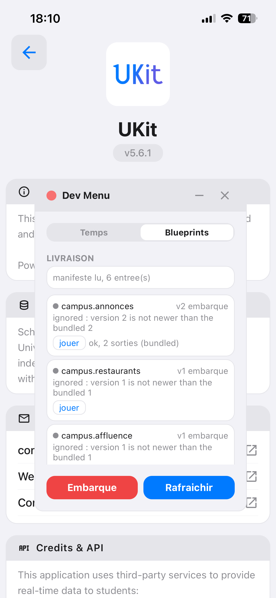

# Les Blueprints

Un **Blueprint** est un fichier JSON déclaratif qui décrit comment atteindre une source distante et
ce qu'on en retient. UKit ne l'interprète pas lui-même : il le confie au moteur
[Aetherius](../docs-aetherius/README.md), embarqué dans l'application.

C'est ce qui remplace, depuis la [Phase 6](phase-6/README.md), les services `axios` écrits à la main
et la WebView cachée pilotée par du JavaScript injecté. Le bénéfice tient en une phrase : **une
source qui change se corrige par une publication de fichier, pas par une release.**

Ce document dit où vivent ces fichiers, ce qu'on y met, ce qu'on n'y met pas, et comment on en publie
un. La grammaire elle-même — les actions disponibles, les expressions, l'extraction — est documentée
chez Aetherius ; elle n'est pas recopiée ici, parce qu'une copie périmée est pire que pas de copie.

## Où ils vivent

| Endroit | Rôle |
|---|---|
| [`blueprints/`](../blueprints/) | **la source de vérité.** Les fichiers sont relus en revue, versionnés avec le code qui les consomme, et importés dans le binaire |
| [`blueprints/portails/`](../blueprints/portails/) | les portails d'établissements **hors socle** : relus et versionnés comme les autres, mais **jamais embarqués** — ils arrivent par le manifeste ([6-G](phase-6/6-g-etablissements.md)) |
| [`blueprints/index.ts`](../blueprints/index.ts) | le **socle embarqué** : la table des noms livrés avec l'application |
| [`blueprints/versions.json`](../blueprints/versions.json) | la **version** de chaque fichier, et son `min_engine` s'il en a un |
| Bucket `blueprints` de Supabase | la **surcouche distante** : les mêmes fichiers, plus récents, publiés entre deux releases |

Le socle embarqué n'est jamais optionnel. Une application doit fonctionner au premier lancement, hors
ligne, sans avoir jamais contacté le réseau ; le distant ne fait que le mettre à jour.

**Une seule exception, et elle est bornée** : un portail d'établissement que l'application n'a jamais
livré n'a pas de repli hors ligne à préserver — il n'existe pas encore pour l'utilisateur. C'est ce
qui rend acceptable que le manifeste puisse en **ajouter** sous `ukit.portail.`, et rien d'autre. La
contrepartie est assumée : tant qu'un portail ajouté n'a pas été résolu une fois, il n'y a rien à quoi
retomber.

Le préfixe ne porte pas que des parcours d'authentification : depuis le jalon
[6-I](phase-6/6-i-planning-universel.md), les deux Blueprints d'**emploi du temps** de Bordeaux INP y
vivent aussi (`ukit.portail.bordeaux-inp.edt`). Ce sont les premiers fichiers du dépôt à déclarer un
`min_engine` — `0.5.4`, la version qui apporte l'extraction `from: "text"` —, et c'est exactement ce
que ce champ existe pour faire : un appareil dont le moteur est plus ancien ignore l'entrée au lieu de
jouer un fichier qu'il ne sait pas exécuter.

### Un Blueprint qui n'appartient à aucun établissement

[`ukit.edt.abonnement`](../blueprints/ukit-edt-abonnement.blueprint.json) est le seul fichier du dépôt
dont la source **n'est pas connue à l'écriture** : il joue le lien d'abonnement que l'étudiant a collé,
quel qu'il soit. C'est le repli universel du jalon
[6-J](phase-6/6-j-compte-et-sources-par-etablissement.md), et deux de ses choix méritent d'être
compris avant d'y toucher :

- **il est embarqué et hors du préfixe `ukit.portail.`**, alors qu'il sert exactement le même besoin
  que `ukit.portail.bordeaux-inp.edt`. La différence est qu'il n'appartient à aucune université : un
  fichier par établissement le rendrait aussi coûteux que ce qu'il remplace, c'est-à-dire lui ferait
  perdre sa raison d'être ;
- **il demande le lien verbatim, sans bornes de dates.** C'est ce qui le rend universel : ADE accepte
  `firstDate` / `lastDate`, mais d'autres produits figent la fenêtre à l'export et un paramètre inconnu
  y est au mieux ignoré. Le filtrage par date est donc **applicatif** — une exception assumée à la
  règle « le Blueprint dit ce qu'on demande et ce qu'on en retient », parce que la seule alternative
  serait un fichier par produit d'emploi du temps.

Aucun secret n'y est déclaré, et c'est volontaire : **le lien *est* le secret**. Il arrive en entrée
depuis le trousseau, et le moteur le masque dans les événements comme n'importe quelle autre entrée.

Les versions vivent dans un fichier de données plutôt que dans `index.ts` pour une raison
mécanique : le script de publication est un module Node, il ne sait pas lire du TypeScript. Un
fichier que les deux côtés lisent tel quel vaut mieux qu'une version recopiée à la main — elle serait
fausse un jour sur deux, et c'est précisément la valeur qui décide de tout.

## Ce qui descend dans un Blueprint, et ce qui n'y descend pas

La frontière n'est pas administrative, elle est **fonctionnelle** : un Blueprint décrit ce qu'on
demande à une source et ce qu'on en retient. Tout ce qui a besoin de l'heure courante, de la position
de l'utilisateur, de l'état des écrans ou de la langue choisie n'a pas ces informations — et ne doit
pas les avoir, sinon le fichier cesse d'être rejouable à l'identique, donc vérifiable.

| Ce qui devient un Blueprint | Ce qui reste du code applicatif |
|---|---|
| L'URL, la méthode, les en-têtes, l'encodage du corps | Le cache et sa péremption |
| Les constantes du protocole distant (`resType`, `colourScheme`) | La persistance, le trousseau, l'état |
| La sélection et le nommage des données extraites | L'internationalisation |
| Le filtrage exprimable **sur un seul élément** | Le calcul : distances, tris, agrégats, dédoublonnage |
| Le parcours d'authentification et les attentes | Le rendu, la navigation, la logique métier |
| L'agent utilisateur quand il décide de la page servie | Toute décision produit (quelles villes, quelles catégories) |

Quatre limites reviennent souvent, et il vaut mieux les connaître avant de buter dessus :

- **pas d'heure courante dans un prédicat.** Une règle de péremption (`expires_at > maintenant`) reste
  applicative. Ce n'est pas un manque : la même donnée peut alors être affichée grisée plutôt que
  masquée, ce qu'un filtre d'extraction interdirait ;
- **pas d'indexation dans un filtre.** « L'un des éléments de cette liste vaut X » n'est pas
  exprimable. On extrait le champ et on filtre côté application ;
- **pas de reconstruction d'un arbre.** `fields` est plat : il nomme des champs relatifs à un élément,
  pas une hiérarchie. Quand l'application a besoin de l'arbre entier — un jour de menu qui porte des
  services, qui portent des catégories, qui portent des plats — le chemin d'un champ désigne le
  **sous-arbre**, qui descend tel quel, et la projection reste applicative ;
- **pas de reformatage d'une date reçue.** Les filtres de date lisent `YYYY-MM-DD` et refusent le
  reste : ils servent à *produire* un format attendu par une source, pas à en interpréter un ;
- **pas de calcul.** Il faudrait le réimplémenter à l'identique dans deux moteurs.

## L'échelle : un Blueprint par appel, pas par source

Un Blueprint correspond à **un appel que l'application joue réellement**, pas à une source ni à un
enchaînement de pages. Trois conséquences :

- une liste de restaurants et le menu d'un restaurant sont deux fichiers : ils sont demandés par deux
  écrans, à deux moments ;
- le parcours universitaire *froid* et le parcours *chaud* sont deux fichiers, parce que l'application
  distingue déjà les deux — un fichier de douze steps que personne ne joue d'un bloc ne démontre
  rien ;
- un fichier qui rend plusieurs choses « puisqu'on y est » couple deux écrans : une panne de l'un
  emporte l'autre.

## Les erreurs cessent d'être avalées

Avant la Phase 6, tous les services renvoyaient `null` ou `[]` en cas d'échec : une panne du
fournisseur et une réponse légitimement vide étaient **indistinguables**, et un écran « aucun
résultat » pouvait masquer une source morte.

Un Blueprint échoue, et `describeFailure` range l'échec dans une famille d'écran
([`src/shared/aetherius/failures.ts`](../src/shared/aetherius/failures.ts)) :

| Ce qui s'est passé | Famille | Ce que l'application affiche |
|---|---|---|
| Réseau injoignable, délai dépassé | `unavailable` | « Service indisponible », avec Réessayer |
| Statut inattendu (`expect`) | `rejected` | « Réponse inattendue » — la source a changé |
| Sélecteur ou extraction sans correspondance | `data` | « Contenu introuvable » — Blueprint à corriger |
| Échec **nommé** par le Blueprint (`fail:CODE`) | `blocked` | le message du cas, tel quel |
| Secret ou entrée absente | `config` | « Saisis tes identifiants » |
| Run annulé | `cancelled` | rien |

Et son pendant : **une liste vide n'est pas une erreur.** Un run réussi dont les sorties portent une
liste vide a réellement trouvé une liste vide.

Tant qu'un écran n'est pas branché sur une famille, elle reste observable : `reportFailure` écrit une
ligne nommant le Blueprint et la famille. C'est ce qui rend les chemins dégradés distinguables sur un
appareil avant même que l'interface les distingue.

### Affirmer la forme, pour que « rien trouvé » ne se confonde pas avec « rien à trouver »

Une extraction qui ne correspond à rien rend **une liste vide**, pas une erreur. C'est le bon
comportement — une source peut légitimement ne rien avoir — mais il ouvre un angle mort : si la
réponse change de forme au point que le chemin d'extraction ne correspond plus, le run **réussit**
avec zéro élément, et l'écran affiche « aucun résultat » pour une source cassée.

Le remède est déclaratif et tient en un step :

```jsonc
{ "id": "forme", "action": "assert",
  "condition": "{{ steps.annonces.racine | length > 0 }}",
  "message": "la reponse ne porte pas de tableau 'annonces'" }
```

en extrayant à côté la **racine** attendue (`{ "from": "json", "path": "$.annonces" }`) : elle
correspond une fois si la clé existe — même vide — et zéro fois si elle a disparu. L'échec est rangé
en `rejected`. Un Blueprint dont l'extraction peut légitimement être vide devrait porter cette
assertion ; celui des annonces l'a gagnée au jalon [6-A](phase-6/6-a-socle.md), après mesure.

**Et quand il n'y a pas de clé ?** Certaines réponses *sont* le tableau : les quatre Blueprints de
calendrier Celcat reçoivent `[ … ]` à la racine. Il n'existe alors aucune clé dont la disparition
serait détectable — `$` correspond toujours, y compris à un objet d'erreur — et une assertion écrite
là ne ferait que rassurer. Ces fichiers s'en tiennent donc à `expect: { status: 200 }`, et le disent
dans leur `description` : une garde qui n'en est pas une coûte plus cher que son absence, parce qu'on
cesse de chercher ailleurs. Constaté au jalon [6-E](phase-6/6-e-planning.md).

### Accepter deux statuts, sans accepter n'importe lequel

`expect.status` ne prend **qu'un** entier. Or une source rend parfois un statut d'erreur pour dire
quelque chose de parfaitement normal : plus de la moitié des restaurants CROUS répondent `404` sur
leur menu, ce qui veut dire « ce restaurant ne publie rien » et non « la source est en panne ». Un
`expect: {status: 200}` transformerait alors un état vide fréquent en message d'erreur ; retirer
l'`expect` tout court ferait passer un `500` pour une liste vide, ce qui est précisément le défaut que
cette phase supprime.

Le remède est le même step qu'au-dessus, appliqué au statut plutôt qu'à la forme :

```jsonc
{ "id": "statut", "action": "assert",
  "condition": "{{ steps.menu.status_code == 200 or steps.menu.status_code == 404 }}",
  "message": "statut inattendu sur le menu : la source a change" }
```

Le step `http.request` publie `status_code` dans ses sorties, et l'échec d'un `assert` est rangé en
`rejected` comme celui d'un `expect`. La règle à retenir : **un statut d'erreur qui fait partie du
contrat se nomme**, il ne se subit pas et ne s'ignore pas. Livré au jalon
[6-D](phase-6/6-d-campus.md), après mesure sur les 41 établissements de la région.

## Écrire un Blueprint

1. **Inventorier la source d'abord**, dans [sources-externes.md](sources-externes.md) : l'URL exacte,
   la méthode, les en-têtes indispensables, la forme du corps, les constantes **et leur
   signification**, les règles de filtrage, et ce que le code fait de la réponse. L'écrire révèle
   déjà la moitié du travail — les constantes qu'on ne sait plus justifier, les filtres dupliqués,
   les erreurs avalées.
2. **Demander pourquoi on passe par là.** Un relais, un proxy « CORS », une fonction qui ne fait que
   retransmettre : la contrainte qui l'a fait naître est souvent celle d'un navigateur, et une
   requête émise nativement depuis l'appareil n'y est pas soumise. C'est ainsi que le relais Celcat
   est sorti de l'architecture.
3. **Écrire le fichier**, nommé `<domaine>.<tache>` (`ukit.campus.restaurants`,
   `ukit.portail.bordeaux.dossier`), avec ses `inputs` typés, ses `vars` nommées, et `expect` sur les
   statuts attendus.
4. **Le jouer avec le moteur Python**, depuis un poste, avant de toucher à l'application. C'est là
   qu'on itère : le cycle est de quelques secondes.

   > **Un fichier qui passe ici peut échouer sur l'appareil**, et le jalon
   > [6-G](phase-6/6-g-etablissements.md) l'a payé. Le moteur Python s'appuie sur Playwright, dont les
   > sélecteurs acceptent des pseudo-classes **propriétaires** — `:text-is()`, `:nth-match()`,
   > `:has-text()`. Le moteur embarqué, lui, résout par `document.querySelectorAll`, qui les rejette
   > comme CSS invalide : le run échoue au premier `extract`, avec un message qui ne nomme pas la
   > cause. **Pour un sélecteur que le CSS standard n'exprime pas — « la valeur dont le libellé voisin
   > vaut X » —, la réponse est XPath**, que les deux moteurs partagent. Un test du dépôt refuse ces
   > pseudo-classes ([`delivery.test.ts`](../src/shared/aetherius/delivery.test.ts)), mais il vaut
   > mieux le savoir en écrivant qu'en le découvrant.
5. **Écrire son cas de parité** dans [`tools/parity/`](../tools/parity/README.md) et le rendre vert
   contre le service historique.
6. **Le jouer sur un appareil**, chemins dégradés compris.

Les identifiants ne sont **jamais** dans un fichier. Ils sont déclarés (`secrets`) et fournis au
runtime par le trousseau de l'appareil.

## Publier une correction

Deux gestes, et le second n'est pas optionnel :

```bash
# 1. corriger le fichier dans blueprints/ et incrementer sa version dans blueprints/versions.json
# 2. publier : valide, televerse, recalcule les empreintes, met la table a jour, regenere le manifeste
npm run blueprints:publish
```

Le manifeste est un **artefact généré**, jamais un fichier qu'on édite. Une empreinte écrite à la
main est périmée dès la première correction, et un manifeste dont l'empreinte ment est exactement ce
que l'appareil rejette : on passerait la soirée à déboguer une garde qui fonctionne.

La correction arrive sur les appareils au rafraîchissement suivant — au démarrage, ou au retour au
premier plan. Le distant ne gagne que s'il est **plus récent, entier et valide**.

### Ce que le script refuse de publier

[`tools/publish-blueprints.mjs`](../tools/publish-blueprints.mjs) joue les gardes qui n'ont aucune
raison d'attendre le téléphone. Chacune arrête la publication, aucune n'est rattrapable après coup :

| Garde | Ce qu'elle évite |
|---|---|
| Le document est validé par le moteur (`validateBlueprintData` + `validateForAct`) | un fichier invalide qui traverserait le réseau pour être refusé à l'arrivée |
| Le `name` déclaré dans le fichier correspond à sa clé de `versions.json` | livrer un Blueprint à la place d'un autre |
| Toute entrée a son fichier, tout fichier a son entrée, et deux fichiers ne portent pas le même nom | annoncer une URL qui ne répond pas, ou publier celui des deux que le système de fichiers a rendu en premier |
| La version est une chaîne numérique pointée | une comparaison que personne ne saurait faire de tête |
| Un fichier de `portails/` est couvert par le préfixe réservé | publier un fichier que l'appareil ignorera **en silence** |

Trois propriétés du script valent d'être connues avant de s'en servir :

- **le manifeste est écrit en dernier**, après les fichiers qu'il désigne — l'inverse ferait pointer
  une empreinte valide vers un fichier absent ;
- **seuls les fichiers dont l'empreinte a changé sont téléversés**, en comparant au manifeste
  réellement servi, pas à un état supposé ;
- **rejoué à vide, il ne change rien** et le dit. C'est ce qui rend un manifeste périmé visible en une
  commande. `--force` republie tout, `--dry-run` montre le plan sans rien toucher.

### Revenir en arrière

Trois interrupteurs, et ils n'ont ni la même portée ni le même délai.

| Geste | Qui | Effet |
|---|---|---|
| `npm run blueprints:publish -- --desactiver <nom>` (ou `desactive` dans la table, puis republier) | le publieur | l'embarqué reprend la main sur ce Blueprint, au rafraîchissement suivant |
| `npm run blueprints:publish -- --arret` | le publieur | **tout** revient à l'embarqué. Le geste inverse est une publication ordinaire |
| Bouton « Embarqué » du menu de développement | l'application | purge la surcouche tout de suite, sans réseau. Non durable : un rafraîchissement peut la ramener |
| `BLUEPRINTS_REMOTE=false` à la construction | l'application | la surcouche est ignorée durablement, **sans être détruite** |

Une entrée simplement **retirée** du manifeste a le même effet qu'un `disabled` : le manifeste décrit
l'état voulu, pas un différentiel, et l'interprétation la plus sûre d'un manifeste partiel est
toujours le socle.

Un mécanisme de déploiement sans mécanisme de retour arrière n'en est pas un — c'est ce qui rend
acceptable qu'une correction publiée soit en production immédiatement, sans environnement de recette.

### Quand une correction « n'arrive pas »

Les causes se ressemblent toutes vues de l'écran principal. Le panneau **Blueprints** du menu de
développement ([`ModMenuBlueprints.tsx`](../src/shared/ui/ModMenuBlueprints.tsx), sept tapes sur le
numéro de version dans À propos) répond en trois secondes : il donne, par Blueprint, sa version, son
origine — embarqué ou distant — et la raison que le dernier rafraîchissement lui a attribuée.

Il porte aussi un bouton **jouer**, et c'est ce qui rend le parcours de correction vérifiable de bout
en bout : voir une ligne passer à « distant » prouve que le document publié est en place, le jouer
prouve qu'il s'exécute. Le bouton n'apparaît que sur les Blueprints qui n'ont **rien à demander** —
aucune entrée obligatoire sans valeur par défaut — et surtout **rien à engager** : un parcours
déclarant des `secrets` n'est pas jouable depuis ce panneau, parce que vérifier une livraison ne
justifie pas une tentative de connexion réelle sur le compte de l'utilisateur.



L'état de repos est celui de la capture : le bucket sert exactement ce que le binaire embarque, donc
chaque entrée est `ignored : version … is not newer than the bundled …`. C'est ce qu'on doit voir
quand il n'y a **rien à corriger** — et non un panneau vide, qui ne dirait pas la différence avec un
manifeste jamais lu.

> **Le rapport ne survit pas à un rechargement, la surcouche si.** Le rapport du dernier
> rafraîchissement vit en mémoire ; la surcouche, elle, vit dans le magasin local. Après un
> rechargement — un `r` dans Metro, une reprise à chaud pendant qu'on développe — le panneau affiche
> donc `manifeste pas encore lu` **en gris**, tout en montrant des lignes `distant` parfaitement
> résolues depuis le cache. Ce n'est pas une panne, et il ne faut pas le confondre avec
> `manifeste non lu : …`, qui s'affiche **en ambre** et signale un vrai échec de lecture. Le bouton
> **Rafraichir** du panneau lève le doute en une seconde. Constaté en vérifiant le jalon
> [6-D](phase-6/6-d-campus.md) sur appareil.

## Ce qu'un Blueprint distant ne peut pas faire

Un Blueprint est de la **donnée exécutable**, et il est traité comme tel :

- il ne peut **déclarer** que les secrets que l'application lui ouvre ;
- il ne peut pas **ajouter** un nom que l'application n'embarque pas — sauf sous le préfixe
  `ukit.portail.`, explicitement ouvert pour le multi-établissement
  ([6-G](phase-6/6-g-etablissements.md)). Un nom **ajouté** ne reçoit que les secrets déclarés dans
  `allowNew.secrets`, jamais l'union de ceux du socle : déduire le périmètre est raisonnable pour un
  fichier qui en remplace un que quelqu'un a relu, et ne l'est pas pour un fichier que personne n'a
  lu ;
- il ne peut pas exécuter de code : le moteur embarqué n'évalue rien dynamiquement, par construction ;
- il est validé **entièrement** avant d'atteindre le cache, donc avant d'atteindre un run.

Et une chose à savoir **avant** de brancher un rapporteur d'erreurs. Le message d'un `expect` raté
porte le **corps de la réponse** : c'est ce qui rend une source qui a changé diagnosticable en une
ligne de terminal, et c'est délibéré. Mais `reportFailure` le passe à `console.warn`, et
`failure.detail` le transporte tel quel — sur un portail, ce corps est une page de dossier
administratif, avec un nom et un numéro étudiant dedans.

Aujourd'hui c'est sans conséquence : rien ne collecte ces journaux, et `SENTRY_DSN` traîne dans `.env`
sans qu'aucune dépendance ne le lise (vérifié le 2026-08-15). Le jour où un rapporteur de crash arrive,
**c'est ce chemin qu'il faut borner en premier** — pas le format du log, qui doit rester bavard là où
il l'est, mais ce qui sort de l'appareil.

Ce qui n'est **pas** couvert et doit rester su : un publieur compromis. Qui contrôle la publication
peut livrer un Blueprint qui envoie les secrets déjà autorisés où il veut. L'accès au projet Supabase
est un accès de production.

## Les fragilités : celles qui disparaissent, celles qui restent

| Avant | Après |
|---|---|
| Constantes magiques disséminées | `vars` nommées, en un seul endroit |
| Un relais à héberger devant une source | **plus de relais** : la requête part de l'appareil ([6-E](phase-6/6-e-planning.md)) |
| Parsing par expression régulière | `as: number`, champs nommés — ou explicitement applicatif |
| Erreurs avalées (`catch { return null }`) | Erreurs typées, familles d'écran |
| JavaScript injecté non typé | Vocabulaire d'actions fermé, validé avant le run |
| Identifiants interpolés dans une source de script | Paramètres encodés en JSON, jamais concaténés |
| Attente recopiée par script, trois plafonds | Une auto-attente, un `timeout_ms`, un `fail:CODE` |
| **Sélecteurs positionnels** (`#gwt-uid-41`) | **Toujours positionnels** |

La dernière ligne est celle qu'il ne faut pas maquiller. Les identifiants du dossier administratif
sont attribués par le framework de la page selon l'ordre de construction du DOM : une modification
côté université les décale silencieusement. La migration ne les rend **pas** robustes. Ce qu'elle
change est ailleurs, et c'est déjà beaucoup : ils deviennent une ligne de données corrigeable à
distance en quelques minutes, au lieu d'une constante compilée en attente de publication.

Et le format déclaratif permet un filet que le code d'origine n'avait pas : lire le **libellé voisin**
et l'affirmer, pour qu'un décalage devienne un échec nommé au lieu d'une donnée fausse. Livré au
jalon [6-F](phase-6/6-f-scolarite.md) sur les **cinq** champs du dossier, et il rend un service de
plus qu'attendu : le libellé `Prénom et Nom` est ce qui autorise l'application à prendre le premier
mot de l'identité comme prénom. Sans lui, l'ordre des deux serait une supposition — et une
supposition sur un nom propre s'affiche en toutes lettres sur un écran d'accueil.

La même campagne a montré l'autre visage de la fragilité : le script d'origine testait `#msg.success`
et `#msg.errors`, or **il n'existe aucun `#msg`** sur ce CAS. Deux branches mortes, sans erreur, sans
symptôme. Un sélecteur compilé ne se relit jamais ; une ligne de fichier, si.

## Vérifier

```bash
npm test                    # le socle, et les gardes de la livraison
npm run parity              # rejoue les Blueprints sous Node, compare aux services historiques
```

Les neuf gardes du registre — empreinte fausse, fichier substitué après publication, version qui ne
bat pas le socle, `min_engine` trop élevé, manifeste malformé, secret hors périmètre, document
invalide, bucket injoignable, cache local corrompu — sont couvertes par
[`delivery.test.ts`](../src/shared/aetherius/delivery.test.ts), qui les joue contre le **vrai**
registre. Les vérifier sur un appareil demanderait de publier neuf manifestes cassés en production ;
l'appareil garde ce qu'il est seul à pouvoir dire, à savoir que la correction arrive et se joue.

La question n'est pas « est-ce que ça tourne » mais « est-ce que ça rend **la même chose** ». Puis le
chemin dégradé, qui est celui qu'on ne teste jamais et qui décide de l'expérience réelle : mode
avion, source qui répond un statut inattendu, identifiants faux, sélecteur devenu introuvable. Chacun
doit produire un écran **différent**. S'ils produisent tous « aucun résultat », la migration n'a rien
apporté.

## Documentation associée

| Sujet | Document |
|---|---|
| Le cadrage de la migration, jalon par jalon | [phase-6/README.md](phase-6/README.md) |
| L'inventaire des sources et leur Blueprint | [sources-externes.md](sources-externes.md) |
| La base qui les publie | [backend.md](backend.md) |
| Le moteur, sa grammaire, ses limites | [../docs-aetherius/README.md](../docs-aetherius/README.md) |
