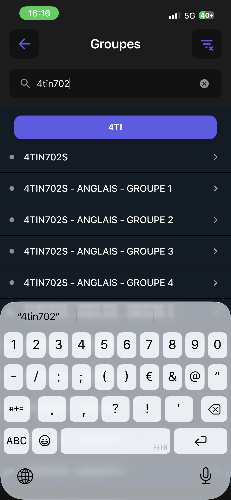
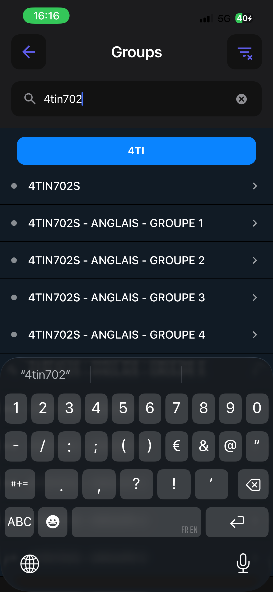

# Défauts fonctionnels connus

Liste **vivante** des défauts de comportement rencontrés en chemin. Ils ne sont pas du goût : ils se
corrigent, se testent et se cochent comme n'importe quel correctif.

> **Pourquoi ce document est séparé de [l'inventaire visuel](inventaire-visuel.md).** L'inventaire est
> une mesure datée qui ne bouge plus ; cette liste-ci se coche et s'allonge. Et surtout : mélanger un
> défaut fonctionnel à de l'esthétique dans une session de refonte rend la session **invérifiable** —
> on ne sait plus dire quand elle est finie, et c'est la moitié facile qui se fait.
>
> Une session d'écran qui rencontre un défaut fonctionnel l'ajoute **ici** et ne le corrige pas au
> passage, sauf s'il tombe exactement dans son périmètre. La règle est écrite dans
> [CONTRIBUTING.md](../CONTRIBUTING.md#un-travail-visuel-nest-pas-documenté-au-même-endroit).

Ouvert par le jalon [6-K](phase-6/6-k-socle-visuel.md) le 2026-08-16. Le jalon les a **inventoriés**
pour qu'aucune session ne les confonde avec du visuel ; ils ont été corrigés dans la foulée, sur
décision du propriétaire du produit — éponger la dette avant d'ouvrir les sessions d'écran plutôt que
de la leur laisser en travers.

## Ouverts

Les deux suivants ont été **rencontrés** par la session d'écran Scolarité du 2026-08-25, et
volontairement **pas corrigés** : ni l'un ni l'autre ne tombe dans son périmètre, et les traiter en
passant aurait rendu la session invérifiable
([CONTRIBUTING.md](../CONTRIBUTING.md#un-travail-visuel-nest-pas-documenté-au-même-endroit)).

### ~~La date du bloc de salutation est en français, en dur~~ — corrigé le 2026-08-28

`GreetingBlock` portait ses propres tableaux `DAYS` et `MONTHS` en français et composait
« Bonjour »/« Bonsoir » hors de `Translator` : un utilisateur anglophone lisait « Lundi 25 août » sous
une interface traduite.

La date passe par `moment().format('dddd D MMMM')`, donc par la locale que `Translator` pose déjà. Et
la salutation elle-même n'est plus une condition dans un composant mais une **table de règles**
(`features/Scolarite/salutations/`), dont le socle est traduit comme le reste — voir
[La salutation](features/scolarite.md#la-salutation-est-une-règle-pas-une-condition).

Le format de date change, donc le rendu de référence de ce bloc change : c'était la raison qui
retenait le correctif, et elle a été levée en même temps que le bloc était repris de fond en comble.

### ~~Deux écrans poussés démarrent sous la barre de navigation~~ — corrigé le 2026-08-29

`LienEdtScreen` et `DocumentsScreen` posaient leur contenu à `insets.top` seulement, alors que
l'en-tête de l'application est **transparent** et que le contenu glisse dessous : le titre et l'icône
du formulaire se chevauchaient. Deux causes distinctes, et il valait mieux les nommer :

- `LienEdtForm` ajoutait son propre espacement à une valeur qui ne comptait que l'encoche. Il est
  partagé avec le parcours d'accueil, qui n'a **pas** d'en-tête — c'est donc à l'appelant de savoir,
  et la marge lui est désormais passée déjà calculée (`HEADER_OFFSET` pour l'écran, `space.md` pour
  l'accueil) ;
- `DocumentsScreen` traitait `headerPadding` comme un nombre. `withStaticHeader` rend un **objet de
  style** `{ paddingTop, paddingBottom }` : posé dans `paddingTop`, il était ignoré. Il s'étale
  maintenant dans le style, comme le font `AboutScreen` et `CourseScreen`.

La leçon vaut pour le prochain écran poussé : `HEADER_OFFSET` est la seule valeur juste, et
`withStaticHeader` la donne déjà — encore faut-il l'appliquer telle qu'elle est rendue.

### ~~Le bouton de filtre était agrandi de 14 % en permanence~~ — corrigé le 2026-08-29

`NavBarHelper` animait les boutons d'en-tête par une mise à l'échelle `1.14 → 1` au défilement. La
décision de retirer ce rétrécissement avait été prise, mais elle n'avait été appliquée qu'à moitié :
[`useCampusListHeader`](../src/features/Campus/components/hooks/useCampusListHeader.tsx) posait son
propre `headerRight` — qui **remplace** celui de `NavBarHelper` — et en gardait une copie dont le repli
était la **valeur statique 1,14**.

Le bouton de filtre des écrans Campus restait donc agrandi de 14 %, seul de sa barre, sans jamais
s'animer. La mécanique est retirée des deux endroits ; il ne reste que le cadre de hauteur fixe qui
aligne les boutons sur le titre.

La leçon : un `navigation.setOptions({ headerRight })` **écrase** l'habillage de `NavBarHelper`. Ce
qui y est recopié doit être retiré au même moment que l'original, sinon la copie survit à l'intention.

### ~~Le logo d'établissement ne s'est jamais affiché~~ — corrigé le 2026-08-29

Les fichiers étaient bien dans le bucket (`media/etablissements/*.webp`, servis en 200), le socle
portait l'adresse, et l'écran de connexion montrait pourtant **l'icône de repli** depuis le jour de la
publication.

La cause est la règle du catalogue elle-même : **une ligne publiée remplace, elle ne corrige pas**
(`projeterEtablissement`). `logo_url` valait `null` dans les lignes publiées, donc l'adresse du socle
était effacée au premier rafraîchissement — et le repli faisait son travail, silencieusement.

Le piège est propre à cette règle, et il vaut pour toute colonne : **oublier une colonne dans une
ligne publiée ne laisse pas la valeur d'avant, elle la supprime.** Une ligne de catalogue s'écrit
entière, ce que `supabase/etablissements.sql` disait déjà — il fallait l'appliquer.

### ~~Les quatre toasts de l'application étaient muets~~ — corrigé le 2026-08-29

`react-native-root-toast` déclare `RootSiblingParent` **obligatoire au-dessus de React Native 0.62**,
et l'application est en 0.81. L'enveloppe était absente de `App.tsx` : `Toast.show` ne levait pas, il
ne rendait simplement rien.

Trois des quatre messages concernés annoncent un **échec** — un document qu'on n'a pas pu ajouter, des
réglages illisibles, une absence de réseau. Ils n'ont donc jamais été vus. Trouvé en cherchant pourquoi
la confirmation de copie de l'écran du compte ne s'affichait pas.

La confirmation de copie, elle, ne repasse **pas** par un toast : même réparé, il apparaît en bas de
l'écran, loin du doigt, et derrière la barre d'onglets flottante. L'icône devient une coche verte —
là où l'œil est déjà.

### ~~Les boutons d'en-tête avaient cinq tailles~~ — corrigé le 2026-08-29

Le bouton retour valait 50 × 50 avec une icône de 28, les quatre autres 45 × 45 avec des icônes de 24
ou de 26 selon l'endroit. **L'écart ne se voyait pas**, et la raison mérite d'être écrite :
`NavBarHelper` appliquait à tous les boutons latéraux une mise à l'échelle animée dont la valeur au
repos était `1.14` — et 45 × 1,14 fait **51**, c'est-à-dire la taille du bouton retour.

Cette animation ne décorait donc pas, elle **compensait une divergence**. La retirer a rendu l'écart
visible d'un coup : les boutons ont paru rapetisser alors qu'ils prenaient enfin leur taille déclarée.

Un composant unique porte désormais la taille :
[`shared/ui/HeaderButton`](../src/shared/ui/HeaderButton.tsx), 50 × 50, icône 26. Seule la flèche de
retour garde 28 — un glyphe plus léger paraît plus petit à taille égale, et c'est un écart **optique**,
pas une divergence oubliée.

### ~~Deux couleurs de `sectionsHeaders` sont identiques en thème sombre~~ — corrigé le 2026-09-03

`theme.sectionsHeaders` porte six teintes catégorielles. En thème **clair**, l'index 0 vaut `#007AFF`
et l'index 4 `#5856D6` — deux couleurs distinctes. En thème **sombre**, les deux valent `#5E5CE6`.

La palette n'y offre donc que **cinq** couleurs distinctes au lieu de six, et deux sections de la
recherche de groupes (Planning) peuvent partager la même en mode sombre. La grille de Scolarité évite
l'index 4 pour cette raison.

C'était une coquille : la variante sombre du bleu système est `#0A84FF`, et c'est ce qu'on attend à
l'index 0 — `sections[0]` sombre, sa version translucide, valait déjà `#0A84FF15`. Corrigée par la
passe de code [6.1-C](phase-6/6-1-c-passe-de-code.md), qui prend la décision que ce registre laissait
ouverte : la première section de la recherche de groupes passe de l'indigo au bleu en sombre, et c'est
tout ce qui change. Les trois palettes qui évitaient le 4 (grille Scolarité, annonces, repas) le
gardent inemployé : redistribuer les teintes n'était pas le sujet.




### Les styles composés du thème ne sont pas typés

[`Theme.ts`](../src/shared/theme/Theme.ts) n'emploie pas `StyleSheet.create` : ses styles composés
sont des objets littéraux, donc TypeScript élargit `justifyContent: 'center'` en `string`, qui n'est
plus assignable à un `ViewStyle`. Les appelants historiques ne le voyaient pas parce que leur prop
`theme` n'était pas typée ; le problème **apparaît dès qu'un composant l'est**, ce qui est le sens de
la marche.

Contourné localement et **une seule fois**, dans
[`ConfirmationScolarite.tsx`](../src/features/Scolarite/components/ConfirmationScolarite.tsx), par un
transtypage commenté. Le corriger à la source demanderait de retyper un fichier de données de
1 100 lignes — hors du périmètre d'une session d'écran, et à faire une fois pour toutes plutôt que
trois fois à moitié.

### ~~Le contenu publié n'atteint les écrans déjà montés qu'au lancement suivant~~ — corrigé le 2026-09-03

Rencontré le 2026-09-03 pendant la vérification du jalon [6.1-B](phase-6/6-1-b-pilotage-a-distance.md),
et déjà noté sous une forme plus étroite pour les visuels ([backend.md](backend.md)). Les surcouches
publiées se **rafraîchissent** bien au retour au premier plan — Blueprints, lieux, visuels, catalogue,
salutations, messages —, mais ce sont les **écrans** qui ne se relisent pas : le tableau de bord
Campus garde ce qu'il a chargé au montage (il ne se démonte jamais), et une liste d'annonces ne
refait sa lecture qu'en se remontant. Une annonce ciblée sur un autre campus, ou rendue à tous,
n'apparaît donc qu'après une vraie relance ; quelqu'un qui garde l'application en arrière-plan peut
attendre longtemps une mise à jour pourtant arrivée.

Le même défaut a une **seconde forme, mesurée en production** le 2 septembre 2026 : l'onglet
Planning ouvert le 1er et laissé en arrière-plan jusqu'au lendemain, « Aujourd'hui » menait encore au
1er — le jour courant est calculé au montage, jamais au retour au premier plan. Ce n'est pas une
publication qui manque, c'est la même absence de « relecture au retour ».

**Corrigé par la passe de code [6.1-C](phase-6/6-1-c-passe-de-code.md)**, par une politique écrite
écran par écran plutôt qu'un rejeu de tout à chaque retour. Un signal partagé
([`shared/services/premierPlan.ts`](../src/shared/services/premierPlan.ts)) dit le **vrai** retour au
premier plan — après un passage en arrière-plan, et non après un centre de contrôle tiré ou une invite
Face ID, deux cas qui émettent aussi `active` et faisaient partir six requêtes et un second run de
widgets pour rien. Sur ce signal : les annonces se relisent, sur le tableau de bord comme dans la
liste ; le Planning recalcule son « Aujourd'hui » si la date a changé, comme au lancement ; les six
surcouches publiées et les widgets de la scolarité se rafraîchissent comme avant, une fois. Les quatre
sources tierces du tableau de bord, elles, **gardent leur contenu** : un tirer-pour-rafraîchir les
relit à la demande ([campus.md](features/campus.md#le-tableau-de-bord)). Les messages de service
arrivaient déjà au retour ; c'est ce comportement qui a été étendu.

### Réessayer après un parcours froid en échec ramène l'écran de chargement plein

Constaté sur appareil le 2026-09-04, **dans l'onglet Scolarité**, pendant la vérification du jalon
[6.1-D](phase-6/6-1-d-publication.md). C'est le même symptôme que S3 — deux vues pour un seul run —
que [6.1-A](phase-6/6-1-a-robustesse-scolarite.md) avait traité, mais par un chemin que la correction
ne couvre pas.

**Le périmètre exact reste à établir** : l'observation vient de cet écran-là. La garde de 6.1-A a un
**second hôte**, la fiche du compte ([`CredentialsSettingsScreen`](../src/features/Scolarite/screens/CredentialsSettingsScreen.tsx)),
qui porte le même `useSessionDepuisLeFormulaire` — il est donc plausible qu'elle y ait le même trou,
mais ça n'a pas été vérifié. À faire avant de corriger, sous peine de traiter un hôte et pas l'autre :
c'est exactement l'erreur qui a produit ce défaut.

Le mécanisme, tel que
[`ScolariteDashboard`](../src/features/Scolarite/screens/ScolariteDashboard.tsx) l'écrit : l'écran
plein s'affiche quand `progression.visible && coldData === null`, et la garde de 6.1-A
([`useSessionDepuisLeFormulaire`](../src/features/Scolarite/hooks/useSessionDepuisLeFormulaire.ts))
ne retient la page que pour une session **partie du formulaire**. Or la séquence observée est :

1. `ukit.portail.verification` réussit → les identifiants sont validés et **écrits** ;
2. `ukit.portail.bordeaux.dossier` échoue → aucun dossier n'a été lu, donc `coldData` reste `null` ;
3. la progression disparaît, le drapeau du formulaire retombe, et comme les identifiants existent
   désormais, l'onglet montre le tableau de bord avec son encart d'échec ;
4. on touche « réessayer » **dans l'encart** — donc pas depuis le formulaire — et là,
   `formulaire.enCours` vaut `false` pendant que `coldData` vaut toujours `null` : l'écran plein
   reprend la main.

La règle écrite dans [`scolarite.md`](features/scolarite.md) réserve l'écran plein au « parcours
froid qu'on n'a pas demandé depuis un formulaire : au lancement, ou sur *Actualiser mon dossier* ».
Ce cas en respecte la lettre — le geste ne vient pas du formulaire — mais pas l'intention : sur
« Actualiser mon dossier » la page tient parce qu'un dossier existe déjà, alors qu'ici il n'y en a
pas, et l'utilisateur voit donc la page changer sous son doigt au moment précis où il essaie de
réparer quelque chose.

La direction, quand une session le reprendra : le drapeau ne doit pas être « la session vient du
formulaire » mais « la session vient d'un geste **de l'utilisateur sur cet écran** » — un réessai en
fait partie. Le nommer autrement suffirait sans doute, mais c'est une décision d'écran, pas une
retouche : le sujet touche aussi la fiche du compte, second hôte de la même garde.

**Pas corrigé dans 6.1-D**, dont le périmètre est les attentes des Blueprints. Le corriger en passant
aurait mêlé un changement d'écran à une campagne de mesure et rendu les deux invérifiables
([CONTRIBUTING.md](../CONTRIBUTING.md#un-travail-visuel-nest-pas-documenté-au-même-endroit)).

### La tuile d'établissement des Réglages reste sur l'ancien campus

Constaté sur appareil le 2026-09-04, pendant la vérification du jalon
[6.1-D](phase-6/6-1-d-publication.md). Changer de campus **depuis l'écran Scolarité** — le lien
« Tu es d'un autre campus ? » ajouté par [6.1-A](phase-6/6-1-a-robustesse-scolarite.md) — laisse
l'onglet Réglages afficher le nom de l'établissement quitté.

[`SettingsScreen`](../src/features/Settings/screens/SettingsScreen.tsx) tient `institutionName` dans
son **état local** : il est posé une fois au constructeur (`nomCourtEtablissement()`) et n'est mis à
jour que par `setInstitution`, c'est-à-dire par une bascule déclenchée **depuis cet écran-là**.
L'onglet étant déjà monté dans le navigateur d'onglets, une bascule venue d'ailleurs ne le rejoint
jamais.

Ce qui rend le défaut évitable : `SettingsManager.setEtablissement` **émet déjà** l'événement
`etablissement` ([`AppCore.tsx`](../src/shared/services/AppCore.tsx)), et le manager porte
`subscribe`/`unsubscribe`. L'écran n'y est simplement pas abonné pour ce champ. La direction est donc
un abonnement au montage, résilié au démontage — le même geste que l'accueil a reçu en 6.1-C pour le
catalogue.

**C'est la même famille que le défaut précédent, et ça vaut d'être dit une fois pour les deux** : en
donnant un **second hôte** à un geste — le choix d'établissement ici, le réessai de session là —,
[6.1-A](phase-6/6-1-a-robustesse-scolarite.md) a déplacé le composant partagé sans rendre observable
l'état qui l'entoure. Le composant a bien été remonté dans `shared/ui` ; l'état, lui, est resté local
à son hôte d'origine. C'est le contrôle à faire la prochaine fois qu'un geste gagne un second point
d'entrée.

**Pas corrigé dans 6.1-D**, dont le périmètre est les attentes des Blueprints
([CONTRIBUTING.md](../CONTRIBUTING.md#un-travail-visuel-nest-pas-documenté-au-même-endroit)).

### ~~Le parcours froid de Bordeaux INP échouait à 97 % sur iPhone~~ — *élucidé le 2026-09-04*

Le 2026-09-04, un parcours froid de Bordeaux INP mourait à 97 % du chargement sur un iPhone, en
`unavailable` — une navigation qui n'aboutit jamais. Le jalon
[6.1-D](phase-6/6-1-d-publication.md) venait de raccourcir une pause de ce fichier, elle a donc été
accusée, restaurée, puis **remise à l'épreuve dans des conditions propres : elle tient.**

Ce qui l'a réellement causé, selon toute vraisemblance : **le compte de test était utilisé en
parallèle par son propriétaire**, constaté à la messagerie dont le compteur de non-lus est passé de 1
à 0 entre deux runs. Une session CAS reprise ailleurs fait rebondir la navigation vers le SSO, ce qui
produit exactement une navigation sans fin. Le réseau du campus était instable au même moment —
`ukit.celcat.jour` expirait à 30 s depuis deux téléphones pendant que le poste obtenait la même
réponse en 0,19 s.

**Trois leçons, et la première est sur la méthode d'enquête :**

- **une explication plausible n'est pas une cause.** Le mécanisme avancé — la navigation suivante
  partant pendant que la précédente charge — ne résiste pas à l'examen : `navigate` ne rend la main
  qu'au chargement du document, il ne peut donc pas y avoir de course sur ce chargement-là. Il a
  pourtant conduit à annuler une amélioration qui fonctionnait ;
- **on ne mesure pas sur un compte qu'un tiers utilise**, ni sur un réseau dont on n'a pas d'abord
  vérifié qu'il est sain. Les deux ont été violés le même matin ;
- **une valeur se remet à l'épreuve plutôt que de rester annulée par précaution.** Republier la valeur
  suspecte dans des conditions propres a coûté une publication et a tranché en cinq minutes.

### Une navigation bonus non gardée peut emporter tout le parcours froid

Constaté sur un iPhone le 2026-09-04, en wifi de campus, pendant la vérification du jalon
[6.1-D](phase-6/6-1-d-publication.md) : le parcours froid de Bordeaux INP meurt à 97 % du
chargement, après une trentaine de secondes, sur « Service indisponible ».

**Le déclencheur était une régression du jalon, et elle est corrigée** (voir plus bas) ; mais elle a
mis au jour un défaut de forme qui, lui, reste ouvert. Les trois lectures bonus du dossier INP sont
chacune précédées d'un `navigate` **non gardé** :

```
navigate  ADE (myplanning.jsp)   ← aucune garde : s'il échoue, le run meurt
wait      6000
extract   planning  as: list     ← protégé, lui : zéro correspondance rend []
```

La règle « une lecture bonus ne doit jamais emporter la connexion » a été appliquée à la **lecture** —
`as: "list"` ne lève jamais — et oubliée sur la **navigation qui la précède**. Or un `navigate` qui
n'aboutit pas lève un `NetworkError`, donc famille `unavailable`, donc le run entier échoue : un
étudiant perd son identité, son INE et sa formation **parce qu'une page d'emploi du temps n'a pas fini
de charger**. Le motif n'est pas propre à l'INP —
[`ukit.portail.bordeaux.dossier`](../blueprints/ukit-portail-bordeaux-dossier.blueprint.json) a la
même forme pour son annuaire.

La direction : **une lecture bonus qui demande une navigation n'appartient pas au Blueprint qui porte
l'identité.** Le vocabulaire du moteur ne sait pas rendre un `navigate` inoffensif — ni `try` ni
`when` ne l'attrapent —, donc la protection ne peut pas venir du fichier : elle vient du
**découpage**, un Blueprint par lecture bonus dont l'échec ne coûte que lui-même. C'est ce que la
Phase 6 a fait pour la messagerie en la sortant de la session ([6-F](phase-6/6-f-scolarite.md)). Une
session à part entière : elle change le contrat de sorties du dossier, donc elle touche l'application
autant que les fichiers.

### « Se déconnecter » ne ferme pas la session distante quand un widget tourne

Constaté sur appareil le 2026-09-04, et **isolé par un A/B** — c'est ce qui rend le diagnostic sûr.

**Sous contention**, un widget en cours de lecture :

```
[moteur] ukit.portail.deconnexion prend la main sur ukit.portail.bordeaux.documents
[chrono] ukit.portail.bordeaux.documents failed 1505 ms      ← le widget cède
[aetherius] documents : cancelled
[chrono] ukit.portail.bordeaux.moodle success 4178 ms        ← un autre widget reprend le moteur
```

Aucune ligne de chrono pour `ukit.portail.deconnexion` — or
[`chrono.ts`](../src/shared/aetherius/chrono.ts) en écrit une pour *tout* run qui atteint
`runBlueprint`. L'observation se prouve elle-même : la réservation *et* l'annulation du widget sont
bien arrivées, donc le canal était vivant et `fermerSessionDistante` s'exécutait. Seul le run manque.

**Sans contention**, tuiles remplies et immobiles, le même geste :

```
[chrono] ukit.portail.deconnexion success 1760 ms
  #0 navigate success 750 ms
  #1 wait     success 1009 ms
```

Le mécanisme est donc la contention, et il est écrit dans
[`MoteurNavigateur`](../src/features/Scolarite/services/MoteurNavigateur.ts) : une session insiste
trois tours pour obtenir le moteur, puis `surLeNavigateur` rend `{ ok: false }` — et
[`fermerSessionDistante`](../src/features/Scolarite/services/ScolariteSession.ts) **ne regarde pas ce
résultat**. Son `catch` est délibérément muet, pour la bonne raison qu'une déconnexion locale ne doit
pas échouer parce qu'un portail ne répond pas ; mais du coup **une réservation refusée est
indiscernable d'une déconnexion réussie**.

Ce que ça coûte, et c'est exactement ce que ce Blueprint existait pour empêcher : le ticket CAS reste
valide côté serveur. « Se déconnecter » efface le trousseau **en laissant le navigateur intégré
authentifié au compte qu'on vient de quitter**. Et le cas se produit précisément quand il est le plus
probable — au retour au premier plan, quand les widgets se rafraîchissent.

Deux directions, à trancher dans la session qui le reprendra : donner à la déconnexion la garantie
d'obtenir le moteur — elle est le seul geste qui ne peut pas se rejouer plus tard —, ou au minimum
**observer le résultat de la réservation** et réessayer. La distinction entre « le portail n'a pas
répondu » (acceptable, silencieux) et « on n'a même pas essayé » (inacceptable) doit exister quelque
part.

> **Une leçon de méthode est venue avec, et elle a failli faire rater le diagnostic.** Deux essais
> intermédiaires n'avaient rien produit, ce qui m'avait fait écarter la contention. Ils ne prouvaient
> rien : le journal avait cessé de recevoir quoi que ce soit de l'appareil pendant dix-neuf minutes
> **sans le dire**. Conclure « ça n'a pas tourné » de « je ne vois rien » n'est valide que si l'on a
> d'abord montré que la trace serait arrivée — ici, en faisant jouer une connexion complète juste
> avant. **Un instrument peut devenir sourd en silence.**

### ~~Le parcours froid de Bordeaux INP échouait à 97 % sur iPhone~~ — *élucidé le 2026-09-04*

Le 2026-09-04, un parcours froid de Bordeaux INP mourait à 97 % du chargement sur un iPhone, en
`unavailable` — une navigation qui n'aboutit jamais. Le jalon
[6.1-D](phase-6/6-1-d-publication.md) venait de raccourcir une pause de ce fichier, elle a donc été
accusée, restaurée, puis **remise à l'épreuve dans des conditions propres : elle tient.**

Ce qui l'a réellement causé, selon toute vraisemblance : **le compte de test était utilisé en
parallèle par son propriétaire**, constaté à la messagerie dont le compteur de non-lus est passé de 1
à 0 entre deux runs. Une session CAS reprise ailleurs fait rebondir la navigation vers le SSO, ce qui
produit exactement une navigation sans fin. Le réseau du campus était instable au même moment —
`ukit.celcat.jour` expirait à 30 s depuis deux téléphones pendant que le poste obtenait la même
réponse en 0,19 s.

**Trois leçons, et la première est sur la méthode d'enquête :**

- **une explication plausible n'est pas une cause.** Le mécanisme avancé — la navigation suivante
  partant pendant que la précédente charge — ne résiste pas à l'examen : `navigate` ne rend la main
  qu'au chargement du document, il ne peut donc pas y avoir de course sur ce chargement-là. Il a
  pourtant conduit à annuler une amélioration qui fonctionnait ;
- **on ne mesure pas sur un compte qu'un tiers utilise**, ni sur un réseau dont on n'a pas d'abord
  vérifié qu'il est sain. Les deux ont été violés le même matin ;
- **une valeur se remet à l'épreuve plutôt que de rester annulée par précaution.** Republier la valeur
  suspecte dans des conditions propres a coûté une publication et a tranché en cinq minutes.

### Une navigation bonus non gardée peut emporter tout le parcours froid

Constaté sur un iPhone le 2026-09-04, en wifi de campus, pendant la vérification du jalon
[6.1-D](phase-6/6-1-d-publication.md) : le parcours froid de Bordeaux INP meurt à 97 % du
chargement, après une trentaine de secondes, sur « Service indisponible ».

**Le déclencheur était une régression du jalon, et elle est corrigée** (voir plus bas) ; mais elle a
mis au jour un défaut de forme qui, lui, reste ouvert. Les trois lectures bonus du dossier INP sont
chacune précédées d'un `navigate` **non gardé** :

```
navigate  ADE (myplanning.jsp)   ← aucune garde : s'il échoue, le run meurt
wait      6000
extract   planning  as: list     ← protégé, lui : zéro correspondance rend []
```

La règle « une lecture bonus ne doit jamais emporter la connexion » a été appliquée à la **lecture** —
`as: "list"` ne lève jamais — et oubliée sur la **navigation qui la précède**. Or un `navigate` qui
n'aboutit pas lève un `NetworkError`, donc famille `unavailable`, donc le run entier échoue : un
étudiant perd son identité, son INE et sa formation **parce qu'une page d'emploi du temps n'a pas fini
de charger**. Le motif n'est pas propre à l'INP —
[`ukit.portail.bordeaux.dossier`](../blueprints/ukit-portail-bordeaux-dossier.blueprint.json) a la
même forme pour son annuaire.

La direction : **une lecture bonus qui demande une navigation n'appartient pas au Blueprint qui porte
l'identité.** Le vocabulaire du moteur ne sait pas rendre un `navigate` inoffensif — ni `try` ni
`when` ne l'attrapent —, donc la protection ne peut pas venir du fichier : elle vient du
**découpage**, un Blueprint par lecture bonus dont l'échec ne coûte que lui-même. C'est ce que la
Phase 6 a fait pour la messagerie en la sortant de la session ([6-F](phase-6/6-f-scolarite.md)). Une
session à part entière : elle change le contrat de sorties du dossier, donc elle touche l'application
autant que les fichiers.

### « Se déconnecter » peut ne jamais fermer la session distante, en silence

Constaté sur appareil le 2026-09-04, chrono à l'appui. Le journal d'une déconnexion réelle donne :

```
[moteur] ukit.portail.deconnexion prend la main sur ukit.portail.bordeaux.documents
[chrono] ukit.portail.bordeaux.documents failed 1505 ms      ← le widget cède, comme prévu
[aetherius] documents : cancelled
[chrono] ukit.portail.bordeaux.moodle success 4178 ms        ← un autre widget reprend le moteur
```

**Aucune ligne de chrono pour `ukit.portail.deconnexion`** — or
[`chrono.ts`](../src/shared/aetherius/chrono.ts) en écrit une pour *tout* run qui atteint
`runBlueprint`, réussi comme échoué. Le Blueprint n'a donc pas été joué, alors que la déconnexion a
bien interrompu un widget pour prendre le moteur.

**L'observation ci-dessus se prouve elle-même**, et c'est ce qui la rend solide : la ligne de
réservation *et* l'annulation du widget sont bien arrivées, donc le canal de journalisation était
vivant et `fermerSessionDistante` était bien en train de s'exécuter. Seul le run manque.

Deux déconnexions ultérieures n'ont rien produit non plus, mais **elles ne prouvent rien** : le
journal a cessé de recevoir quoi que ce soit de l'appareil pendant dix-neuf minutes sans le dire, et
conclure « le Blueprint n'a pas tourné » de « je ne vois rien » n'est valide que si le canal est
vivant — ce qui se vérifie, et ne l'avait pas été. La leçon vaut au-delà de ce défaut : **un
instrument peut devenir sourd en silence**, et une absence de trace n'est une mesure que si l'on a
d'abord montré que la trace serait arrivée.

**Le mécanisme reste donc à établir**, et il demande une trace posée dans `fermerSessionDistante`
elle-même, sur ses trois sorties possibles — adresse de CAS absente, réservation refusée, exception
avalée par le `catch` muet. C'est la première chose à faire dans la session qui reprendra ce défaut ;
un essai de plus sans instrument rendrait le même silence.

Ce qui est acquis, en revanche, c'est le trou de conception qui rend la panne invisible :
[`surLeNavigateur`](../src/features/Scolarite/services/MoteurNavigateur.ts) rend `{ ok: false }`
quand une session n'obtient pas le moteur après ses trois tours d'insistance — et
[`fermerSessionDistante`](../src/features/Scolarite/services/ScolariteSession.ts) **ne regarde pas ce
résultat**. Son `catch` est délibérément muet, pour la bonne raison qu'une déconnexion locale ne doit
pas échouer parce qu'un portail ne répond pas ; mais du coup **une réservation refusée est
indiscernable d'une déconnexion réussie**.

Ce que ça coûte, et c'est exactement ce que ce Blueprint existait pour empêcher : le ticket CAS reste
valide côté serveur. « Se déconnecter » efface le trousseau **en laissant le navigateur intégré
authentifié au compte qu'on vient de quitter** — la raison d'être de `options.session.persist` se
retourne contre l'utilisateur.

Deux directions, à trancher dans la session qui le reprendra : donner à la déconnexion la garantie
d'obtenir le moteur — elle est le seul geste qui ne peut pas se rejouer plus tard —, ou au minimum
**observer le résultat de la réservation** et réessayer, quitte à le dire. La distinction entre « le
portail n'a pas répondu » (acceptable, silencieux) et « on n'a même pas essayé » (inacceptable) doit
exister quelque part.

## Limites connues, qui ne sont pas des défauts

- **La précision horaire d'une bibliothèque fermée reste en français.** Le fournisseur ne publie
  qu'une phrase libre (`openingText`), jamais une heure structurée : impossible de la localiser. Elle
  n'est plus **soudée** au statut traduit depuis le jalon 6-K — elle s'affiche à côté, en texte
  secondaire — mais elle reste dans sa langue. À reprendre le jour où la source publiera une heure.

## Corrigés

Les quatre défauts ouverts par le jalon 6-K ont été corrigés le 2026-08-16, deux autres levés en
vérifiant la passe de finition l'ont été le 2026-08-21, et les deux que cette passe visait
explicitement l'ont été le 2026-08-22.

### Le mode sombre choisi à la configuration ne s'appliquait qu'au redémarrage suivant — *corrigé le 2026-08-22*

Signalé par un utilisateur sur la v5.6.1 (Pixel 8, GrapheneOS) : choisir le mode sombre pendant le
parcours d'accueil laissait l'application en clair, et il fallait la redémarrer pour que le choix
prenne. La préférence était pourtant bien enregistrée — c'est ce qui rendait le symptôme déroutant.

**Deux causes, qui se combinaient**, et corriger l'une aurait laissé l'autre :

- **`loadSettings` ne restaurait rien tant que le parcours n'était pas terminé.** Un `return` anticipé
  sur `firstload` sautait le thème et la langue avec le reste. Le raisonnement se défend pour les
  groupes favoris ou l'établissement — ils se choisissent *dans* le parcours, les restaurer par-dessus
  répondrait à sa place — mais pas pour des préférences d'affichage, qui n'attendent pas qu'un
  parcours soit fini pour valoir ;
- **le parcours reposait les valeurs de l'appareil à chaque montage.** Son effet de montage appelait
  `setTheme(getAutomaticTheme())` sans condition : rouvrir l'application au milieu de la configuration
  écrasait donc le choix par le thème du système. Sur un téléphone au thème clair, retour au clair.

Un parcours interrompu n'a rien d'exceptionnel : il suffit qu'Android réclame la mémoire, ce qui est
fréquent sur les systèmes qui gèrent l'arrière-plan agressivement — le rapport vient précisément d'un
appareil de ce genre.

Les préférences d'affichage se restaurent désormais **toujours**, le reste restant réservé à un
parcours terminé ; et les valeurs de l'appareil ne sont posées que lorsque **rien n'a jamais été
écrit**. L'état initial de l'écran part du gestionnaire au lieu de `fr`/`light` en dur, sans quoi un
parcours repris clignoterait en clair le temps d'un rendu.

### Changer d'établissement déconnectait le compte universitaire — *corrigé le 2026-08-22*

Basculer d'une fac à l'autre effaçait les identifiants **et** le dossier froid du trousseau : revenir
à son établissement d'origine obligeait à se reconnecter. Signalé à l'usage.

**Ce n'était pas une régression, mais une décision du jalon [6-G](phase-6/6-g-etablissements.md)**,
prise pour une bonne raison : les identifiants et l'identité appartiennent au portail quitté, et les
garder afficherait le nom d'un étudiant d'une fac sous le nom d'une autre.

Le remède, lui, était le mauvais — et le dépôt avait déjà tranché ce dilemme deux fois. Les groupes
favoris au 6-I, puis les liens d'abonnement au 6-J, ont reçu la correction inverse, et sa
justification était écrite dans le fichier même qui effaçait la session : *« effacer répond à la
mauvaise question, la règle est que les données de deux facs ne se **mélangent** pas, pas qu'il faille
les oublier »*. Un seul élément qui saute quand tout le reste survit ressemble à un défaut, pas à une
règle.

La session est donc **cloisonnée** ([`comptes.ts`](../src/shared/etablissements/comptes.ts)) : le
trousseau porte une table indexée par code d'établissement, on ne lit jamais que l'entrée de
l'établissement actif — donc rien ne se mélange — et un retour retrouve sa session. La déconnexion
explicite ne retire que l'entrée courante ; seule la réinitialisation efface tout.

Deux pièges valaient d'être traités plutôt que découverts. **La conversion** : sans elle, la
correction aurait déconnecté tout le parc installé le jour de sa mise à jour, produisant une fois
exactement le défaut qu'elle supprime. Les clés d'avant sont donc lues une dernière fois, rangées sous
l'établissement sélectionné, puis supprimées — dans cet ordre, une interruption entre les deux ferait
perdre la session. **Et la mémoire** : le contexte de scolarité est monté au-dessus de toute la pile
et ne se démonte jamais. Il oubliait déjà la session au changement, ce qui suffisait tant que la
bascule vidait le magasin ; il doit maintenant **relire** celle de la fac d'arrivée, sans quoi on
redemanderait une connexion là où l'on est déjà connecté.

### Une fiche de cours n'avait pas de carte, pour deux raisons différentes — *corrigé le 2026-08-22*

Ouvrir un cours donné dans le bâtiment `A28` n'affichait **aucune carte**, alors que ce bâtiment est
au référentiel avec ses coordonnées. Aucun message, aucune erreur : la fiche s'affichait simplement
sans son plan, comme si la localisation était inconnue.

Rejoué sur les vraies données Celcat (groupe `INF601A5`, semaine du 2026-01-12), le symptôme unique
avait **deux causes indépendantes**, et corriger l'une aurait laissé l'autre :

- **la vue semaine ne produisait aucune description.** Le serveur formate à l'identique dans les deux
  vues (`\r\n\r\n<br />\r\n\r\n`), `formatDescription` réduit cela à des `;`, et `projeterCours`
  découpait la semaine sur `\n` : il n'en sortait qu'un champ, porteur de la catégorie, donc écarté en
  entier. Plus de ligne de salle, donc plus de carte — ni enseignant, ni semaines. C'était écrit comme
  limite connue et **verrouillé par un test**, au motif que le corriger déplacerait des pixels ;
- **une double espace dans `modules`.** La source rend `"4TIN606U  Histoire et Epistémologie de
  l'Optimisation"` avec deux espaces là où la description n'en a qu'une. La ligne du module n'était
  donc pas reconnue comme une répétition du sujet, elle restait dans la description, et tout glissait
  d'un rang : la « ligne de salle » cherchée au rang 2 devenait le nom de l'enseignant.

Le correctif ne répare aucune des deux heuristiques : il cesse de deviner. **Celcat publie un champ
`sites`** (`["Bâtiment A28"]`) que rien n'extrayait, et c'est la donnée fiable. Les trois Blueprints
de cours l'extraient désormais, la fiche le lit **avant** toute heuristique, et le séparateur passe à
`;` pour toutes les vues — ce qui rend au passage sa description à la vue semaine.

Le test qui « verrouillait » la vue semaine ne vérifiait d'ailleurs pas ce qu'il annonçait : il
passait le séparateur **à la main**, donc il décrivait la fonction et non la vue. Il passait encore
après le changement. Il porte maintenant sur `decouperSemaine`, seul chemin réel.

### Sur iPhone, Face ID n'était jamais tenté — *corrigé le 2026-08-22, confirmé sur build le 2026-09-02*

L'onglet Scolarité et la révélation du mot de passe demandaient directement le **code de l'appareil**,
sans jamais proposer Face ID, alors que l'empreinte se déclenchait normalement sur Android.

Les deux appels passaient `disableDeviceFallback: false`, ce qui demande à iOS la politique
`deviceOwnerAuthentication` — celle qui **autorise** le système à court-circuiter la biométrie. Ce
n'est pas un défaut de la bibliothèque, et aucune option ne rend ce choix prévisible.

Les deux appels vivent désormais dans [`shared/biometrie`](../src/shared/biometrie/index.ts), qui
demande les deux politiques dans l'ordre : biométrie seule d'abord, puis le code en repli — sauf
lorsque la personne a **annulé**, cas où enchaîner reproduirait le défaut dans l'autre sens.

Au passage, un appareil **sans aucun verrou** ne pouvait plus jamais ouvrir cet onglet : toute demande
échouait et l'écran proposait un « Réessayer » qui ne pouvait pas marcher. La porte s'ouvre maintenant
dans ce cas, ce qui est défendable parce qu'elle est un verrou d'interface — le trousseau, lui,
n'exige pas d'authentification.

**La cause est mesurée, et elle est celle qu'on redoutait.** Sonde sur iPhone le 2026-08-22, sous
Expo Go : matériel et enrôlement sont vrais, et le premier temps échoue sur
**`missing_usage_description`** — `NSFaceIDUsageDescription` manque à l'`Info.plist` du conteneur qui
exécute. La couche native résout alors l'échec **sans jamais appeler `evaluatePolicy`**, donc sans
ouvrir la moindre fenêtre : voilà pourquoi personne n'a jamais vu Face ID essayer.

Le conteneur, sous Expo Go, est Expo Go. Celui de UKit porte la clé par deux chemins vérifiés dans
`app.config.ts` — `ios.infoPlist` et l'option `faceIDPermission` du greffon. La confirmation demandait
un build : **elle est faite, sur l'iPhone de production, le 2026-09-02** — Face ID est proposé avant
le code, à l'ouverture de l'onglet comme à la révélation du mot de passe.

Deux choses trouvées en chemin. La sonde elle-même était fautive : `demander()` **jetait l'erreur du
premier temps** dès que le code finissait par réussir, c'est-à-dire au moment précis où on la
cherchait — la première campagne n'a donc rien pu apprendre. Et `missing_usage_description` **n'est pas
dans le type publié** par la bibliothèque, seulement dans sa couche native : le garde de compilation
qui protège l'union ne voit que la déclaration, pas ce qui est réellement émis.

### Le filtre d'une liste Campus ne remontait jamais au tableau de bord — *corrigé le 2026-08-21*

Changer le filtre des restaurants ou des bibliothèques depuis l'écran de liste ne changeait **rien**
sur le tableau de bord : ses carrousels restaient sur la valeur lue au lancement de l'application,
définitivement — passer en arrière-plan et revenir n'y changeait rien non plus. Constaté sur appareil,
et le symptôme visible était pire que la cause : deux sections vides sous leur en-tête, ce qui se lit
comme une application cassée.

`useSavedFilter` lisait `AsyncStorage` **une seule fois**, dans un `useEffect` dont la dépendance ne
bouge jamais. Deux écrans lisent la même clé — le tableau de bord et la liste complète — et chacun en
a sa propre instance, sans rien entre elles. Une lecture au montage suffisait à la liste, qui se
remonte à chaque ouverture ; elle ne suffisait pas au tableau de bord, qui est un **onglet et ne se
démonte jamais**.

Il lit désormais au `useFocusEffect`, exactement comme
[`useFavorites`](../src/features/Campus/hooks/useFavorites.ts) juste à côté — qui résout le même
problème depuis toujours, et qui est la raison pour laquelle une étoile posée depuis la liste, elle,
était bien à jour au retour. Le rapprochement est ce qui a désigné la cause : deux hooks voisins, une
seule bonne réponse, et un seul des deux l'avait.

**Et une clé jamais écrite rend maintenant la valeur par défaut** au lieu de conserver la dernière
lue : sans ça, le geste « Tout afficher » n'aurait pas survécu à un retour d'écran.

### La section des salles libres avalait l'échec de sa source — *corrigé le 2026-08-21*

`CampusDataManager.fetchBuildingList()` **rend** un `UkitFailure` depuis le jalon 6-K, et
`FreeRoomScreen` le passe à son écran. La **section** du tableau de bord, elle, appelait la même
fonction en ignorant sa valeur de retour : une source morte y devenait un carrousel vide. C'est le
défaut que la Phase 6 revendique d'avoir supprimé, resté dans le seul appelant qu'on n'avait pas
regardé. L'échec n'est retenu que s'il ne reste rien à montrer — un cache peuplé survit à un
rafraîchissement raté, même règle que l'écran.

### Un mot de passe changé à l'université menait à une impasse — *corrigé le 2026-08-16*

`LOGIN_FAILED` reste **non réessayable**, et le raisonnement était juste : rejouer le même mot de
passe donnera le même refus. Mais l'écran de connexion n'apparaissait que si le trousseau était
**vide** — quelqu'un dont le mot de passe avait changé voyait une erreur définitive, sans formulaire,
et devait deviner qu'il fallait passer par les Réglages.

L'échec porte désormais une **action** — « Ressaisir mes identifiants » — et pas un bouton Réessayer.
C'est la distinction que `NoticeAction` portait déjà depuis le jalon 6-J : *réessayer répare une
panne, une action répare une absence*, et un mot de passe périmé est une absence. La condition est
dans [`demandeUneRessaisie`](../src/features/Scolarite/services/ScolariteMapping.ts), à côté de la
table des codes du portail.

**Une première version de ce correctif n'en couvrait que la moitié**, et c'est instructif :
`echecBloquant` exige `coldData === null`. Quand une identité a déjà été lue — le cas le plus
fréquent, puisqu'un mot de passe change *après* une première connexion réussie — le tableau de bord
s'affiche normalement et l'échec se réfugie dans la **ligne de messagerie**, où l'écran plein
n'apparaît jamais. L'impasse restait entière de ce côté-là.

Les deux chemins mènent maintenant au formulaire : l'écran d'échec par son action, et la ligne de
messagerie par son `onPress` — quand elle dit « identifiants incorrects », la toucher doit mener à
les corriger, pas ouvrir une boîte à laquelle on n'a plus accès.

**Et le formulaire est atteignable sans se déconnecter.** L'action ouvre l'écran du compte en mode
ressaisie (`CredentialsSettings` avec `ressaisie: true`), et un bouton « Ressaisir mes identifiants »
y vit en permanence. Passer par la déconnexion effacerait aussi l'identité déjà lue et obligerait à
retaper l'identifiant, pour un mot de passe qui a changé tout seul.

### On ne pouvait pas relancer un parcours froid — *corrigé le 2026-08-16*

Le mode se déduisait de la présence des données froides. `rafraichirDossier()` le force, et vit dans
l'écran du compte, à côté de la déconnexion qu'il remplace. Les données froides ne sont effacées
**que si la session démarre** — même précaution que `validateAndSave`, sinon on les perdrait pour
rien.

### Les salles libres n'avaient pas d'état d'erreur — *corrigé le 2026-08-16*

`CampusDataManager.fetchBuildingList()` avalait l'échec par un `return` nu, alors que
`CampusApiService.fetchRoomList()` le rendait déjà. Il le **remonte** maintenant, et l'écran le passe
à `CampusListLayout` — mais **seulement quand il n'y a aucune donnée** : un cache peuplé survit à un
rafraîchissement raté, sinon une liste complète se présenterait comme une panne.

C'était le dernier endroit de Campus où une source morte devenait une liste vide.

### La police des titres n'était pas chargée — *corrigé le 2026-08-16*

[`App.tsx`](../App.tsx) ne chargeait que `Montserrat_500Medium`, alors que le code demandait
`Montserrat_600SemiBold` **23 fois** — tous les grands titres de page et tous les en-têtes de
section — et `Montserrat_700Bold` une fois. React Native retombait en silence sur la police système :
la typographie affichée n'était pas celle que le code décrivait.

Corrigé **en sens inverse**, et c'est la bonne réponse. Charger les trois graisses a rendu le défaut
visible : la police ne vivait que dans les titres et les en-têtes, jamais dans le contenu, et le
mélange sautait aux yeux dès qu'il rendait vraiment. Montserrat a donc été **retirée entièrement** —
code, chargement, dépendance — et l'application est en police système, où la hiérarchie tient à la
taille et à la graisse. La décision et ses raisons sont dans
[theme.md](theme.md#les-décisions-durables).

C'est le seul de ces correctifs qui change le rendu, et il le change partout à la fois : c'est
pourquoi le jalon 6-K l'avait laissé de côté plutôt que de le traiter en effet de bord.

### Huit libellés Campus s'affichaient en clé brute à l'écran — *corrigé le 2026-08-16*

Le README annonçait « treize libellés d'écrans Campus restent non traduits ». La formulation était
trop douce : huit n'avaient aucun repli, et `Translator.get` rendait alors la clé elle-même —
`SEARCH_BU_CITY` dans une barre de recherche, `NO_RESULTS_FOUND` comme message d'état vide.

Les treize clés sont dans les trois dictionnaires, **et les casts `as Parameters<typeof
Translator.get>[0]` qui les masquaient sont retirés** : le cast existait précisément parce que la clé
n'était pas dans le type, donc il faisait taire le seul mécanisme qui aurait détecté l'oubli. Sans
lui, la quatorzième ne compilera pas.

Les **38 replis en dur** (`|| 'Aucun bâtiment trouvé'`) sont retirés en même temps : ils portaient
tous sur des clés qui existent, donc ne se déclenchaient jamais, et masquaient d'avance le prochain
oubli — en français, quelle que soit la langue choisie.
