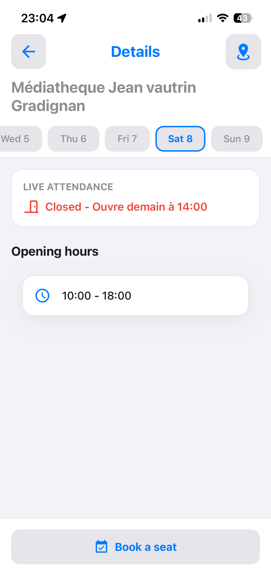

# Campus — bibliothèques universitaires

Liste des BU de la région avec leur **affluence en temps réel**, leur état d'ouverture et leurs
horaires de la semaine.

Socle commun : [campus.md](campus.md). Source de données : Affluences, section 3 de
[sources-externes.md](../sources-externes.md).

## Parcours utilisateur

1. La section du tableau de bord présente les BU les plus proches avec leur pastille d'affluence.
2. « Voir tout » ouvre la liste : recherche par nom ou par ville, filtre « ouvertes uniquement »,
   mise en favori.
3. Toucher une BU ouvre sa fiche : jauge d'affluence, bandeau de dates de la **semaine courante**, et
   horaires du jour sélectionné.
4. Un bouton d'en-tête ouvre la carte de la bibliothèque.





La dernière est la seule interface que le jalon [6-D](../phase-6/6-d-campus.md) ajoute, et elle répond
à une question que l'ancien code ne se posait pas : deux points de balayage sur douze n'ont pas
répondu, les dix autres sont là, **et l'utilisateur le sait**. Avant, la liste s'affichait amputée
sans que rien ne le signale.

## Flux de données

```text
LibraryScreen
  ├─ useCampusPosition()                      position resolue une fois
  ├─ useNearbyLibraries(lat, lon)             partage avec le carrousel du tableau de bord
  │     ├─ LibraryService.fetchNearbyLibraries(lat, lng)
  │     │     └─ 12 × Blueprint ukit.campus.bibliotheques   runs concurrents, dedoublonnes par id
  │     └─ pour chaque BU : LibraryService.getAffluencesData(slug)
  │           └─ Blueprint ukit.campus.bibliotheque-affluence
  ├─ tri : favoris d'abord, puis distance croissante
  └─ CampusListLayout → LibraryListItem

LibraryDetailsScreen  (params : library, affluence)
  └─ useLibraryTimetableData(library)
       └─ LibraryService.fetchLibraryTimetable(slug, weekOffset)
            └─ Blueprint ukit.campus.bibliotheque-horaires
```

Le service n'émet plus de requête depuis le jalon [6-D](../phase-6/6-d-campus.md) : il joue des
[Blueprints](../blueprints.md) et travaille la donnée reçue. Ce qui est resté applicatif — le
balayage, le dédoublonnage, le filtre de catégorie, Haversine, le tri — est listé dans la section 3
de [sources-externes.md](../sources-externes.md), avec la raison de chaque cas.

L'affluence de la liste est chargée en parallèle après la découverte des sites : la liste s'affiche
d'abord, les pastilles se remplissent ensuite.

## Contrats

```ts
interface LibraryInfo {
    id: string;
    name: string;           // primary_name du fournisseur
    campus: string;         // ville, à défaut le libellé CAMPUS
    lat: number;
    lng: number;            // noter "lng", pas "lon"
    slug: string;           // identifiant utilisé par les endpoints v4
    distance?: number;      // km, recalculé localement
    imageUrl?: string;
}

interface AffluencesData {
    isOpen: boolean;
    occupancyRate: number | null;   // pourcentage, null si non publié
    closingTime?: string;
    openingText?: string;           // "ouvre à 8h30"
}

interface TimetableEntry {
    day: string;
    isToday: boolean;
    openingHours: { openingHour: string; closingHour: string }[];
}
```

Ces trois types n'ont pas bougé avec la migration — c'est ce qui a permis de ne pas toucher aux
composants. Ce qui a changé, c'est ce que les **méthodes** rendent :

```ts
type LibrariesResult = { ok: true; libraries: LibraryInfo[]; secteursMuets: number; secteurs: number }
                     | { ok: false; failure: UkitFailure };
type AffluenceResult = { ok: true; affluence: AffluencesData } | { ok: false; failure: UkitFailure };
type TimetableResult = { ok: true; entries: TimetableEntry[] } | { ok: false; failure: UkitFailure };
```

**Se teste avec `resultat.ok === false`, jamais avec `!resultat.ok`** : sans `strictNullChecks`,
TypeScript ne restreint pas une union sur la simple véracité du discriminant.

`secteursMuets` est la réponse à une question que l'ancien code ne se posait pas — voir « Décisions de
conception ».

## Codes couleur d'affluence

`getLibraryStatus` ([`LibraryService.ts`](../../src/features/Campus/services/LibraryService.ts))
centralise la traduction d'une affluence en couleur et en libellé. C'est la seule source de vérité de
cette sémantique — ne pas la réimplémenter dans un composant.

| Condition | Couleur | Sens |
|---|---|---|
| fermée | `#f44336` rouge | quel que soit le taux |
| ouverte, taux `null` ou `< 50 %` | `#4caf50` vert | de la place |
| ouverte, taux `< 80 %` | `#ff9800` orange | se remplit |
| ouverte, taux `>= 80 %` | `#ff4436` rouge clair | pleine |

Un taux inconnu est traité comme « de la place » : afficher un avertissement sans donnée serait
trompeur.

## Décisions de conception

**Douze points de balayage plutôt qu'un.** L'endpoint de découverte ne renvoie que les sites proches
du point interrogé. Une seule requête depuis la position de l'étudiant masquerait les BU des autres
villes de la région. Les onze points fixes couvrent Bordeaux et les campus de Nouvelle-Aquitaine ;
ajouter une ville consiste à ajouter une coordonnée dans `POINTS_FIXES`.

**Le balayage n'est pas descendu dans le Blueprint, et c'est le point du jalon.** Le Blueprint prend
une latitude et une longitude et rend les sites de ce point ; le service le joue douze fois. Trois
raisons, dont aucune n'est un manque du moteur : la liste des villes est une décision **produit** ;
« l'une des catégories vaut 1 ou 20 » demanderait d'indexer une liste dans un prédicat, ce que la
grammaire refuse des deux côtés ; et Haversine est du **calcul**, qu'il faudrait alors réimplémenter à
l'identique dans deux moteurs.

**Deux points muets sur douze se disent.** Avant le jalon 6-D, la réponse à « que fait-on quand un
point de balayage échoue ? » était « rien, on n'en sait rien » : la liste s'affichait amputée, sans
que rien ne le signale. Désormais les dix qui ont répondu s'affichent **et** un bandeau discret dit
que la couverture est incomplète, avec Réessayer. Zéro réponse reste un échec plein, avec le message
de sa famille. Une liste incomplète qui se présente comme complète est un mensonge silencieux, et
c'est exactement le défaut que cette phase supprime.

**Le filtrage par catégorie (`id` 1 ou 20) est indispensable.** L'endpoint renvoie tous les types de
lieux gérés par le fournisseur — piscines, mairies, salles de sport. Sans ce filtre, la liste serait
inexploitable. Il reste une **constante applicative** : le corriger demande donc toujours une release.

**L'arité de l'extraction n'est pas un cas limite ici, c'est le cas nominal.** Tous les sites de la
région n'ont qu'une catégorie, donc `$.categories[*].id` rend `20` et jamais `[20]`. Un filtre écrit
pour une liste aurait rendu une liste vide sur des données parfaitement normales, sans rien signaler.
`commeListe` normalise en un endroit, et un test le verrouille.

**La distance renvoyée par l'API est ignorée** quand les coordonnées du site sont disponibles :
`estimated_distance` est relative au point de balayage, pas à l'étudiant. Elle ne sert que de repli.

**Le taux d'occupation est lu à deux emplacements** (`liveAttendance.percentage` puis
`liveAttendance.occupancy`) : les deux formes coexistent selon les sites. Le Blueprint extrait les
**deux**, et le choix reste applicatif — un `??` n'est pas exprimable dans une spécification
d'extraction. Un site fermé rend `liveAttendance: null`, donc aucun des deux chemins ne correspond :
c'est un résultat, pas un échec.

**L'échec d'une affluence reste discret.** Il est journalisé, et la bibliothèque s'affiche sans
pastille — ce que l'application faisait déjà. Douze messages d'erreur pour douze pastilles seraient
pires que le défaut ; l'échec de la **liste**, lui, est visible.

**Le filtre « ouvertes » considère qu'une BU sans donnée est ouverte** (`?? true`). Masquer une
bibliothèque parce que son affluence n'a pas encore été chargée serait un faux négatif visible.

## Vérifier

- Ouvrir la liste : des BU d'au moins deux villes doivent apparaître, la plus proche en tête.
- Vérifier les pastilles d'affluence en heure creuse puis en heure pleine : la couleur doit changer.
- Activer le filtre « ouvertes » en soirée : les BU fermées doivent disparaître.
- Ouvrir une fiche : la jauge, le jour courant présélectionné, et les horaires doivent être cohérents.
  La fiche ne montre que la semaine courante — voir les limites.
- Ouvrir une BU fermée : l'état fermé et son texte d'ouverture, **pas** un échec.
- Chemin dégradé : pointer `vars.api` du Blueprint sur un hôte `.invalid` — « Service indisponible »
  **avec** Réessayer, et non une liste vide.
- Chemin dégradé : faire échouer **une partie** des points de balayage — la liste s'affiche, plus le
  bandeau de couverture partielle. Les trois écrans (échec plein, couverture partielle, liste
  légitimement vide) doivent être différents ; s'ils ne le sont pas, la vérification n'a rien
  vérifié.

## Limites connues

- **Douze requêtes de découverte à chaque ouverture**, plus une requête d'affluence par BU trouvée.
  C'est le chargement le plus lourd de l'application. Le jalon 6-D ne l'a pas touché : réduire le
  balayage est un changement de comportement produit, il se décide séparément et avec ses mesures.

  Ces mesures existent maintenant, prises le 2026-08-08 en vérifiant la couverture partielle sur
  appareil, et elles ne disent pas ce qu'on attendait :

  | Point | BU rendues | Exclusives |
  |---|---:|---|
  | Bordeaux Centre | 8 | *aucune* |
  | Talence/Pessac | 8 | *aucune* |
  | Pau | 1 | Bibliothèque de Pau |
  | La Rochelle | 2 | BU La Rochelle, XL Library |
  | Limoges | 1 | Bibliothèque Francophone Multimédia |
  | Bayonne/Anglet | 2 | Médiathèque Centre-Ville, Bibliothèque Florence Delay |
  | Poitiers, Périgueux, Agen, Angoulême, Niort | 0 | — |

  **Quatorze bibliothèques pour douze requêtes**, dont cinq points qui n'en rendent aucune et deux qui
  se recouvrent entièrement. Ce n'est pas un défaut à corriger tout de suite : un point muet
  aujourd'hui cesse de l'être le jour où une bibliothèque s'inscrit chez le fournisseur, et la liste
  des villes couvertes est une promesse produit. C'est une décision pour
  [6-G](../phase-6/6-g-etablissements.md), quand ces points rejoindront le catalogue des
  établissements — et elle se prendra sur ces chiffres plutôt que sur une intuition.
- **Les libellés de filtre et de recherche s'affichent en majuscules brutes** (`ALL_LIBRARIES`,
  `OPEN_LIBRARIES`, `SEARCH_BU_CITY`) — voir [i18n.md](../i18n.md).
- **Les points de balayage sont codés en dur** : une BU hors de leur portée reste invisible. Ils
  pourraient rejoindre la base avec le catalogue des établissements
  ([6-G](../phase-6/6-g-etablissements.md)) — c'est le bon endroit pour eux, mais pas maintenant.
- **Les identifiants de catégorie (1, 20) restent une constante applicative** : les descendre
  demanderait d'indexer une liste dans un prédicat, ce que la grammaire refuse. Leur correction
  demande donc toujours une release, contrairement à tout le reste de cette source.
- **La navigation de semaine en semaine n'existe pas dans l'interface.**
  [`useLibraryTimetableData`](../../src/features/Campus/Library/hooks/useLibraryTimetableData.ts)
  expose `weekOffset` et `setWeekOffset`, mais **aucun composant ne les branche** : la fiche ne
  demande jamais que la semaine courante. Ce document annonçait pourtant cette navigation, et la
  vérification sur appareil du jalon [6-D](../phase-6/6-d-campus.md) l'a démentie. Le Blueprint, lui,
  accepte un décalage signé et la parité le joue sur deux semaines : brancher deux boutons suffirait,
  mais c'est une capacité d'interface, à décider comme telle.
- **Les textes venant du fournisseur restent en français**, quelle que soit la langue de
  l'application : les Blueprints envoient `Accept-Language: fr` sans condition. Une BU fermée affiche
  donc « Ouvre demain à 14:00 » au milieu d'une interface en anglais — visible sur la capture
  ci-dessus. Ce n'était pas différent avant la migration, mais l'en-tête est désormais **dans un
  fichier** : le corriger demanderait de passer la langue en entrée du Blueprint, ce qu'un Blueprint
  ne peut pas deviner seul. C'est une évolution possible, pas un défaut de la migration.
- **Aucun cache** : la liste et les affluences sont rechargées à chaque montage.
- **Un site sans coordonnées ni distance estimée n'a plus de distance du tout.** L'ancien code
  divisait `estimated_distance` sans vérifier sa présence et produisait `NaN` ; il rend désormais
  `undefined`, que le tri et l'affichage traitent déjà comme une absence. Aucun site de la région
  n'est dans ce cas.

## Carte des fichiers

| Fichier | Rôle |
|---|---|
| [`Library/LibraryScreen.tsx`](../../src/features/Campus/Library/LibraryScreen.tsx) | liste des BU : composition, tri, filtres, recherche |
| [`Library/LibraryDetailsScreen.tsx`](../../src/features/Campus/Library/LibraryDetailsScreen.tsx) | fiche d'une BU : affluence, dates, horaires, état d'échec des horaires |
| [`Library/components/LibraryListItem.tsx`](../../src/features/Campus/Library/components/LibraryListItem.tsx) | ligne de liste d'une BU avec son état |
| [`Library/components/LibraryDetailsComponents.tsx`](../../src/features/Campus/Library/components/LibraryDetailsComponents.tsx) | `LibraryLiveAttendance`, `LibraryDatesHeader`, `LibraryOpeningHoursList` |
| [`Library/hooks/useLibraryTimetableData.ts`](../../src/features/Campus/Library/hooks/useLibraryTimetableData.ts) | horaires d'une BU : chargement par semaine, échec, sélection du jour, défilement |
| [`hooks/useNearbyLibraries.ts`](../../src/features/Campus/hooks/useNearbyLibraries.ts) | découverte, affluences, échec et couverture partielle, partagés par la liste et le carrousel |
| [`services/LibraryService.ts`](../../src/features/Campus/services/LibraryService.ts) | orchestration des trois Blueprints, balayage, distances, `getLibraryStatus` |
| [`services/LibraryMapping.ts`](../../src/features/Campus/services/LibraryMapping.ts) | le contrat et la projection : arité, visuel, affluence, horaires — sans plateforme |
| [`services/LibraryMapping.test.ts`](../../src/features/Campus/services/LibraryMapping.test.ts) | ses tests, joués par `npm test` |
