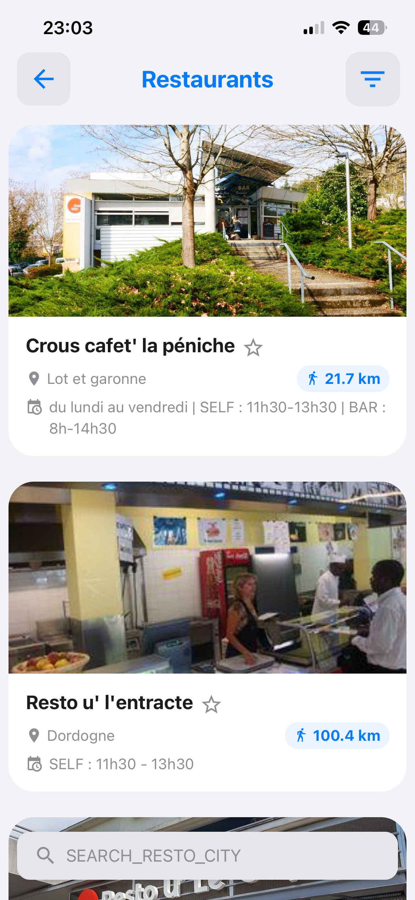
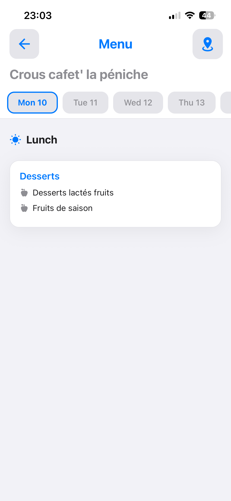
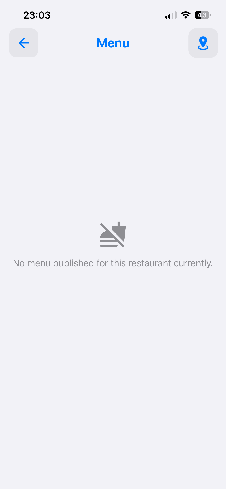

# Campus — restaurants universitaires

Liste des restaurants et cafétérias CROUS de la région, triés par distance, avec les menus du jour et
des jours suivants.

**La région est une donnée de catalogue** depuis le jalon
[6-J](../phase-6/6-j-compte-et-sources-par-etablissement.md), colonne `crous_region`. Elle était une
`vars` du Blueprint, avec un commentaire qui l'assumait — « l'application vise une seule région ».
C'était vrai, et ça le reste : le périmètre du produit est le **secteur bordelais**
([README](../../README.md)), et la valeur vaut toujours `1`. Ce qui a changé n'est pas la valeur mais
sa **nature** — c'est exactement la forme que prend une constante bordelaise avant de devenir fausse,
et le jalon 6-G en a déterré onze du même genre. Un établissement qui ne déclare pas de région ne fait
pas afficher les restaurants d'une autre ville : la **section disparaît**, comme celle des salles
libres chez un établissement sans inventaire.

Socle commun : [campus.md](campus.md). Source de données : Croustillant, section 4 de
[sources-externes.md](../sources-externes.md).

## Parcours utilisateur

1. La section du tableau de bord présente un carrousel des restaurants les plus proches.
2. « Voir tout » ouvre la liste complète : recherche par nom ou par ville, filtre par type
   (tous / Resto U / Crous Market), mise en favori.
3. Toucher un restaurant ouvre sa fiche : sélecteur de dates en bandeau, menu du midi et du soir
   détaillé par catégorie.
4. Un bouton d'en-tête ouvre la carte du restaurant.



La ligne d'horaires de cette capture est le correctif du jalon [6-D](../phase-6/6-d-campus.md) : avant
lui, ces trois mentions étaient remplacées par « Horaires non spécifiés », pour **tous** les
établissements de la région.





Cette dernière capture est à contraster avec un écran d'échec. Les deux disaient la même chose avant
la [Phase 6](../phase-6/README.md) ; ici la source a parfaitement répondu, elle n'a simplement rien à
publier — et 24 des 41 établissements de la région sont dans ce cas.

## Flux de données

```text
CrousScreen
  ├─ useCampusPosition()                      position resolue une fois
  ├─ useCrousRestaurants(lat, lon)            partage avec le carrousel du tableau de bord
  │     └─ CrousService.fetchRestaurantsBordeaux(lat, lon)
  │           └─ Blueprint ukit.campus.restaurants
  ├─ tri : favoris d'abord, puis distance croissante
  ├─ filtre : type d'établissement + recherche textuelle
  └─ CampusListLayout → CrousRestaurantListItem

CrousMenuScreen  (params : restaurantId, restaurantName, location)
  ├─ CrousService.fetchRestaurantMenu(restaurantId)
  │     └─ Blueprint ukit.campus.restaurant-menu
  ├─ CrousDateHeader     sélection du jour
  └─ CrousMealCard       une carte par service (midi, soir)
```

Le service n'émet plus de requête depuis le jalon [6-D](../phase-6/6-d-campus.md) : il joue des
[Blueprints](../blueprints.md) et travaille la donnée reçue. Ce qui est resté applicatif — la
position, Haversine, le tri, la relecture de la date, les libellés — est listé dans la section 4 de
[sources-externes.md](../sources-externes.md).

Aucun cache : les menus changent quotidiennement et sont rechargés à chaque ouverture.

## Contrats

Les types de **données** n'ont pas bougé avec la migration — c'est ce qui a permis de ne pas toucher
aux composants :

```ts
interface CrousRestaurant {
    id: string;            // code numérique du CROUS, en chaîne
    title: string;
    short_desc: string;    // zone, à défaut adresse
    lat: number;
    lon: number;           // noter "lon", pas "lng"
    opening: string;       // horaires joints par " | "
    distance?: number;     // km, calculé localement
    image_url?: string;    // endpoint /preview du fournisseur
}

interface CrousDayMenu {
    date: string | null;                              // normalisée en YYYY-MM-DD
    midi: { name: string, dishes: string[] }[];
    soir: { name: string, dishes: string[] }[];
}
```

Ce qui a changé, c'est ce que les **méthodes** rendent : une union discriminée qui porte l'échec,
calquée sur `BlueprintRun` du socle.

```ts
type CrousRestaurantsResult = { ok: true; restaurants: CrousRestaurant[] } | { ok: false; failure: UkitFailure };
type CrousMenuResult        = { ok: true; menus: CrousDayMenu[] }         | { ok: false; failure: UkitFailure };
```

**Se teste avec `resultat.ok === false`, jamais avec `!resultat.ok`** : sans `strictNullChecks`,
TypeScript ne restreint pas une union sur la simple véracité du discriminant.

`CrousMenu`, `CrousMenuCategory` et `CrousDish` ont été **retirés** au jalon 6-D : aucun écran ne les
lisait, et `CrousRestaurant.menus` n'était jamais rempli.

## Filtres

Le filtrage par type est **textuel**, faute de champ de catégorie exploitable côté fournisseur :

| Filtre | Condition sur le titre, en minuscules |
|---|---|
| `resto` | contient `crous cafet` ou `resto u` |
| `market` | contient `crous moovy market` ou `crous market` |

Le filtre est persisté sous `crous_filter`, les favoris sous `crous_favorites`.

## Décisions de conception

**La région est codée en dur à 1** (Nouvelle-Aquitaine). L'application vise l'Université de Bordeaux ;
élargir supposerait de choisir une région, donc une préférence utilisateur qui n'existe pas.

**Les établissements de `type.code === 4` sont écartés** par un prédicat `where` du Blueprint : cette
catégorie ne correspond pas à un lieu de restauration exploitable pour l'étudiant. Le `4` y est écrit
en clair et non en `vars` — une spécification d'extraction n'est **jamais** rendue, donc une variable
y serait un nom mort.

**Les dates sont converties à la lecture**, et cette conversion-là ne descend pas. L'API renvoie
`DD-MM-YYYY`, toute l'application manipule `YYYY-MM-DD`. Les filtres de date du moteur **produisent**
un format attendu par une source ; ils refusent d'en interpréter un, bruyamment. La conversion reste
donc dans [`CrousMapping.ts`](../../src/features/Campus/services/CrousMapping.ts), et une date déjà
au format de l'application y traverse sans être retournée.

**Un restaurant sans menu n'est pas une panne.** 24 des 41 établissements de la région rendent `404`
sur `/menu`, dont 8 que l'application affiche. Le Blueprint ne porte donc pas d'`expect` : un step
`assert` accepte 200 **ou** 404, et refuse tout le reste. L'écran garde son état vide « aucun menu
publié » là où un `expect: {status: 200}` aurait affiché « réponse inattendue » à un étudiant sur
deux.

**L'image est une URL construite**, pas un champ renvoyé : `/restaurants/{code}/preview`. Un
restaurant sans visuel côté fournisseur affiche donc une image cassée, rattrapée par
[`default_resto.png`](../../assets/images/default_resto.png). Aucun Blueprint ne la porte : ce n'est
pas une requête que le service émet, c'est une adresse qu'une balise image résout.

**Les horaires étaient invisibles, et personne ne le savait.** La source a cessé de servir `horaires`
comme un tableau pour le servir comme une **chaîne JSON** ; `Array.isArray` étant faux pour les 41
établissements, l'écran affichait « horaires non spécifiés » partout. Mesuré et corrigé au jalon 6-D :
`horairesLisibles` accepte les deux formes, et une troisième retombe sur le libellé traduit. C'est le
**seul** changement de comportement volontaire du jalon, et donc le seul champ exclu de la projection
de parité ([tools/parity/README.md](../../tools/parity/README.md)).

## Vérifier

- Ouvrir la liste : les restaurants proches doivent apparaître en premier, avec une distance
  plausible.
- Appliquer le filtre « Resto U » puis « Crous Market » : la liste doit se réduire cohéremment.
- Rechercher une ville (« Pessac », « Talence ») : la correspondance porte sur le nom **et** sur la
  zone.
- Ouvrir un restaurant en période de service : le menu du jour doit s'afficher, midi et soir séparés.
- Ouvrir **Restaurant la passerelle** (code 1642) ou tout autre établissement qui ne publie rien :
  l'état « aucun menu publié » doit s'afficher, **sans** message d'erreur.
- Chemin dégradé : pointer `vars.api` du Blueprint sur un hôte `.invalid` — la liste doit afficher
  « Service indisponible » **avec** Réessayer, et non un état vide.
- Chemin dégradé : mettre `expect.status` à `999` — « Réponse inattendue », **sans** Réessayer. Les
  deux écrans doivent être différents ; s'ils ne le sont pas, la vérification n'a rien vérifié.

## Limites connues

- **Aucun repli hors ligne, et ce qu'on croit en voir n'en est pas un.** Le hors ligne coupé depuis le
  menu de développement ([qualite.md](../qualite.md)) laisse le carrousel du tableau de bord afficher
  ses restaurants, ce qui ressemble à un cache : ce n'en est pas un. C'est l'**état React** de la
  section, chargé avant la coupure, que l'effet ne rejoue que sur un changement de position ou un
  nouvel essai ([`useCrousRestaurants.ts`](../../src/features/Campus/hooks/useCrousRestaurants.ts)).
  La liste complète, qui se monte à neuf, affiche bien « Service indisponible ». Au redémarrage de
  l'application hors ligne, les deux seraient vides. C'est la décision écrite dans
  [donnees-et-persistance.md](../donnees-et-persistance.md) — un menu change tous les jours — mais
  elle se vérifie mal, et c'est ce piège d'observation qu'il faut connaître.
- **Les libellés de filtre et le texte de recherche s'affichent en majuscules brutes**
  (`ALL_ESTABLISHMENTS`, `RESTO_U`, `CROUS_MARKET`, `SEARCH_RESTO_CITY`) — voir [i18n.md](../i18n.md).
- **Le classement par type repose sur des chaînes présentes dans le nom**, et c'est plus fragile que
  ça n'en a l'air. Mesuré le 2026-08-08 en publiant la région 2 sur un appareil : le CROUS y nomme ses
  établissements `R.u. breuty`, `R.u. crousty`… là où la région 1 écrit `Resto u'`. Sur les 35
  établissements servis, le filtre « Resto U » en retient **1**, le filtre « Crous Market » **0**.
  Un renommage côté fournisseur ne produit donc aucune erreur : il vide simplement un filtre, en
  silence. C'est une fragilité applicative que les Blueprints ne réparent pas — le filtrage textuel
  n'est pas descendu, et il ne pouvait pas l'être.
- **Le prédicat `where` lève sur un établissement sans `type`.** `item.type.code != 4` compare un
  champ absent, ce que les deux moteurs refusent au lieu de filtrer en silence. Aucun des 41
  établissements n'est dans ce cas aujourd'hui ; le jour où la source en servirait un, l'échec serait
  rangé en `data` — visible, donc corrigeable, ce qui est préférable à une liste amputée sans raison.
- **La région est un `vars`, pas une entrée.** La changer demande une publication de fichier, ce qui
  est désormais une minute — mais pas un réglage utilisateur.
- **Aucun cache** : rouvrir une fiche relance systématiquement l'appel.

## Carte des fichiers

| Fichier | Rôle |
|---|---|
| [`Crous/CrousScreen.tsx`](../../src/features/Campus/Crous/CrousScreen.tsx) | liste des restaurants : composition, tri, filtres, recherche |
| [`Crous/CrousMenuScreen.tsx`](../../src/features/Campus/Crous/CrousMenuScreen.tsx) | fiche d'un restaurant : menus par jour et par service, état vide, état d'échec |
| [`Crous/components/CrousRestaurantListItem.tsx`](../../src/features/Campus/Crous/components/CrousRestaurantListItem.tsx) | ligne de liste d'un restaurant |
| [`Crous/components/CrousDateHeader.tsx`](../../src/features/Campus/Crous/components/CrousDateHeader.tsx) | bandeau de sélection du jour dans la fiche |
| [`Crous/components/CrousMealCard.tsx`](../../src/features/Campus/Crous/components/CrousMealCard.tsx) | carte d'un service (midi ou soir), catégories et plats |
| [`hooks/useCrousRestaurants.ts`](../../src/features/Campus/hooks/useCrousRestaurants.ts) | chargement, échec et nouvel essai, partagés par la liste et le carrousel |
| [`services/CrousService.ts`](../../src/features/Campus/services/CrousService.ts) | orchestration des deux Blueprints, distances et tri |
| [`services/CrousMapping.ts`](../../src/features/Campus/services/CrousMapping.ts) | le contrat et la projection : date, horaires, services — sans plateforme |
| [`services/CrousMapping.test.ts`](../../src/features/Campus/services/CrousMapping.test.ts) | ses tests, joués par `npm test` |
