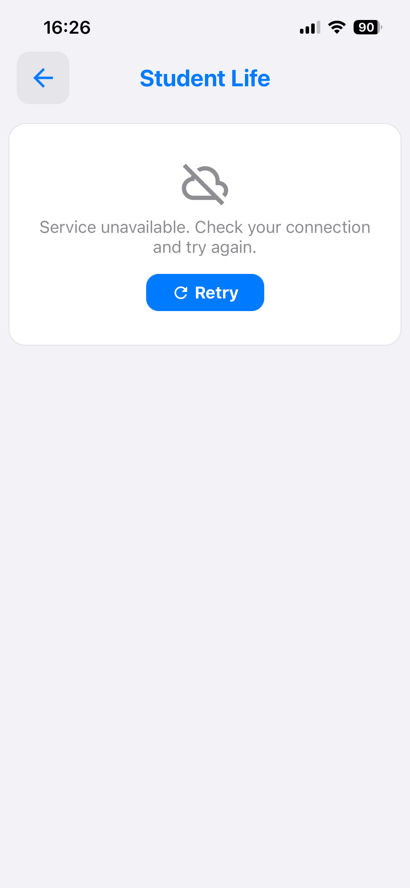

# Campus — vie étudiante

Annonces éditoriales : événements associatifs, communications de BDE, informations ponctuelles. C'est
le seul contenu de l'application **rédigé par l'équipe** plutôt que récupéré d'un système
universitaire.

Socle commun : [campus.md](campus.md). Source de données : la table `annonces` de notre
[base de publication](../backend.md).

Cette partie a servi deux fois de pilote, et c'est ce qui explique son histoire. Au jalon
[6-A](../phase-6/6-a-socle.md) elle a été la **première source migrée vers un
[Blueprint](../blueprints.md)** — la plus simple du lot, donc celle dont un échec ne pouvait venir
que du socle qu'on posait. Au jalon [6-B](../phase-6/6-b-supabase.md) elle est devenue la **première
fonctionnalité alimentée par la base**, et le **premier écran branché sur le modèle d'erreur**.

## Parcours utilisateur

1. La section du tableau de bord présente les annonces actives en carrousel horizontal — c'est la
   première section, en haut de l'onglet. Les cartes sont au **format affiche** : visuel carré,
   titre et émetteur en pied — environ deux affiches visibles, l'amorce de la suivante dépassant
   du bord.
2. « Voir tout » ouvre la liste complète, en **grille de deux colonnes** — avec recherche sur le
   titre, l'émetteur et l'accroche dès que huit annonces sont publiées : le seuil des listes (4),
   doublé parce que la grille en range deux par rangée ([campus.md](campus.md)).
3. Toucher une annonce ouvre sa fiche : visuel au ratio de l'image, titre, émetteur, étiquette
   d'information, description longue, et bouton d'action ouvrant un lien externe.

> **Capture attendue** — `annonces-liste.png` : la grille des annonces actives.
>
> **Capture attendue** — `annonce-detail.png` : une fiche complète, avec émetteur, étiquette et bouton
> d'action.

## Flux de données

```text
BdeSection (tableau de bord) / BdeScreen (liste)
  └─ useBdeAnnonces()                     le chargement, l'echec, le nouvel essai
       └─ BdeService.fetchAnnonces()
            ├─ getSupabase()              null si l'application est construite sans cle
            ├─ select(colonnes) sur `annonces`
            │    ├─ la politique de lecture ecarte deja l'inactif et l'expire
            │    └─ order publiee_le desc, puis id asc
            ├─ si erreur → describeSupabaseFailure → { ok: false, failure }
            ├─ projection : colonnes de la table → contrat BdeAnnonce (BdeMapping)
            └─ filtre applicatif : expires_at > maintenant, ou pas d'expiration
  └─ succes → BdeAnnonceCard → navigation vers BdeDetail
  └─ echec  → message de la famille + bouton Reessayer

BdeDetailsScreen (params : annonce)
  └─ rendu direct de l'objet reçu, aucun appel réseau
  └─ bouton d'action (barre flottante PiedFlottant) : lien web → navigateur intégré,
     autre schéma (mailto, tel) → Linking.openURL
```

La fiche ne recharge rien : l'annonce complète transite par les paramètres de navigation. C'est
possible parce que la charge utile est petite et déjà entièrement chargée par la liste.

**Où passe la frontière.** La base porte le contenu et la règle de publication (`active`,
`expire_le`) ; l'application porte la projection sur `BdeAnnonce`, le **filtre d'expiration** et le
tri. Le filtre est volontairement doublé : la politique protège la **donnée** — ce qui n'a pas à être
lu n'est pas envoyé — et le filtre applicatif protégera l'**affichage** le jour où la donnée viendra
d'un cache local. C'est aussi lui qui permettra un jour d'afficher une annonce expirée en grisé
plutôt que de la masquer, ce qu'un filtre côté base interdit.

**Pourquoi pas un Blueprint, alors qu'il en existait un.** Un Blueprint sert à parler à une source
**tierce** dont on ne contrôle ni le format ni la disponibilité, et qu'on veut pouvoir corriger sans
release. Pour notre propre table, l'indirection n'achèterait rien — nous changeons le schéma et
l'application dans le même mouvement — et coûterait un aller-retour de plus à chaque correction.
Le fichier reste dans [`blueprints/`](../../blueprints/) comme témoin du format.

## Contrat

Deux formes, et il faut savoir laquelle est laquelle. La **ligne de base** est en français, comme le
reste du schéma ; le **contrat d'écran** garde les noms anglais d'avant la base — renommer le contrat
en même temps qu'on change de source aurait mélangé deux changements dont un seul a une raison.

| Colonne (`annonces`) | Champ (`BdeAnnonce`) | Note |
|---|---|---|
| `id` | `id` | UUID, sert de clé de liste |
| `active` | `is_active` | filtré par la politique ; lu, plus supposé |
| `expire_le` | `expires_at` | **nullable** — vide veut dire « n'expire pas » |
| `titre` | `title` | |
| `emetteur` | `issuer_name` | association ou service émetteur |
| `image_url` | `image_url` | URL du bucket `media` |
| `images` | `images` | **jsonb**, tableau d'URLs : la galerie de la fiche, sous la description. Une entrée qui n'est pas une chaîne est ignorée, un tableau vide est omis |
| `lat`, `lng` | `location` | le lieu de l'événement : les **deux** présents, la fiche montre une carte « S'y rendre » — l'un sans l'autre est omis |
| `couleur` | `couleur` | l'identité visuelle : un index de la palette de sections (0-3, 5) — pastille d'émetteur, icône d'accroche, départ du cycle des sections. Omis si pas un entier positif |
| `accroche` | `info_label` | étiquette courte : date, lieu, tarif |
| `description` | `long_desc` | la description longue de la fiche |
| `cta_texte` | `cta_text` | libellé du bouton d'action |
| `cta_lien` | `cta_link` | URL ouverte au clic — dans le **navigateur intégré** pour un lien web, vers le système sinon (mailto, tel) |
| `publiee_le` | — | jamais affiché ; c'est le tri |

Un champ nul ou vide en base est **omis** du contrat, jamais rendu chaîne vide : la fiche n'affiche
son bouton que si le libellé et le lien sont tous deux présents, et un libellé vide donnerait un
bouton muet. La conversion est dans
[`BdeMapping.ts`](../../src/features/Campus/services/BdeMapping.ts) et elle est testée.

## Publier une annonce

Depuis la console d'administration de Supabase, table `annonces`. Une entrée ajoutée est visible au
rechargement suivant, **sans publier de nouvelle version de l'application**.

Deux garde-fous, et ils ne font pas la même chose : `active = false` retire une annonce
**maintenant**, `expire_le` la fait disparaître d'elle-même à échéance. Les deux sont appliqués par
la politique de lecture, donc une annonce retirée ne sort pas de la base.

**`expire_le` peut rester vide** : l'annonce n'expire alors jamais.

**La description est un mini-langage publiable**, rendu dans le vocabulaire des fiches — chaque
section a sa **tête colorée avec icône** (le carré teinté des fiches de restaurant et de BU) et sa
carte, les listes deviennent des **puces** comme les plats d'un menu :

| Ligne | Rendu |
|---|---|
| `# Titre` | une section : tête colorée, icône par défaut |
| `# icone\|Titre` | idem, avec l'icône MaterialCommunityIcons nommée (`calendar-check`, `map-marker`…) |
| `- élément` | une puce, le point à la teinte de sa section |
| ligne vide | séparation de paragraphes |

Les couleurs des têtes **tournent** sur la palette des sections (`sectionsHeaders`, l'index 4 évité
comme partout), à partir de la **couleur d'identité** de l'annonce — la colonne `couleur`, qui
teinte aussi la pastille d'émetteur (sur la fiche **et** sur les cartes du carrousel et de la
grille, [`PastilleEmetteur`](../../src/features/Campus/Bde/PastilleEmetteur.tsx)) et l'accroche —
une pastille du même système, multi-ligne parce qu'elle porte une phrase. Tout vient du texte et de la
ligne publiés : un BDE structure et colore son annonce **sans release**. Une icône inconnue rend le
glyphe `?` — visible à la relecture, corrigeable à la publication, jamais un plantage.

Le filtre applicatif date par `moment()` depuis le jalon [6-E](../phase-6/6-e-planning.md), et non
plus par `new Date()` : la [simulation temporelle](../qualite.md) l'atteint donc, et une annonce
expirée se vérifie en déplaçant l'heure au lieu d'attendre son échéance.

Les visuels vont dans le bucket `media`, sous `annonces/`, et leur URL publique dans `image_url`.
**Le format attendu est le carré 1:1** — celui des affiches d'événements — et c'est lui que les
cartes affichent plein cadre. Un autre format n'est pas rejeté, et n'est **jamais recadré** : la
carte l'affiche entier sur un fond flou tiré de l'image, et la fiche l'affiche à son ratio, borné
entre 3:4 et 16:9. Procédure complète et clés : [backend.md](../backend.md#publier).

**La fiche parle le vocabulaire des fiches** (2026-08-30) : l'émetteur est la pastille partagée
(`Badge`, la même que la carte de liste), l'accroche est une **ligne d'information** et non une
pastille — elle porte une phrase, et une phrase dans une pastille déborde, c'est ce que l'écran
faisait. La galerie (`images`) suit la description, chaque image dans le même cadre adaptatif que le
visuel principal, et le lieu (`lat`/`lng`) se termine par la même section « S'y rendre » que les
fiches de restaurant et de BU ([`CampusMapSection`](../../src/features/Campus/components/CampusMapSection.tsx)).
Le bouton d'action **flotte sur le contenu**, dans le vocabulaire de la barre de recherche — objet
posé avec l'ombre partagée, fumée d'amortissement au-dessus
([`PiedFlottant`](../../src/shared/ui/PiedFlottant.tsx)) — et l'écran dégage sa hauteur en pied de
défilement.

Une annonce est le seul contenu dont **nous** publions déjà l'image : la table
[`visuels`](../backend.md#le-schéma) s'y applique quand même, et c'est délibéré. Elle permet de
retirer ou de remplacer un visuel sans toucher à la ligne d'annonce — donc sans risquer de modifier un
texte en voulant changer une photo.

## Décisions de conception

**Les cartes sont au format affiche, et l'accroche n'y est pas** (session d'écran du 2026-08-30).
Les visuels d'annonces sont des affiches 1:1 — le format des communications associatives — qui
portent déjà la date, le lieu et le tarif : la carte les affiche carrées et plein cadre, avec un
pied minimal (titre, émetteur). Répéter l'accroche sous l'affiche la dirait deux fois ; elle reste
sur la fiche, où elle se copie du regard avec la description. La même carte sert au carrousel du
tableau de bord (largeur ~60 % de l'écran, pour que la suivante dépasse) et à la grille de la liste
complète — deux largeurs, un seul composant, [`BdeAnnonceCard`](../../src/features/Campus/Bde/BdeAnnonceCard.tsx).

**Une affiche ne se recadre jamais.** Un visuel presque carré perdait son bord — précisément là où
une affiche écrit la date et le lieu. L'image s'affiche donc entière (`contain`), et une copie
floutée d'elle-même remplit ce que son format laisse libre du carré : invisible sur un 1:1 exact,
des bandes aux couleurs de l'affiche sinon — jamais un recadrage, jamais un aplat gris.

**L'émetteur est la pastille de la fiche**, [`Badge`](../../src/shared/ui/Badge.tsx) : la carte et
la fiche le disent d'une seule voix. Ce choix prépare la partie 2 de la v6 : la pastille a déjà un
`tone` sémantique, et le jour où les annonces portent une catégorie, la couleur par catégorie est
un mapping — pas une refonte de carte.

**La fiche épouse le ratio du visuel, borné.** Le bandeau paysage de 250 points réduisait une
affiche 1:1 à une vignette. Le cadre prend désormais le ratio mesuré de l'image (`Image.getSize`),
borné entre 3:4 et 16:9 pour qu'un format extrême — story verticale, bannière — ne prenne ni
n'écrase l'écran. Et **sans visuel, pas de cadre** : la fiche omet ce qui manque au lieu d'afficher
un rectangle gris qui se lirait comme une image cassée.

**Le tri est explicite.** Une table n'a pas d'ordre : s'en remettre à celui que la base rend ferait
varier l'affichage sans raison. `publiee_le` décroissant, `id` pour départager à horodatage égal, de
sorte que deux lectures successives donnent la même liste.

**Une annonce sans expiration ne disparaît pas.** `expire_le` est nullable et la politique laisse
passer `expire_le is null`. Le code d'avant la base comparait `new Date('')`, toujours faux, ce qui
aurait masqué une annonce que la base publie. Corrigé au jalon 6-B, et verrouillé par un test. Une
date *illisible*, en revanche, écarte toujours l'annonce : mieux vaut masquer que d'afficher un
contenu dont on ne sait pas s'il est encore d'actualité.

**La fiche est purement présentationnelle.** Aucun état, aucun chargement : elle rend l'objet reçu et
sort tôt (`if (!annonce) return null`) si le paramètre manque.

**Le chargement vit dans un hook, pas dans les écrans.** Le carrousel du tableau de bord et la liste
complète lisent la même source avec la même machinerie — chargement, échec, nouvel essai. L'écrire
une fois, dans [`useBdeAnnonces`](../../src/features/Campus/hooks/useBdeAnnonces.ts), évite qu'ils
divergent.

**Une liste vide et une panne ne produisent pas le même écran**, et c'est le vrai apport du jalon
6-B ici. En cas d'échec, la liste affiche le message de la famille et un bouton Réessayer ; le
carrousel du tableau de bord affiche une ligne discrète au lieu de disparaître. Quand il n'y a
simplement rien à publier, le carrousel disparaît comme avant — une absence d'annonces ne mérite pas
de section.

**Le bouton Réessayer n'apparaît que s'il peut réparer quelque chose.** C'est la table de
[`shared/aetherius/failures.ts`](../../src/shared/aetherius/failures.ts) qui décide, pas l'écran :
une source qui a changé de contrat (`rejected`) redonnera la même réponse, et un bouton qui ne répare
rien est pire qu'aucun bouton.

## Vérifier

```bash
npm test                      # la projection, l'expiration, la table d'erreurs
```

Le harnais de parité n'a plus de cas pour cette source : il comparait le Blueprint à l'ancien chemin
jsDelivr, et les deux ont quitté la production au jalon 6-B.

Sur appareil, le parcours nominal :

- Ouvrir l'onglet Campus : la section annonces doit être en tête et peuplée, environ deux affiches
  visibles et l'amorce de la suivante dépassant du bord, l'accroche sur les cartes en moins.
- Ouvrir la liste complète : une **grille de deux colonnes** ; avec un nombre impair d'annonces, la
  dernière cellule reste alignée à gauche. Recherche et états inchangés.
- Ouvrir une fiche : une affiche 1:1 s'affiche plein cadre ; visuel, émetteur en pastille, accroche
  en ligne d'information et **description longue** doivent s'afficher ; le bouton d'action d'un lien
  web doit ouvrir le **navigateur intégré**, et son retour ramener à la fiche.
- Ouvrir une annonce sans `image_url`, sans `info_label` ou sans `cta_link` : la fiche doit rester
  correcte, les éléments absents simplement omis — sans visuel, **aucun cadre gris**, le titre
  ouvre la page. Même règle pour `images` et `lat`/`lng` : pas de galerie vide, pas de carte sans
  les deux coordonnées.
- Publier une annonce avec `images` et `lat`/`lng` : la galerie sous la description, chaque image à
  son ratio, et la carte « S'y rendre » en pied, centrée au bon endroit.
- Une image paysage (ancien format) doit rester correcte : entière sur son fond flou sur les
  cartes, bornée à 16:9 sur la fiche — jamais tronquée.

Puis les chemins dégradés, qui doivent produire des écrans **différents** :

| Sonde | Comment | Attendu |
|---|---|---|
| Annonce retirée | `active = false` en base | disparaît au rechargement, sans release |
| Annonce expirée | reculer `expire_le` | absente — et absente **de la réponse**, pas seulement de l'écran |
| Annonce sans échéance | `expire_le = null` | **visible** |
| Base injoignable | `SUPABASE_URL` sur un hôte `.invalid` | « Service indisponible » + Réessayer, et les autres onglets fonctionnent |
| Clé fausse | altérer `SUPABASE_ANON_KEY` | même écran, et l'application démarre |
| Sans base du tout | vider les deux variables | l'application démarre et s'utilise entièrement |
| Rien à publier | passer toutes les annonces à `active = false` | écran vide **sans** message d'erreur |

Les deux dernières lignes sont celles qui comptent : la première prouve que la base est un point de
publication et non un intermédiaire, et le contraste entre les deux prouve que « la source est
morte » et « il n'y a rien aujourd'hui » ne sont plus le même écran.

**Une astuce qui fait gagner deux allers-retours** : les trois sondes de publication se jouent en une
seule recharge, en ajoutant deux annonces de sonde en base — l'une expirée, l'autre sans échéance —
en plus d'une désactivée. Chaque cas a alors une issue distincte et lisible sur le même écran, et il
suffit de relever la réponse REST en parallèle pour prouver que l'écart vient de la politique et non
d'un filtre applicatif.

**Le mode avion n'est pas la bonne sonde** : couper la connexion d'un appareil de développement casse
aussi Metro. Pointer `SUPABASE_URL` sur le TLD réservé `.invalid` (RFC 2606, ne résout sur aucun
réseau) produit exactement la même famille, sans toucher à la connectivité. Après toute bascule de
`.env`, redémarrer avec `npx expo start -c` : `app.config.ts` lit l'environnement au moment de la
configuration, pas à l'exécution.



*L'écran de la sonde « base injoignable ». C'est ce qui remplace l'ancienne liste vide — et ce qui ne
s'affiche **pas** quand il n'y a simplement rien à publier : dans ce cas la section disparaît, sans
message ni bouton.*

## Limites connues

- **Aucun cache** : l'absence de réseau vide la section. Elle affiche désormais *pourquoi*, ce qui
  est mieux qu'avant, mais des annonces vues juste avant ne réapparaissent pas hors ligne.
- **`expires_at` est comparé en heure locale de l'appareil**, sans fuseau explicite.
- **La fiche n'a pas d'état d'erreur** : un paramètre manquant produit un écran vide. Elle ne charge
  rien, donc elle ne peut pas échouer — mais elle ne peut pas non plus le dire.
- **Le tri se fait sur `publiee_le`**, pas sur un ordre éditorial choisi. Deux annonces publiées à la
  même seconde sont départagées par leur identifiant, ce qui est déterministe mais arbitraire.

## Carte des fichiers

| Fichier | Rôle |
|---|---|
| [`Bde/BdeScreen.tsx`](../../src/features/Campus/Bde/BdeScreen.tsx) | liste complète des annonces actives, en grille de deux colonnes |
| [`Bde/BdeAnnonceCard.tsx`](../../src/features/Campus/Bde/BdeAnnonceCard.tsx) | la carte au format affiche : visuel 1:1, titre et émetteur en pied — partagée par le carrousel et la grille |
| [`Bde/BdeDetailsScreen.tsx`](../../src/features/Campus/Bde/BdeDetailsScreen.tsx) | fiche d'une annonce : visuel au ratio borné, métadonnées teintées par l'identité, galerie, carte « S'y rendre », bouton d'action |
| [`Bde/DescriptionAnnonce.tsx`](../../src/features/Campus/Bde/DescriptionAnnonce.tsx) | le mini-langage de description : découpage, têtes de section colorées, puces — la grammaire vit dans son en-tête |
| [`Bde/PastilleEmetteur.tsx`](../../src/features/Campus/Bde/PastilleEmetteur.tsx) | la pastille d'émetteur teintée par l'identité, et `teinteDAnnonce` — partagées par les cartes et la fiche |
| [`hooks/useBdeAnnonces.ts`](../../src/features/Campus/hooks/useBdeAnnonces.ts) | le chargement, l'échec retenu, le nouvel essai — partagé par les deux surfaces |
| [`services/BdeService.ts`](../../src/features/Campus/services/BdeService.ts) | lit la table, rend une liste ou un échec traduit |
| [`services/BdeMapping.ts`](../../src/features/Campus/services/BdeMapping.ts) | le contrat `BdeAnnonce`, la projection depuis la ligne de base, la péremption |
| [`Dashboard/components/BdeSection.tsx`](../../src/features/Campus/Dashboard/components/BdeSection.tsx) | le carrousel du tableau de bord. Sa carte vivait dans un `BdeSectionParts.tsx` voisin ; devenue commune à la grille, elle est remontée dans `Bde/` et le fichier a disparu |
| [`blueprints/ukit-campus-annonces.blueprint.json`](../../blueprints/ukit-campus-annonces.blueprint.json) | témoin du format : le pilote du jalon 6-A, plus joué en production |
