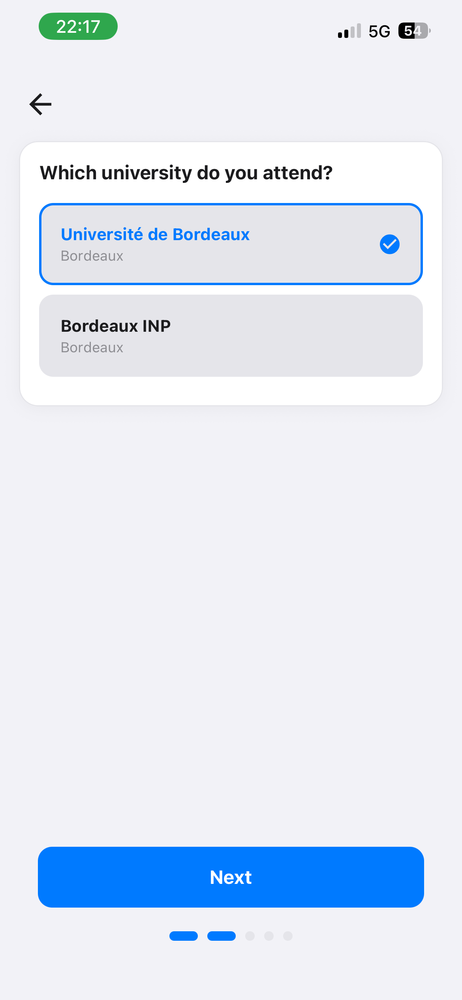

# Onboarding — premier lancement

Le parcours d'accueil, joué une seule fois : il choisit l'**établissement**, le thème, la langue et le
premier groupe favori, pour que l'application soit immédiatement utile à la première ouverture du
planning.

Implémentation en trois fichiers depuis le jalon [6-G](../phase-6/6-g-etablissements.md) :
[`WelcomeScreen.tsx`](../../src/features/Onboarding/WelcomeScreen.tsx) compose et enchaîne,
[`hooks/useWelcomeState.ts`](../../src/features/Onboarding/hooks/useWelcomeState.ts) porte l'état et
les cinq gestes, [`components/WelcomeSteps.tsx`](../../src/features/Onboarding/components/WelcomeSteps.tsx)
ne fait que rendre. L'étape d'établissement aurait porté le fichier unique au-delà de la limite de
lignes, et un écran qui compose n'a pas à porter le détail de cinq mises en page.

## Déclenchement

`RootContainer` ([`rootContainer.tsx`](../../src/shared/navigation/rootContainer.tsx)) rend le
parcours **à la place du `NavigationContainer`** tant que `SettingsManager.isFirstLoad()` est vrai.
L'onboarding vit donc **hors de toute navigation** : pas de pile, pas d'en-tête, pas d'onglets. Il
gère ses propres étapes par un simple compteur d'état.

Le drapeau `firstload` est persisté sous sa propre clé AsyncStorage, distincte de `settings`. Il est
remis à vrai par la réinitialisation depuis [Réglages](settings.md).

## Les six étapes — moins pour certains établissements

| Étape | Contenu | Effet |
|---|---|---|
| 1 | Logo, souhait de bienvenue | — |
| 2 | Choix du thème (clair / sombre) et de la langue (fr / en / es) | `SettingsManager.setTheme` / `setLanguage`, appliqués **en direct** |
| 3 | **Choix de l'établissement**, lu dans le catalogue | `changerEtablissement(code)` puis `SettingsManager.setEtablissement` |
| 4 | **Compte universitaire**, proposé et sautable | `validateAndSave` du contexte de scolarité, ou « Plus tard » |
| 5 | **L'emploi du temps** : groupes, ou lien d'abonnement | favoris, ou `enregistrerLienEdt` |
| 6 | Confirmation | `setFirstLoad(false)` sur « Terminer » |

**Deux étapes disparaissent selon l'établissement**, et la règle est la même pour les deux : *on ne
pose pas une question sans réponse.* L'étape du compte s'efface chez une université qui ne publie
aucun portail ; celle de l'emploi du temps, chez une université qui n'en publie pas.

**L'établissement vient juste avant les groupes**, et l'ordre a été corrigé après coup : la
spécification du jalon [6-G](../phase-6/6-g-etablissements.md) le plaçait en première position, au
motif qu'il conditionne tout le reste. C'est vrai — mais ce « tout le reste » se réduit à l'étape des
groupes, alors que demander à quelqu'un de choisir son université **dans une langue qu'il n'a pas
encore choisie** met la charge au mauvais endroit. Mesuré en jouant le parcours, pas déduit.

**Le compte vient juste après l'établissement**, et avant l'emploi du temps (jalon
[6-J](../phase-6/6-j-compte-et-sources-par-etablissement.md)). L'ordre a été décidé **pour les autres
facs, pas pour Bordeaux** : ici le compte ne sert pas à obtenir l'emploi du temps, mais chez beaucoup
d'universités il *est* la porte, et le demander après aurait posé la question dans le mauvais sens.
C'est le formulaire de l'onglet Scolarité, tel quel, avec une sortie « Plus tard » — un lien discret
et non un second bouton, parce que les deux gestes n'ont pas le même poids. Il se résout dès que le CAS
accepte (~13 s à Bordeaux) ; la lecture du dossier continue derrière, sans bloquer le parcours.

**L'étape de l'emploi du temps a deux contenus**, et c'est la **source** qui tranche, jamais
l'établissement : un choix de groupe quand il y en a à choisir, un champ de lien d'abonnement sinon
(voir [planning.md](planning.md#les-quatre-états-de-lemploi-du-temps)). Le formulaire de lien est rendu
**en place** : l'accueil vit hors de toute navigation, il n'a nulle part où pousser un écran.

La pagination suit — quatre à six points — et le recalcul se fait à chaque rendu, pour qu'un changement
d'établissement à l'étape 3 ajoute ou retire une étape **tout de suite**.

La liste des établissements se rafraîchit **après** l'affichage : sa lecture est hors du chemin de
démarrage. L'écran s'y abonne, comme il le fait depuis toujours pour la liste des groupes, plutôt que
de figer une liste au montage — sans quoi un premier lancement afficherait le socle embarqué seul et
n'apprendrait jamais le second établissement.

Un bouton retour apparaît à partir de l'étape 2 ; une pagination en bas indique la progression.

> **Capture attendue** — `onboarding-bienvenue.png` : l'étape 1, logo et accroche.
>
> **Capture attendue** — `onboarding-preferences.png` : l'étape 2, sélection du thème et de la langue.
>
> **Capture attendue** — `onboarding-fin.png` : l'étape 5, confirmation avant l'entrée dans l'application.



Chaque choix est appliqué **immédiatement**, pas à la fin : sélectionner le mode sombre à l'étape 2
repeint l'écran en cours. L'utilisateur voit ce qu'il choisit. Il n'y a donc pas d'état à valider —
seul `firstload` reste à basculer.

## Valeurs par défaut

Au montage, le parcours s'aligne sur l'appareil :

```ts
SettingsManager.setLanguage(languageFromDevice());        // fr / es / en
SettingsManager.setTheme(SettingsManager.getAutomaticTheme());  // Appearance.getColorScheme()
```

Un utilisateur qui traverse le parcours sans rien toucher obtient donc déjà la langue et le thème de
son téléphone.

## Sélection du groupe

C'est l'étape la plus élaborée. La liste complète des groupes vient de
`PlanningDataManager.getGroupList()`, chargée au démarrage
([donnees-et-persistance.md](../donnees-et-persistance.md)), et le parcours s'abonne à l'événement
`groupList` pour se mettre à jour si le chargement se termine après l'affichage.

**Le tri par année et semestre ne s'affiche que pour Celcat**, depuis le jalon
[6-J](../phase-6/6-j-compte-et-sources-par-etablissement.md). La table de fragments ci-dessous est une
convention de nommage **de Celcat Bordeaux**, et de rien d'autre : depuis que Bordeaux INP a un emploi
du temps (6-I), ses treize groupes s'appellent `ENSC 2A GR1` et aucun fragment ne les atteignait — la
liste restait vide sauf en choisissant « AUTRE ». La vraie question n'était pas *quelle table de
filtrage* mais **cette liste est-elle trop longue pour être parcourue** : Celcat publie plusieurs
centaines de groupes, un référentiel iCalendar en compte treize, qui tiennent à l'écran.

Le filtrage combine trois critères : **année**, **semestre** et **texte saisi**. Année et semestre
sont traduits en fragments d'identifiants par une table locale :

```ts
filterSeason = {
  autumn: { L1: ['10', 'MIASHS1'], L2: ['30', 'MIASHS3'], L3: ['50', 'MIASHS5'],
            M1: ['M1', '70'],      M2: ['M2', '90'],      AUTRE: [''] },
  spring: { L1: ['20', 'MIASHS2'], L2: ['40', 'MIASHS4'], L3: ['60', 'MIASHS6'],
            M1: ['M1', '80'],      M2: ['M2', '000', '001', '002', '003', '004'], AUTRE: [''] },
}
```

Un groupe est retenu si son nom contient **l'un** des fragments de la combinaison choisie **et** le
texte saisi. Le choix `AUTRE` porte le fragment vide, donc ne filtre que sur le texte.

L'affichage est plafonné à **10 résultats** ; au-delà, un message indique combien sont masqués et
invite à préciser la recherche.

> **Capture attendue** — `onboarding-groupes.png` : l'étape 4, avec une année et un semestre
> sélectionnés et une liste de groupes filtrée.

## Décisions de conception

**Hors navigation, volontairement.** Le parcours ne doit pas pouvoir être quitté par un geste de
retour ni apparaître dans un historique. Le rendre à la place du conteneur de navigation est le moyen
le plus simple d'y parvenir.

**Application immédiate des choix.** Voir le thème changer sous ses doigts vaut mieux qu'un aperçu.
Le corollaire est qu'abandonner le parcours en cours de route laisse les réglages déjà appliqués —
sans conséquence, puisque `firstload` reste vrai et que le parcours recommence.

**Les identifiants de groupe encodent l'année et le semestre.** La table `filterSeason` exploite cette
convention de nommage Celcat pour éviter à l'étudiant de parcourir plusieurs centaines de groupes. Ce
n'est pas un contrat : c'est une heuristique locale (voir les limites).

**Plusieurs groupes sélectionnables dès l'accueil.** L'étape 3 ajoute ou retire des favoris, elle
n'en choisit pas un seul : le planning agrégé est disponible immédiatement après l'accueil.

## Vérifier

Le parcours ne se rejoue pas spontanément. Deux moyens de le retrouver : **Réglages → Réinitialiser
l'application**, ou réinstaller l'application.

- Traverser les quatre étapes sans rien changer : la langue et le thème doivent correspondre à ceux du
  téléphone.
- À l'étape 2, changer thème et langue : l'écran doit se mettre à jour immédiatement.
- À l'étape 3, choisir une année et un semestre : la liste doit se réduire ; saisir du texte : elle
  doit se réduire encore ; dépasser 10 résultats : le message de résultats masqués doit apparaître.
- Sélectionner deux groupes puis terminer : le planning doit s'ouvrir sur l'agrégation des deux.
- Terminer sans choisir de groupe : le planning doit afficher son état vide, sans blocage.
- Utiliser le bouton retour à chaque étape.

## Limites connues

- **La table `filterSeason` est spécifique à des conventions de nommage observées.** Un changement de
  nomenclature côté université fait renvoyer des listes vides pour les combinaisons concernées, sans
  erreur visible. Le choix `AUTRE` reste le contournement.
- **Aucune vérification que la liste des groupes est chargée.** Si le chargement du démarrage a
  échoué (première installation hors ligne), l'étape des groupes est vide sans expliquer pourquoi.
- **Le parcours ne vérifie pas que le compte a abouti.** « Plus tard » et un échec de connexion mènent
  au même écran suivant : la session continue derrière, et c'est l'onglet Scolarité qui portera son
  échec. C'est voulu — bloquer l'accueil sur une panne de portail serait pire — mais un étudiant qui
  s'est trompé de mot de passe ne l'apprend qu'en arrivant sur l'onglet.
- **Les abonnements ne sont jamais résiliés** : le `useEffect` de montage appelle `on(...)` sans
  fonction de nettoyage. Le composant étant démonté définitivement à la fin du parcours, les
  rappels restent enregistrés dans les managers pour la durée de la session.
- **Le parcours utilise `StyleWelcome`**, un jeu de styles distinct des deux thèmes
  ([theme.md](../theme.md)), ce qui le rend moins homogène avec le reste de l'application.
- **Un fichier de 302 lignes** contenant les quatre étapes, la table de filtrage et la logique de
  navigation.

## Carte des fichiers

| Fichier | Rôle |
|---|---|
| [`WelcomeScreen.tsx`](../../src/features/Onboarding/WelcomeScreen.tsx) | l'enchaînement des étapes, leur nombre selon l'établissement, la bascule de `firstload` |
| [`hooks/useWelcomeState.ts`](../../src/features/Onboarding/hooks/useWelcomeState.ts) | l'état, les abonnements, les valeurs par défaut système, le filtrage des groupes et les cinq gestes |
| [`components/WelcomeSteps.tsx`](../../src/features/Onboarding/components/WelcomeSteps.tsx) | les mises en page, la pagination, le bouton retour et le pied de la liste de groupes. Rend deux composants venus d'autres domaines — `ScolariteLoginView` et `LienEdtForm` — plutôt que d'en recopier une seconde version ([architecture.md](../architecture.md#dépendances-entre-features)) |
