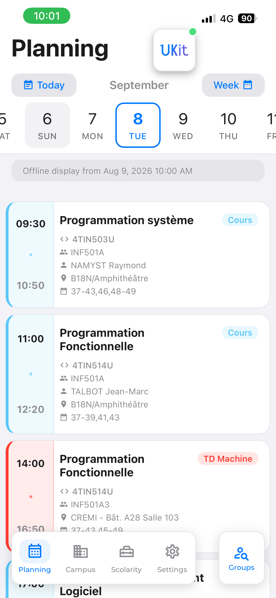
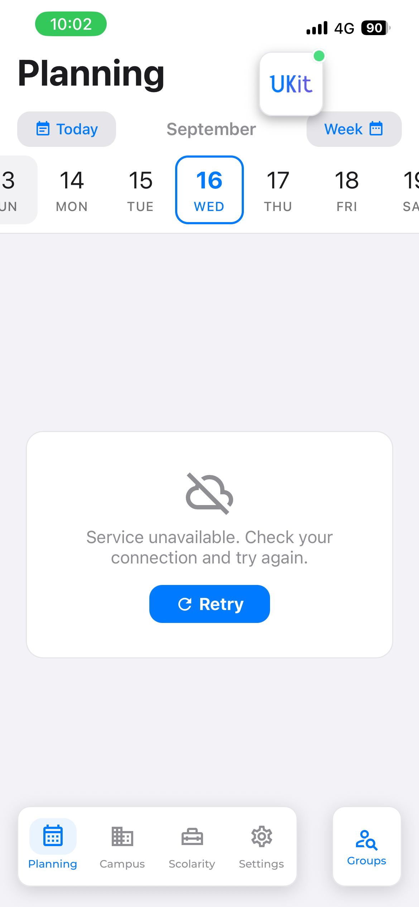

# Planning — emploi du temps

L'onglet historique et le cœur de l'application : consulter son emploi du temps universitaire, par
jour ou par semaine, pour un groupe donné ou pour l'agrégation de ses groupes favoris.

Source de données : Celcat, section 1 de [sources-externes.md](../sources-externes.md).

## Parcours utilisateur

1. À l'ouverture, l'onglet affiche le **planning agrégé des groupes favoris** pour la journée
   courante. Sans favori, un état vide invite à en chercher un.
2. Le bandeau supérieur porte un curseur horizontal de dates. Une année scolaire entière est
   parcourable (365 jours à partir du 1er août).
3. Le bouton de droite bascule **jour / semaine**. Le bouton de gauche revient à aujourd'hui ou à la
   semaine courante.
4. Toucher un cours ouvre sa fiche : matière, code d'UE, horaires, salle, carte du bâtiment, ajout au
   calendrier système.
5. Le bouton d'action à côté de la barre d'onglets ouvre la **recherche de groupes** : liste complète,
   sections alphabétiques, recherche, ajout aux favoris.


> **Capture attendue** — `planning-semaine.png` : la vue semaine, avec ses sections repliables.
>
> **Capture attendue** — `planning-groupes.png` : la recherche de groupes et ses sections
> alphabétiques colorées.
>
> **Capture attendue** — `planning-cours-detail.png` : la fiche d'un cours localisé, avec sa carte.

## Flux de données

```text
DayView (état : jour/semaine sélectionnés, mode)
  └─ DayViewHeader        titre, navigation, curseur de dates
  └─ DayComponent / WeekComponent   =  withHeaderAnimation(ScheduleList)
       └─ ScheduleList
            ├─ isConnected()                    NetInfo
            ├─ PlanningApiService.fetchCalendarDay | fetchCalendarWeek
            │      └─ Blueprint ukit.celcat.jour | ukit.celcat.semaine   (moteur embarqué)
            │      └─ PlanningApiMapping         projection, filtres, tri, découpage
            ├─ AsyncStorage  <groupes>@date | <groupes>@Week<n>   (écriture si succès, lecture si échec)
            ├─ SourceFailureNotice                                (si ni réponse ni cache)
            ├─ PlanningDataManager.extractUEsFromCourses          (alimente les filtres)
            ├─ CourseManager.computeCourseUE / filterCourse        (mode jour)
            ├─ NotificationManager.scheduleCourseNotifications     (si planning favori)
            └─ groupOverlappingCourses → CourseGroupCarousel → CourseRow
```

Depuis le jalon [6-E](../phase-6/6-e-planning.md), le service n'émet plus aucune requête : il joue
quatre [Blueprints](../blueprints.md) qui visent **`celcat.u-bordeaux.fr` directement**. Le relais
`ukit.kbdev.io` est sorti de l'architecture — il n'existait que pour contourner une contrainte de
navigateur, et il répondait déjà `522` au moment de la bascule
([sources-externes.md](../sources-externes.md#1-celcat--emplois-du-temps)).

L'ordre est important : le réseau est tenté **en premier** dès qu'une connexion est détectée, le cache
n'intervient qu'en repli. Voir [donnees-et-persistance.md](../donnees-et-persistance.md).

### Recherche de groupes

```text
GroupSelectionScreen
  ├─ PlanningApiService.fetchGroupList()   Blueprint ukit.celcat.groupes (resType=103)
  ├─ AsyncStorage 'groups'                 cache d'affichage, repli hors ligne
  └─ generateSections()                    regroupement par première lettre, couleur cyclique
```

`PlanningDataManager` maintient en parallèle la même liste sous la clé `groupList`, avec une
expiration de 7 jours, pour l'onboarding et les suggestions de filtres. Les deux caches coexistent et
ne sont pas synchronisés.

## Contrats

Le contrat de données est défini dans
[`PlanningApiMapping.ts`](../../src/features/Planning/services/PlanningApiMapping.ts) — un module sans
dépendance de plateforme, donc testable ; le service le réexporte pour que les composants n'aient rien
à changer.

```ts
interface PlanningEvent {
    id: string;
    style: string;               // attribut style HTML pré-composé (hérité)
    color: string;               // couleur brute Celcat
    schedule: string;            // "08:00-10:00 CM"
    starttime: string;           // "08:00"
    endtime: string;             // "10:00"
    date: { start: string; end: string };   // ISO
    subject: string;             // matière, code d'UE retiré
    description: string;         // lignes nettoyées, jointes par \n
    category: string;            // "CM", "TD", "TP"…
    group: string;
    toFilter?: string | null;    // sous-groupe déduit de la description
    day?: string;                // "Lundi 12/05" (vue semaine)
    dayNumber?: string;          // jour ISO 1-7 (vue semaine)
}

interface PlanningWeekDay {
    dayNumber: string;
    dayTimestamp: number;
    courses: PlanningEvent[];
}
```

`CourseData` ([`CourseCard.tsx`](../../src/features/Planning/components/CourseCard.tsx)) est le
sous-ensemble consommé par les composants d'affichage. Le champ `UE` y est ajouté à l'exécution par
`CourseManager.computeCourseUE`.

Les quatre méthodes du service rendent un **résultat discriminé** plutôt qu'un `null` :

```ts
type PlanningDayResult =
    | { ok: true; courses: PlanningEvent[] }
    | { ok: false; failure: UkitFailure };
```

**Se teste avec `resultat.ok === false`, jamais avec `!resultat.ok`** : `tsconfig.json` n'active pas
`strictNullChecks`, et sans lui TypeScript ne restreint pas une union sur la simple véracité du
discriminant ([qualite.md](../qualite.md)). La famille de l'échec décide de l'écran
([blueprints.md](../blueprints.md#les-erreurs-cessent-dêtre-avalées)).

## Cache et persistance

| Clé | Contenu | Expiration |
|---|---|---|
| `<groupes>@YYYY/MM/DD` | `{ data, date }` — planning d'un jour | aucune, repli hors ligne |
| `<groupes>@Week<n>` | `{ data, date }` — planning d'une semaine | aucune, repli hors ligne |
| `groups` | `{ list, date }` — liste pour l'écran de recherche | aucune |
| `groupList` + `groupListTimestamp` | liste pour `PlanningDataManager` | 7 jours |

`<groupes>` vaut le nom du groupe, ou les favoris joints par `+` pour le planning agrégé. Quand le
cache est servi, un bandeau affiche sa date (`OFFLINE_DISPLAY_FROM_DATE`).



Et son opposé, quand il n'y a **rien** à replier : une journée jamais consultée, source injoignable.
Avant le jalon [6-E](../phase-6/6-e-planning.md), cet écran était un indicateur de chargement qui
tournait indéfiniment.



> **Capture attendue** — `planning-vide.png` : l'état vide quand aucun groupe n'est en favori.

## Décisions de conception

**Le planning agrégé est un `groupName` de type tableau.** `ScheduleScreen` reçoit `name` ; s'il
s'agit d'un tableau, il le remplace par `context.favoriteGroups`. Toute la chaîne — clé de cache,
requête `federationIds[]` multiple, activation des notifications, application des filtres UE —
distingue les deux cas par `Array.isArray(groupName)`. C'est le pivot du module : le modifier touche
tout le reste.

**Les filtres UE ne s'appliquent qu'au planning favori.** `CourseManager.filterCourse` renvoie `true`
sans condition quand `isFavorite` est faux. Consulter le planning d'un autre groupe montre donc tout,
volontairement : les filtres décrivent *ses* UE, pas celles d'autrui.

**Le jour et la semaine ne parsent pas la description pareil.** `projeterCours` reçoit `';'` en mode
jour et `'\n'` en mode semaine. C'est le comportement d'origine, conservé à la lettre par le jalon
[6-E](../phase-6/6-e-planning.md) — mais sa justification historique était fausse, et sa conséquence
réelle est écrite dans les [limites connues](#limites-connues).

**La position dans le calendrier survit à la navigation.** `DayView.lastSelectedDay` et
`lastSelectedWeek` sont des propriétés **statiques de classe** : revenir sur l'onglet Planning
restitue le jour consulté, pas aujourd'hui. C'est délibéré et non persisté (remis à zéro au
redémarrage).

**Les cours qui se chevauchent deviennent un carrousel.**
[`groupOverlappingCourses`](../../src/features/Planning/components/ScheduleListUtils.ts) regroupe les
cours dont les plages se recoupent ; `CourseGroupCarousel` les rend en pages horizontales avec des
points de position. L'index consulté est mémorisé dans une `Map` de module, indexée par
`heure de début + matière`, pour que le défilement ne se réinitialise pas au rendu suivant.

> **Capture attendue** — `planning-cours-simultanes.png` : un créneau à plusieurs cours, points de
> pagination visibles.

**Les couleurs Celcat sont retraduites.** `theme.courses` associe les couleurs brutes du serveur
(`#FFFF00`, `#800040`…) à des teintes de la palette de l'application, avec un `default`. Afficher la
couleur brute donnerait des tons saturés incohérents avec le reste de l'interface.

**Le rechargement au focus n'existe qu'en mode jour.** `ScheduleList` s'abonne à l'événement `focus`
de la navigation uniquement si `mode === 'day'` : c'est la vue par défaut, celle qu'on veut à jour en
revenant dans l'application.

## Vérifier

- Ouvrir l'onglet sans favori : l'état vide et son bouton vers la recherche doivent s'afficher.
- Ajouter deux groupes en favori : le planning agrégé doit fusionner leurs cours et la clé de cache
  contenir les deux noms joints par `+`.
- Basculer jour / semaine, naviguer dans le curseur, revenir avec le bouton « aujourd'hui ».
- Ouvrir un cours ayant une salle connue : la carte doit apparaître ; en ouvrir un sans salle : la
  fiche doit rester correcte sans carte.
- Ajouter un cours au calendrier système et vérifier sa présence dans l'application Calendrier.
- **Hors ligne** : ouvrir un jour déjà consulté — le cache daté doit s'afficher avec son bandeau ;
  ouvrir un jour jamais consulté — un écran d'échec explicite doit apparaître, avec un bouton
  Réessayer. Plus besoin du mode avion pour l'obtenir : pointer `vars.domaine` de
  `ukit-celcat-jour.blueprint.json` sur un hôte injoignable et recharger produit le même chemin, en
  vingt secondes et de façon reproductible.
- **Source qui a changé** : passer l'`expect.status` du même Blueprint à `418` doit produire un écran
  **différent** — « Réponse inattendue », sans bouton Réessayer, parce que rejouer ne répare pas une
  source qui a changé de contrat.
- Un dimanche, ou un jour sans cours : la carte « pas de cours » doit s'afficher.

## Quand l'établissement ne publie pas d'emploi du temps

`celcat_domaine` à `null` dans le catalogue veut dire « cette université ne publie pas son emploi du
temps ici ». Le service rend alors `PLANNING_ABSENT` **sans qu'aucun run ne parte**, et l'écran affiche
« Cette université ne publie pas encore son emploi du temps dans UKit » — sans bouton Réessayer, parce
que rien n'est en panne et que la source ne répondra pas mieux dans dix secondes.

C'est un écran **différent** de celui d'une panne, d'une journée sans cours **et d'une liste de
favoris vide** ; les quatre se ressemblaient avant la Phase 6 et c'est précisément ce qu'elle a
supprimé. Le dernier cas a demandé une correction trouvée sur appareil : l'absence d'emploi du temps
est testée **avant** l'état « aucun groupe favori », parce qu'une université sans serveur n'en a jamais
— l'écran d'invitation à chercher un groupe gagnait donc toujours, avec un bouton menant à une
recherche qui ne peut rien trouver. Le cas est réel depuis le
jalon [6-G](../phase-6/6-g-etablissements.md) : Bordeaux INP est sur ADE, pas sur Celcat. Le porter
demande une capacité que le moteur n'a pas encore, et le sujet a sa propre spécification —
[6-I](../phase-6/6-i-planning-universel.md).

L'hôte et les codes d'inventaire des six Blueprints `ukit.celcat.*` viennent eux aussi du catalogue
depuis 6-G : ils sont passés en **entrées**, avec les valeurs de Bordeaux par défaut. Aucun
`if (etablissement === …)` n'apparaît dans un service — ce qui varie est une donnée.

## Limites connues

- **La vue semaine n'affiche aucune description, et ce n'est pas nouveau.** Mesure du 2026-08-09 : le
  serveur formate la description **à l'identique** dans les deux vues
  (`\r\n\r\n<br />\r\n\r\n`), que `formatDescription` réduit à une seule ligne séparée par `;`.
  Découper sur `'\n'` ne rend donc qu'un champ, qui porte la catégorie en tête et se fait écarter en
  entier. La justification historique — « le serveur ne formate pas pareil selon `calView` » — était
  fausse ; le comportement, lui, est celui de l'application depuis toujours. Le jalon 6-E l'a
  **conservé et verrouillé par un test**
  ([`PlanningApiMapping.test.ts`](../../src/features/Planning/services/PlanningApiMapping.test.ts)),
  parce que le corriger changerait l'affichage de la vue semaine : c'est une décision produit, pas une
  correction de migration.
- **Un `modules: []` retomberait sur la catégorie.** L'extraction rend `null` aussi bien pour un champ
  absent que pour une liste vide, et les deux cessent d'être distinguables. Le code d'origine rendait
  alors un sujet indéfini, affiché vide. Le cas n'existe dans aucune des 334 entrées d'une année
  interrogée le 2026-08-09.
- **Deux caches concurrents pour la liste des groupes** (`groups` et `groupList`), écrits par deux
  chemins différents et jamais réconciliés.
- **`computeScheduleWeek` est appelée au rendu**, pas au chargement : le calcul des UE et le filtrage
  de la vue semaine se rejouent à chaque rendu de `DayWeek`.
- **`ScheduleList` est un composant à classe dense** : chargement, cache, calcul et rendu dans le même
  fichier. Le jalon 6-E l'a découpé en méthodes nommées (`loadSchedule`, `cacheOrFailure`,
  `applySchedule`) sans le scinder — un composant à classe qui fonctionne ne se réécrit pas sans
  raison.
- **La route `Day`** est déclarée dans la pile mais n'est atteinte par aucun appel de navigation.
- **Trois erreurs de typage** subsistent dans ce module (`TS2612` sur `context`) — voir
  [qualite.md](../qualite.md).

## Carte des fichiers

| Fichier | Rôle |
|---|---|
| [`views/DayView.tsx`](../../src/features/Planning/views/DayView.tsx) | vue composite de l'onglet : état jour/semaine, génération des 365 jours et des semaines, défilement du curseur, bascule de mode |
| [`screens/ScheduleScreen.tsx`](../../src/features/Planning/screens/ScheduleScreen.tsx) | enveloppe routée : résout le groupe (favoris si tableau) et configure l'en-tête |
| [`screens/GroupSelectionScreen.tsx`](../../src/features/Planning/screens/GroupSelectionScreen.tsx) | recherche de groupes : chargement, cache, sections alphabétiques, filtrage |
| [`screens/CourseScreen.tsx`](../../src/features/Planning/screens/CourseScreen.tsx) | fiche d'un cours : détails, extraction de la salle, carte Leaflet intégrée |
| [`components/ScheduleList.tsx`](../../src/features/Planning/components/ScheduleList.tsx) | chargement et rendu d'un planning (jour ou semaine), cache, filtres, notifications |
| [`components/ScheduleListUtils.ts`](../../src/features/Planning/components/ScheduleListUtils.ts) | `groupOverlappingCourses` : regroupement des cours qui se chevauchent |
| [`components/DayViewHeader.tsx`](../../src/features/Planning/components/DayViewHeader.tsx) | bandeau collant : titre, boutons de navigation, curseurs jour et semaine |
| [`components/CalendarDay.tsx`](../../src/features/Planning/components/CalendarDay.tsx) | pastille d'un jour dans le curseur |
| [`components/CalendarWeek.tsx`](../../src/features/Planning/components/CalendarWeek.tsx) | pastille d'une semaine dans le curseur |
| [`components/CourseCard.tsx`](../../src/features/Planning/components/CourseCard.tsx) | point d'entrée du module carte : type `CourseData` et réexports |
| [`components/CourseRow.tsx`](../../src/features/Planning/components/CourseRow.tsx) | carte d'un cours : couleur, matière, UE, horaires, description, état « pas de cours » |
| [`components/CourseGroupCarousel.tsx`](../../src/features/Planning/components/CourseGroupCarousel.tsx) | carrousel paginé des cours simultanés, avec mémorisation de l'index |
| [`components/CalendarNewEventPrompt.tsx`](../../src/features/Planning/components/CalendarNewEventPrompt.tsx) | modale d'ajout d'un cours au calendrier système (permissions, calendrier par défaut) |
| [`components/DayWeekCollapsible.tsx`](../../src/features/Planning/components/DayWeekCollapsible.tsx) | section repliable d'un jour dans la vue semaine, avec résolution tolérante de la date |
| [`components/GroupSelectionComponents.tsx`](../../src/features/Planning/components/GroupSelectionComponents.tsx) | en-tête de section et ligne de groupe de l'écran de recherche |
| [`services/PlanningApiService.ts`](../../src/features/Planning/services/PlanningApiService.ts) | joue les quatre Blueprints Celcat, et calcule les plages qui dépendent de l'heure courante |
| [`services/PlanningApiMapping.ts`](../../src/features/Planning/services/PlanningApiMapping.ts) | contrats et projection : sujet, description, filtres, tri, découpage de la semaine |
| [`services/PlanningApiMapping.test.ts`](../../src/features/Planning/services/PlanningApiMapping.test.ts) | ses tests, joués par `npm test` |
| [`services/PlanningDataManager.ts`](../../src/features/Planning/services/PlanningDataManager.ts) | manager observable : liste des groupes en cache 7 jours, extraction des UE disponibles |
