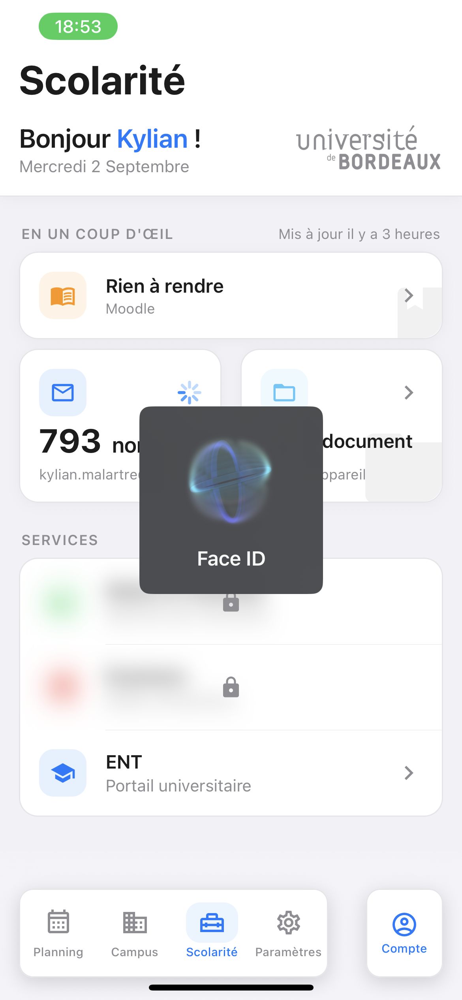

# Scolarité — session universitaire

L'onglet qui relie l'application au système d'information de l'université : connexion au compte
étudiant, récupération de l'identité, compteur de messages non lus, et navigateur intégré vers les
services universitaires.

C'est le module le plus sensible du projet — il manipule des identifiants — et le plus fragile — il
n'existe **aucune API**, tout passe par extraction de pages. Depuis le jalon
[6-F](../phase-6/6-f-scolarite.md), ce parcours n'est plus du code : ce sont deux
[Blueprints](../blueprints.md) joués par le moteur embarqué. Détail des hôtes, sélecteurs et délais :
section 2 de [sources-externes.md](../sources-externes.md).

## Parcours utilisateur

0. **Proposé dès l'accueil** depuis le jalon
   [6-J](../phase-6/6-j-compte-et-sources-par-etablissement.md) : le parcours de premier lancement
   porte une étape « compte universitaire », juste après le choix de l'établissement. C'est **le même
   formulaire** que celui de cet onglet — le contexte de session est monté au-dessus de toute
   l'application précisément pour qu'il n'existe qu'un seul chemin vers le trousseau. Elle est
   **sautable** (« Plus tard ») et **rappelée** dans les [Réglages](settings.md).
1. **Sans compte enregistré** : un écran de connexion demande identifiant et mot de passe
   universitaires, avec une explication de ce qui sera fait de ces données.
2. **Première connexion** (parcours « froid ») : un écran de progression détaille les étapes —
   connexion, profil, dossier. Les pauses déclarées ne sont pas du confort, elles sont la condition
   pour que les cascades d'authentification arrivent avant qu'on interroge la page (voir
   [Décisions de conception](#décisions-de-conception)).
3. **Lancements suivants** : plus aucun run au démarrage. Les données d'identité sont stockées, et
   les [widgets](#les-widgets) s'ouvrent sur leur dernière valeur connue, puis se rafraîchissent
   **dans la page** si elle est périmée.
4. **Verrou biométrique** : à chaque prise de focus de l'onglet, une authentification locale est
   demandée avant d'afficher les données. Une seule fois par session d'application.
5. Le tableau de bord affiche une salutation personnalisée, la date, un indicateur d'anniversaire, et
   **quatre rangées de service** dont chacune porte ce que son service a à dire. Les toucher ouvre le
   service dans le navigateur intégré.
6. Le bouton d'action de la barre d'onglets mène aux réglages du compte : informations enregistrées,
   déconnexion.

> Toutes les captures de cet onglet se prennent avec un **compte de test**, ou après floutage : elles
> ne doivent montrer ni nom, ni numéro étudiant, ni INE, ni adresse mail, ni contenu de messagerie
> réels.
>
> **Capture attendue** — `scolarite-login.png` : l'écran de connexion universitaire.
>
> **Deux captures différées, volontairement** — `scolarite-dashboard.png` et `scolarite-compte.png`.
> Elles montrent des écrans dont l'habillage doit changer prochainement, et une capture périmée
> renseigne moins bien qu'une absence signalée. Les quatre autres, ci-dessous, illustrent ce que le
> jalon 6-F a réellement changé et n'ont pas cette fragilité.


Et les deux échecs, qui ne se ressemblent pas et ne doivent pas se ressembler — un refus
d'identifiants se corrige en retapant son mot de passe, un portail muet se corrige en attendant :


## Ce que la page montre

> **Décidé le 2026-08-13, livré le 2026-08-25** par la première session d'écran du volet 2. Avant
> elle, l'onglet ne montrait qu'une salutation et une ligne de messagerie — le reste était vide, et
> chez un établissement sans portail publié il n'y avait *rien du tout*.

### Trois natures, trois sections — et ne pas les mélanger

L'erreur qui guettait cet écran était d'aligner six tuiles qui se ressemblent alors qu'elles ne font
pas la même chose. Une grille de widgets indifférenciés se lit comme un brouillon ; trois sections
dont l'intention est nommée se lisent comme une décision.

| Section | Nature | Ce qui la remplit |
|---|---|---|
| **Ton dossier** | ce que l'application **sait** | des données extraites par Blueprint — donc qui peuvent manquer, échouer, ou être absentes chez un établissement |
| **Tes services** | ce que l'étudiant peut **ouvrir** | des portes vers le navigateur intégré : aucune extraction, aucune panne possible |
| **Tes documents** | ce que l'étudiant a **rangé** | des fichiers locaux, qui n'ont rien à voir avec le portail |

### Ton dossier

Trois rangées, et **aucune n'est une porte** : c'est l'en-tête de section qui porte le chevron et
mène à la fiche complète. C'est la règle du dépôt appliquée — *une information se lit, elle ne se
déclenche pas* — et ça évite trois cibles qui mèneraient toutes au même écran.

**Une seule rangée : la formation courante** — son intitulé, son année, et l'intitulé long en
sous-titre. Lue dans *Inscriptions* à Bordeaux, dans *Parcours* à l'INP.

**Le numéro étudiant et la fraîcheur ont quitté cet écran**, et ce n'est pas un allègement
cosmétique : le tableau de bord est **dédié aux services**, et l'écran du compte est devenu l'endroit
où l'on va chercher une information d'état civil — c'est ce que dit son bouton de barre d'onglets,
« Compte » et non plus « Déconnexion ». Le numéro s'y **copie d'un geste** ; la fraîcheur y vit à
côté du bouton qui la corrige, ce qui la rend actionnable au lieu d'informative.

Faute de formation lue — une entrée de trousseau écrite par une version antérieure — la section
**disparaît entièrement** plutôt que d'afficher un en-tête au-dessus du vide.

### Tes services

Des portes, et rien d'autre : elles ouvrent le [navigateur intégré](#le-navigateur-intégré) sur une
adresse. Elles ne peuvent pas échouer, elles ne demandent aucun Blueprint, et elles **viennent toutes
du catalogue** — colonne `services`, posée au jalon [6-G](../phase-6/6-g-etablissements.md).

| Porte | Bordeaux | Bordeaux INP |
|---|---|---|
| **Messagerie** | `webmel.u-bordeaux.fr` | `partage.bordeaux-inp.fr/mail` |
| **Moodle** | `moodle…/login/index.php` | `moodle.bordeaux-inp.fr` |
| **Notes et résultats** | `apogee…?srv=RE01` | — *(pas dans son dossier)* |
| **Examens** | `apogee…?srv=RE02` | — *(idem)* |
| **ENT** | `intranet.u-bordeaux.fr` | `ent.bordeaux-inp.fr` |

> **Une ligne de ce tableau corrige la documentation.** Elle affirmait que le webmail de l'INP passe
> par SAML et qu'il est **hors de portée**. Sonde du 2026-08-28 : `partage.bordeaux-inp.fr` redirige
> vers **son propre CAS** — un SP SAML dont l'IdP délègue au CAS, exactement comme Moodle à Bordeaux.
> Et Partage est **le même Zimbra que webmel**, au sélecteur près. L'INP a donc son compteur de
> messages, joué par
> [`ukit.portail.bordeaux-inp.messagerie`](../../blueprints/portails/ukit-portail-bordeaux-inp-messagerie.blueprint.json).

**La messagerie a perdu la section qu'elle avait pour elle seule.** Un en-tête « MESSAGERIE » au-dessus
d'une unique rangée était une grammaire de plus, et il disparaissait en entier chez un établissement
sans webmail extractible. Elle vit maintenant ici, parce que c'est ce qu'elle est : une porte, qui
porte en plus un compteur. Elle **garde sa forme de rangée pleine largeur**, et ce n'est pas
cosmétique — c'est elle qui lui permet d'afficher l'échec du parcours chaud et de mener à la
ressaisie quand les identifiants sont refusés, deux comportements gagnés au jalon 6-K qu'une tuile
rendrait illisibles.

Un établissement qui ne déclare pas une adresse **n'affiche pas la porte**. La grille se construit
donc **depuis le catalogue**, jamais depuis une liste écrite dans l'écran :

```ts
import { serviceEtablissement } from '../../shared/etablissements';

const adresse = serviceEtablissement('moodle');   // string | null
// null  →  la porte ne s'affiche pas. Pas de tuile morte, pas de message d'erreur.
```

Deux limites documentées meurent ici : `ApogeeCard.tsx` était **défini et monté nulle part**, et le
point d'entrée `apogee` n'était atteint par **aucun appel** de navigation. La carte est supprimée, et
une rangée générique pilotée par le catalogue la remplace — *un export mort fait croire à une
capacité*.

### Les widgets

**Session du 2026-08-28.** La messagerie était la seule rangée à porter une donnée. Elle en porte
maintenant une famille : quatre rangées, les mêmes chez les deux établissements, dont chacune dit ce
que son service a à annoncer.

| Widget | Forme | Bordeaux | Bordeaux INP |
|---|---|---|---|
| **Messagerie** | tuile | messages non lus | messages non lus |
| **Moodle** | tuile | échéances de la chronologie | *bientôt* |
| **Notes et résultats** | rangée | *bientôt* | *pas porté ici* |
| **Examens** | rangée | *bientôt* | *pas porté ici* |

#### La grille : trois formes, et la forme veut dire quelque chose

```text
Bonsoir Kylian !                      ← la salutation EST le titre de la page
vendredi 28 août                        (dans l'en-tête collant, elle ne s'efface pas)

EN UN COUP D'ŒIL      il y a 12 min ← intertitres en petites capitales ; la
┌─────────────────────────────────┐   fraîcheur des lectures à droite du premier
│ [book]                          │   un HÉROS pleine largeur : une
│  2  devoirs à rendre            │   chronologie ne porte pas qu'un
│  Devoir de calcul — jeudi       │   chiffre, elle nomme une échéance
└─────────────────────────────────┘
┌────────────────┬────────────────┐
│ [mail]         │ [folder]       │   deux TUILES — des flux et des
│ 3 non lus      │ 4 documents    │   comptes : la messagerie, et les
│ kylian@u-bor…  │ Sur ton appar… │   documents rangés sur l'appareil
└────────────────┴────────────────┘

TES SERVICES
┌─────────────────────────────────┐
│ [chart] Notes et résultats    > │   des RANGÉES — des événements
│         Tes relevés par semestre│   et des portes : rien à
├─────────────────────────────────┤   annoncer la plupart du temps
│ [cal]   Examens               > │
├─────────────────────────────────┤
│ [school] ENT                  > │
└─────────────────────────────────┘
```

**La forme vient du rôle, jamais de la donnée.** C'est la contrainte qui tient toute la grille : la
faire dépendre de la présence d'une source donnerait deux pages différentes selon l'université —
Bordeaux INP, qui n'a qu'une source, se retrouverait avec **une tuile seule et un trou à côté**. La
grille est donc identique partout ; ce qui change est ce que les tuiles disent.

**Chaque service porte sa couleur**, prise dans `theme.sectionsHeaders` — la palette catégorielle que
le Planning emploie déjà pour ses sections. Toute la grille était à l'accent : icônes, surfaces et
compteurs tous bleus, ce qui la faisait lire comme un bloc indifférencié — on lisait les libellés pour
retrouver un service au lieu de le reconnaître. C'est le motif des Réglages d'iOS, dont ces rangées
ont déjà la forme.

L'index et non une couleur écrite : la palette est **du thème**, donc elle suit le mode sombre.

| Service | Index | Couleur |
|---|---|---|
| Messagerie | 0 | bleu — le service le plus consulté garde la couleur d'action |
| Notes et résultats | 1 | vert |
| Moodle | 2 | orange — celui de Moodle, coïncidence utile, pas une reprise de marque |
| Examens | 3 | rouge — l'échéance qui presse le plus |
| Documents | 5 | bleu clair |
| ENT | *l'accent* | le portail générique : rien n'y est compté, il n'est pas au même rang |

> **Piège de la palette** : en thème sombre, les index **0 et 4 portent la même valeur** (`#5E5CE6`),
> là où le thème clair en a deux différentes (`#007AFF` et `#5856D6`). Le 4 est donc évité ici. C'est
> vraisemblablement une coquille du thème — elle fait aussi partager une couleur à deux sections du
> Planning en mode sombre — mais la corriger touche un écran qui n'est pas celui-ci.

**Le héros s'aligne, il ne se répartit pas.** Icône à gauche, chiffre à côté de son libellé, contexte
dessous. Avec un espacement forcé sur la hauteur, une carte pleine largeur sans donnée — « Rien à
rendre », le cas de presque toute l'année — devenait une grande boîte à moitié vide qui se lisait
comme un gabarit inachevé. Alignée, elle est dense qu'elle porte un chiffre ou non.

**Les cartes portent l'ombre douce du reste de l'application** (`tokens.shadow.sm`, comme
`shared/ui/Card` et les écrans du Planning). Sur un fond gris clair, un aplat blanc à filet fin se lit
comme un gabarit plutôt que comme un objet — ce n'est pas une invention ici, c'est un alignement.

**Pourquoi Moodle est le héros et pas la messagerie.** Un compteur de messages *est* un chiffre : une
demi-largeur lui suffit. Une chronologie, non — elle nomme la prochaine échéance, et « Devoir de
calcul — jeudi » ne tient pas dans une demi-largeur sans être tronqué. Il n'y en a **qu'un** : deux
héros ne sont plus une hiérarchie.

Une tuile **sépare le chiffre du mot qui le qualifie** — là où une rangée écrit la phrase entière. On
vient chercher un nombre dans un carré, pas une phrase. La séparation est **une différence de taille
sur une même ligne de base** — « **790** non lus », comme dans le héros — et non un retour à la
ligne : empilés, le chiffre et son unité creusaient la tuile et la faisaient paraître à moitié vide,
et la hauteur minimale est descendue avec (150 → 120, 2026-08-30). **Et l'unité s'accorde** : « 1 non
lu », « 1 document » — la définition d'un widget porte une unité singulière optionnelle (`uniteUn`),
et « à rendre », invariable, s'en passe.

**Le milieu de la petite tuile se centre** (2026-08-30) : la valeur était collée en bas avec le
contexte, et une tuile sans chiffre — « Aucun message non lu » — laissait un trou entre l'icône et
son texte. L'espace libre se répartit désormais des deux côtés ; le contexte, lui, reste collé en
bas, et deux voisines restent alignées par leur rangée, qui étire ses enfants à la plus haute.

**Chaque tuile porte sa silhouette en filigrane** (2026-08-30) : une grande enveloppe pour la
messagerie, un grand dossier pour les documents, un livre — fermé : rognée, une silhouette simple
reste reconnaissable — pour le héros Moodle, réduit parce que sa carte est courte. Tous rognés par
le **coin bas droit**. Les trois positions ont été essayées avant de s'y arrêter : au milieu, la
silhouette ne répondait à rien ; en haut, son sommet coupé se lisait comme une forme cassée — le
rognage doit manger le *bas* d'une silhouette, qui « dépasse » alors du cadre au lieu d'être
amputée. C'est le geste de signature du dépôt — l'identité en transparence — porté par
[`GlypheFiligrane`](../../src/shared/ui/GlypheFiligrane.tsx), qui fixe l'opacité et le rognage et
consigne les règles d'usage ; la silhouette vient de `glyphe` dans la définition du widget.

**Elle porte un chevron**, et c'est un revirement. On avait jugé qu'un chevron dans un carré était un
ornement de liste égaré, la tuile entière étant la cible. L'appareil a tranché autrement : posées
au-dessus de trois rangées qui, elles, en portent un, les tuiles ne se lisaient plus comme cliquables
— et leur coin haut paraissait vide. Un signe partagé vaut mieux qu'une règle de pureté que
l'utilisateur doit deviner. Il cède la place à l'indicateur pendant une lecture : même coin, jamais
deux signes à la fois.

#### Les documents sont entrés dans la grille

« Trois natures, trois sections » était la règle, et elle valait quand il y en avait trois. Le dossier
est parti sur l'écran du compte ; il n'en restait que **deux**, et deux en-têtes au-dessus de deux
petits groupes font plus d'ornement que de structure.

Les documents deviennent donc une **tuile** — ils ont un compte, comme les autres — et leur détail a
gagné son propre écran, où la liste a la place de respirer au lieu de pousser le reste de la page vers
le bas pour un contenu qu'on consulte le jour où l'on en a besoin, un certificat.

Leur valeur ne vient **pas d'un run** : elle compte des fichiers présents sur l'appareil. La tuile
passe donc à côté de la machinerie de widgets — péremption, cache, verrou du moteur — dont rien ne lui
servirait, et emprunte seulement le châssis visuel (`TuileScolarite`). Faire entrer un cas local dans
une machinerie qui ne connaît que des Blueprints l'aurait alourdie pour un seul appelant.

**La salutation est le titre de la page**, et la grille suit — sous deux **intertitres** en petites
capitales, « En un coup d'œil » et « Tes services » (2026-08-30). Ce ne sont pas les en-têtes de
section d'avant qui reviennent : c'est l'intertitre des Réglages et des horaires du CROUS, une ligne
qui nomme sans peser. Sans eux, le héros, les tuiles et les rangées se lisaient comme un seul
empilement — la page manquait d'air précisément là où sa structure change de nature.

> **La grille ne change jamais de forme.** Elle a basculé la paire entière en rangées sur un échec, le
> temps d'une version — un échec demande des mots, et une tuile les tronquerait. La 6.0 a montré le
> prix de cette exception : la page changeait de forme sous les yeux de l'utilisateur. Une tuile en
> échec dit désormais deux mots et garde sa taille ; la phrase est dans la feuille — voir
> [Une tuile en échec garde sa taille](#une-tuile-en-échec-garde-sa-taille).

**Pourquoi trois rangées sur quatre n'ont pas de donnée, et pourquoi elles sont là quand même.**
Parce qu'il n'y a rien à lire fin août, et c'est **mesuré** : la chronologie Moodle du compte de
sonde est vide même sur le filtre *Tout*, les résultats tombent en bloc en fin de semestre, et aucun
calendrier d'épreuves n'existe avant la rentrée. Dessiner une extraction pour un contenu qu'on n'a
jamais vu produirait des sélecteurs imaginés — exactement ce que ce dépôt ne fait pas.

**Et depuis le 2026-08-30, une rangée sans source publiée est un teaser assumé**
([`RangeeMysterieuse`](../../src/features/Scolarite/components/RangeeMysterieuse.tsx)) : notes et
examens passent **sous un flou** (`expo-blur`, un cadenas au centre — l'exclusivité plutôt que la
promesse), et le toucher ouvre une
modale « Bientôt disponible » — avec, quand l'établissement déclare une porte, un lien discret pour
ouvrir le service quand même : le mystère ne coûte aucune capacité. **Le déclencheur est la donnée,
pas une liste écrite** (natures `bientot` et `absent`, chez les deux facs) : le jour où la partie 2
de la v6 publie le Blueprint des notes, le flou tombe de lui-même, sans release — la thèse de la
phase 6 appliquée à un effet de style. Les tuiles, elles, ne se floutent jamais : la messagerie et
les documents ont toujours quelque chose de vrai à dire.

#### Les six états d'une rangée

Décidés hors du rendu, dans
[`widgets/presentation.ts`](../../src/features/Scolarite/widgets/presentation.ts), et testés un par un.

| État | Quand | Ce qu'on voit |
|---|---|---|
| `échec` | la lecture a échoué et a quelque chose à dire | sur une rangée, l'erreur ; sur une tuile, deux mots — la phrase est dans la feuille |
| `compte` | une valeur exploitable | ce que la source annonce, et son compteur |
| `attente` | une source existe, rien n'est encore connu | un indicateur |
| `inconnu` | la lecture n'a rien rendu d'exploitable | la rangée redevient une porte |
| `bientôt` | pas de source, mais une porte | le service et sa description — **rien ne signale le manque** |
| `absent` | ni source ni porte ici | une phrase, et de quoi le demander |

`bientôt` et `absent` **ne mènent pas au même endroit** : le premier ouvre son service, le second mène
au formulaire de demande. C'est ce qui justifie qu'ils s'affichent différemment.

> **`bientôt` ne s'annonce plus**, décidé le 2026-08-29 après un retour d'appareil. La rangée disait
> « Bientôt dans UKit », ce qui portait à confusion : on pouvait croire que le bouton ne marchait pas,
> alors qu'il ouvre bel et bien son service. Elle affiche donc la description ordinaire du service,
> exactement comme une rangée qui a une source et rien à signaler — *on ne vend pas un manque que
> personne ne remarquerait*. Seul `absent` garde sa phrase, parce que la rangée y mène ailleurs qu'à
> son service et que le taire serait une surprise.
>
> **Ces descriptions sont un intérim, pas une destination.** « Tes relevés par semestre » tient la
> place que « 2 nouvelles notes » occupera le jour où la source existera — voir
> [Un widget de plus est une publication](#un-widget-de-plus-est-une-publication-pas-une-release).
> Ce qui est caché à l'utilisateur, c'est **l'inachevé**, pas l'intention : elle est écrite ici, et
> les libellés du compte sont déjà livrés pour que l'allumage ne coûte pas une release.

**Aucun de ces états n'est une tuile morte** — la règle du dépôt tient. `bientôt` ouvre son service,
`absent` ouvre le formulaire de demande (`services.adaptation`).

#### Une tuile en échec garde sa taille

**Décidé le 2026-09-02, livré par le jalon [6.1-A](../phase-6/6-1-a-robustesse-scolarite.md).** La
grille basculait la paire entière en rangées dès qu'un widget échouait, pour lui donner la place
d'une phrase — et le soir de la sortie de la 6.0, une panne de Moodle a transformé la messagerie en
rangée aussi : la page changeait de forme sous les yeux de l'utilisateur, ce qui amplifiait une panne
de widget en page cassée. La règle est désormais inverse, et elle est durable
([theme.md](../theme.md#les-décisions-durables)) : **une tuile ne change pas de taille, quoi qu'il
arrive à sa source.** Elle ne dit que deux mots — l'icône d'alerte du service, le mot, rien d'autre,
pas même sa ligne de contexte — et la phrase vit dans la feuille que le toucher ouvre.

| Famille d'échec | Les deux mots | Au toucher |
|---|---|---|
| refus d'identifiants (`LOGIN_FAILED`) | « À ressaisir » | la fiche du compte en mode ressaisie, sans feuille |
| service momentanément absent — famille `unavailable`, ou un code en `_INDISPONIBLE` | « Indisponible » | la feuille : le titre et le message, **« Relancer »** ce seul widget |
| tout le reste (`rejected`, `data`, `config`, `engine`) | « Erreur » | la feuille : le message, « Relancer » sauf pour `engine` |

La décision est pure et testée ([`widgets/presentation.ts`](../../src/features/Scolarite/widgets/presentation.ts),
`echecDeTuile`) ; le rendu n'interprète rien. Un `config` — « il manque une information » — dit
« Erreur » et non « À ressaisir » : un code qu'on ne sait pas lire ne doit pas envoyer d'office vers la
ressaisie, mais sa feuille propose le lien « Ressaisir mes identifiants ». `engine` reste sans bouton :
« un problème de notre côté » que rejouer ne répare pas — c'est la limite écrite plus bas.

**La feuille** ([`FeuilleDeWidget`](../../src/features/Scolarite/components/FeuilleDeWidget.tsx))
compose le dialogue partagé du dépôt ([`shared/ui/Dialogue`](../../src/shared/ui/Dialogue.tsx)) — le
même gabarit que « Bientôt » et que « Campus pas encore relié », extrait le jour où il a gagné son
troisième hôte. Elle montre le titre et le message tels que `ScolariteMapping` les présente ; le
`detail` du moteur reste dans le journal, la feuille ne diagnostique pas.

**Relancer un seul widget** est nouveau : [`widgets/runner.ts`](../../src/features/Scolarite/widgets/runner.ts)
expose `relireWidget(point)`, avec la même réservation du navigateur que le rafraîchissement global
(priorité `arrière-plan`, interruptible par un geste), et `useWidgets` expose `relancer(point)`. La
relance **attend** la boucle de rafraîchissement en vol plutôt que de la refuser : une boucle globale
peut sauter le widget en échec — frais selon la valeur d'avant — et un « Relancer » sans effet visible
serait un bouton mort. Pendant la relance, l'indicateur tourne dans le coin de la tuile sans effacer
ses deux mots (`etatDeLaRangee` garde la nature `echec` et pose `chargement`).

**Et un code inconnu n'est plus une « connexion interrompue ».** `MOODLE_INDISPONIBLE` n'était pas dans
la table des codes de `ScolariteMapping` et tombait sur le repli de sa famille — « La connexion a été
interrompue avant la fin », qui décrit autre chose. La table ne porte plus que les codes qui méritent
un libellé précis ; une **règle** passe derrière elle : tout code qui se termine par `_INDISPONIBLE`
(ou son pluriel) se présente comme un service injoignable, **réessayable**, et le prochain widget n'aura
rien à déclarer. Le repli de la famille `blocked` ne sert plus qu'aux codes qui ne disent rien de leur
nature.

#### Un widget de plus est une publication, pas une release

C'est la promesse que l'architecture rend vraie, et elle a un prix payé d'avance : **les libellés des
quatre widgets sont livrés**, y compris ceux dont la donnée n'existe pas. Sans eux, allumer un widget
aurait redemandé une release.

| Ce qui est du code | Ce qui est du catalogue |
|---|---|
| le nom, l'icône, les libellés, l'ordre | le Blueprint qui remplit la valeur |
| la péremption par défaut | la péremption, si on veut la corriger |

```jsonc
// colonne `portail_widgets` d'une ligne d'établissement
{ "moodle": { "blueprint": "ukit.portail.bordeaux.moodle", "peremption_min": 360 } }
```

Un point **absent** de cette table n'est pas une panne : c'est un widget sans source ici, donc une
rangée en `bientôt` ou en `absent`.

> **`portail_messagerie` reste lue en repli**, et ce n'est pas de la nostalgie : la surcouche de
> catalogue s'applique en **asynchrone**. Un appareil qui reçoit cette version de l'application mais
> pas encore la ligne de catalogue qui va avec n'a que l'ancienne colonne — sans le repli, la mise à
> jour éteindrait le compteur de messages jusqu'au prochain rafraîchissement. Une régression
> invisible, introduite par une amélioration.

#### Quand ça se rejoue

Au lancement, au retour d'arrière-plan, et sur un geste explicite — **borné par la péremption de
chaque widget**. Sans cette borne, chaque bascule d'application ferait traverser un WAYF puis un CAS
pour une valeur identique, plusieurs fois par heure.

Les runs sont **séquentiels** : il y a une seule WebView montée, donc un seul run Act II à la fois
([`MoteurNavigateur`](../../src/features/Scolarite/services/MoteurNavigateur.ts)). Le verrou porte une
**priorité**, et c'est une correction du 2026-08-29 :

| Priorité | Qui | Devant un run d'arrière-plan | Devant une session |
|---|---|---|---|
| `session` | se connecter, se déconnecter, actualiser son dossier | **prend la main** : le run d'arrière-plan est abandonné | refusée, bruyamment |
| `arrière-plan` | les widgets, le certificat | attend son tour | attend son tour, et se laisse interrompre |

**La règle d'avant — « une session qui trouve le moteur pris est une erreur de programmation » — était
vraie tant que les sessions étaient seules à jouer.** Elle est devenue fausse le jour où des lectures
d'arrière-plan ont partagé la vue, et le symptôme est apparu sur appareil : un étudiant qui appuie sur
« Se connecter » se faisait refuser parce qu'une chronologie Moodle se rafraîchissait.

```
ukit.portail.verification : un run navigateur est deja en cours (ukit.portail.bordeaux.moodle)
```

**Un geste de l'utilisateur passe toujours devant une lecture d'arrière-plan**, et il l'interrompt
plutôt que de faire la queue : une lecture n'a rien à rattraper — elle se rejoue au prochain retour au
premier plan — alors qu'un geste qui attend vingt secondes derrière un run que personne n'a demandé se
lit comme une application bloquée. Un run abandonné rend un échec `cancelled`, déjà marqué `silent` :
la rangée garde sa valeur et ne dit rien.

Le verrou a désormais ses propres tests
([`MoteurNavigateur.test.ts`](../../src/features/Scolarite/services/MoteurNavigateur.test.ts)) : c'est
exactement le genre de logique qui régresse en silence.

**Le cache est ce qui fait que la page s'ouvre pleine.** Les valeurs sont persistées au trousseau
(`UKIT_WIDGETS_PAR_ETAB`, cloisonné par établissement comme le reste), et la relecture se fait
**dessous** : la rangée garde sa valeur et pose un indicateur à côté. La messagerie n'avait pas ce
cache — d'où l'indicateur tournant à chaque lancement, et le vide hors ligne.

### La salutation est une règle, pas une condition

Elle était `heures < 19 ? 'Bonjour' : 'Bonsoir'`, en dur, hors de `Translator`, au-dessus d'une date
dont les jours et les mois étaient écrits en français dans le fichier. Elle est désormais **une table
de règles**, et cette table est **publiable**.

C'est la thèse de la Phase 6 appliquée à une phrase : *une source qui change se corrige par une
publication, pas par une release*. Poser un mot pour la rentrée, pour une période d'examens ou pour un
jour particulier ne doit pas demander de passer par un magasin d'applications.

**Le vocabulaire de conditions est fermé**, et c'est ce qui le rend publiable sans danger. Une règle
déclare zéro, une ou plusieurs conditions ; elles s'appliquent **toutes** (un ET). Sans condition, la
règle vaut toujours.

| Condition | Forme | Exemple |
|---|---|---|
| `heures` | `{ de, a }`, 0–23, `a` exclu | la nuit : `{ de: 22, a: 5 }` |
| `jours` | `[0..6]`, 0 = dimanche | le week-end : `[0, 6]` |
| `plage` | `{ du, au }` en `MM-JJ` | Noël : `{ du: "12-20", au: "01-05" }` |
| `anniversaire` | `true` | le jour dit |

**Les deux intervalles savent boucler**, et ce n'est pas un raffinement : une nuit qui commence à 22 h
et des vacances qui passent le 31 décembre sont exactement les deux cas où une comparaison encadrée
naïve rend faux **tous** les jours où l'on aurait justement voulu dire quelque chose. Le défaut ne se
verrait qu'une fois par an, la nuit, chez quelqu'un d'autre — d'où les cas de test.

**La priorité tranche**, et le socle embarqué va de 0 à 90 **espacé de dix** : une règle publiée doit
pouvoir se glisser *entre* deux règles embarquées sans release. Numéroter de un en un aurait détruit
l'intérêt. À priorité égale, **le publié gagne** — il est assemblé après le socle, et quelqu'un a
voulu l'écrire.

| Priorité | Règle du socle |
|---|---|
| 0 | « Bonjour » — sans condition, donc toujours vrai. Il garantit qu'il y a **toujours** quelque chose à afficher |
| 10 | « Bonsoir », de 19 h à 4 h — l'intervalle passe minuit |
| 90 | l'anniversaire — le seul message qui parle de la personne et non du moment, et rien du calendrier ne doit le recouvrir |

Le socle s'est **réduit à ces trois règles** le 2026-08-30 : matin, nuit et week-end multipliaient
les variantes pour un accueil qu'on ne relit pas. Un mot de circonstance reste possible par une règle
publiée — c'est exactement le rôle de la table, et c'est pourquoi la machinerie n'a pas bougé.

```sql
-- Un mot pour la rentrée, posé sans release. `messages` porte une entrée par langue :
-- ces textes ne sont pas dans le binaire, donc ils ne passent pas par le traducteur.
insert into public.salutations (id, priorite, condition, messages) values (
    'rentree-2026', 50,
    '{"plage": {"du": "09-01", "au": "09-15"}}'::jsonb,
    '{"fr": "Bonne rentrée", "en": "Welcome back"}'::jsonb
);
```

**Une date de naissance illisible ne déclenche rien** : souhaiter un anniversaire le mauvais jour est
pire que ne rien souhaiter. Et une condition à demi comprise se **relâche** au lieu de se durcir —
c'est le bon sens de l'erreur, un message qui apparaît trop souvent se remarque et se corrige, un
message qui n'apparaît jamais ne se remarque pas.

**Une ligne, jamais deux**, et en `xl` (22) plutôt qu'en `xxl` (28) : c'est la taille à laquelle une
salutation longue — « Joyeux anniversaire Kylian ! » — tient sans passer à la ligne. `numberOfLines={1}`
tranche ce qui dépasserait quand même.

**L'en-tête est collant, il ne s'efface plus, et il s'assume comme tel.** Il a d'abord glissé sous le contenu en s'effaçant au
défilement, et ça ne pouvait pas marcher ici : *la page est trop courte pour offrir assez de course*.
Le titre et la salutation restaient à moitié effacés, l'un par-dessus l'autre, et **aucun réglage
d'interpolation ne rattrape ça** — c'était la disposition qu'il fallait changer, pas la courbe.

Le bloc occupe donc une vraie place, comme celui du Planning : le contenu commence dessous et défile
dessous. **Et il en prend l'habillage** — fond `cardBackground`, filet bas, ombre douce. Transparent,
il laissait voir le contenu passer *derrière* la date et se couper net sur le bord haut de la vue
défilante : on lisait un contenu tronqué plutôt qu'un contenu qui glisse sous une barre.

```text
┌──────────────────────────────────────┐
│ Scolarité                            │
│ Bonsoir Kylian !          ┌─────────┐│   le logo en FILIGRANE : monochrome,
│ samedi 29 août            │logo gris││   sans fond, aligné sur la salutation
│                           └─────────┘│   et sa date
└──────────────────────────────────────┘
```

**Le titre reste « Scolarité »**, comme chaque onglet porte son nom. La salutation **a été** le titre
le temps d'un essai (2026-08-30), défait le jour même, et il ne faut pas le refaire : un titre au
contenu variable casse sa ligne au premier prénom composé — 34 points ne pardonnent rien — et la
page devenait la seule de l'application à ne pas porter son nom.

**Le logo est un filigrane** (2026-08-30) : monochrome (`tintColor: fontSecondary`), sans fond ni
filet. C'est l'usage « niveaux de gris » que tout kit de marque autorise — à ne pas confondre avec
recolorer ou tourner le logo, qui restent interdits. Il remplace la vignette sur carré blanc, qui
flottait en thème sombre et restait petite parce qu'elle devait se loger dans la seule ligne du
titre ; le filigrane, lui, **se pose sur le bas de la ligne salutation + date** — comme un texte sur
sa ligne d'écriture — et le titre garde toute sa largeur au-dessus. Centré, il dépassait du haut de
la salutation ; centré sur le bloc entier, il ne répondait à rien : deux entre-deux essayés et
défaits le même jour. Sans dossier lu, il se pose sur la ligne du titre.

**Sa taille se calcule du ratio mesuré du logo** (`Image.getSize`), pas d'une boîte fixe : dans une
boîte, `contain` fait saturer la hauteur aux logos compacts et la largeur aux étirés — à hauteur
pleine, le logo trapu de Bordeaux INP (1,69:1) paraissait plus lourd que le logotype étiré de l'UB
(2,86:1). Une **hauteur commune** (44 points, plafond de largeur à 132) égalise la masse visuelle.

> **Aucun autre grand titre de section ne porte quoi que ce soit à sa droite** — ni Planning, ni
> Campus, ni Réglages. C'est donc une **exception assumée pour cet onglet**, décidée après l'avoir
> essayé aux deux endroits. Elle se défend : Scolarité est le seul onglet dont *tout* le contenu
> appartient à un établissement, donc le seul où le nommer en tête a un sens.

**Sans logo publié, rien ne se pose à côté du titre** : la **pastille de nom** prend le relais sur la
ligne de contexte. Un pictogramme générique à côté d'un grand titre serait de l'ornement, pas de
l'information — et l'alternative n'est jamais un trou, le nom dit la même chose en toutes lettres.

**La fraîcheur a quitté l'en-tête** (2026-08-30) : « mis à jour il y a 12 min » qualifiait le cache
des widgets, pas la page, et se lisait comme une propriété de page qu'aucun autre onglet ne portait —
une incohérence apparente alors que Scolarité est simplement le **seul** onglet à cache à péremption
(Campus et Planning rechargent au montage). Elle vit désormais à droite de l'intertitre « En un coup
d'œil », en petit texte gris, au ras de ce qu'elle mesure. Elle prend **la plus récente** des
lectures, pas la plus ancienne : chaque widget a sa propre péremption, donc la plus ancienne serait
toujours celle du widget au rythme le plus lent. Elle n'apparaît qu'une fois quelque chose lu.

Le composant vit dans [`EnteteScolarite`](../../src/features/Scolarite/components/EnteteScolarite.tsx),
sorti de l'écran comme `PageScolarite` avant lui — la limite de lignes du dépôt, et un en-tête qui a
maintenant une vraie structure.

Deux conséquences dans le code, et la seconde est un piège :

- `PageScolarite` n'a plus ni valeur de défilement ni compensation d'en-tête — elle ne connaît même
  plus les marges de sécurité, c'est l'en-tête qui porte l'encoche ;
- **la vue défilante doit porter `flex: 1`.** Sous un en-tête absolu elle remplissait l'écran toute
  seule ; sous un en-tête qui prend de la place, une vue défilante sans `flex` prend la hauteur de son
  contenu et **déborde au lieu de défiler**.

Corollaire pour qui publie une règle : **garder les messages courts**. Ce qui dépasse est tronqué, et
c'est le bon comportement pour un accueil.

### Tes documents

Un endroit où l'étudiant range ses certificats de scolarité, attestations et autres pièces, pour les
avoir **hors ligne** et les retrouver sans fouiller.

Elle fonctionne **techniquement** sans compte — ce sont des fichiers locaux — mais elle ne s'affiche
pas sans compte, et c'est un arbitrage du propriétaire du produit du 2026-08-27, contraire au premier.

La première version la rendait sans condition, pour une raison qui tenait : l'onglet ne servait à rien
à qui ne se connectait pas, et rien du tout chez un établissement sans portail. À l'usage, un onglet
qui montre **une seule section sous un encart d'invitation** se lit moins bien qu'un onglet
franchement vide, qui ne propose qu'une chose — se connecter. C'est **tout ou rien** — et depuis le
2026-08-31, l'onglet sans compte **est le formulaire** (`ScolariteLoginView`, sans en-tête collant :
le bandeau du formulaire porte le titre) : l'encart d'invitation obligeait un tap de plus vers
exactement la même page.

La conséquence est assumée : chez « Autre campus », l'onglet s'ouvre sur sa propre page — pas de
documents, pas de compte — et c'est le bouton Compte de la barre qui est voilé
([Un campus non porté n'est pas une panne](#un-campus-non-porté-nest-pas-une-panne)).

Ces fichiers vont dans le **répertoire privé de l'application** (`expo-file-system`), isolé des
autres applications et couvert par le chiffrement de l'appareil quand celui-ci est verrouillé. **Pas
dans le trousseau** : `expo-secure-store` est fait pour de petites valeurs — quelques kilo-octets —
et refuserait un PDF.

La formulation exacte, reprise telle quelle dans [PRIVACY.md](../../PRIVACY.md) : *les documents
restent sur l'appareil, dans l'espace privé de l'application, et ne sont envoyés nulle part.* Écrire
« chiffrés par UKit » serait faux — une clé qui vivrait à côté du fichier ne protège de rien, et le
vrai rempart est celui de l'OS.

**Le répertoire est la liste.** Aucun index JSON n'est tenu en parallèle : ce serait deux vérités à
réconcilier — un fichier supprimé par le système, un index qui le mentionne encore — pour ne gagner
que des métadonnées que `info()` donne déjà.

**Et il y a un répertoire par établissement** (`scolarite-documents/<code>/`), depuis le 2026-08-29 :
les pièces vivaient dans un seul dossier, et basculer vers Bordeaux INP montrait le certificat de
scolarité du Collège ST — la règle « les données de deux universités ne se mélangent pas » vaut aussi
pour les fichiers. Le modèle est celui du trousseau : une bascule n'efface rien, un aller-retour
retrouve ses pièces. Effacer à la bascule, comme le font les caches, serait ici une perte — ce sont
des fichiers personnels, pas des données rejouables. Les fichiers restés à la racine relèvent de la
disposition d'avant le cloisonnement, jamais livrée : ils sont effacés une fois par lancement, et le
certificat se retélécharge seul.

Trois dépendances : `expo-file-system` (le répertoire), `expo-document-picker` (importer),
`expo-sharing` (envoyer vers une autre application).

#### Une pièce s'ouvre dans l'application

Depuis le 2026-08-29, appuyer sur une pièce l'**affiche** au lieu de la sortir
([`DocumentViewerScreen`](../../src/features/Scolarite/screens/DocumentViewerScreen.tsx)). Consulter
un certificat demandait jusque-là de passer par la feuille de partage et de choisir une autre
application — trois gestes pour regarder une page qu'on a soi-même rangée.

**Aucun module natif ajouté**, et c'est ce qui rend l'arbitrage tenable : le rendu vient de
`react-native-webview`, déjà au projet pour les portails. Sur iOS, `WKWebView` affiche un PDF depuis
une adresse `file://` avec le défilement et le zoom du système. Sur Android, c'est **pdf.js** qui
dessine, embarqué dans la page de la WebView — des fichiers statiques, donc Expo Go reste utilisable
(voir plus bas).

**La forme est celle de l'écran de carte**, et c'est une demande explicite : barre de navigation
transparente, bandeau plein peint par l'écran (`insets.top + HEADER_OFFSET`, fond de carte, filet
bas), et le geste secondaire — ici le partage — en **bouton d'en-tête** (`HeaderButton`), là où la
carte propose l'ouverture dans un plan externe. Pas de barre du bas.

**Trois stratégies de rendu, et l'écran bascule tout seul.** L'écran est resté noir sur appareil à
trois reprises le 2026-08-29, avec des événements de chargement *normaux* — commencé puis fini, aucun
échec. C'est le piège documenté dans le natif : une adresse `file://` que la conversion refuse fait
charger une **page vide sans erreur** (`RNCWebViewImpl`, `!request.URL` → `loadHTMLString:@""`). Un
« chargement fini » ne prouve donc rien ; seule l'URL rapportée par l'événement dit ce qui a chargé.

| Stratégie | Quoi | Quand |
|---|---|---|
| `fichier` | l'adresse `file://` — le seul rendu PDF complet (défilement, zoom, toutes les pages) | d'abord, toujours |
| `inline` | le même document en base64 dans une page `source={{ html }}` — le chemin de l'écran de carte, prouvé sur l'appareil ; `<embed>` peut ne rendre que la première page d'un PDF | quand la fin de chargement rapporte une URL qui n'est pas le fichier, ou quand le processus web meurt |
| `pdfjs` | la page du lecteur ([`assets/pdfjs/viewer.html`](../../assets/pdfjs/viewer.html)) qui embarque pdf.js et dessine chaque page dans un canevas ; bibliothèque, worker et document lui sont posés en littéraux à l'assemblage | Android, pour un PDF, **d'emblée** — son moteur n'a aucune visionneuse |

Tout ce qui décide vit dans [`hooks/useLectureDuDocument.ts`](../../src/features/Scolarite/hooks/useLectureDuDocument.ts) ;
l'écran compose.

Le contenu est **lu et vérifié au montage** (`base64Sync`) : une pièce vide ou sans la signature de
son type (`%PDF` s'encode `JVBERi`) part au repli au lieu d'un noir muet. Les traces `[lecteur]`
nomment chaque étape et chaque bascule, et l'indicateur d'attente ne couvre plus le contenu.
`originWhitelist={['*']}` comme la carte.

**C'est cette validation qui a fini par nommer la vraie cause des écrans noirs** — qui n'était ni
l'origine, ni l'encodage de l'adresse, ni la WebView : *le fichier rangé n'était pas un PDF.* Le
relevé sur l'appareil touché : **zéro octet** sous un nom en `.pdf`, que WKWebView chargeait « avec
succès » et rendait en noir. L'écriture déléguait le décodage au natif
(`write(base64, { encoding: 'base64' })`), une option qui n'existe que depuis expo-file-system
19.0.16 — et le natif qui tourne est celui **embarqué dans Expo Go**, pas celui de `node_modules` ;
l'échec n'a jamais été bruyant, et l'idempotence verrouillait le fichier mort. Cinq allers-retours
d'appareil pour le nommer. Voir
[Le certificat s'y range tout seul](#le-certificat-de-scolarité-sy-range-tout-seul) pour la
correction — décodage en JavaScript, écriture **vérifiée par relecture** avec repli sur l'API
héritée, et idempotence durcie en auto-réparation.

**Android ne rend pas les PDF dans une WebView** — son moteur n'a pas de visionneuse intégrée, ni par
`file://` ni par `<embed>`, et l'écran y retombait sur la feuille de partage. À l'usage, « lecture
indisponible » se lisait comme une panne ([mise à plat](../phase-6/6-1-mise-a-plat.md), S10). Depuis
[6.1-A](../phase-6/6-1-a-robustesse-scolarite.md), l'écran y **dessine le document lui-même**, avec
pdf.js — un essai assumé, et il tient en quatre pièces :

- **la bibliothèque et son worker**, copiés tels quels du paquet `pdfjs-dist` (build `legacy`, pour
  couvrir les WebView anciennes) dans [`assets/pdfjs/`](../../assets/pdfjs/) par `npm run pdfjs:vendor`,
  sous une extension `.txt` — Metro n'embarque un fichier tel quel que sous une extension d'asset, et
  c'est [`metro.config.js`](../../metro.config.js) qui la déclare. Un test vérifie que les copies sont
  celles du paquet installé ;
- **la page du lecteur**, à nous, qui importe la bibliothèque depuis un Blob — un module ES ne
  s'importe que par une adresse, et `blob:` est la seule qu'une page sans réseau ni fichier sache
  fabriquer — puis dessine chaque page dans un canevas, à la largeur de l'écran, l'une sous l'autre.
  Le pincement pour zoomer est celui de la WebView ;
- **l'assemblage**, pur et testé ([`services/LecteurPdfPage.ts`](../../src/features/Scolarite/services/LecteurPdfPage.ts)) :
  les trois textes posés en littéraux JavaScript dans le gabarit, avec les deux pièges qui rendent une
  page blanche sans un mot — un `</script>` dans une bibliothèque minifiée, un `$&` dans un
  remplacement ;
- **la couture** ([`services/LecteurPdf.ts`](../../src/features/Scolarite/services/LecteurPdf.ts)) qui
  lit les trois assets une fois par session d'application.

La page conclut par un message — la première page est rendue, ou rien ne le sera — et un chien de
garde de quinze secondes tranche si elle ne conclut pas. Dans les deux cas d'échec, comme pour un
document au-delà de six mégaoctets (la page tiendrait la bibliothèque **et** le document dans une
seule chaîne), l'écran retombe sur la feuille de partage — l'écran d'avant — et le dit. Les images,
elles, s'affichent partout.

La pièce ne quitte pas l'appareil : elle est lue depuis le répertoire privé, la WebView n'a aucun
réseau — pdf.js compris, qui tourne sur la page sans rien charger —, le JavaScript n'est activé que
pour cette stratégie, et le partage reste une décision de l'utilisateur.

**Pas de vraie vignette dans la liste, et pas de badge d'extension non plus.** La vignette est un
arbitrage assumé : rendre la première page d'un PDF demanderait soit une bibliothèque de rendu, soit
une WebView **par rangée** — un processus web complet pour une image de trente points de côté. Le
badge, lui, a existé un jour : essayé le 2026-08-29 puis retiré le jour même, parce que l'icône de
famille fait déjà ce travail — le glyphe PDF se reconnaît, et doubler l'information chargeait la
rangée. La rangée porte donc l'icône, le nom, la date et la taille, rien d'autre.

#### Le certificat de scolarité s'y range tout seul

**Depuis le 2026-08-29, le parcours froid dépose le certificat de scolarité dans cette section**, chez
les établissements qui le permettent. C'est le premier — et pour l'instant le seul — document que
l'application va chercher elle-même ; tout le reste, l'étudiant l'ajoute.

**La pièce retenue est celle de l'année la plus récente**, décidée par l'année lue dans le libellé et
non par la position dans la page : `/categorie/3` en liste plusieurs — trois sur le compte de sonde,
2026/2027, 2025/2026 et 2024/2025 — et prendre la première revenait à parier sur un ordre que rien ne
garantit. Le libellé porte deux années (« Certificat 2026/2027 ») ; on retient la plus grande, ce qui
ordonne correctement une année universitaire.

Ce qui rend un portail rapportable tient en une phrase, et elle a été **corrigée le 2026-08-29** :
il faut qu'un Blueprint sache **trouver le lien dans la page** — rien d'autre. La première analyse
exigeait une adresse *rejouable* et excluait Bordeaux INP, dont les adresses portent un UUID et un
horodatage regénérés à chaque rendu ; c'était confondre l'adresse et l'accès. Le Blueprint lit le
lien **frais** dans le DOM à chaque run et télécharge depuis la page même, avec les cookies de la
session — l'instabilité de l'adresse est donc sans objet, et c'est l'utilisateur du produit qui a
repéré l'erreur. Les deux établissements sont portés :

| Établissement | Où | Adresses | Choix de l'année |
|---|---|---|---|
| Collège ST | ReNARD, `/categorie/3` | déterministes (`/document/<base64>/lang`), identité par cookie | la plus grande année du libellé (« Certificat 2026/2027 ») |
| Bordeaux INP | mondossierweb, `/inscriptions` | éphémères (UUID + horodatage à chaque rendu) | la plus grande année du bloc d'inscription (libellé PÉRIODE) |

Et l'ajout de l'INP n'a demandé **aucune release** : un Blueprint publié
(`ukit.portail.bordeaux-inp.documents`) plus la colonne `portail_documents` de sa ligne de catalogue
— la promesse du jalon 6-G, tenue pour un flux qui rapporte un binaire.

**Un Blueprint n'écrit toujours pas de fichier**, et la limite n'a pas bougé : c'est la répartition
qui est devenue explicite. Le Blueprint navigue, liste, et **rapporte le contenu** ; l'application
l'écrit. La requête part de la page elle-même (`evaluate`), donc elle porte la session sans qu'on ait
à ponter le magasin de cookies natif, et elle se comporte à l'identique sur les deux moteurs. Le
contenu revient en base64 par le pont, qui le découpe en messages — c'est ce qui **borne la pièce à
4 Mo**, refus explicite au-delà plutôt qu'un pont saturé. Le certificat mesuré fait 94 ko.

**Le décodage base64 se fait en JavaScript** (`shared/services/Base64.ts`, testé) et **l'écriture est
vérifiée par relecture** (`ecrireEtVerifier`) : l'API moderne d'abord (`write(Uint8Array)`), l'API
héritée en repli (`writeAsStringAsync`, des années d'Expo Go derrière elle), et une erreur **nommée**
si la relecture ne rend pas la taille attendue — plus aucun chemin d'écriture n'est cru sur parole.
La leçon vient d'un fichier de zéro octet écrit sans qu'aucune étape ne lève : déléguer au natif
(`write(…, { encoding: 'base64' })`) suppose une option qui n'existe que depuis expo-file-system
19.0.16. Règle générale : *le natif qui tourne est celui d'Expo Go, pas celui de `node_modules`* —
une API récente peut mentir sans lever.

**Et l'idempotence est devenue une auto-réparation** (`pieceSaineRangee`) : la clé « le fichier de ce
nom existe » verrouillait le défaut — la pièce corrompue bloquait toute nouvelle tentative, pour
toujours. Le test vérifie désormais la *signature* du contenu ; une pièce du bon nom au contenu faux
est supprimée, et le parcours froid suivant range la bonne. Les appareils touchés se réparent seuls,
sans geste ni release.

Trois règles de comportement, et aucune n'est cosmétique :

| Règle | Pourquoi |
|---|---|
| **Ça ne bloque jamais rien** | l'appel est lancé après le parcours froid, sans être attendu. Portail muet, moteur occupé, pièce absente : le compte est connecté quand même |
| **Ça n'écrit jamais deux fois la même pièce** | le nom du fichier est la clé, et il vient du **libellé du portail**. Sans cette garde, chaque parcours froid ajouterait « Certificat 2026-2027 (2).pdf », puis (3) |
| **Ça ne dit rien à l'utilisateur — en mots** | ni réussite ni échec ; annoncer qu'on n'a pas su le chercher transformerait un service rendu en passif affiché. Mais ça **se montre** : la tuile des documents pose l'indicateur de lecture des widgets pendant ce run — il continue après la barre du parcours froid, une vingtaine de secondes, et un silence total se lisait comme un échec (constat d'appareil). À la fin, la tuile relit son compte : la pièce apparaît sans changer d'onglet |

La vérification a lieu **après** le run et pas avant, contre une optimisation tentante : deviner le nom
d'avance demanderait de connaître à la fois la formulation du portail *et l'année qu'il sert*. La
seconde n'est pas celle du calendrier — un étudiant pas encore réinscrit se voit servir l'année
précédente —, donc un nom deviné serait faux précisément dans le cas où il compte. On paie un run pour
ne pas ranger une pièce sous une mauvaise année, et le run n'a lieu qu'au parcours froid : une
connexion, ou un « Actualiser mon dossier ».

La contrepartie qui reste est assumée, et c'est le bon sens de l'erreur : **une pièce supprimée à la
main revient au prochain parcours froid**. Gênant une fois, là où l'inverse remplirait l'appareil tout
seul.

**Le reste des pièces, l'étudiant les ajoute lui-même**, et ça reste une limite écrite. Voir
[Ce qui n'est pas récupérable](#ce-qui-nest-pas-récupérable-et-pourquoi).

### L'aiguillage s'est inversé, et c'est le changement structurant

L'écran rendait un état **plein écran** et rien d'autre dès que la session n'était pas nominale.
Depuis que les documents existent — locaux, sans compte, sans portail — cacher toute la page derrière
un écran d'erreur rendrait l'onglet mort pour exactement ceux à qui il sert le plus.

| Situation | Avant | Après |
|---|---|---|
| Aucun portail publié | `PORTAIL_ABSENT` plein écran | **sa propre page** — un état vide, la demande de campus, un bouton pour corriger son choix (6.1-A) |
| Aucun compte | `ScolariteLoginView` plein écran | une invitation à connecter, **et rien d'autre** |
| Échec bloquant | `SourceFailureNotice` plein écran | l'encart d'échec en tête, **puis les documents** |
| **Parcours froid en cours** | plein écran | plein écran **sans dossier lu** ; avec un dossier, un encart de progression en tête de page (6.1-A) |

La dernière ligne est délibérée : le parcours froid est *transitoire*, et une page qui se remplirait
sous un indicateur de progression ferait sauter le contenu à chaque étape franchie — **tant que la
page n'a rien d'autre à montrer**. Avec un dossier déjà lu, « Actualiser mon dossier » ne l'efface
plus : la page reste, la barre se pose en encart au-dessus, et le nouveau dossier écrase l'ancien à
l'arrivée. Revenir sur l'onglet pendant l'actualisation retombait sur l'écran plein, l'ancienne
barre (constat du 2026-09-02). Corollaire : « Réessayer » relance le dossier quand la dernière
session a échoué, et non plus seulement quand aucun dossier n'existe — la présence d'un dossier ne
dit plus que la session a abouti.

**Le verrou biométrique suit la même logique** : il ne s'arme que lorsqu'un compte est enregistré.
Sans compte il n'y a rien à protéger dans cet onglet — l'identité n'a pas été lue — et demander une
empreinte pour atteindre ses propres fichiers serait un péage sans serrure derrière.

### Le tableau de bord est dédié aux services

La formation y a vécu une journée, puis elle a rejoint l'écran du compte. C'est une information d'état
civil : on la consulte, on n'agit pas dessus — et la garder sur le tableau de bord obligeait à poser un
en-tête de section au-dessus d'une **rangée unique**. Le tableau de bord se réduit donc à la
salutation, l'encart d'état, les services et les documents.

**L'écran du compte est devenu le lieu de ce qu'on va chercher**, et son bouton de barre d'onglets le
dit : « Compte », plus « Déconnexion ». Il porte l'état civil, la formation, l'INE, les identifiants,
la date de dernière lecture, et les trois gestes.

### Trois chaînes se copient, et ce sont les bonnes

Le numéro étudiant, l'INE et l'adresse universitaire portent un bouton de copie. Ce sont exactement
les chaînes qu'on redemande à un étudiant et qu'il ne retient pas — inscription en bibliothèque,
feuille d'examen, formulaire administratif. Le bouton **ne s'affiche que s'il y a quelque chose à
copier** : une icône au-dessus d'un tiret proposerait un geste sans effet. Le retour est un toast,
parce qu'un presse-papiers est invisible : sans confirmation, rien ne distingue « copié » de « rien ne
s'est passé ».

### La progression s'affiche là où le geste est fait

« Actualiser mon dossier » rejouait un parcours froid puis **fermait l'écran**. Le run se déroulait
bien — il n'est annulé qu'au passage en arrière-plan, jamais par un changement d'écran — mais **rien
ne le montrait** en dehors de l'onglet Scolarité, seul endroit qui rendait l'écran de progression.
Depuis les Réglages, on revenait donc aux Réglages et le geste paraissait sans effet, jusqu'à ce qu'on
ouvre l'onglet et qu'on découvre une progression qui semblait commencer à cet instant.

L'écran du compte rend maintenant la progression lui-même et **ne se ferme plus**. L'autre remède
envisagé — renvoyer l'utilisateur vers l'onglet Scolarité — corrigeait le symptôme en *déplaçant la
personne* : on touche une ligne dans les Réglages et on se retrouve dans un autre onglet. Et l'onglet,
lui, garde sa page pendant l'actualisation : la même barre en encart en tête, le dossier précédent
dessous ([L'aiguillage s'est inversé](#laiguillage-sest-inversé-et-cest-le-changement-structurant)).

### Le formulaire ne cède plus la place à l'écran d'attente

Se connecter faisait défiler deux pages : le formulaire, puis un écran de progression, puis la fiche.
Chacune paraissait à moitié vide, et l'enchaînement se lisait comme une application qui hésite —
d'autant qu'un échec obligeait à revenir en arrière pour retrouver ses champs.

**Le formulaire porte donc sa propre progression** : le bandeau — logo, titre, phrase — reste, et
seule la carte passe des champs à la barre. Une page qui se transforme se lit comme une suite, et un
échec revient **là où la saisie a eu lieu**, sans qu'aucun écran ne soit rejoué en sens inverse.
Le bloc est partagé ([`BlocProgression`](../../src/features/Scolarite/components/ScolariteLoadingScreen.tsx)) :
l'écran plein n'en est qu'un second hôte.

**L'ordre de l'aiguillage est le sujet**, et il a dû être inversé : l'écran plein était testé *avant*
le formulaire, donc il le supplantait dès que la session partait — on retombait sur deux pages qui se
remplacent. Ce qui reste à l'écran plein est le parcours froid qu'on n'a **pas** demandé depuis un
formulaire : au lancement, ou sur « Actualiser mon dossier ». Il n'y a alors aucune page à garder.

### La grille n'apparaît pas vide sous une barre de chargement

Un parcours froid qui a échoué sans laisser de dossier ne montre pas de grille : l'encart d'échec
porte le problème et son geste, la page reste propre. Cette règle avait un trou, trouvé le
2026-09-04 : **relancer efface l'échec**, donc la condition repassait et la grille revenait — vide —
juste sous la barre de progression du réessai.

Une session qui court sans dossier n'a toujours rien à montrer. La grille attend donc aussi que la
progression soit finie, pas seulement que l'échec ait disparu.

### Une seule règle : la page se transforme, elle ne se remplace pas

Elle vaut désormais partout sur l'écran du compte, et il n'y a **plus aucun chargement plein écran**
sur cet écran :

| Situation | Ce qui change | Ce qui reste |
|---|---|---|
| Connexion en cours | la carte passe des champs à la barre | le bandeau : logo, titre, phrase |
| Actualisation du dossier | les trois actions cèdent la place à la barre | la fiche : état civil, dossier, identifiants |

Actualiser prenait l'écran entier : on perdait de vue ce qu'on était en train d'actualiser, et le
retour de la fiche se lisait comme un changement de page. Les trois actions n'ont de toute façon aucun
sens pendant un run — c'est exactement l'espace à leur prendre.

**Un piège dans le premier cas, et il n'est pas évident.** `LOGIN_SUCCESS` est émis au dixième step
sur vingt : les identifiants sont posés **dès que le CAS accepte**, donc `credentials` cesse d'être nul
*en plein run*. La condition qui gardait le formulaire retombait à faux à mi-parcours, et l'écran
basculait d'un coup. Le formulaire signale donc à son hôte qu'une session part **de lui**
(`onDebut`), et garde la page jusqu'au terme — échec compris, puisque c'est là que son message doit
s'afficher.

**La garde n'avait été posée que sur cet écran-ci**, et l'onglet Scolarité a montré le même défaut le
soir de la sortie de la 6.0 : une connexion lancée depuis l'onglet passait du formulaire à l'écran de
chargement plein au dixième pas. Elle vit désormais dans un hook partagé par les deux hôtes, et
l'onglet teste sa branche formulaire **avant** l'écran plein — l'ordre est le sujet
([6.1-A](../phase-6/6-1-a-robustesse-scolarite.md)).

**Et le drapeau portait encore le mauvais concept**, ce que le jalon
[6.1-E](../phase-6/6-1-e-finitions-interface.md) a corrigé : il ne connaissait qu'une origine, le
formulaire. Un dossier qui échoue **après** l'écriture des identifiants laisse la page sur son encart
d'échec ; toucher « Réessayer » **dans l'encart** relançait un parcours froid que rien n'avait
annoncé, et l'écran plein reprenait la main — la page changeait sous le doigt de quelqu'un en train de
réparer. La règle voulue n'a jamais été « la session vient du formulaire » mais **« la session vient
d'un geste de l'utilisateur sur cet écran »**, et le hook s'appelle donc
[`useSessionDemandeeIci`](../../src/features/Scolarite/hooks/useSessionDemandeeIci.ts) : il rend une
**origine** — `formulaire`, qui garde le formulaire, ou `page`, qui garde le tableau de bord et pose
la barre en encart — plutôt qu'un booléen.

Le geste s'annonce **dans le `onPress`**, jamais dans `retrySession` : un parcours froid repart aussi
tout seul au retour au premier plan après une annulation, et cette reprise-là n'est pas un geste —
elle doit garder l'écran plein, qui est le bon rendu quand il n'y a rien à préserver.

### Le moteur se libère avant un geste qui doit pouvoir jouer

`fermerSessionDistante` appelait le moteur **directement**, sans passer par le verrou. Elle passe
désormais par lui, en priorité `session`, et c'est une correction du 2026-08-29 dont le symptôme
n'avait aucun rapport apparent avec sa cause :

```
ukit.portail.bordeaux.messagerie : blocked [LOGIN_FAILED]
```

La déconnexion naviguait la vue **partagée** vers la page de déconnexion du CAS *pendant* qu'un widget
s'y authentifiait. Le widget voyait alors le panneau d'erreur du CAS et rendait `LOGIN_FAILED` sur des
identifiants parfaitement valides — la pire forme du défaut, **une erreur qui accuse l'utilisateur**
pour une collision interne. Un run qui touche la WebView passe par le verrou, sans exception.

L'enchaînement qui en découlait valait d'être démonté, parce que le symptôme ne ressemblait pas à sa
cause : la session CAS restait ouverte, le parcours suivant ne voyait donc **aucun formulaire**, donc
`LOGIN_SUCCESS` n'était pas émis, donc la validation se soldait en *« impossible de vérifier tes
identifiants »* — sur des identifiants pourtant justes.

`validateAndSave` **libère le moteur d'abord**, puis ferme la session distante, puis relance. Et
« libérer » veut dire *attendre* : annuler ne rend pas le verrou tout de suite, l'abandon se propage
au run dont le `finally` le rend au tour suivant. Repartir aussitôt faisait refuser la nouvelle
session par ce verrou-là.

Ce n'est **pas** la file d'attente que le module refuse : on ne met pas deux demandes concurrentes en
attente l'une de l'autre, on laisse celle qu'on vient d'annuler finir de mourir.

### Le verrou teste et réserve dans le même tour

Une session **insiste** trois tours face à une lecture d'arrière-plan, et renonce tout de suite face à
une autre session. Ce qui manquait jusqu'au 2026-09-04 n'est pas l'insistance mais **l'atomicité** :
l'attente et la réservation étaient séparées par une frontière d'`await`, et une lecture qui
patientait sur le même run — inscrite avant la session, donc réveillée avant elle — réservait dans
l'intervalle. La session se réveillait sur un moteur repris et renonçait sans avoir consommé un seul
de ses tours.

La boucle couvre donc **le test et la pose**, dans le même instant de la boucle d'événements. C'est
une propriété qu'on ne voit pas à la relecture et qui se vérifie en une ligne de test : celui qui la
garde échoue sur l'implémentation d'avant.

### Une demande explicite passe devant une session de fond

« Une seule session à la fois » reste vrai, mais le refus sec traitait de la même façon deux choses
différentes : un double appui accidentel, et quelqu'un qui demande « actualise mon dossier » pendant
que le parcours chaud du lancement tourne encore. Le second se faisait refuser **en silence à
l'écran**, avec pour seule trace un avertissement dans le terminal — le bouton paraissait mort.

Une session portée par un **geste** — actualiser, valider des identifiants — remplace donc celle qui
court. Le refus reste pour tout le reste.

Deux précautions que ce remplacement impose, et qui ne se devinent pas :

- **la remise à `null` de la session est synchrone.** Le `finally` du run remplacé ne s'exécute qu'au
  tour suivant, et sa garde `=== controleur` l'empêche d'effacer la session qui vient d'arriver ;
- **un run remplacé ne solde pas la validation de celui qui l'a remplacé.** Sans cette garde, l'écran
  afficherait une erreur réseau sur une session qui se déroule parfaitement.

### La déconnexion quitte l'écran, la connexion y reste

L'écran s'est d'abord refermé après un `await`, ce qui supposait que la personne y était encore. Elle
ne l'était plus, pour deux raisons indépendantes :

- **à la déconnexion**, `logout` attend la fermeture de la session distante — quelques secondes.
  L'interface, elle, s'est mise à jour bien avant : le formulaire est déjà affiché, et l'écran se
  refermait **pendant qu'on retapait ses identifiants** ;
- **à la connexion**, `LOGIN_SUCCESS` est émis au **dixième step sur vingt**. Le CAS a accepté, mais
  le dossier, la formation et l'annuaire restent à lire : la promesse se résolvait à mi-parcours, et
  l'écran se refermait avec dix secondes de run devant lui.

Il a ensuite cessé de se refermer du tout, et c'était l'autre défaut, signalé le 2026-09-02 : un
compte déconnecté depuis cet écran montrait le formulaire **ici**, puis un second formulaire — celui
de l'onglet — en revenant en arrière. Deux écrans de connexion empilés.

**La déconnexion revient donc en arrière tout de suite, avant d'attendre** : l'onglet Scolarité est le
formulaire de connexion, et c'est lui qu'on retrouve ; depuis les Réglages, on retrouve les Réglages,
dont la ligne du compte se relit au focus. La fermeture de la session distante continue derrière,
elle n'a besoin d'aucun écran. **La connexion, elle, reste** : l'aiguillage montre la progression
puis la fiche — il n'y a rien à fuir.

### Une validation en attente se solde toujours

`finirValidation` n'était appelé que sur `LOGIN_SUCCESS` ou sur un échec. Depuis que l'`emit` est
conditionnel, **un run qui va au bout sans formulaire ne résolvait plus rien** : la promesse restait
pendante et la référence armée, si bien que le `LOGIN_SUCCESS` d'un run *ultérieur* la résolvait.

Elle se solde désormais à la fin de chaque run, et en **échec** quand le CAS ne s'est pas prononcé :
sans formulaire, les identifiants n'ont été vérifiés par personne et n'ont donc pas été écrits —
annoncer un succès afficherait « connecté » sur un trousseau vide.

### L'écran d'attente : une barre, un pourcentage, une ligne

La liste d'étapes cochées était **plus informative**, et c'est justement ce qui la rendait mal adaptée
ici : **on ne peut agir sur aucune de ces étapes.** « Récupération du dossier étudiant » ne dit rien
d'utilisable à quelqu'un qui ne peut qu'attendre ; ce qu'il veut savoir, c'est *combien de temps
encore*. Une liste de tâches sert quand on peut intervenir, ou quand les étapes veulent dire quelque
chose pour celui qui regarde — ce n'est ni l'un ni l'autre. La ligne unique dit la même chose sans
étaler quatre lignes dont trois sont grisées.

**La barre ne saute jamais.** Une première version posait un *plancher* au changement d'étape : elle
bondissait d'un coup, et les étapes quasi instantanées rendaient le saut très visible. Elle anime
maintenant **toujours depuis sa position courante** vers le plafond de l'étape — un changement d'étape
ne fait que changer la cible, jamais la position. Une étape qui passe en une seconde accélère la barre
au lieu de la téléporter.

Elle est portée par une `Animated.Value` : elle avance à la fréquence de l'écran, pas à celle des
mises à jour d'état. La version d'avant se rafraîchissait quatre fois par seconde, ce qui suffit à se
voir. Le pourcentage, lui, passe par un écouteur arrondi à l'entier — au plus cent mises à jour sur
tout le parcours, là où suivre la valeur brute en rendrait des milliers pour un texte qui ne change
pas.

**Ce qu'elle s'autorise et ce qu'elle s'interdit.** Elle s'autorise à *lisser* : les durées sont
estimées, donc elle avance sans savoir exactement où elle en est. Elle s'interdit les deux choses qui
en feraient un mensonge — elle ne **recule** jamais, et elle n'atteint jamais le plafond d'une étape
qui n'est pas finie. Les paliers ne sont pas équidistants, et c'est mesuré : la connexion et la
messagerie portent les deux pauses d'authentification, le profil est instantané.

### Le bandeau n'existe que pour une page qui a un dossier

L'en-tête collant de l'onglet — filet, ombre, salutation en guise de titre — **ne se justifie que
lorsqu'il y a quelqu'un à saluer**. Sans dossier lu, il se refermait sur un titre posé dans le vide,
et il portait alors trois objets sur une même ligne : le grand titre, la pastille d'état de service et
le filigrane de l'établissement. Une marque de coin et un contrôle d'en-tête sur la même ligne de
base se lisent comme une collision — signalé sur appareil le 2026-09-04, sur l'écran de réessai.

Le titre **flotte** donc tant qu'il n'y a pas de dossier, du même gabarit que Campus, les Réglages et
le formulaire de connexion : posé en absolu, sans fond ni filet, il s'efface au défilement. Il devient
un bandeau au moment où la lecture aboutit, c'est-à-dire au moment où il a quelque chose à dire.

La correction en a supprimé un second, que personne n'avait nommé : **le filigrane sautait** de la
ligne du titre à celle de la salutation quand le dossier arrivait. Les deux états ont désormais la
même charpente, donc le logo ne bouge plus et l'en-tête ne change pas de hauteur.

### Le logo de l'établissement

Le catalogue porte une colonne `logo_url` depuis le jalon 6-G, et **elle n'était lue nulle part** : la
plomberie existait, la donnée manquait. Le formulaire de connexion l'affiche désormais.

**En filigrane, comme l'en-tête du tableau de bord** (2026-08-30) : silhouette monochrome
(`tintColor: fontSecondary`), sans fond ni filet, dimensionnée du ratio mesuré du fichier — les
règles sont celles du filigrane de l'en-tête (« Le logo est un filigrane », plus haut), avec une hauteur plus
généreuse (64 points contre 44) parce qu'ici le logo est le héros du bandeau, pas une signature de
coin. Le formulaire a d'abord porté une **vignette sur carré blanc à filet** — un logo publié est
détouré sur transparent et dessiné pour du blanc, donc illisible posé nu sur le fond sombre — mais
quand le tableau de bord est passé au monochrome, elle est devenue la dernière du dépôt et
détonnait. Le gabarit blanc reste dans `LogoEtablissement` sans usage courant, pour un logo dont la
silhouette monochrome serait illisible.

Le **repli sur l'icône générique** couvre les trois cas : aucun logo publié, un logo qui ne se charge
pas, et le premier lancement hors ligne. Le formulaire reste utilisable dans les trois, ce qui est la
seule chose qui compte à cet endroit.

**Sous le bouton de connexion, « Tu es d'un autre campus ? »** (6.1-A), en **bouton tonal** — la
forme d'une action secondaire partout dans l'application, désactivé pendant la soumission comme le
reste de la carte. Il a vécu à côté de « Plus tard » en lien de même forme, un doublon à l'œil, puis
sous le logo en texte nu, où il flottait « dans le vide » et paraissait déplacé. Juste sous l'action
principale, c'est l'autre chose qu'on peut faire de ce formulaire ; « Plus tard » reste dessous, où
il est la sortie.

Un logo peut servir **plusieurs établissements** : celui de l'Université de Bordeaux vaut pour le
Collège Sciences et Technologies et vaudra pour les autres campus qui en dépendent. C'est pourquoi
`logo_url` est une colonne par établissement et non un fichier par code — plusieurs lignes pointent
sur le même objet sans le dupliquer.

### Un campus non porté n'est pas une panne

L'état d'un établissement sans portail publié empruntait la grammaire d'échec
(`SourceFailureNotice`) : il disait « le portail ne répond pas » là où il n'y a **jamais eu** de
portail à joindre. C'est désormais un **état vide**, avec ce qu'un état vide doit porter — une
**action**, jamais un bouton Réessayer qui n'aurait rien à rejouer.

**L'onglet a sa page** ([`CampusNonRelie`](../../src/features/Scolarite/components/CampusNonRelie.tsx),
6.1-A). Il a d'abord été un teaser (2026-08-30) : l'icône Scolarité passait sous le voile flouté à
cadenas et le toucher ouvrait la modale « Campus pas encore relié ». Mais on pouvait quand même y
arriver — en changeant de campus depuis le formulaire de connexion, ou en y étant déjà — et on
tombait alors sur le tableau de bord avec un encart de plus, c'est-à-dire sur la page d'un étudiant
connecté à qui il manquerait tout. L'onglet s'ouvre donc, sur une page qui est **un état vide**, posé là
où les autres campus voient leur formulaire : la surface d'icône du vocabulaire partagé, le titre et
la phrase du campus non relié, le bouton « Demander mon campus », et un bouton tonal « Tu es d'un
autre campus ? » pour corriger un mauvais choix. Le logo de UKit y a été essayé à la place de
l'icône — en filigrane, là où le formulaire pose le logo de l'établissement — et défait le jour même :
un logotype en tête d'une page qui dit « pas encore » se lisait comme une signature déplacée. **Le bouton Compte de la barre, lui, reste sous le voile** : c'est
le compte qui n'est pas encore possible ici, pas l'onglet. Le déclencheur est toujours
`portailPublie()` : relier le campus fait tomber le voile sans release. Le bouton Groupes de la barre
suit le même sort quand l'emploi du temps passe par un lien personnel (`groupesRequis()`) : la
recherche n'a rien à chercher dans un inventaire qui n'existe pas.

L'action ouvre un formulaire de demande, et **son adresse vient du catalogue** (`services.adaptation`)
: ajouter ou changer ce lien est une publication, pas une release. Sans lien publié, le message reste
et l'action disparaît — mieux vaut dire honnêtement « pas encore » que proposer une porte fermée.

### Ce qui n'est pas récupérable, et pourquoi

- **Le certificat de scolarité se récupère chez les deux établissements** — et cette ligne a dit
  « pas du tout », puis « pas partout », avant d'arriver ici : chaque recul venait d'une analyse qui
  exigeait une adresse rejouable, quand la technique lit le lien frais dans le DOM et n'a que faire
  de l'instabilité des adresses (voir [Tes documents](#tes-documents)). C'est le catalogue qui
  tranche, établissement par établissement — `null` veut dire « personne n'a encore écrit ce
  Blueprint », pas « impossible ».

  Ce qui n'a pas bougé : **un Blueprint n'écrit pas de fichier binaire.** Il rapporte le contenu,
  l'application l'écrit.
- **Les notes et les examens ne sont pas extraits, et il n'y a rien à extraire aujourd'hui.** Le
  constat vient du propriétaire du produit et il est confirmé par la sonde : les résultats tombent
  **en bloc en fin de semestre** sur Apogée — l'onglet de Moodle existe mais personne ne le consulte —
  et aucun calendrier d'épreuves n'est publié avant la rentrée. Écrire une extraction contre un DOM
  qu'on n'a jamais vu rempli produirait des sélecteurs imaginés.

  Leurs **rangées existent** malgré tout, en état `bientôt`, et ouvrent leur service (`?srv=RE01` et
  `?srv=RE02` à Bordeaux). Le jour où la donnée apparaît, les allumer est un Blueprint publié plus une
  ligne de catalogue — voir [Les widgets](#les-widgets).

  L'**écran de notes** reste une session à part, et pour la même raison qu'avant : résultats par
  année, détail par UE derrière un clic, échelles `/20` et `/200` qui cohabitent, hiérarchie
  BCC → UE → CC/EX portée par l'indentation du libellé.

## À faire : le simulateur de notes

**Demandé le 2026-08-28, à faire quand il y aura des notes à simuler** — c'est-à-dire pas avant la fin
du semestre. Noté ici pour que la place soit tenue, pas pour être commencé.

Le Collège Sciences et Technologies n'a **pas de moyenne générale** : la validation se joue par
**blocs de compétences** (BCC), chacun avec ses UE. L'établissement publie un site officiel où l'on
simule ses résultats — « qu'est-ce qu'il me faut à cet examen pour valider ce bloc ». C'est l'outil
que les étudiants ouvrent en fin de semestre, et il n'a aucun équivalent dans l'application.

**Où il ira** : une **rangée** de plus, dans la famille des résultats — à côté de « Notes et
résultats » et « Examens ». La grille n'a donc rien à changer pour l'accueillir : c'est une définition
de widget, ses libellés, et une ligne de catalogue. C'est exactement ce que la forme-par-rôle rend
possible.

**Ce qu'il faudra décider, et le raisonnement à reprendre :**

- une **WebView** ne coûte rien et fait illusion tout de suite — mais elle sort de l'application, ne
  marche pas hors ligne, et ne peut pas être pré-remplie avec les notes qu'on aura déjà lues ;
- un **simulateur natif** est le bon état final, et il coûte moins qu'il n'en a l'air : la structure
  BCC → UE → épreuves est **la même donnée** que l'écran de notes devra porter. Le construire une fois
  sert les deux ;
- mais **les règles ne sont pas du code**. Coefficients, seuils, règles de compensation : elles
  changent d'une maquette à l'autre, et elles diffèrent entre le Collège ST et Bordeaux INP — qui
  aura besoin du sien. Elles doivent donc être **publiées**, comme tout ce qui varie d'un
  établissement à l'autre depuis le jalon 6-G. Un simulateur dont les règles sont compilées serait
  faux à la première réforme de maquette, et faux sans que personne le voie.

**La marche à suivre** reste celle qui a marché deux fois : sonder d'abord le site officiel avec un
compte réel, relever le jeu de règles qu'il applique, décider ensuite. En attendant, la rangée peut
ouvrir le site officiel dans le navigateur intégré — une porte, ce qui est utile tout de suite et ne
promet rien de faux.

## Architecture

```text
CredentialsProvider                     englobe toute la pile de navigation
  ├─ useCredentialsSession()            l'état : trousseau, progression, échec
  ├─ useChargementInitial()             le trousseau, puis un parcours froid s'il manque une identité
  ├─ useCycleDeVieSession()             annule en arrière-plan, reprend au retour
  ├─ useWidgets()                       le cache, la péremption, le retour d'arrière-plan
  │    └─ widgets/runner.rafraichirWidgets()   séquentiel, un widget périmé à la fois
  └─ ScolariteSession.deroulerSession() la séquence de la session
       ├─ si un couple est saisi : ukit.portail.verification → la preuve (renew=true)
       └─ froid                  : ukit.portail.<code>.dossier → identité complète

                                        ⤷ le verrou du moteur est partagé :
                                          services/MoteurNavigateur.ts
                                          (une session refuse, un widget attend)

ScolariteDashboard                      consomme useCredentials()
  ├─ campus sans portail     → CampusNonRelie               (sa page : demande, filigrane UKit)
  ├─ sans compte             → ScolariteLoginView           (l'onglet EST le formulaire)
  ├─ parcours froid en cours → ScolariteLoadingScreen        (le seul etat plein ecran)
  └─ sinon                   → [BiometryGate si compte] > PageScolarite
                                  ├─ GreetingBlock          (si une identite est lue)
                                  ├─ EncartSession          (pas de compte / echec)
                                  └─ GrilleScolarite        (4 widgets, les documents, la porte ENT)
                                       ├─ WidgetTile × 2    (moodle en héros, messagerie — des flux ;
                                       │                     un échec : deux mots, même taille, et
                                       │                     la FeuilleDeWidget au toucher)
                                       ├─ DocumentsTile     (local — compte les pièces rangées)
                                       └─ WidgetRow × 2     (notes, examens — des événements,
                                            ⤷ floutés en teaser tant que leur source n'est pas
                                              publiée — état décidé par widgets/presentation)
```

**L'absence de portail passe devant l'absence de compte** dans `EncartSession`, et l'ordre n'est pas
indifférent — c'est le même raisonnement que l'onglet Planning au jalon 6-G, appliqué ici au jalon
6-J. Un établissement qui ne publie aucun portail n'a **jamais** d'identifiants enregistrés : la
branche « pas de compte » gagnait donc toujours, et proposait un formulaire de connexion qui ne
pouvait mener nulle part. C'est la condition pour qu'une université sans portail soit utilisable
plutôt que menteuse.

Ce qui a changé, c'est que ces états ne **prennent plus l'écran** : ce sont des encarts, et les
documents restent atteignables dessous (voir [L'aiguillage s'est inversé](#laiguillage-sest-inversé-et-cest-le-changement-structurant)).

Il n'y a **plus de WebView propre à cet onglet** : les deux Blueprints sont joués dans la WebView
unique montée par [`rootContainer.tsx`](../../src/shared/navigation/rootContainer.tsx), qui ne crée
sa vue native qu'au premier run navigateur et la libère à la fin.

Le provider est monté **au-dessus de la pile entière** ([navigation.md](../navigation.md)) : la
session démarre au lancement de l'application, pas à l'ouverture de l'onglet, pour que les données
soient prêtes quand l'utilisateur y arrive.

## Un Blueprint par appel, jamais un par page

| Blueprint | Quand | Ce qu'il rend |
|---|---|---|
| [`…verification`](../../blueprints/ukit-portail-verification.blueprint.json) | quand un couple est saisi | rien : il **prouve**, par `renew=true` |
| [`…bordeaux.dossier`](../../blueprints/ukit-portail-bordeaux-dossier.blueprint.json) | premier login | numéro étudiant, INE, identité, adresse mail, date de naissance, **formation**, appartenances d'annuaire |
| [`…bordeaux.messagerie`](../../blueprints/ukit-portail-bordeaux-messagerie.blueprint.json) | widget, sur péremption | nombre de messages non lus |
| [`…bordeaux.moodle`](../../blueprints/ukit-portail-bordeaux-moodle.blueprint.json) | widget, sur péremption | échéances de la chronologie |
| [`…bordeaux-inp.messagerie`](../../blueprints/portails/ukit-portail-bordeaux-inp-messagerie.blueprint.json) | widget, sur péremption | nombre de messages non lus |

> **La messagerie n'est plus dans la session.** Elle la fermait à chaque lancement, sans jamais rien
> garder — d'où l'indicateur tournant au démarrage et le vide hors ligne. C'est un
> [widget](#les-widgets) depuis le 2026-08-28 : il s'ouvre sur sa dernière valeur connue et ne rejoue
> que s'il est périmé. Le **parcours chaud a donc disparu** : relancer l'application ne coûte plus
> aucun run à quelqu'un qui ouvre l'onglet Planning et rien d'autre.

**Les noms viennent du catalogue**, plus de constantes, depuis le jalon
[6-G](../phase-6/6-g-etablissements.md) : ils sont propres à l'établissement sélectionné, et un
établissement ajouté à distance apporte les siens. Un champ à `null` n'est pas une panne mais un
**service absent** — voir [Un établissement peut n'avoir qu'une partie des services](#un-établissement-peut-navoir-quune-partie-des-services).

Le découpage suit **les parcours de l'application, pas les pages** : chacun ouvre son service, qui
rebondit lui-même sur l'authentification unifiée. Chacun se rejoue seul, et une panne de l'un
n'emporte pas l'autre — une messagerie injoignable n'efface pas le dossier qui vient d'être lu.

Chaque fichier part **du service et non du portail**. Le code d'origine ouvrait `ent.u-bordeaux.fr`
puis naviguait de page en page en injectant `window.location.href` ; les Blueprints ouvrent
directement `mondossierweb` ou `webmel`, qui redirigent vers le CAS avec leur paramètre `service=` et
reviennent au bon endroit, fragment compris. Corollaire assumé : **la lecture du prénom sur l'ENT
n'a plus de page où se faire.** Le dossier administratif porte l'identité complète, c'est de là
qu'elle vient désormais.

## Un établissement peut n'avoir qu'une partie des services

Le cas n'est pas théorique. Il l'était moins encore qu'on ne le croyait : ce document affirmait que
**Bordeaux INP n'a pas de messagerie extractible**, son webmail passant « par SAML et non par le
CAS ». **C'est faux**, mesuré le 2026-08-28 — voir [Les widgets](#les-widgets). L'exemple qui reste
vrai chez lui est ailleurs : ni ses **notes** ni ses **examens** ne vivent dans son dossier, dont la
sonde a relevé quatre onglets et quatre seulement (État-civil, Coordonnées, Accès, Parcours).

Ce qui en découle vaut pour n'importe quel service manquant :

- le rafraîchissement **saute** le widget sans source au lieu d'échouer : une fac sans Apogée doit
  donner une page complète, pas une erreur à chaque lancement ;
- la rangée reste **affichée**, en `bientôt` si une porte existe, en `absent` sinon — et `absent`
  propose le formulaire de demande. Une rangée en panne permanente pour un service inexistant serait
  un mensonge répété ; une rangée absente ferait deux pages différentes selon la fac ;
- le seul cas qui échoue est celui où l'établissement ne publie **rien** : il n'y a alors pas de
  session à dérouler, et le dire est le bon comportement (`PORTAIL_ABSENT`).

Le pendant côté message : `serviceAbsent()` rend un échec de famille `config`, non réessayable, qui
porte **son propre libellé** — « Cette université n'est pas encore reliée à UKit », et non « le portail
ne répond pas ». Les deux appellent des gestes opposés de la part d'un étudiant.

## Deux portails, une seule sortie

Le portail de Bordeaux INP a été écrit au jalon 6-G contre un compte étudiant réel, et il ne ressemble
au premier que par sa forme :

| | Université de Bordeaux | Bordeaux INP |
|---|---|---|
| Soumission du CAS | `input[type=submit]` | **`<button id="submitBtn">`** |
| Panneau d'erreur | `#loginErrorsPanel` | **le même** |
| Dossier | `mondossierweb` **Vaadin 8** (thème Valo) | `mondossierweb` **Vaadin 14+** (PC-Scol) |
| Ancrage des champs | **par leur libellé** *(depuis le 2026-08-25)* | **par leur libellé** |
| Navigation entre vues | on **clique** un menu à état serveur | de vraies routes (`/acces`, `/inscriptions`) |
| Identité | `PRÉNOM NOM` en un champ | nom et prénom séparés, recomposés par le fichier |
| INE | état civil | **onglet Accès** |
| Formation | vue *Inscriptions*, un tableau | vue *Parcours*, une carte par année |
| Durée du parcours froid | **43,0 s → 14,1 s** | **48,2 s → 25,3 s** |
| Durée du parcours froid *(chiffres antérieurs)* | ~46 s | ~24 s |

Les deux premières valeurs sont mesurées au poste le 2026-09-04, avant puis après le jalon
[6.1-D](../phase-6/6-1-d-publication.md) — le parcours froid est la somme de `verification` et de
`dossier`. La ligne des chiffres antérieurs est conservée parce qu'elle a servi de référence pendant
un mois, mais elle n'est plus comparable : celui de l'INP est **antérieur aux trois vues bonus**
(*Accès*, *Parcours*, arbre ADE) que la sonde du 2026-08-25 a ajoutées, chacune avec sa pause.

Ce que ça établit, et qui vaut pour tous les portails à venir : **c'est la sortie qui est le
contrat.** Les deux fichiers rendent les mêmes champs, et les écrans ne savent toujours pas qu'il
existe deux portails.

Une nuance est apparue en ajoutant la formation, et elle vaut d'être écrite : **les deux portails ne
rendent pas la même *forme*.** Une lecture obligatoire descend en `as: "text"`, qui lève si le nœud
manque ; une lecture **bonus** descend en `as: "list"`, qui rend `[]` et ne lève jamais. L'INE en est
l'illustration — obligatoire à Bordeaux, facultatif à l'INP où il vit sur un onglet à part.
`premierTexte` ramène les deux à une chaîne, dans le seul module qui en a le droit. Normaliser là
plutôt que dans les fichiers évite d'imposer à un portail la fragilité de l'autre.

## Données froides et données chaudes

| | Données froides | Données de widget |
|---|---|---|
| Contenu | prénom, numéro étudiant, INE, adresse mail, date de naissance, **formation et son année**, **date de lecture** | un compteur, un détail, une date de lecture — par service |
| Stabilité | ne changent pas d'une année sur l'autre | changent dans la journée |
| Stockage | SecureStore (`UKIT_COLD_DATA_PAR_ETAB`) | SecureStore (`UKIT_WIDGETS_PAR_ETAB`) |
| Récupération | une seule fois, au premier login | sur péremption, par widget |

**Les données chaudes n'étaient pas stockées, et c'était le défaut.** Le compteur de messages vivait
en mémoire seulement : chaque lancement le rejouait, chaque lancement montrait un indicateur à sa
place, et hors ligne il n'y avait rien du tout. Les deux familles sont désormais persistées et
**cloisonnées par établissement** ; ce qui les sépare n'est plus le stockage mais le **rythme** — une
identité se lit une fois, un compteur se relit quand il est périmé.

Corollaire : **le mode « chaud » a disparu**. Il n'existait que pour rejouer la messagerie au
démarrage. Un lancement avec des données froides ne déclenche plus aucun run de session ; les widgets
s'ouvrent sur leur cache et se rafraîchissent seuls.

**Les quatre champs ajoutés le 2026-08-25 sont facultatifs dans le type**, et le compilateur le dit :
une entrée de trousseau écrite par une version antérieure ne les porte pas. Les déclarer obligatoires
ferait mentir le type sur des données qui existent déjà sur les appareils, et l'écran afficherait un
libellé vide au lieu de faire disparaître sa ligne. **Personne n'est déconnecté par cet ajout** : les
clés historiques n'ont pas bougé, et un dossier ancien se complète au prochain « Actualiser ».

La **date de lecture** est posée par l'appelant (`ScolariteSession`), jamais lue dans la projection :
`ScolariteMapping` ne connaît ni l'heure ni la plateforme, et c'est ce qui le garde rejouable sous
vitest.

## États de session

```ts
scrapeStatus   : 'idle' | 'connecting' | 'scraping' | 'done' | 'error'
scrapeProgress : 'connecting' | 'profile' | 'dossier' | 'mailbox' | null
sessionFailure : UkitFailure | null
```

Les trois vivent dans **un seul état** ([`CredentialsContext.tsx`](../../src/features/Scolarite/services/CredentialsContext.tsx)) :
ils changent toujours ensemble, et trois `useState` séparés laissaient possibles un statut qui avance
sans que la progression suive, ou un échec qui reste affiché après une reprise.

La progression ne vient plus de messages postés à la main : elle est **lue dans le flux d'événements
du run**. `LOGIN_SUCCESS`, que le Blueprint émet explicitement, fait passer à l'étape *profil* ; le
`step_started` du step nommé `dossier` fait passer à l'étape *dossier* ; le run de messagerie porte
la dernière.

Le garde-fou global de 60 s **a disparu**. Chaque attente porte son propre `timeout_ms` dans le
fichier, et `runBlueprint` ne lève jamais : une promesse qui ne se résout pas n'est plus possible.

## Deux écritures, deux déclencheurs

C'est la distinction à ne pas confondre, et le jalon 6-F la rend possible :

- **les identifiants** s'écrivent sur `LOGIN_SUCCESS`, l'événement que le Blueprint émet quand le CAS
  a accepté. C'est la preuve qu'ils sont bons ; un mot de passe erroné ne laisse donc aucune trace ;
- **les données froides** ne s'écrivent que si le run va au bout, `assert` compris. Un décalage des
  identifiants GWT fait échouer l'assertion, et **rien d'incorrect n'atteint le trousseau**.

`validateAndSave(username, password)` retourne une promesse résolue par le flux du run. Le couple
candidat n'étant pas encore dans `SecureStore`, il est passé **à l'appel** (`RunBlueprintOptions.secrets`,
qui gagne sur le resolver) plutôt qu'écrit d'abord : l'écrire pour que le resolver le trouve
romprait exactement la promesse ci-dessus.

## Une session à la fois

Il y a une WebView montée, donc **un run navigateur à la fois**. Une seconde demande est refusée
**explicitement et bruyamment**, jamais mise en file : une file cacherait une seconde session
derrière un délai inexpliqué. La garde est posée deux fois — dans le contexte et dans
[`ScolariteSession.ts`](../../src/features/Scolarite/services/ScolariteSession.ts) — et c'est voulu :
celle du contexte attrape le geste utilisateur, celle du service attrape l'erreur de programmation.

L'**annulation** est le pendant : la session est coupée quand l'application passe en arrière-plan et
au démontage du provider, sans quoi une WebView cachée survivrait à l'écran qui l'a demandée. Sur
`background` seulement, jamais sur `inactive` — iOS émet `inactive` pour l'invite biométrique de cet
onglet, et couper là serait absurde. Au retour au premier plan, une session qu'on a soi-même annulée
**reprend** ; un échec réel, lui, ne se rejoue pas tout seul.

**Changer d'établissement déconnecte, y compris en mémoire.** `changerEtablissement` vide le
trousseau, mais le provider est monté au-dessus de toute la pile : il ne se démonte pas, et son état
survivait à la bascule — l'onglet affichait le prénom de l'étudiant de l'autre université avec un
trousseau pourtant vide, c'est-à-dire la pire forme du défaut que cette phase supprime : une donnée
fausse qui a l'air juste. Le contexte s'abonne donc à l'événement `etablissement` et oublie **ce qu'il
garde**, sans retoucher au magasin — le refaire ici ferait dépendre la correction de l'ordre des
abonnements. Trouvé sur appareil au jalon 6-G.

Une session annulée **n'écrit rien**. Le cas qui l'impose n'est pas théorique : une déconnexion
pendant la session remettrait dans le trousseau l'identité que `logout` vient d'effacer.

## Ce que la sonde du 2026-08-25 a corrigé

Une sonde de reconnaissance a ouvert les deux dossiers avec des comptes réels — 5 connexions côté
Bordeaux, **2** côté INP dont le compte est prêté — et dumpé leur DOM pour l'analyser hors ligne.
Elle a corrigé **trois affirmations de cette documentation** et supprimé la fragilité que la Phase 6
désignait comme la plus sérieuse du projet.

### Les deux portails sont des Vaadin

Ce document opposait « `mondossierweb` **GWT** » à « `mondossierweb` **Vaadin** ». C'est inexact, et
ça masquait leur symétrie : Bordeaux est un **Vaadin 8** (thème Valo) dont le moteur client est
*compilé par GWT* — d'où les `gwt-uid-NN` — et l'INP un **Vaadin 14+** en composants web. Même
famille, deux générations.

### Les sélecteurs positionnels ont disparu

Les cinq `#gwt-uid-41/43/45/47/51` étaient attribués selon l'ordre de construction du DOM, et ce
document les appelait *« la fragilité la plus sérieuse du projet »*. Ils n'existent plus : chaque
champ vit dans une ligne de `v-formlayout` qui **porte sa légende**, exactement comme chez l'INP.

```
//tr[contains(@class,'v-formlayout-row')]
   [td[contains(@class,'v-formlayout-captioncell')][normalize-space()="NNE"]]
   /td[contains(@class,'v-formlayout-contentcell')]
```

Vérifié hors ligne sur le DOM capturé : **11 libellés testés, 11 nœuds uniques.** Un décalage du DOM
ne peut donc plus rendre *la mauvaise valeur* — il ne rend plus *rien*, et l'extraction échoue
bruyamment.

**Le piège, à connaître avant de « simplifier » ces XPath** : une ligne porte **trois** cellules —
légende, **erreur**, contenu. Un `following-sibling::td[1]` tombe sur la cellule d'erreur, vide.
C'est ce qui a fait échouer le premier essai de la sonde.

**L'`assert` a maigri en conséquence.** Les cinq libellés voisins n'ont plus à être lus puisqu'ils
*sont* les sélecteurs. Il ne garde que le cas qu'un ancrage par libellé ne couvre pas : un libellé
présent au-dessus d'une valeur **vide**, qui écrirait un dossier creux dans le trousseau.

Et l'attente qui prouve la connexion a suivi : `#gwt-uid-41` cède la place à
`td.v-formlayout-contentcell`. En CSS et non en XPath, parce que `wait_for` ne lit pas
`selector_type` côté moteur Python — c'est le dernier identifiant positionnel à quitter le chemin
critique.

### L'INE de Bordeaux INP existe

Ce document écrivait : *« Bordeaux INP ne rend pas d'INE : son dossier ne l'expose pas. »* Faux. Il
est sous l'onglet **Accès**, libellé `Code INE`, que le Blueprint ne visitait pas. Le champ est
désormais rempli des deux côtés.

### « Documentation » n'est pas un onglet de documents

Ce document écrivait que *« le dossier de Bordeaux INP a bien un onglet "Documentation" »*, en
supposant des fichiers. C'est un **lien externe** vers une page d'aide de l'ENT. Les vrais PDF sont
dans *Parcours*, et ils ne sont pas stockables — voir
[Ce qui n'est pas récupérable](#ce-qui-nest-pas-récupérable-et-pourquoi).

### Deux garde-fous appris en écrivant ces Blueprints

Ils ne se devinent pas à la relecture, et chacun coûte un run entier :

- **un step gardé par `when` n'enregistre aucune sortie**, donc le bloc `outputs` qui le référence
  lève en `StrictUndefined`. Une lecture facultative se protège par `as: "list"` — qui rend `[]` et
  ne lève jamais — et non par une garde ;
- **le moteur embarqué refuse un clic ambigu** là où Playwright prend le premier. Tout sélecteur de
  `click` doit matcher **exactement un** élément, et ça se mesure.

## Le navigateur intégré s'ouvre déjà authentifié

**Décidé et mesuré le 2026-08-25.** C'était l'une des promesses de garder des identifiants
enregistrés, et elle n'était pas tenue : ouvrir l'ENT, Moodle ou le webmail retombait sur un
formulaire de connexion, que le script injecte remplissait en interrogeant la page toutes les
100 ms.

**La cause n'était pas là où on la cherchait, et le remède n'est pas un Blueprint de plus.** Le
moteur ouvre sa WebView en **incognito** — `options.session.persist` vaut `false` par défaut — donc
le ticket CAS que le parcours vient d'obtenir est *jeté* à la fin du run. Il y avait une session
valide, elle était détruite trois secondes plus tard.

Deux lignes suffisent, et elles vont par paire :

| Où | Quoi | Pourquoi |
|---|---|---|
| les trois Blueprints de portail | `options.session.persist: true` | le ticket survit au run et atterrit dans le magasin de cookies de la plateforme |
| [`WebBrowserScreen`](../../src/features/Scolarite/screens/WebBrowserScreen.tsx) | `sharedCookiesEnabled`, `thirdPartyCookiesEnabled` | sur iOS, `WKWebView` n'utilise le magasin partagé que si on le demande — sans ça, l'écran repartirait d'un magasin vide malgré une session ouverte à côté |

**C'est un gain de sécurité, pas une concession.** Le mot de passe cesse d'être injecté dans une page
pour le cas courant. Le script de remplissage **reste** et n'est pas redondant : un ticket CAS expire,
et c'est lui qui rattrape ce cas-là.

### La connexion est devenue conditionnelle, et il le fallait

Persister la session a immédiatement cassé le parcours chaud, et le symptôme était trompeur :

```
ukit.portail.bordeaux.messagerie : blocked [CAS_INDISPONIBLE]
  — wait_for timed out for selector "#username"
```

**C'est la preuve que ça marche.** Avec une session vivante, le CAS reconnaît le ticket et renvoie
*directement* au service : il n'affiche **aucun formulaire**, donc attendre `#username` échoue après
20 s d'attente inutile. Les trois Blueprints de portail demandent désormais à la page s'il y a un
formulaire — `as: "count"`, qui ne lève jamais — et ne jouent le bloc de connexion que dans ce cas.

| Branche | Ce qui se joue | Code d'échec de la cible |
|---|---|---|
| `formulaire > 0` | remplissage, clic, pause d'après-clic, garde `#loginErrorsPanel` | `LOGIN_FAILED` / `MESSAGERIE_INDISPONIBLE` |
| `formulaire == 0` | rien — on est déjà passé | **`CAS_INDISPONIBLE`** : ni formulaire ni cible veut dire que le portail n'a rien rendu |

Deux gains au passage : la pause d'après-clic — **15 s** sur la messagerie — n'est plus payée quand on
n'a pas eu à s'authentifier ; et la distinction de diagnostic que la phase a mis sept jalons à
construire est préservée au lieu d'être aplatie sur un seul code.

**La sonde d'attente vaut 6 s et non 3.** La mesure du 2026-08-24 donne **2834 ms pour la seule
navigation** depuis un poste filaire, et c'est le meilleur cas. Sous-estimer ce délai ferait conclure
« pas de formulaire » à une page qui allait en afficher un.

### Le piège que cette garde a révélé : une revalidation pouvait écrire un mot de passe faux

`LOGIN_SUCCESS` est ce qui autorise l'application à écrire les identifiants dans le trousseau — il
veut dire *« le CAS a accepté ce couple »*. Avec une session vivante, le run traverse **sans que le
CAS ait rien vérifié** : l'émettre là ferait enregistrer un mot de passe faux comme s'il était bon.

Le cas n'est pas théorique, c'est exactement celui de **« Ressaisir mes identifiants »** : quelqu'un
dont le mot de passe a changé tape le nouveau, une session de l'ancien est encore ouverte, et rien ne
distingue le succès de l'inertie.

Deux moitiés, et il faut les deux :

- l'`emit` est **gardé sur la branche du formulaire** — il ne se produit que si le CAS s'est
  réellement prononcé ;
- `validateAndSave` **ferme la session distante avant de lancer le run**, de sorte que le formulaire
  apparaisse et que la garde soit vraie. `finally` et non `then` : une fermeture qui échoue ne doit
  pas empêcher quelqu'un de se reconnecter.

**Les deux branches sont vérifiées contre le portail réel** (2026-08-27) : au premier passage la sonde
compte `1` formulaire et la connexion se joue ; au second, session vivante, elle compte `0`, aucune
étape de connexion ne s'exécute, et la boîte est relue sans reconnexion.

### Prouver un couple d'identifiants ne se déduit pas, ça se demande

C'est la correction la plus instructive de la session, parce qu'elle a démoli une déduction qui
paraissait solide : *si le parcours traverse un formulaire, c'est que le CAS a accepté.*

Elle est fausse dès que la session persiste. On a d'abord cru pouvoir la sauver en fermant la session
distante avant toute validation — puisque sans session, le formulaire réapparaît. **Mesuré le
2026-08-27, ça ne marche pas** : le CAS répond « Logout successful », et revenir sur `mondossierweb`
passe quand même **sans formulaire**. Le service garde son **propre** cookie de session, que la
déconnexion du CAS ne touche pas.

Le parcours traversait donc sans que personne ne se prononce, `LOGIN_SUCCESS` n'était pas émis, et
l'application soldait la validation en *« impossible de vérifier tes identifiants »* — sur des
identifiants justes.

La réponse est un paramètre du protocole, pas un contournement :
[`ukit.portail.verification`](../../blueprints/ukit-portail-verification.blueprint.json) demande au
CAS `renew=true`, ce qui le fait **redemander les identifiants même si un ticket vit**. La preuve
cesse d'être déduite d'une absence de session pour devenir demandée.

| | Avant | Après |
|---|---|---|
| Comment on prouve | on espère qu'un formulaire apparaisse | on **exige** qu'il apparaisse |
| Si une session vit | rien n'est prouvé, et on l'ignore | le CAS redemande quand même |
| Mauvais mot de passe | dépend du chemin | `LOGIN_FAILED`, toujours |

Vérifié contre le portail réel, les deux cas, **avec une session vivante** : bon mot de passe →
`LOGIN_SUCCESS` ; mauvais → `LOGIN_FAILED`, aucun émis.

Le fichier est **générique et embarqué** : `/login` est le chemin d'Apereo — Bordeaux le sert sous
`/cas` et y redirige en 308, l'INP à la racine — et les deux entrées viennent du catalogue. Une
précaution y est écrite : le `service` arrive **déjà encodé**, parce que le filtre `urlencode` existe
côté moteur Python et **pas** côté moteur embarqué. L'employer dans le fichier marcherait depuis un
poste et nulle part ailleurs — la même classe de piège que les pseudo-classes de Playwright au jalon
6-G.

### Le pendant obligatoire : la déconnexion ferme la session distante

Persister une session sans savoir la fermer serait une régression, pas une fonctionnalité : « se
déconnecter » effacerait le trousseau **en laissant un navigateur intégré authentifié** au compte
qu'on vient de retirer.

[`ukit.portail.deconnexion`](../../blueprints/ukit-portail-deconnexion.blueprint.json) navigue vers
`{{ inputs.cas }}/logout`. Trois choix s'y expliquent :

- **viser le CAS plutôt que supprimer un cookie local** : le serveur invalide le ticket pour de bon,
  là où une suppression locale laisse une session vivante qu'un autre client pourrait reprendre — et
  ça ne coûte aucune dépendance de plus ;
- **le fichier est générique et embarqué**, malgré son préfixe `ukit.portail.` : `/logout` est le
  chemin d'Apereo CAS, le même produit chez les deux établissements, et la racine arrive **en
  entrée** depuis le catalogue. Il ne déclare **aucun secret** : il n'a rien à authentifier ;
- **il s'exécute après l'effacement local, et il ne lève jamais.** L'inverse laisserait quelqu'un dont
  le portail ne répond pas *toujours connecté localement* — c'est-à-dire un bouton « Se déconnecter »
  qui ne déconnecte pas.

> **Limite mesurée le 2026-08-27, et elle vaut d'être écrite plutôt que découverte.** Fermer la
> session **du CAS** ne ferme pas celle **des services** déjà ouverts : `mondossierweb` garde son
> propre cookie, et le navigateur intégré peut donc encore l'atteindre après une déconnexion. Le
> ticket est bien invalidé — un service qu'on n'a pas encore ouvert redemandera une authentification —
> mais ceux qui l'étaient survivent.
>
> Fermer aussi les sessions de service demanderait soit de vider les cookies du navigateur, ce que ni
> le moteur ni ce dépôt n'exposent, soit de visiter la déconnexion propre à chaque service, ce qui
> serait une donnée de plus par établissement. Aucune des deux n'est faite ici, et la validation
> d'identifiants **ne repose plus dessus** depuis qu'elle demande `renew=true`.

**Elle dit désormais ce qu'elle n'a pas fait** (6.1-E). Elle jetait le résultat de sa réservation du
moteur : « le portail n'a pas répondu » — acceptable — et « on n'a même pas essayé » — inacceptable,
puisque le ticket CAS reste alors valide côté serveur — étaient **indiscernables**. Elle rend
maintenant quatre issues nommées (`fermee`, `sans-cas`, `moteur-occupe`, `echec`) et journalise les
trois qui ne sont pas nominales, dont `MOTEUR_OCCUPE`. Elle ne lève toujours jamais : une déconnexion
locale réussie avec une session distante encore ouverte vaut mieux qu'un bouton qui refuse de marcher.

**Et la déconnexion obtient le moteur avant d'appeler.** Le cas se produisait précisément quand il
était le plus probable — au retour au premier plan, quand les widgets se rafraîchissent : la série
reprenait le moteur entre deux runs, et le Blueprint n'était jamais joué. `logout` **arrête la série**
et la session, **attend leur mort** — abandonner ne rend le verrou qu'au `finally` du run, un tour
plus tard —, efface le local, puis ferme à distance. L'ordre du local avant le réseau, lui, ne change
pas.

## Le navigateur intégré

[`WebBrowserScreen.tsx`](../../src/features/Scolarite/screens/WebBrowserScreen.tsx) est une WebView
plein écran avec une barre d'action flottante glissable (retour, avant, rechargement, ouverture
externe, fermeture), pilotée par un geste Reanimated. **Ce n'est pas du scraping** : l'utilisateur la
pilote, elle ne devient pas un Blueprint.

Quatre points d'entrée nommés :

| `entrypoint` | Destination |
|---|---|
| `ent` | l'ENT de l'établissement |
| `email` | son webmail |
| `cas` | son authentification unifiée |
| `apogee` | ses résultats |

Les quatre adresses **viennent du catalogue** (colonne `services`) depuis le jalon
[6-G](../phase-6/6-g-etablissements.md). Elles étaient en dur ici, et c'était le dernier hôte
bordelais compilé dans un écran : un étudiant d'une autre fac s'y serait retrouvé sur le portail de
Bordeaux. Un point d'entrée que l'établissement ne déclare pas retombe sur le site de UKit — le repli
qui existait déjà pour un paramètre absent.

**Le script injecté franchit deux pages, et elles ne se ressemblent pas.**
`getPortalInjectedScript` scrute la page toutes les 100 ms (50 tentatives, soit 5 s).

**1. Le formulaire du CAS.** Si des identifiants sont enregistrés et qu'aucun refus n'est affiché, il
remplit et soumet. Sinon, il pose un écouteur sur la soumission pour **proposer d'enregistrer** les
identifiants saisis à la main.

**Ce n'est plus le chemin principal** depuis que la session persiste : le navigateur s'ouvre
normalement déjà authentifié, et cette branche ne voit même pas la page. Elle reste pour ce qu'une
session ne couvre pas — **un ticket CAS expiré**. C'est un filet, pas la règle.

**2. La page de choix d'établissement.** Moodle à Bordeaux ne passe pas par le CAS mais par
**Shibboleth**, et sa page d'entrée est une page de *découverte* : une liste de **56 établissements**
dans laquelle il faut trouver le sien avant que la moindre authentification commence. Une session
persistée n'y change rien — ce n'est pas une connexion, c'est un aiguillage — et c'est pourquoi cette
branche existe. Elle coche au passage « se souvenir pour cette session », sans quoi la page revient à
chaque service.

Elle **ne tape aucun secret** : elle choisit une entrée dans une liste et soumet. Sa garde est donc
**structurelle** plutôt que fondée sur l'URL, ce qui la rend portable à un autre WAYF : le select
`#userIdPSelection` doit exister **et** contenir exactement l'identité publiée pour cet
établissement. Sans identité publiée, elle ne fait rien — on ne devine pas la fac de quelqu'un dans
une liste de 56.

| | Identité Shibboleth | Parcours de Moodle |
|---|---|---|
| Bordeaux | `https://idp-ubx.u-bordeaux.fr/idp/shibboleth` | page WAYF, puis l'IdP — **qui délègue au CAS** |
| Bordeaux INP | `https://sso.bordeaux-inp.fr/idp/shibboleth` | **pas de WAYF** — droit sur son CAS avec `gateway=true`, donc la session persistée suffit |

L'identité vit dans le catalogue (`services.idp_shibboleth`) et **n'est pas une porte** : rien ne
s'ouvre à cette adresse. C'est ce que la page attend qu'on lui désigne.

> **La porte Moodle vise `/login/index.php`, pas la racine.** Mesuré le 2026-08-29 après un retour
> d'appareil : la racine de ce Moodle est une page d'accueil **publique**. On y arrivait donc
> déconnecté, avec un bouton « Connexion » à presser — et la session persistée ne servait à rien,
> puisqu'aucune page d'authentification n'était jamais demandée. C'est le genre de défaut qu'aucune
> lecture de code ne trouve : tout marchait, sauf qu'on n'atteignait jamais le chemin qui marche.
> Corrigé **par une publication de catalogue**. L'INP garde sa racine : son Moodle n'a pas de page de
> découverte et tente le SSO silencieux (`gateway=true`) dès l'accueil.

> **La ligne « Bordeaux » a été complétée le 2026-08-28, et elle change la conclusion.** On lisait ce
> paragraphe comme « Moodle à Bordeaux est hors de portée d'une session ». La sonde dit autre chose :
> le WAYF mène à `idp-ubx`, qui redirige vers `cas.u-bordeaux.fr` — **le formulaire de l'IdP *est* le
> formulaire du CAS**, `#username` / `#password`. Une session vivante traverse donc sans rien retaper.
> Seul l'aiguillage reste à franchir, et il ne coûte qu'une étape.
>
> **Deux façons de le franchir ont été écartées, chacune pour une raison mesurée.** `select` exige un
> élément **visible** dans les deux moteurs, et ce `<select>`-ci est masqué par un widget jQuery
> (`improvedDropDown`) : il échouerait sur l'appareil comme sur le poste. Et le contournement standard
> de Shibboleth — `/Shibboleth.sso/Login?entityID=…` — rend
> `shibsp::ConfigurationException — handler invoked at an unconfigured location` : ce SP n'expose pas
> d'initiateur de session paramétrable, il renvoie toujours à la découverte. Le Blueprint emploie donc
> **`evaluate`**, qui fait exactement ce que le script injecté de cet écran fait déjà, en le rendant
> déclaratif et relu — et coche « se souvenir », ce qui fait disparaître l'étape aux runs suivants.

Trois défauts y ont été corrigés le 2026-08-25, et aucun ne se voyait à la relecture :

- **la porte ENT menait à un hôte qui n'existe plus.** `ent.u-bordeaux.fr` **ne résout pas** —
  `NSURLErrorDomain -1003`, « A server with the specified hostname could not be found », à chaque
  ouverture et **y compris en production**. Le portail vit sur `intranet.u-bordeaux.fr`, qui rebondit
  sur le CAS avec son paramètre `service`. Le Blueprint du dossier visait déjà cet hôte pour
  l'annuaire, et sa propre description écrivait que *« l'hôte du portail historique ne résout plus »*
  — l'écran, lui, était resté sur l'ancien nom. Corrigé **par une publication de catalogue** ;

- **l'hôte était écrit en dur.** La garde testait `cas.u-bordeaux.fr`, donc le remplissage n'a
  **jamais** fonctionné pour un étudiant de Bordeaux INP, dont le CAS est `cas.bordeaux-inp.fr`.
  C'était le dernier hôte bordelais compilé dans un écran, du même genre que les onze que le jalon
  6-G a déterrés ; la racine vient désormais du catalogue ;
- **la détection d'erreur ne discriminait rien, et empêchait le remplissage.** Le script cherchait
  `.alert-danger`, `#msg.errors` et `.errors`. Or la mesure du 2026-08-09 dit deux choses : **il
  n'existe aucun `#msg`** sur ce CAS, et **`.errors` existe déjà vide** sur la page propre. Le
  troisième sélecteur répondait donc *toujours* — le script concluait « une erreur est affichée »,
  sautait le remplissage, et se contentait de poser son écouteur. Le seul nœud mesuré comme
  discriminant est `#loginErrorsPanel`, celui que les Blueprints emploient depuis 6-F.

Les identifiants y passent par `JSON.stringify` depuis le jalon 6-F : ils étaient interpolés entre
apostrophes simples, donc un mot de passe contenant `'` cassait le script — pas l'authentification,
**le script**, silencieusement. C'est la même classe de bug que la session supprime par construction,
et cet écran la portait aussi.

Le retour matériel Android est intercepté : il navigue dans l'historique de la WebView avant de
quitter l'écran, et le geste de retour de la pile est désactivé tant qu'un historique existe.

> **Capture attendue** — `scolarite-navigateur.png` : le navigateur intégré et sa barre d'action
> flottante.

## Sécurité

- Les identifiants vivent **uniquement** en SecureStore, chiffré par le trousseau de l'OS.
- Ils ne transitent par **aucun serveur tiers** : le moteur est embarqué, les requêtes partent de
  l'appareil, et seul le CAS de l'université les voit.
- Ils ne traversent **jamais la source d'un script** : le moteur les encode en JSON et les transmet
  par une communication corrélée avec l'agent injecté.
- Un Blueprint ne peut déclarer que les secrets que l'application lui ouvre
  (`ALLOWED_SECRETS`, [blueprints/index.ts](../../blueprints/index.ts)) — y compris un Blueprint
  publié à distance, **y compris un portail que l'application n'embarque pas**. C'est la borne du
  jalon 6-G : le préfixe décide de ce qui peut arriver, le périmètre de secrets décide de ce que ça
  peut réclamer. Les deux noms sont neutres vis-à-vis de l'établissement (`portail_user` /
  `portail_pass`) ; les **clés du trousseau, elles, n'ont pas bougé**, et personne n'a été déconnecté
  par le renommage.
- Les valeurs résolues sont **masquées** dans les événements et les messages d'échec.
- Les données personnelles récupérées ne quittent jamais l'appareil.
- L'accès à l'onglet est protégé par `BiometryGate`, avec repli sur le code de l'appareil. Son écran
  de garde a pris le vocabulaire partagé : il affichait un **cadenas emoji** de 48 points et un `#fff`
  en dur sur son bouton — deux règles du dépôt enfreintes au même endroit, et un rendu qui variait
  avec la police d'emoji du système.
- La déconnexion coupe la session en cours **avant** de supprimer les deux clés SecureStore.

## Où la biométrie est demandée, et où elle ne l'est pas

Audité le 2026-08-27, après deux incohérences trouvées à l'usage.

| Endroit | Demande ? | Pourquoi |
|---|:---:|---|
| L'onglet Scolarité | **oui**, une fois par lancement | il montre l'identité et la messagerie |
| La fiche du compte | **oui**, la **même** porte | elle montre davantage : INE, date de naissance, état civil, identifiants |
| Le formulaire de connexion | non | il n'y a rien à protéger avant d'avoir lu quoi que ce soit |
| L'écran de progression | non | transitoire, et il ne montre rien |
| Un établissement sans portail | non | il n'y a pas de compte |
| Révéler le mot de passe | **oui, à chaque fois** | c'est le seul geste qui dévoile un secret, et il ne se mutualise pas |



**Deux corrections, et la seconde fermait un contournement.**

`authPassedRef` était un `useRef` **dans** le composant : il survit aux rendus, pas aux
**démontages**. Or cette porte se démonte tout le temps — le tableau de bord la retire dès qu'un
parcours froid prend l'écran, et la remonte après. On redemandait donc une empreinte après chaque
actualisation du dossier, à quelqu'un qu'on venait d'identifier. Le drapeau vit désormais **au niveau
du module**, ce qui est ce que « une fois par session d'application » voulait dire depuis le début.

Et un module survit aussi d'un écran à l'autre, ce qui est le second effet voulu : **la fiche du
compte partage la porte du tableau de bord.** Elle s'ouvrait sans rien demander depuis les Réglages —
en montrant plus que l'onglet gardé — ce qui faisait du verrou un théâtre qu'il suffisait de
contourner par un autre chemin. Franchir l'une ouvre l'autre : on ne paie pas une seconde demande,
on ferme une porte dérobée.

## La biométrie se demande en deux temps

Sur iPhone, l'application demandait le **code de l'appareil sans jamais tenter Face ID**, alors que
l'empreinte se déclenchait normalement sur Android. Les deux appels — la porte de l'onglet et la
révélation du mot de passe — passaient `disableDeviceFallback: false`, ce qui demande à iOS la
politique `deviceOwnerAuthentication` : celle qui **autorise** le système à court-circuiter la
biométrie. C'est une décision d'iOS, pas un défaut de la bibliothèque, et aucune option ne la rend
prévisible.

[`shared/biometrie`](../../src/shared/biometrie/index.ts) demande donc les deux politiques dans
l'ordre : `disableDeviceFallback: true` d'abord — `deviceOwnerAuthenticationWithBiometrics`, où iOS ne
peut plus court-circuiter — puis, sur échec, une seconde demande **avec** le repli, pour que le code
reste atteignable.

**Deux temps ne veut pas dire deux fenêtres imposées.** Quelqu'un qui appuie sur *Annuler* a décidé :
lui ouvrir aussitôt le clavier du code serait une seconde demande qu'il n'a pas faite, c'est-à-dire
exactement le comportement qu'on reproche à iOS dans l'autre sens. C'est
[`doitProposerLeCode`](../../src/shared/biometrie/decision.ts) qui tient cette frontière, et elle vit
dans un fichier **sans aucune dépendance** pour être vérifiable sans appareil : `expo-local-authentication`
tire `react-native`, donc tout module qui l'importe est injouable sous Node.

| Ce que rend `error` | Ce qu'on fait |
|---|---|
| `user_cancel`, `app_cancel`, `system_cancel` | **rien** : la personne, l'application ou le système a interrompu |
| `user_fallback` | le code — c'est le cas nominal, « Utiliser le code » |
| `authentication_failed`, `lockout` | le code : le visage n'a pas été reconnu, ou le système n'accepte plus que lui |
| `not_enrolled`, `passcode_not_set`, `not_available` | le code : rien n'est enrôlé, ou Face ID est refusé à l'application |
| `timeout`, `unable_to_process`, `no_space`, `invalid_context`, `unknown` | le code : la biométrie n'a pas pu se prononcer |

| `missing_usage_description` | le code : `NSFaceIDUsageDescription` manque à l'`Info.plist` du conteneur qui exécute |

> **Attention en lisant d'anciennes notes** : `biometry_not_available` et `biometry_lockout`, qui
> circulent dans la documentation d'iOS et dans les versions anciennes de la bibliothèque,
> **n'existent pas** en version 17. Ce sont `not_available` et `lockout`.

Un code ajouté à la **déclaration** de la bibliothèque casse la compilation plutôt que de tomber en
silence dans le repli par défaut : `index.ts` affecte le `error` de la bibliothèque dans un champ du
type recopié. Ce garde a une limite, et elle a servi dès la première campagne de sonde : il ne voit
que la déclaration. `missing_usage_description` est émis par la couche **native** et n'est pas dans le
`.d.ts` de la version 17 — mesuré sur iPhone le 2026-08-22. **Ce qu'une sonde rapporte prime sur ce
qu'un type déclare.**

### Le verdict de la première campagne, et ce qu'il ne dit pas

Mesuré sur iPhone le 2026-08-22, sous Expo Go : `matériel` et `enrôlé` sont vrais, et le premier temps
échoue immédiatement sur **`missing_usage_description`** — sans ouvrir la moindre fenêtre. Le code
natif l'explique : sur la politique biométrique seule, si la clé d'usage manque, il **résout l'échec
sans jamais appeler `evaluatePolicy`**, parce qu'appeler planterait. C'est exactement pour ça qu'on ne
voit jamais Face ID essayer.

Le cas ne se produit **que** sur `disableDeviceFallback: true`. Avec le repli, la bibliothèque va
directement à `deviceOwnerAuthentication`, qui présente le code : c'est pourquoi le symptôme d'origine
n'avait pas d'explication visible.

**Ce verdict ne dit rien de l'application réelle.** Le conteneur qui exécute est Expo Go, avec son
propre `Info.plist`. Celui de UKit porte la clé, par **deux** chemins vérifiés dans
[`app.config.ts`](../../app.config.ts) — `ios.infoPlist.NSFaceIDUsageDescription` et l'option
`faceIDPermission` du greffon `expo-local-authentication`. La confirmation demande donc un
`eas build --profile development` ; le correctif, lui, est celui que ce verdict appelle.

**Un appareil sans aucun verrou ouvre la porte**, et c'est une décision. Sans code ni biométrie,
aucune demande ne peut jamais aboutir : l'écran d'avant montrait un bouton « Réessayer » qui ne pouvait
pas marcher, et l'onglet devenait inatteignable pour toujours. Cette porte est un verrou
**d'interface** — le trousseau, lui, n'exige pas d'authentification
([`SecureStoreService`](../../src/shared/services/SecureStoreService.ts)) — donc bloquer ne protégeait
rien que l'appareil ne laisse déjà voir. Le jour où `requireAuthentication` sera posé sur SecureStore,
cette décision devra être rouverte.

Le menu de développement porte un panneau **Biométrie** qui affiche les capacités de l'appareil et le
`{success, error, warning}` **brut** des deux politiques, jouables côte à côte : le symptôme ne
distingue pas ses causes, et sans ce panneau on corrige à l'aveugle ([qualite.md](../qualite.md)).

## Les trois gestes du compte, et pourquoi ils ne se ressemblent pas

L'écran du compte propose d'**actualiser** le dossier, de **ressaisir** ses identifiants et de **se
déconnecter**. L'ordre porte du sens — actualiser ne perd rien, ressaisir ne perd que le mot de passe
gardé, se déconnecter efface tout — et depuis la passe de finition, l'habillage le porte aussi : les
deux premiers sont `tonal`, le troisième `destructive`
([theme.md](../theme.md#les-décisions-durables)).

Les trois étaient auparavant de simples **cadres à fond transparent**, distingués par la seule couleur
de leur filet. C'était le seul endroit de l'application où une action ne portait pas de surface, et
sur le fond de page ils disparaissaient : rien ne disait lequel des trois coûtait quelque chose.

**Deux des trois demandent une confirmation**, et pas pour la même raison. La déconnexion parce
qu'elle efface le trousseau et l'identité déjà lue ; l'actualisation parce qu'elle **rejoue une
connexion complète** — plusieurs secondes d'écran de progression, sans retour possible une fois
lancée. Le coût n'est pas toujours une destruction ([theme.md](../theme.md#les-décisions-durables)).
L'explication du geste vit dans ce dialogue, au moment de décider, et non en ligne d'aide sous le
bouton : personne ne la lisait, et elle cassait le rythme des trois actions.

Deux défauts de cet écran, relevés sur capture, valaient d'être corrigés en même temps : il
s'intitulait **« Se déconnecter »** alors qu'il montre le profil, le dossier, les identifiants *et*
trois actions — il prend le nom de la ligne qui l'ouvre, « Compte universitaire » — et le libellé du
prénom était **écrit en dur, en français**, sur un écran qui s'affiche dans les trois langues. Sa
ligne disparaît désormais faute de donnée, au lieu d'afficher un libellé vide avec son filet.

## Ce que la connexion trouve en plus, et qu'elle propose

Une connexion universitaire traverse des pages qui en savent bien plus que l'état civil. Deux
lectures s'ajoutent au dossier depuis le 2026-08-24, une par établissement, et **aucune des deux ne
s'applique toute seule** :

| Établissement | Ce que la page porte | Ce qu'on en fait |
|---|---|---|
| Université de Bordeaux | les **appartenances** de l'annuaire, dont les UE inscrites | pré-remplir les filtres |
| Bordeaux INP | la fiche que **ADE présélectionne**, c'est-à-dire l'emploi du temps personnel | le proposer comme groupe |

### Le piège du filtre, et pourquoi on pré-remplit le complément

Un filtre d'UE **masque** : `CourseManager.filterCourse` rend `false` quand la liste contient le code
du cours. Pré-remplir cette liste avec les UE **inscrites** cacherait donc à l'étudiant exactement
ses propres cours — le planning se viderait, et rien ne dirait pourquoi. Ce qu'on propose est le
**complément** : les UE que le planning du groupe porte et auxquelles il n'est pas inscrit.

Inverser le filtre en liste positive a été envisagé puis écarté. Il y a deux intentions distinctes —
*« cette UE n'est pas la mienne »*, qui est un fait du dossier, et *« cette UE est la mienne mais je
ne veux pas la voir »*, qui est une décision personnelle — et une liste unique ne peut pas porter les
deux. Pré-remplir garde le geste manuel identique dans les deux sens, ne migre aucune donnée
persistée, et laisse la refonte des réglages libre de ses choix.

### Le moment, qui n'appartient à aucun écran

Le parcours d'accueil demande le compte **avant** le groupe (`intro > préférences > établissement >
compte > edt`) : à la fin de la lecture du dossier, il n'existe encore aucun planning, donc aucune UE
à comparer. La question attend donc que le planning ait livré ses UE, et
[`PropositionsDecision`](../../src/features/Scolarite/services/PropositionsDecision.ts) a trois
réponses et non deux — `rien`, `attendre`, `demander`. Confondre les deux premières ferait taire la
proposition pour toujours, au moment précis où elle est la plus utile.

L'emploi du temps personnel, lui, ne dépend d'aucun planning : c'est **lui** qui remplit l'étape des
groupes, et l'attendre serait circulaire. Quand les deux sont là, on ne demande **qu'une fois**, avec
tout ce qu'il y a à demander : deux dialogues à la suite pour une même lecture se lisent comme un
défaut.

La modale est donc rendue par `rootContainer`, à côté du menu flottant : elle doit pouvoir apparaître
pendant le parcours d'accueil — qui est rendu *à la place* de la navigation — comme au-dessus de
n'importe quel onglet. Aucun écran ne la porte, donc aucun écran n'a besoin de savoir qu'elle existe.

### L'identifiant ADE vaut un secret

L'export anonyme d'ADE accepte **n'importe quel** identifiant de ressource et rend l'emploi du temps
correspondant, sans authentification : mesuré le 2026-08-22, `anonymous_cal.jsp?resources=4087` rend
le planning nominatif d'un étudiant. Deux conséquences, et les deux sont écrites dans le code :

- la lecture **refuse un identifiant qui n'est pas un nombre** plutôt que de proposer une valeur
  douteuse — un identifiant mal lu afficherait, sans la moindre erreur, le planning de quelqu'un
  d'autre ;
- il vit au **trousseau**, cloisonné par établissement comme le lien d'abonnement et la session, et
  la réinitialisation seule l'efface.

Il est ensuite **fusionné au référentiel du catalogue** par `sourceEdt()`, en tête de liste : le
groupe personnel se résout alors comme un autre, et ni les services, ni les écrans, ni les favoris
n'apprennent qu'il existe ([planning.md](planning.md#lemploi-du-temps-personnel)).

### Le portail de l'INP n'est pas embarqué : sans publication, il ne change pas

`ukit.portail.bordeaux.dossier` est **dans le binaire** ; `ukit.portail.bordeaux-inp.dossier` ne l'est
pas — il vit sous le préfixe réservé et arrive **uniquement par le manifeste**
([6-G](../phase-6/6-g-etablissements.md)). C'est la règle de la phase, et elle a une conséquence
pratique qui se paie une fois par jalon si on l'oublie : **modifier le fichier de l'INP dans le dépôt
ne change rien sur l'appareil.** Tant que la publication n'a pas eu lieu, le téléphone joue la version
publiée, qui ne connaît pas les sorties qu'on vient d'ajouter — et la fonctionnalité paraît morte
alors qu'elle n'a jamais été livrée.

Bordeaux n'a pas ce problème : l'embarqué gagne tant que le publié n'est pas d'une version
strictement supérieure, donc une correction locale s'y teste au rechargement.

### La proposition d'UE ne se contente pas de ce qui a été affiché

La liste des UE rencontrées (`PlanningDataManager.getAvailableUEs`) ne se remplit qu'**à mesure qu'on
affiche des journées**, et elle repart vide à chaque lancement — elle n'est pas persistée. S'en
contenter rendait la proposition **partielle par construction** : on aurait proposé de masquer une UE
étrangère aujourd'hui, une autre la semaine suivante. Masquer un tiers de ce qu'il fallait est pire
que ne rien masquer, parce que l'étudiant croit le ménage fait.

Mesuré le 2026-08-24 sur `INF601A5` : le **lundi 12 janvier** ne porte que 4 UE, toutes suivies par
l'étudiant — complément vide, donc aucune question, à juste titre. Il faut la **semaine** entière pour
voir apparaître `4TIN606U` et `4TTVP32U`, les deux seules qu'il ne suit pas.

Quand une proposition d'UE attend, l'écran demande donc **une fois** l'année entière du groupe, par le
run qui sert déjà la synchronisation calendrier (`fetchCalendarForSynchronization`), et verse le
résultat par la porte ordinaire — ce qui profite aussi à la liste de suggestions des réglages. Un
échec ne se dit pas : on retombe sur ce que l'écran a déjà chargé.

### La sonde, parce qu'« aucun dialogue » n'est pas un symptôme

Quatre situations produisent le même écran — aucune question — et ne se distinguent pas à l'œil :
l'annuaire n'a rien rendu, l'étudiant suit toutes les UE de son planning, le planning n'est pas encore
chargé, ou la proposition a déjà été appliquée. Le menu flottant porte donc un panneau **Dossier**
([`ModMenuPropositions`](../../src/shared/ui/ModMenuPropositions.tsx)) qui lit une trace posée à
**chaque** calcul de décision, y compris quand il n'y a rien à demander. Il donne l'arbre en entier :

| Ce que le panneau dit | Ce que ça veut dire |
|---|---|
| *aucune lecture depuis le démarrage* | aucun parcours froid n'a eu lieu — « Actualiser le dossier » en rejoue un |
| `UE inscrites lues : 0` | la lecture de l'annuaire est revenue vide : la page n'était pas arrivée, ou elle a changé |
| `décision : attendre` | le planning n'a pas encore livré ses UE — ouvrir l'onglet Planning |
| `décision : rien`, complément 0 | il n'y a réellement rien à proposer |
| `décision : demander` | le dialogue doit être à l'écran |

C'est la leçon de la campagne biométrique, appliquée avant d'en payer le prix une seconde fois : une
sonde doit garder la trace de **chaque** étape, pas seulement du verdict final.

**Le piège que cette sonde a été écrite pour rendre visible est réel.** La lecture de l'annuaire est
un bonus qui ne doit jamais faire échouer la connexion, donc elle utilise `wait` et `as: "list"` — ni
l'un ni l'autre ne peut échouer. Le revers est qu'elle dégrade **en silence** : une page pas encore
arrivée rend une liste vide, indistinguable d'un compte sans UE. L'attente était de 1500 ms ; la
navigation vers l'annuaire, mesurée depuis un poste filaire le 2026-08-24, prend à elle seule
**2834 ms**, et un moteur de WebView peut de surcroît rendre la main à la fin d'une redirection
intermédiaire du SSO. Elle est passée à 6000 ms.

### Ce qui attend une réponse est gardé — et pourquoi la décision inverse était fausse

La première version ne persistait rien : une proposition vivait le temps de la session qui avait lu le
dossier, une nouvelle lecture la reproposait, et l'écart — fermer l'application entre la lecture et le
premier chargement du planning — paraissait étroit.

**Il ne l'est pas, et c'est une mesure qui l'a montré.** Les UE à masquer se calculent contre le
planning du groupe, or le planning d'une université est **vide tout l'été** : mesuré le 2026-08-24 sur
le groupe `INF601A5`, 33 cours la semaine du 12 janvier, **zéro** les semaines du 24 août et du
14 septembre. C'est exactement la période où l'on installe l'application. Quelqu'un qui se connecte en
août lit donc son dossier alors qu'il n'y a rien à comparer — et sans persistance, la proposition
était perdue au prochain démarrage, **définitivement**, puisque les lancements suivants sont des
parcours *chauds* qui ne relisent pas le dossier.

Ce qui attend une réponse est donc gardé au trousseau
([`PropositionsEnAttente`](../../src/features/Scolarite/services/PropositionsEnAttente.ts), clé
`UKIT_PROPOSITIONS`), cloisonné par établissement comme le reste. Trois règles, et elles suffisent :

- une entrée disparaît quand l'étudiant a **tranché** — accepté ou refusé — et pas avant ;
- elle est **redécidée** à chaque lancement contre le planning et les filtres du moment : une
  proposition qui n'a plus lieu d'être ne s'affiche pas, elle s'éteint toute seule. C'est ce qui
  répond au risque qui avait motivé l'inverse — voir ressurgir six mois plus tard une proposition
  périmée ;
- la **déconnexion** l'efface : ce qui attendait appartenait à ce compte, et le garder poserait la
  question au suivant avec les UE du précédent. Un changement d'établissement, lui, n'y touche pas —
  chaque fac garde la sienne.

## Décisions de conception

**Une WebView plutôt qu'un client HTTP.** Le CAS repose sur des redirections, des cookies de session
et du JavaScript ; les pages cibles sont rendues côté client (GWT pour le dossier, framework
propriétaire pour le webmail). Un client HTTP devrait réimplémenter un navigateur.

**Un user-agent de Chrome desktop**, déclaré dans les deux fichiers. Le webmail sert `/modern/` aux
UA mobiles, un DOM entièrement différent où le sélecteur du compteur **n'existe pas**. Ce n'est pas
un raffinement, c'est ce qui rend la page atteignable depuis un téléphone.

**Une pause explicite après le clic de soumission**, 8 s pour le dossier et 15 s pour la messagerie.
L'authentification unifiée enchaîne plusieurs sauts, puis le client pose son propre fragment, et
**une opération émise pendant cette cascade se perd en silence** sur un appareil. C'est un
contournement d'une limite du moteur, écrit dans le fichier plutôt que déguisé en délai généreux —
un contournement qu'on peut lire est un contournement qu'on saura retirer.

**Une lecture qui suit une attente porte un délai court** (5 s). Elle n'a rien à attendre : sa
présence vient d'être prouvée. Un budget court garantit que la page réponde avant l'appelant, donc
qu'un échec reste lisible au lieu d'être un silence rapporté comme « la page a changé ».

**Une garde sur `#loginErrorsPanel`** juste après la pause. Ce panneau est absent de la page de
connexion propre et présent dès que le CAS refuse — mesuré, contrairement à `#msg2` et `.errors` qui
existent déjà vides. Sans elle, un mot de passe faux coûterait le plafond entier du sélecteur
suivant : **41 s mesurées, contre 13 s avec**. Elle est posée *après* la pause, donc hors de la
cascade de navigations, ce qui est ce qui la rend sûre.

**Le verrou biométrique n'est demandé qu'une fois par session d'application** (`authPassedRef`, une
référence qui survit aux rendus). Le redemander à chaque focus d'onglet serait inutilisable. Il
protège l'accès à l'écran, pas la session : les deux sont indépendants et doivent le rester.

## Vérifier

Les sondes se jouent **sur appareil**, avec un compte universitaire réel, et le chemin dégradé fait
partie de la définition de « terminé ». **Pas de mode avion** : il coupe aussi Metro. On dégrade en
pointant le Blueprint embarqué sur un hôte injoignable puis en rechargeant, ce qui est d'ailleurs
plus précis — ça distingue `unavailable` de `rejected` et de `data`.

- **Premier login** : l'écran de progression parcourt les **trois** étapes ; la page apparaît avec
  l'identité, puis les quatre rangées de service se remplissent **dedans**, une par une.
- **Relancer l'application** : affichage immédiat, **aucun run** — les rangées portent déjà leur
  valeur, relue du trousseau. Attendre la péremption (20 min pour la messagerie) et revenir de
  l'arrière-plan : la rangée garde sa valeur et pose un indicateur à côté, elle ne se vide pas.
- **Mot de passe contenant `'`, `"` et `^`** : fonctionne. C'est la sonde du jalon.
- **Identifiants erronés** : message clair, aucun enregistrement, possibilité de réessayer.
- **Sélecteur GWT volontairement faux** : l'`assert` déclenche, et **rien d'identitaire n'est écrit**.
- **Sélecteur du compteur faux** : échec `MESSAGERIE_INDISPONIBLE` sur **cette rangée seulement** —
  les trois autres continuent. Une panne de l'un n'emporte pas l'autre.
- **Widget Moodle** : la rangée dit « Rien à rendre » tant que la chronologie est vide. Elle porte un
  compteur et le titre de la première échéance dès qu'il y en a une — **à confirmer à la rentrée**,
  c'est le seul point de cette session qui n'a pas pu être vu avec des données réelles.
- **Rangées sans source** : « Notes et résultats » et « Examens » disent *bientôt* à Bordeaux et
  **ouvrent Apogée** ; chez Bordeaux INP elles disent *pas encore disponible* et mènent au formulaire
  de demande. Aucune des deux n'est muette.
- **Le titre des écrans poussés s'efface** au défilement sur les trois de l'onglet — compte, documents,
  navigateur. Un écran qui garde son titre figé détonne au milieu de ceux qui l'effacent.
- **La grille** : les deux tuiles font **la même hauteur** quelle que soit la longueur de leur texte,
  et l'INP doit voir exactement la même grille que Bordeaux — c'est ce que la forme-par-rôle garantit.
- **Une tuile en échec garde sa taille** : publier un Blueprint Moodle qui `fail:MOODLE_INDISPONIBLE`
  — le héros dit « Indisponible », icône d'alerte, même taille ; la messagerie reste une tuile. Le
  toucher ouvre la feuille « Service injoignable » avec « Relancer » ; l'indicateur tourne dans le coin
  de cette tuile seule. Republier le Blueprint corrigé, revenir au premier plan, « Relancer » : la tuile
  se remplit sans recharger l'onglet.
- **Un refus d'identifiants** sur la messagerie : « À ressaisir », et le toucher ouvre la fiche du compte
  en ressaisie — sans feuille. Une extraction cassée (`data`) : « Erreur », feuille avec « Relancer ».
- **Une seule vue** : se déconnecter, se reconnecter **depuis l'onglet** — le formulaire et sa barre du
  premier au dernier pas, puis le tableau de bord. Même chose depuis Réglages → Compte.
- **« Tu es d'un autre campus ? »** sous le formulaire de l'onglet : choisir l'INP — même bascule que
  les Réglages, avertissement de purge compris ; revenir à Bordeaux par les Réglages retrouve la
  session. À l'accueil, le lien ramène à l'étape établissement.
- **Android, un certificat PDF** : rendu dans l'application, défilement, pincement, partage par le
  bouton d'en-tête ; un fichier `.pdf` vide, ou un document de plus de six mégaoctets, retombe sur la
  feuille de partage et le dit. À jouer sous Expo Go **et** sur un build : l'asset n'arrive pas par le
  même chemin.
- **`vars.dossier` sur `https://127.0.0.1:1/`** : « Le portail de l'université ne répond pas », **avec**
  Réessayer. Une adresse qui refuse la connexion, pas un nom qui ne résout pas — voir les limites.
- **Arrière-plan pendant la session** : pas de WebView orpheline ; la session reprend au retour.
- **Deux sessions coup sur coup** : la seconde est refusée, la première va au bout.
- **Correction publiée** : `npm run blueprints:publish` après avoir corrigé un sélecteur — la session
  repart sans réinstaller l'application.
- **Formation** : après un parcours froid, la rangée « Formation » porte l'intitulé de l'inscription
  courante et son année, **des deux côtés**. Un dossier lu avant le 2026-08-25 ne la porte pas : c'est
  le comportement voulu, et « Actualiser mon dossier » la fait apparaître.
- **Libellé déplacé** : changer `Prénom et Nom` en `Prénom et Nom X` dans le Blueprint embarqué —
  l'extraction doit **échouer bruyamment** (`data`, « Contenu introuvable ») et non écrire une valeur
  décalée. C'est la sonde qui remplace l'ancien test de décalage GWT.
- **Valeur vide sous un libellé présent** : l'`assert` déclenche, et **rien n'atteint le trousseau**.
- **Documents** : ajouter une pièce, la rouvrir, la supprimer ; relancer l'application, elle est
  toujours là. Ajouter **deux fois le même nom** — la seconde est suffixée, la première n'est pas
  écrasée.
- **Documents sans compte** : se déconnecter — la section reste, et aucune biométrie n'est demandée.
- **Documents chez « Autre université »** : basculer dessus — l'encart dit que l'université n'est pas
  reliée, **et les documents restent en dessous**. C'est la sonde de cette session : avant, l'onglet
  était entièrement mort pour ces étudiants.
- **Verrou biométrique** : quitter l'onglet et y revenir dans la même session — aucune nouvelle
  demande ; relancer l'application — la demande revient.
- **Navigateur intégré** : ouvrir le webmail depuis la rangée Messagerie ; le formulaire CAS doit se
  remplir seul. Ouvrir **Moodle** : la page de choix d'établissement ne doit pas réapparaître si un
  run l'a déjà franchie (elle coche « se souvenir »).
- **Déconnexion** : l'écran de connexion revient, aucune donnée ne subsiste.
- **Établissement sans portail** : basculer sur « Mon université n'est pas dans la liste » — l'onglet
  doit dire « Cette université n'est pas encore reliée à UKit », **sans formulaire** et sans bouton
  Réessayer. C'est la sonde du jalon 6-J.
- **Second établissement** : basculer sur Bordeaux INP dans les réglages, se connecter avec un compte
  de cette école — le parcours froid va au bout en une douzaine de secondes, l'identité s'affiche, et
  la **rangée Messagerie porte un compteur** : c'est la correction du 2026-08-28, elle n'en avait
  aucune avant. Une page de consentement Shibboleth peut s'intercaler à la première autorisation, une
  seule fois. Puis revenir à Bordeaux : les quatre rangées doivent retrouver **les valeurs de
  Bordeaux**, pas celles de l'INP — le cache est cloisonné par établissement.

## Deux impasses fermées au jalon 6-K

- **Un mot de passe changé à l'université** produisait un `LOGIN_FAILED`, à juste titre non
  réessayable — mais l'écran de connexion n'apparaît que si le trousseau est **vide**, et il ne
  l'était pas. Deux chemins mènent désormais au formulaire, parce qu'il y a deux façons de tomber
  dans l'impasse : l'écran d'échec plein porte une **action** « Ressaisir mes identifiants », et la
  **ligne de messagerie** — le seul endroit où l'échec se montre quand une identité a déjà été lue,
  `echecBloquant` exigeant `coldData === null` — y mène aussi quand on la touche. La condition vit
  dans [`demandeUneRessaisie`](../../src/features/Scolarite/services/ScolariteMapping.ts), à côté de
  la table des codes du portail.
- **Ressaisir ne déconnecte pas.** L'écran du compte s'ouvre en mode `ressaisie`, ou porte un bouton
  dédié. Vider le trousseau effacerait aussi l'identité déjà lue et obligerait à retaper
  l'identifiant, pour un mot de passe qui a changé tout seul.
- **Le mode de session se déduisait** de la présence des données froides, sans moyen de forcer :
  rafraîchir une identité périmée obligeait à se déconnecter. `rafraichirDossier()` relance un
  parcours froid depuis l'écran du compte, et n'efface les données froides **que si la session
  démarre** — sinon on les perdrait pour rien.

Les deux sont consignées dans [defauts-fonctionnels.md](../defauts-fonctionnels.md).

## Limites connues

- **Le parcours froid a été mesuré, puis raccourci de moitié** (jalon
  [6.1-D](../phase-6/6-1-d-publication.md), 2026-09-04). Il s'était allongé à mesure qu'on ajoutait
  des vues, chacune payant une pause de 6 s calibrée à la main : 43,0 s à Bordeaux, 48,2 s à l'INP,
  mesurées au poste. En chronométrant chaque cascade, on a trouvé que le travail réel tenait en une à
  deux secondes par Blueprint — le reste était de l'attente aveugle. Mesuré **sur appareil**, il est
  aujourd'hui de **14,1 s à Bordeaux et 25,3 s à l'INP**. Ce qui reste à l'INP,
  ce sont ses trois vues bonus : leur rendu est réellement lent (2,3 s et 2,8 s mesurés), et leur
  pause n'a donc **pas** bougé. Le délai n'est payé **qu'au premier login**.
- **Un mot de passe faux coûte environ 7 s** — 7,2 s mesurées sur appareil le 2026-09-04 (9,4 s au
  poste), contre une vingtaine avant que les attentes ne soient resserrées. Le script d'origine lisait le message
  d'erreur du CAS en deux secondes. Descendre plus bas demanderait d'interroger la page pendant la
  cascade de navigations qui suit la soumission — là où une opération se perd en silence, ce qui
  mettrait le chemin **nominal** en risque pour améliorer le chemin d'erreur.
- **Une source injoignable n'est jamais rangée en `unavailable`**, et c'est une limite du moteur
  mesurée sur appareil. Une adresse qui **refuse la connexion** fait rendre à iOS sa propre page
  d'erreur : l'agent s'y injecte et s'annonce, donc la navigation « réussit », et c'est l'attente
  suivante qui échoue — en `blocked`, avec le nom que le Blueprint lui a donné. Un nom qui **ne
  résout pas** ne produit aucun document, et le run retombe en `engine`, c'est-à-dire « un problème
  de notre côté » affiché à quelqu'un dont le portail est simplement en panne.

  L'application corrige la conséquence, pas la cause : `CAS_INDISPONIBLE` et
  `MESSAGERIE_INDISPONIBLE` sont déclarés **réessayables** dans
  [`ScolariteMapping.ts`](../../src/features/Scolarite/services/ScolariteMapping.ts), alors que leur
  famille ne l'est pas. Un portail muet répondra peut-être dans dix secondes, et lui refuser un
  bouton Réessayer serait faux ; `LOGIN_FAILED`, lui, reste non réessayable, parce que rejouer le
  même mot de passe donnera le même refus. Le cas `engine`, en revanche, **reste sans bouton** — il
  faudrait pour cela que le moteur distingue « aucun document » de « bug interne », et c'est chez lui
  que ça se traite, pas ici ([note de portée de la Phase 6](../phase-6/README.md)). Le défaut est
  ouvert et documenté chez Aetherius, avec sa reproduction et sa direction de correctif, dans la
  section « Limites connues » de `docs/embedded.md` — il se corrigera par une **release du moteur**,
  pas par une publication de Blueprint.
- **La feuille d'échec ne diagnostique pas.** Elle montre le titre et le message de l'échec ; le
  `detail` du moteur reste dans le journal, et un `engine` reste « un problème de notre côté », sans
  bouton — le distinguer d'une source morte se traite chez Aetherius (ci-dessus).
- **Le parcours chaud dure quelques secondes** — 4,4 s mesurées sur appareil pour la messagerie de
  Bordeaux, contre 23,9 s avant le jalon [6.1-D](../phase-6/6-1-d-publication.md). La pause fixe qui
  suit la soumission est passée de 15 s à 5 s, et l'attente d'ouverture de 6 s est devenue
  conditionnelle. Elle ne disparaîtra pas complètement : une opération émise pendant la cascade
  d'authentification du webmail **se perd en silence** sur un appareil, et cette pause est ce qui la
  protège. Le compteur de messages arrive donc toujours après l'ouverture de l'onglet, mais de
  beaucoup moins loin.
- **Un prénom composé de deux prénoms n'en montre que le premier.** C'est le bon résultat pour une
  salutation ; l'état civil complet reste visible dans les réglages du compte.
- **Le compteur peut valoir `null`.** `as: "number"` rend un entier ou rien ; un libellé sans
  parenthèses vaut `0`, une boîte absente vaut « on ne sait pas ». Les deux ne s'affichent pas
  pareil, et le test [`ScolariteMapping.test.ts`](../../src/features/Scolarite/services/ScolariteMapping.test.ts)
  fige la distinction.
- **Les notes ne sont pas extraites, et ce n'est plus faute de savoir où elles sont.** La sonde du
  2026-08-25 les a trouvées des deux côtés, dans `mondossierweb` — la porte Apogée les couvre en
  attendant, à Bordeaux. Elles font l'objet de leur propre session, pour une raison de vérifiabilité
  et non de difficulté ([Ce qui n'est pas récupérable](#ce-qui-nest-pas-récupérable-et-pourquoi)).
- **Un seul document se récupère tout seul : le certificat de scolarité**, chez les deux
  établissements depuis le 2026-08-29. Les autres pièces des mêmes pages ont la même forme et ne
  sont pas ouvertes : chez ReNARD, quatre catégories (relevés, attestations de réussite, bulletins
  de versement, internationalisation) derrière l'entrée `categorie` du Blueprint ; chez l'INP,
  l'attestation de paiement et les relevés sur la même page `/inscriptions`. Les ouvrir sera **une
  publication**, pas une release.
- **pdf.js est une visionneuse, et un essai assumé.** Il n'annote pas, ne signe pas, ne remplit pas de
  formulaire ; il dessine toutes les pages d'un coup, à deux fois la densité de l'écran au plus — un
  document long coûte de la mémoire, et un document de plus de six mégaoctets est refusé avant
  d'être assemblé. **Le rendu est une image** : le pincement agrandit un dessin fait à deux fois la
  densité de l'écran, et au-delà le trait se pixellise — là où iOS, qui rend le PDF lui-même, reste
  net à tout zoom. Redessiner à l'échelle du zoom est possible et coûterait un rendu par geste ; ce
  sera la suite si un vrai certificat le réclame. Si le rendu d'un vrai certificat déçoit — police, lenteur —, le repli vers la
  feuille de partage reste, et la décision s'écrira ici. Les polices standard non embarquées dans un
  PDF sont rendues par celles du système.
- **Le socle du catalogue se périme à chaque publication d'établissement** : un campus ajouté après
  la release n'est dans le socle qu'à la suivante. Entre les deux, il arrive par le rafraîchissement,
  que l'accueil sait attendre ([onboarding.md](onboarding.md)).
- **Rien ne borne le volume des documents.** Ni nombre, ni taille totale : le répertoire privé de
  l'application est compté dans son stockage, et une pièce oubliée le reste. Un garde-fou demanderait
  de décider quoi supprimer à la place de l'utilisateur.
- **Le numéro étudiant de Bordeaux INP est lu par position** dans le bandeau latéral, faute d'un
  libellé pour l'ancrer — la seule fragilité positionnelle de ce portail. L'`assert` sur les libellés
  de l'état-civil est ce qui la garde : un décalage du bandeau accompagnerait une refonte de la page,
  donc de ces libellés.
- **Pas de parité automatisée** pour ce module, et c'est assumé : elle demanderait des identifiants
  réels dans un harnais.
- **Sur iPhone, le lecteur d'image peut rester dans son état de zoom** quand on quitte l'écran en
  plein pincement et qu'on y revient : c'est l'état de la WebView qui survit, pas une pièce abîmée, et
  relancer l'application le remet à plat. Il faut vraiment forcer pour y arriver (constat du
  2026-09-02) ; ce n'est pas corrigé.
- **La session au lancement, mesurée plutôt que supposée** (6.1-C, S13). Ce document affirmait
  qu'elle « rallongeait le splash » et partait « à chaque lancement » ; le code dit autre chose.
  `CredentialsProvider` vit dans [`rootContainer.tsx`](../../src/shared/navigation/rootContainer.tsx)
  depuis 6-J, monté **après** que le splash natif est retiré (`App.tsx`), et il ne lance un parcours
  froid que si le trousseau porte des identifiants **sans dossier** — c'est-à-dire, en pratique, au
  premier lancement après une connexion ; un dossier déjà lu ne déclenche rien, ce sont les widgets
  qui se rejouent, une fois par ouverture de l'onglet et au vrai retour d'arrière-plan. Ce que le
  lancement coûte se lit désormais dans Metro : [`Chrono`](../../src/shared/services/Chrono.ts) pose
  ses repères de la préparation au premier rendu et jusqu'au départ de la session ou des widgets
  ([qualite.md](../qualite.md#lire-le-démarrage-plutôt-que-le-supposer)). Mesuré sur iPhone le
  2026-09-03 : la scolarité décide à +447 ms sans identifiants et à +400 ms avec un dossier en
  cache, soit trente à soixante millisecondes **après** le premier rendu (+385 et +230 ms) — rien à
  différer. Ce qui reste écrit : le parcours froid au lancement, seul état qui lance une session,
  tourne pendant le fondu d'une seconde du splash animé, et un run de moteur dispute alors le fil
  JavaScript à l'animation.

## Carte des fichiers

| Fichier | Rôle |
|---|---|
| [`services/CredentialsContext.tsx`](../../src/features/Scolarite/services/CredentialsContext.tsx) | contexte et état de session : trousseau, mode froid/chaud, progression, échec, annulation |
| [`services/ScolariteSession.ts`](../../src/features/Scolarite/services/ScolariteSession.ts) | la séquence de runs : quels Blueprints, dans quel ordre, et le verrou d'un run navigateur à la fois |
| [`services/ScolariteMapping.ts`](../../src/features/Scolarite/services/ScolariteMapping.ts) | la projection des sorties vers les écrans, et la table des échecs nommés |
| [`services/ScolariteMapping.test.ts`](../../src/features/Scolarite/services/ScolariteMapping.test.ts) | ce que cette projection doit tenir |
| [`services/PropositionsDossier.ts`](../../src/features/Scolarite/services/PropositionsDossier.ts) | ce que le dossier a livré en plus de l'identité : UE inscrites, emploi du temps personnel |
| [`services/PropositionsDecision.ts`](../../src/features/Scolarite/services/PropositionsDecision.ts) | ce qu'on en demande, et **quand** — le complément des UE, jamais les UE inscrites |
| [`components/PropositionsModal.tsx`](../../src/features/Scolarite/components/PropositionsModal.tsx) | la confirmation, rendue par `rootContainer` pour exister aussi pendant l'accueil |
| [`components/RangeeMysterieuse.tsx`](../../src/features/Scolarite/components/RangeeMysterieuse.tsx) | le teaser d'un widget sans source publiée : la rangée floutée — la modale « Bientôt » qu'elle ouvre vit dans `shared/ui` |
| [`components/FeuilleDeWidget.tsx`](../../src/features/Scolarite/components/FeuilleDeWidget.tsx) | la feuille d'un widget en échec : la phrase que la tuile ne dit pas, « Relancer » ce seul widget, ou la ressaisie |
| [`hooks/useSessionDemandeeIci.ts`](../../src/features/Scolarite/hooks/useSessionDemandeeIci.ts) | une session lancée par un geste fait **sur cet écran** lui laisse la page jusqu'à son terme, et dit **de quel geste** — la garde partagée par l'onglet et la fiche du compte |
| [`screens/ScolariteDashboard.tsx`](../../src/features/Scolarite/screens/ScolariteDashboard.tsx) | écran d'onglet : aiguillage entre connexion, chargement, échec et tableau de bord |
| [`screens/CredentialsSettingsScreen.tsx`](../../src/features/Scolarite/screens/CredentialsSettingsScreen.tsx) | réglages du compte : informations enregistrées, déconnexion — et, **sans compte, le formulaire de connexion** plutôt qu'une fiche vide |
| [`screens/WebBrowserScreen.tsx`](../../src/features/Scolarite/screens/WebBrowserScreen.tsx) | navigateur intégré : points d'entrée, historique, retour matériel, enregistrement d'identifiants |
| [`components/WebBrowserComponents.tsx`](../../src/features/Scolarite/components/WebBrowserComponents.tsx) | barre d'action flottante, modale d'enregistrement, et le script injecté : formulaire CAS **et** page de choix d'établissement |
| [`components/ScolariteLoginView.tsx`](../../src/features/Scolarite/components/ScolariteLoginView.tsx) | formulaire de connexion et explication du traitement des données. Partagé avec le [parcours d'accueil](onboarding.md), où il porte en plus une sortie « Plus tard » ([architecture.md](../architecture.md#dépendances-entre-features)) |
| [`components/ScolariteLoadingScreen.tsx`](../../src/features/Scolarite/components/ScolariteLoadingScreen.tsx) | écran de progression du parcours froid, étape par étape |
| [`components/BiometryGate.tsx`](../../src/features/Scolarite/components/BiometryGate.tsx) | verrou biométrique, une demande par session d'application |
| [`shared/biometrie/decision.ts`](../../src/shared/biometrie/decision.ts) | après un échec, propose-t-on le code ? Sans dépendance, donc jouable sous Node |
| [`shared/biometrie/index.ts`](../../src/shared/biometrie/index.ts) | la séquence en deux temps, les capacités de l'appareil, et la politique d'avant pour la sonde |
| [`components/GreetingBlock.tsx`](../../src/features/Scolarite/components/GreetingBlock.tsx) | la salutation — le **titre** de la page dès qu'un dossier est lu — et la date du jour |
| [`components/PageScolarite.tsx`](../../src/features/Scolarite/components/PageScolarite.tsx) | le corps défilant : l'encart d'état, puis les trois sections |
| [`components/EncartSession.tsx`](../../src/features/Scolarite/components/EncartSession.tsx) | l'état de la session **en tête de page** : pas de compte, échec |
| [`components/CampusNonRelie.tsx`](../../src/features/Scolarite/components/CampusNonRelie.tsx) | la page d'un campus sans portail : l'état vide du vocabulaire partagé, la demande, le bouton pour corriger son choix |
| [`components/DocumentsSection.tsx`](../../src/features/Scolarite/components/DocumentsSection.tsx) | « Tes documents » : la liste locale, l'ajout, la suppression |
| [`components/LigneScolarite.tsx`](../../src/features/Scolarite/components/LigneScolarite.tsx) | le vocabulaire de rangées de l'onglet : un groupe encadré, ses lignes, son compteur |
| [`components/ConfirmationScolarite.tsx`](../../src/features/Scolarite/components/ConfirmationScolarite.tsx) | le dialogue de confirmation, partagé par les trois gestes qui en demandent un |
| [`services/DocumentsService.ts`](../../src/features/Scolarite/services/DocumentsService.ts) | les pièces locales : lister, ajouter, écrire des octets rapportés, supprimer — dans le répertoire privé de l'application |
| [`services/CertificatService.ts`](../../src/features/Scolarite/services/CertificatService.ts) | la couture du certificat : jouer le Blueprint, ne pas le rejouer pour rien, écrire |
| [`services/CertificatProjection.ts`](../../src/features/Scolarite/services/CertificatProjection.ts) | ce qu'un run rapporte, et sous quel nom on le range — **pur**, donc testé |
| [`services/EcritureVerifiee.ts`](../../src/features/Scolarite/services/EcritureVerifiee.ts) | écrire des octets et **relire** : l'API moderne, l'API héritée en repli, une erreur nommée si la taille ne suit pas |
| [`screens/DocumentViewerScreen.tsx`](../../src/features/Scolarite/screens/DocumentViewerScreen.tsx) | le lecteur intégré : le bandeau, la WebView du projet, et l'écran de repli vers le partage — il compose, il ne décide pas |
| [`hooks/useLectureDuDocument.ts`](../../src/features/Scolarite/hooks/useLectureDuDocument.ts) | les trois stratégies de rendu, le contenu lu et vérifié, les verdicts que la vue rapporte, le chien de garde de pdf.js |
| [`hooks/useLecteurPdfJs.ts`](../../src/features/Scolarite/hooks/useLecteurPdfJs.ts) | les pièces de pdf.js, chargées quand l'écran en a besoin et seulement alors |
| [`services/LecteurPdfPage.ts`](../../src/features/Scolarite/services/LecteurPdfPage.ts) | l'assemblage de la page du lecteur — **pur**, donc testé — et la lecture défiante de ses messages |
| [`services/LecteurPdfPage.test.ts`](../../src/features/Scolarite/services/LecteurPdfPage.test.ts) | ce qui doit survivre au passage en littéral, et ce qui doit lever plutôt que rendre une page blanche |
| [`services/LecteurPdf.ts`](../../src/features/Scolarite/services/LecteurPdf.ts) | la couture : les trois assets lus une fois par session d'application |
| [`hooks/useDocuments.ts`](../../src/features/Scolarite/hooks/useDocuments.ts) | leur état d'écran, relu **au focus** et non au montage — l'onglet ne se démonte jamais |
