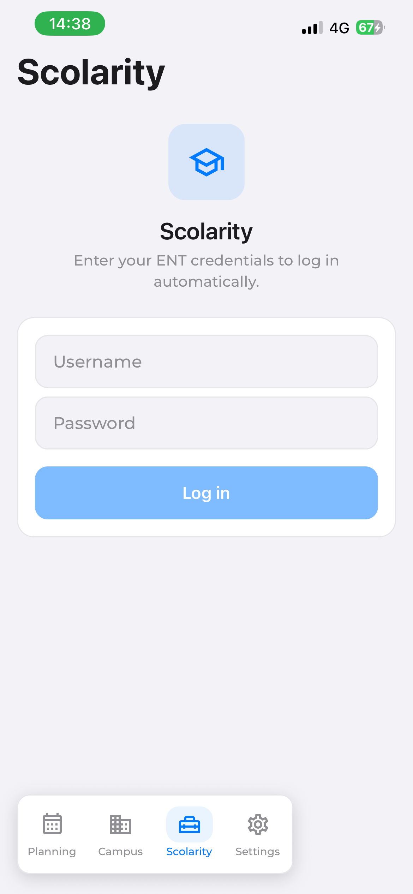
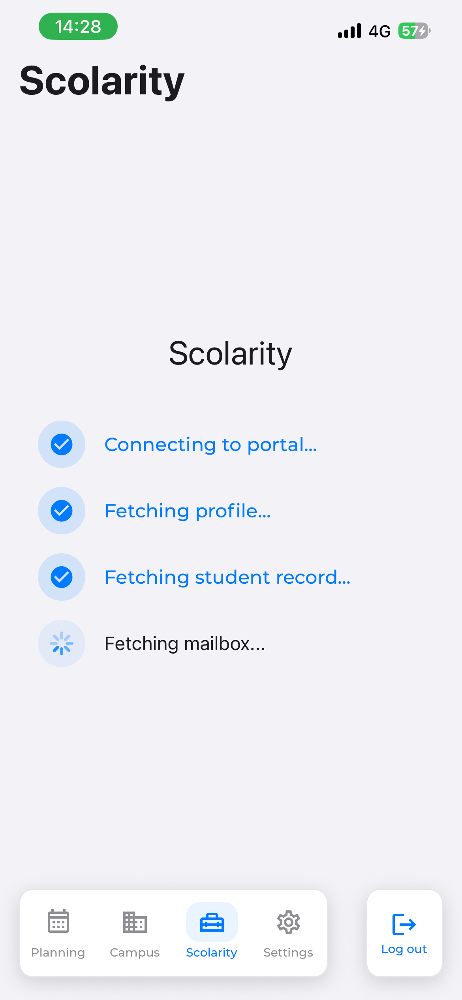
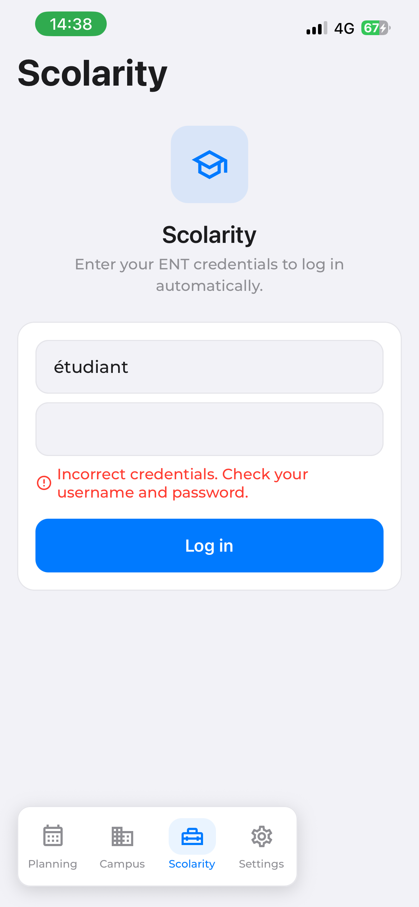
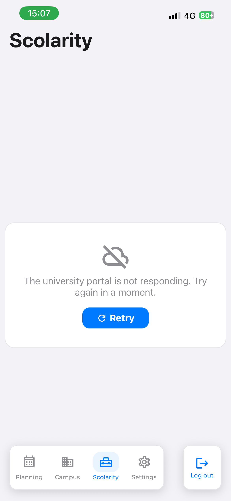

# Scolarité — session universitaire

L'onglet qui relie l'application au système d'information de l'université : connexion au compte
étudiant, récupération de l'identité, compteur de messages non lus, et navigateur intégré vers les
services universitaires.

C'est le module le plus sensible du projet — il manipule des identifiants — et le plus fragile — il
n'existe **aucune API**, tout passe par extraction de pages. Depuis le jalon
[6-F](../phase-6/6-f-scolarite.md), ce parcours n'est plus du code : ce sont deux
[Blueprints](../blueprints.md) joués par le moteur embarqué. Détail des hôtes, sélecteurs et délais :
section 2 de [sources-externes.md](../sources-externes.md).

## Parcours utilisateur

1. **Sans compte enregistré** : un écran de connexion demande identifiant et mot de passe
   universitaires, avec une explication de ce qui sera fait de ces données.
2. **Première connexion** (parcours « froid ») : un écran de progression détaille les étapes —
   connexion, profil, dossier, messagerie. Il dure une **quarantaine de secondes**, dont 23 s de
   pauses déclarées : elles ne sont pas du confort, elles sont la condition pour que les deux
   cascades d'authentification arrivent avant qu'on interroge la page (voir
   [Décisions de conception](#décisions-de-conception)).
3. **Lancements suivants** (parcours « chaud ») : les données d'identité sont déjà stockées, seule la
   messagerie est rafraîchie. L'écran s'affiche immédiatement.
4. **Verrou biométrique** : à chaque prise de focus de l'onglet, une authentification locale est
   demandée avant d'afficher les données. Une seule fois par session d'application.
5. Le tableau de bord affiche une salutation personnalisée, la date, un indicateur d'anniversaire, et
   la ligne de messagerie avec le nombre de messages non lus. La toucher ouvre le webmail dans le
   navigateur intégré.
6. Le bouton d'action de la barre d'onglets mène aux réglages du compte : informations enregistrées,
   déconnexion.

> Toutes les captures de cet onglet se prennent avec un **compte de test**, ou après floutage : elles
> ne doivent montrer ni nom, ni numéro étudiant, ni INE, ni adresse mail, ni contenu de messagerie
> réels.
>
> **Capture attendue** — `scolarite-login.png` : l'écran de connexion universitaire.
>
> **Trois captures différées, volontairement** — `scolarite-dashboard.png`, `scolarite-biometrie.png`
> et `scolarite-compte.png`. Elles montrent des écrans dont l'habillage doit changer prochainement, et
> une capture périmée renseigne moins bien qu'une absence signalée. Les quatre autres, ci-dessous,
> illustrent ce que le jalon 6-F a réellement changé et n'ont pas cette fragilité.





Et les deux échecs, qui ne se ressemblent pas et ne doivent pas se ressembler — un refus
d'identifiants se corrige en retapant son mot de passe, un portail muet se corrige en attendant :





## Architecture

```text
CredentialsProvider                     englobe toute la pile de navigation
  ├─ useCredentialsSession()            l'état : trousseau, mode, progression, échec
  ├─ useChargementInitial()             ce que le trousseau porte, puis la session qui va avec
  ├─ useCycleDeVieSession()             annule en arrière-plan, reprend au retour
  └─ ScolariteSession.deroulerSession() la séquence de runs
       ├─ froid : ukit.scolarite.dossier  → identité complète
       └─ les deux : ukit.scolarite.messagerie → non lus

ScolariteDashboard                      consomme useCredentials()
  ├─ pas de compte           → ScolariteLoginView
  ├─ parcours froid en cours → ScolariteLoadingScreen
  ├─ échec sans identité     → SourceFailureNotice
  └─ sinon                   → BiometryGate > GreetingBlock + MailboxRow
```

Il n'y a **plus de WebView propre à cet onglet** : les deux Blueprints sont joués dans la WebView
unique montée par [`rootContainer.tsx`](../../src/shared/navigation/rootContainer.tsx), qui ne crée
sa vue native qu'au premier run navigateur et la libère à la fin.

Le provider est monté **au-dessus de la pile entière** ([navigation.md](../navigation.md)) : la
session démarre au lancement de l'application, pas à l'ouverture de l'onglet, pour que les données
soient prêtes quand l'utilisateur y arrive.

## Deux Blueprints, pas un

| Blueprint | Quand | Ce qu'il rend |
|---|---|---|
| [`ukit.portail.bordeaux.dossier`](../../blueprints/ukit-portail-bordeaux-dossier.blueprint.json) | premier login | numéro étudiant, INE, identité, adresse mail, date de naissance |
| [`ukit.portail.bordeaux.messagerie`](../../blueprints/ukit-portail-bordeaux-messagerie.blueprint.json) | chaque lancement, et fin du parcours froid | nombre de messages non lus |

**Les noms viennent du catalogue**, plus de constantes, depuis le jalon
[6-G](../phase-6/6-g-etablissements.md) : ils sont propres à l'établissement sélectionné, et un
établissement ajouté à distance apporte les siens. Un champ à `null` n'est pas une panne mais un
**service absent** — voir [Un établissement peut n'avoir qu'une partie des services](#un-établissement-peut-navoir-quune-partie-des-services).

Le découpage suit **les parcours de l'application, pas les pages** : chacun ouvre son service, qui
rebondit lui-même sur l'authentification unifiée. Chacun se rejoue seul, et une panne de l'un
n'emporte pas l'autre — une messagerie injoignable n'efface pas le dossier qui vient d'être lu.

Chaque fichier part **du service et non du portail**. Le code d'origine ouvrait `ent.u-bordeaux.fr`
puis naviguait de page en page en injectant `window.location.href` ; les Blueprints ouvrent
directement `mondossierweb` ou `webmel`, qui redirigent vers le CAS avec leur paramètre `service=` et
reviennent au bon endroit, fragment compris. Corollaire assumé : **la lecture du prénom sur l'ENT
n'a plus de page où se faire.** Le dossier administratif porte l'identité complète, c'est de là
qu'elle vient désormais.

## Un établissement peut n'avoir qu'une partie des services

Le cas n'est pas théorique : **Bordeaux INP**, le second établissement du catalogue, n'a pas de
messagerie extractible — son webmail passe par SAML et non par le CAS. `portail_messagerie` vaut donc
`null`, et trois choses en découlent :

- la session **saute** le run de messagerie au lieu d'échouer : une fac sans webmail lisible doit
  donner une session complète, pas une erreur à chaque lancement ;
- le tableau de bord **n'affiche pas la carte** (`messagerieDisponible`, lu à chaque rendu pour qu'une
  bascule d'établissement le fasse disparaître tout de suite). Une carte en panne permanente pour un
  service inexistant serait un mensonge répété ;
- le seul cas qui échoue est celui où l'établissement ne publie **rien** : il n'y a alors pas de
  session à dérouler, et le dire est le bon comportement (`PORTAIL_ABSENT`).

Le pendant côté message : `serviceAbsent()` rend un échec de famille `config`, non réessayable, qui
porte **son propre libellé** — « Cette université n'est pas encore reliée à UKit », et non « le portail
ne répond pas ». Les deux appellent des gestes opposés de la part d'un étudiant.

## Deux portails, une seule sortie

Le portail de Bordeaux INP a été écrit au jalon 6-G contre un compte étudiant réel, et il ne ressemble
au premier que par sa forme :

| | Université de Bordeaux | Bordeaux INP |
|---|---|---|
| Soumission du CAS | `input[type=submit]` | **`<button id="submitBtn">`** |
| Panneau d'erreur | `#loginErrorsPanel` | **le même** |
| Dossier | `mondossierweb` **GWT**, `#gwt-uid-NN` positionnels | `mondossierweb` **Vaadin**, couples ancrés **par leur libellé** |
| Identité | `PRÉNOM NOM` en un champ | nom et prénom séparés, recomposés par le fichier |
| INE | lu | absent du dossier |
| Durée du parcours froid | ~40 s | ~12 s |

Ce que ça établit, et qui vaut pour tous les portails à venir : **c'est la sortie qui est le
contrat.** Les deux fichiers rendent les mêmes cinq champs, `ScolariteMapping` n'a pas bougé d'une
ligne, et les écrans ne savent toujours pas qu'il existe deux portails.

## Données froides et données chaudes

| | Données froides | Données chaudes |
|---|---|---|
| Contenu | prénom, numéro étudiant, INE, adresse mail, date de naissance | nombre de messages non lus |
| Stabilité | ne changent pas d'une année sur l'autre | changent en permanence |
| Stockage | SecureStore (`UKIT_COLD_DATA`) | mémoire seulement |
| Récupération | une seule fois, au premier login | à chaque lancement |

C'est ce qui permet le mode « chaud » : une page lourde évitée à chaque démarrage. Le mode est
choisi automatiquement à l'initialisation — `hot` si des données froides existent, `cold` sinon — et
forcé à `cold` lors d'un nouveau login.

## États de session

```ts
scrapeStatus   : 'idle' | 'connecting' | 'scraping' | 'done' | 'error'
scrapeProgress : 'connecting' | 'profile' | 'dossier' | 'mailbox' | null
sessionFailure : UkitFailure | null
```

Les trois vivent dans **un seul état** ([`CredentialsContext.tsx`](../../src/features/Scolarite/services/CredentialsContext.tsx)) :
ils changent toujours ensemble, et trois `useState` séparés laissaient possibles un statut qui avance
sans que la progression suive, ou un échec qui reste affiché après une reprise.

La progression ne vient plus de messages postés à la main : elle est **lue dans le flux d'événements
du run**. `LOGIN_SUCCESS`, que le Blueprint émet explicitement, fait passer à l'étape *profil* ; le
`step_started` du step nommé `dossier` fait passer à l'étape *dossier* ; le run de messagerie porte
la dernière.

Le garde-fou global de 60 s **a disparu**. Chaque attente porte son propre `timeout_ms` dans le
fichier, et `runBlueprint` ne lève jamais : une promesse qui ne se résout pas n'est plus possible.

## Deux écritures, deux déclencheurs

C'est la distinction à ne pas confondre, et le jalon 6-F la rend possible :

- **les identifiants** s'écrivent sur `LOGIN_SUCCESS`, l'événement que le Blueprint émet quand le CAS
  a accepté. C'est la preuve qu'ils sont bons ; un mot de passe erroné ne laisse donc aucune trace ;
- **les données froides** ne s'écrivent que si le run va au bout, `assert` compris. Un décalage des
  identifiants GWT fait échouer l'assertion, et **rien d'incorrect n'atteint le trousseau**.

`validateAndSave(username, password)` retourne une promesse résolue par le flux du run. Le couple
candidat n'étant pas encore dans `SecureStore`, il est passé **à l'appel** (`RunBlueprintOptions.secrets`,
qui gagne sur le resolver) plutôt qu'écrit d'abord : l'écrire pour que le resolver le trouve
romprait exactement la promesse ci-dessus.

## Une session à la fois

Il y a une WebView montée, donc **un run navigateur à la fois**. Une seconde demande est refusée
**explicitement et bruyamment**, jamais mise en file : une file cacherait une seconde session
derrière un délai inexpliqué. La garde est posée deux fois — dans le contexte et dans
[`ScolariteSession.ts`](../../src/features/Scolarite/services/ScolariteSession.ts) — et c'est voulu :
celle du contexte attrape le geste utilisateur, celle du service attrape l'erreur de programmation.

L'**annulation** est le pendant : la session est coupée quand l'application passe en arrière-plan et
au démontage du provider, sans quoi une WebView cachée survivrait à l'écran qui l'a demandée. Sur
`background` seulement, jamais sur `inactive` — iOS émet `inactive` pour l'invite biométrique de cet
onglet, et couper là serait absurde. Au retour au premier plan, une session qu'on a soi-même annulée
**reprend** ; un échec réel, lui, ne se rejoue pas tout seul.

**Changer d'établissement déconnecte, y compris en mémoire.** `changerEtablissement` vide le
trousseau, mais le provider est monté au-dessus de toute la pile : il ne se démonte pas, et son état
survivait à la bascule — l'onglet affichait le prénom de l'étudiant de l'autre université avec un
trousseau pourtant vide, c'est-à-dire la pire forme du défaut que cette phase supprime : une donnée
fausse qui a l'air juste. Le contexte s'abonne donc à l'événement `etablissement` et oublie **ce qu'il
garde**, sans retoucher au magasin — le refaire ici ferait dépendre la correction de l'ordre des
abonnements. Trouvé sur appareil au jalon 6-G.

Une session annulée **n'écrit rien**. Le cas qui l'impose n'est pas théorique : une déconnexion
pendant la session remettrait dans le trousseau l'identité que `logout` vient d'effacer.

## Le filet que le code d'origine n'avait pas

Les identifiants GWT du dossier sont attribués selon l'ordre de construction du DOM. La migration ne
les rend **pas** robustes. Ce qu'elle ajoute, c'est la lecture des **cinq libellés voisins** et leur
assertion :

```json
{ "action": "assert",
  "condition": "{{ steps.dossier.libelle_numero == 'Dossier' and … }}" }
```

Un décalage devient un **échec nommé** au lieu d'une donnée fausse écrite dans le trousseau. Le
libellé `Prénom et Nom` sert deux fois : il garde l'extraction, et c'est lui qui autorise à prendre
le premier mot de l'identité comme prénom — sans lui, l'ordre serait une supposition, et une
supposition sur un nom propre s'affiche en toutes lettres sur le tableau de bord.

## Le navigateur intégré

[`WebBrowserScreen.tsx`](../../src/features/Scolarite/screens/WebBrowserScreen.tsx) est une WebView
plein écran avec une barre d'action flottante glissable (retour, avant, rechargement, ouverture
externe, fermeture), pilotée par un geste Reanimated. **Ce n'est pas du scraping** : l'utilisateur la
pilote, elle ne devient pas un Blueprint.

Quatre points d'entrée nommés :

| `entrypoint` | Destination |
|---|---|
| `ent` | l'ENT de l'établissement |
| `email` | son webmail |
| `cas` | son authentification unifiée |
| `apogee` | ses résultats |

Les quatre adresses **viennent du catalogue** (colonne `services`) depuis le jalon
[6-G](../phase-6/6-g-etablissements.md). Elles étaient en dur ici, et c'était le dernier hôte
bordelais compilé dans un écran : un étudiant d'une autre fac s'y serait retrouvé sur le portail de
Bordeaux. Un point d'entrée que l'établissement ne déclare pas retombe sur le site de UKit — le repli
qui existait déjà pour un paramètre absent.

**Remplissage automatique du formulaire CAS** : `getCASInjectedScript` scrute la page toutes les
100 ms (50 tentatives, soit 5 s). Si des identifiants sont enregistrés et qu'aucune erreur n'est
affichée, il remplit et soumet. Sinon, il pose un écouteur sur la soumission du formulaire pour
**proposer d'enregistrer** les identifiants saisis à la main.

Les identifiants y passent par `JSON.stringify` depuis le jalon 6-F : ils étaient interpolés entre
apostrophes simples, donc un mot de passe contenant `'` cassait le script — pas l'authentification,
**le script**, silencieusement. C'est la même classe de bug que la session supprime par construction,
et cet écran la portait aussi.

Le retour matériel Android est intercepté : il navigue dans l'historique de la WebView avant de
quitter l'écran, et le geste de retour de la pile est désactivé tant qu'un historique existe.

> **Capture attendue** — `scolarite-navigateur.png` : le navigateur intégré et sa barre d'action
> flottante.

## Sécurité

- Les identifiants vivent **uniquement** en SecureStore, chiffré par le trousseau de l'OS.
- Ils ne transitent par **aucun serveur tiers** : le moteur est embarqué, les requêtes partent de
  l'appareil, et seul le CAS de l'université les voit.
- Ils ne traversent **jamais la source d'un script** : le moteur les encode en JSON et les transmet
  par une communication corrélée avec l'agent injecté.
- Un Blueprint ne peut déclarer que les secrets que l'application lui ouvre
  (`ALLOWED_SECRETS`, [blueprints/index.ts](../../blueprints/index.ts)) — y compris un Blueprint
  publié à distance, **y compris un portail que l'application n'embarque pas**. C'est la borne du
  jalon 6-G : le préfixe décide de ce qui peut arriver, le périmètre de secrets décide de ce que ça
  peut réclamer. Les deux noms sont neutres vis-à-vis de l'établissement (`portail_user` /
  `portail_pass`) ; les **clés du trousseau, elles, n'ont pas bougé**, et personne n'a été déconnecté
  par le renommage.
- Les valeurs résolues sont **masquées** dans les événements et les messages d'échec.
- Les données personnelles récupérées ne quittent jamais l'appareil.
- L'accès à l'onglet est protégé par `BiometryGate` (`expo-local-authentication`), avec repli sur le
  code de l'appareil.
- La déconnexion coupe la session en cours **avant** de supprimer les deux clés SecureStore.

## Décisions de conception

**Une WebView plutôt qu'un client HTTP.** Le CAS repose sur des redirections, des cookies de session
et du JavaScript ; les pages cibles sont rendues côté client (GWT pour le dossier, framework
propriétaire pour le webmail). Un client HTTP devrait réimplémenter un navigateur.

**Un user-agent de Chrome desktop**, déclaré dans les deux fichiers. Le webmail sert `/modern/` aux
UA mobiles, un DOM entièrement différent où le sélecteur du compteur **n'existe pas**. Ce n'est pas
un raffinement, c'est ce qui rend la page atteignable depuis un téléphone.

**Une pause explicite après le clic de soumission**, 8 s pour le dossier et 15 s pour la messagerie.
L'authentification unifiée enchaîne plusieurs sauts, puis le client pose son propre fragment, et
**une opération émise pendant cette cascade se perd en silence** sur un appareil. C'est un
contournement d'une limite du moteur, écrit dans le fichier plutôt que déguisé en délai généreux —
un contournement qu'on peut lire est un contournement qu'on saura retirer.

**Une lecture qui suit une attente porte un délai court** (5 s). Elle n'a rien à attendre : sa
présence vient d'être prouvée. Un budget court garantit que la page réponde avant l'appelant, donc
qu'un échec reste lisible au lieu d'être un silence rapporté comme « la page a changé ».

**Une garde sur `#loginErrorsPanel`** juste après la pause. Ce panneau est absent de la page de
connexion propre et présent dès que le CAS refuse — mesuré, contrairement à `#msg2` et `.errors` qui
existent déjà vides. Sans elle, un mot de passe faux coûterait le plafond entier du sélecteur
suivant : **41 s mesurées, contre 13 s avec**. Elle est posée *après* la pause, donc hors de la
cascade de navigations, ce qui est ce qui la rend sûre.

**Le verrou biométrique n'est demandé qu'une fois par session d'application** (`authPassedRef`, une
référence qui survit aux rendus). Le redemander à chaque focus d'onglet serait inutilisable. Il
protège l'accès à l'écran, pas la session : les deux sont indépendants et doivent le rester.

## Vérifier

Les sondes se jouent **sur appareil**, avec un compte universitaire réel, et le chemin dégradé fait
partie de la définition de « terminé ». **Pas de mode avion** : il coupe aussi Metro. On dégrade en
pointant le Blueprint embarqué sur un hôte injoignable puis en rechargeant, ce qui est d'ailleurs
plus précis — ça distingue `unavailable` de `rejected` et de `data`.

- **Premier login** : l'écran de progression parcourt les quatre étapes ; le prénom, le numéro
  étudiant et le compteur de messages s'affichent.
- **Relancer l'application** : parcours « chaud », affichage immédiat, seule la messagerie se
  rafraîchit.
- **Mot de passe contenant `'`, `"` et `^`** : fonctionne. C'est la sonde du jalon.
- **Identifiants erronés** : message clair, aucun enregistrement, possibilité de réessayer.
- **Sélecteur GWT volontairement faux** : l'`assert` déclenche, et **rien d'identitaire n'est écrit**.
- **Sélecteur du compteur faux** : échec `MESSAGERIE_INDISPONIBLE`, distinct de l'échec de login.
- **`vars.dossier` sur `https://127.0.0.1:1/`** : « Le portail de l'université ne répond pas », **avec**
  Réessayer. Une adresse qui refuse la connexion, pas un nom qui ne résout pas — voir les limites.
- **Arrière-plan pendant la session** : pas de WebView orpheline ; la session reprend au retour.
- **Deux sessions coup sur coup** : la seconde est refusée, la première va au bout.
- **Correction publiée** : `npm run blueprints:publish` après avoir corrigé un sélecteur — la session
  repart sans réinstaller l'application.
- **Verrou biométrique** : quitter l'onglet et y revenir dans la même session — aucune nouvelle
  demande ; relancer l'application — la demande revient.
- **Navigateur intégré** : ouvrir le webmail depuis la ligne de messagerie ; le formulaire CAS doit se
  remplir seul.
- **Déconnexion** : l'écran de connexion revient, aucune donnée ne subsiste.
- **Second établissement** : basculer sur Bordeaux INP dans les réglages, se connecter avec un compte
  de cette école — le parcours froid va au bout en une douzaine de secondes, l'identité s'affiche, et
  **aucune ligne de messagerie n'apparaît**. Puis revenir à Bordeaux : la session est à refaire, ce
  qui est le comportement voulu.

## Limites connues

- **Les sélecteurs restent positionnels** (`gwt-uid-41`, `-43`, `-45`, `-47`, `-51`). Ils ne sont pas
  devenus robustes : ils sont devenus une **ligne de données corrigeable à distance**, et un décalage
  produit désormais un échec nommé au lieu d'une donnée fausse. C'est déjà beaucoup, et ce n'est pas
  la même chose.
- **Un mot de passe faux coûte environ 13 s.** Le script d'origine lisait le message d'erreur du CAS
  en deux secondes. Descendre plus bas demanderait d'interroger la page pendant la cascade de
  navigations qui suit la soumission — là où une opération se perd en silence, ce qui mettrait le
  chemin **nominal** en risque pour améliorer le chemin d'erreur.
- **Une source injoignable n'est jamais rangée en `unavailable`**, et c'est une limite du moteur
  mesurée sur appareil. Une adresse qui **refuse la connexion** fait rendre à iOS sa propre page
  d'erreur : l'agent s'y injecte et s'annonce, donc la navigation « réussit », et c'est l'attente
  suivante qui échoue — en `blocked`, avec le nom que le Blueprint lui a donné. Un nom qui **ne
  résout pas** ne produit aucun document, et le run retombe en `engine`, c'est-à-dire « un problème
  de notre côté » affiché à quelqu'un dont le portail est simplement en panne.

  L'application corrige la conséquence, pas la cause : `CAS_INDISPONIBLE` et
  `MESSAGERIE_INDISPONIBLE` sont déclarés **réessayables** dans
  [`ScolariteMapping.ts`](../../src/features/Scolarite/services/ScolariteMapping.ts), alors que leur
  famille ne l'est pas. Un portail muet répondra peut-être dans dix secondes, et lui refuser un
  bouton Réessayer serait faux ; `LOGIN_FAILED`, lui, reste non réessayable, parce que rejouer le
  même mot de passe donnera le même refus. Le cas `engine`, en revanche, **reste sans bouton** — il
  faudrait pour cela que le moteur distingue « aucun document » de « bug interne », et c'est chez lui
  que ça se traite, pas ici ([note de portée de la Phase 6](../phase-6/README.md)). Le défaut est
  ouvert et documenté chez Aetherius, avec sa reproduction et sa direction de correctif, dans la
  section « Limites connues » de `docs/embedded.md` — il se corrigera par une **release du moteur**,
  pas par une publication de Blueprint.
- **La ligne de messagerie ne propose pas de réessayer.** Elle *dit* l'échec ; la reprise se fait au
  retour au premier plan ou au lancement suivant. Un bouton de plus sur une rangée qui ouvre déjà le
  webmail au toucher rendrait la cible ambiguë.
- **Le parcours chaud dure une vingtaine de secondes**, dont 15 s de pause fixe imposée par la
  cascade d'authentification du webmail. Le compteur de messages arrive donc après l'ouverture de
  l'onglet, pas avec elle.
- **Un prénom composé de deux prénoms n'en montre que le premier.** C'est le bon résultat pour une
  salutation ; l'état civil complet reste visible dans les réglages du compte.
- **Le compteur peut valoir `null`.** `as: "number"` rend un entier ou rien ; un libellé sans
  parenthèses vaut `0`, une boîte absente vaut « on ne sait pas ». Les deux ne s'affichent pas
  pareil, et le test [`ScolariteMapping.test.ts`](../../src/features/Scolarite/services/ScolariteMapping.test.ts)
  fige la distinction.
- **Apogée n'est pas extrait**, pas plus qu'avant : il reste accessible par le navigateur intégré.
- **Le numéro étudiant de Bordeaux INP est lu par position** dans le bandeau latéral, faute d'un
  libellé pour l'ancrer — la seule fragilité positionnelle de ce portail. L'`assert` sur les libellés
  de l'état-civil est ce qui la garde : un décalage du bandeau accompagnerait une refonte de la page,
  donc de ces libellés.
- **Bordeaux INP ne rend pas d'INE** : son dossier ne l'expose pas. Le champ reste vide plutôt que
  d'être inventé.
- **Pas de parité automatisée** pour ce module, et c'est assumé : elle demanderait des identifiants
  réels dans un harnais.
- **[`ApogeeCard.tsx`](../../src/features/Scolarite/components/cards/ApogeeCard.tsx) n'est importé
  nulle part** : la carte d'accès aux notes existe mais n'est pas branchée au tableau de bord.
- **Le point d'entrée `apogee` du navigateur intégré n'est atteint par aucun appel** de navigation.
- **La session rallonge le splash de démarrage.** `CredentialsProvider` enveloppe toute la pile
  ([`StackNavigator.tsx`](../../src/shared/navigation/StackNavigator.tsx)) et lance la session dès
  que le trousseau a rendu des identifiants, donc **à chaque lancement**. Le comportement est
  antérieur à la Phase 6 et reproduit à l'identique sur `master` ; le jalon 6-F change **comment** la
  session tourne, pas **quand** elle démarre. Le raccourcir demande de retarder la session jusqu'à la
  fin du splash, ou de la déclencher à l'entrée dans l'onglet — une décision de produit (on perdrait
  le compteur de messages à jour dès l'ouverture), pas un correctif technique.

## Carte des fichiers

| Fichier | Rôle |
|---|---|
| [`services/CredentialsContext.tsx`](../../src/features/Scolarite/services/CredentialsContext.tsx) | contexte et état de session : trousseau, mode froid/chaud, progression, échec, annulation |
| [`services/ScolariteSession.ts`](../../src/features/Scolarite/services/ScolariteSession.ts) | la séquence de runs : quels Blueprints, dans quel ordre, et le verrou d'un run navigateur à la fois |
| [`services/ScolariteMapping.ts`](../../src/features/Scolarite/services/ScolariteMapping.ts) | la projection des sorties vers les écrans, et la table des échecs nommés |
| [`services/ScolariteMapping.test.ts`](../../src/features/Scolarite/services/ScolariteMapping.test.ts) | ce que cette projection doit tenir |
| [`screens/ScolariteDashboard.tsx`](../../src/features/Scolarite/screens/ScolariteDashboard.tsx) | écran d'onglet : aiguillage entre connexion, chargement, échec et tableau de bord |
| [`screens/CredentialsSettingsScreen.tsx`](../../src/features/Scolarite/screens/CredentialsSettingsScreen.tsx) | réglages du compte : informations enregistrées, déconnexion |
| [`screens/WebBrowserScreen.tsx`](../../src/features/Scolarite/screens/WebBrowserScreen.tsx) | navigateur intégré : points d'entrée, historique, retour matériel, enregistrement d'identifiants |
| [`components/WebBrowserComponents.tsx`](../../src/features/Scolarite/components/WebBrowserComponents.tsx) | barre d'action flottante, modale d'enregistrement, script de remplissage CAS |
| [`components/ScolariteLoginView.tsx`](../../src/features/Scolarite/components/ScolariteLoginView.tsx) | formulaire de connexion et explication du traitement des données |
| [`components/ScolariteLoadingScreen.tsx`](../../src/features/Scolarite/components/ScolariteLoadingScreen.tsx) | écran de progression du parcours froid, étape par étape |
| [`components/BiometryGate.tsx`](../../src/features/Scolarite/components/BiometryGate.tsx) | verrou biométrique, une demande par session d'application |
| [`components/GreetingBlock.tsx`](../../src/features/Scolarite/components/GreetingBlock.tsx) | salutation, date du jour, détection d'anniversaire |
| [`components/MailboxRow.tsx`](../../src/features/Scolarite/components/MailboxRow.tsx) | ligne de messagerie : compteur de non-lus, chargement, et échec du parcours chaud |
| [`components/cards/ApogeeCard.tsx`](../../src/features/Scolarite/components/cards/ApogeeCard.tsx) | carte d'accès aux résultats — définie, non branchée |
