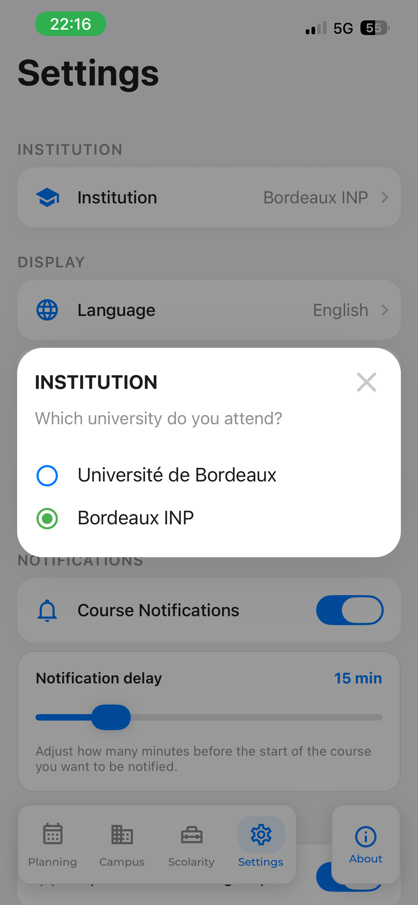

# Réglages

Le quatrième onglet : préférences d'affichage, filtres d'UE, notifications de cours, synchronisation
avec le calendrier du système, réinitialisation, et écran À propos.

Tout l'état de cet onglet est porté par `SettingsManager`
([donnees-et-persistance.md](../donnees-et-persistance.md)) : l'écran n'est qu'une surface de pilotage.

## Parcours utilisateur

L'écran est une suite de sections empilées, sous un titre qui s'efface au défilement :

| Section | Contenu |
|---|---|
| **Établissement** | l'université sélectionnée (modale de choix, avec confirmation) |
| **Affichage** | langue (modale à trois choix), filtres d'UE (modale de gestion) |
| **Thème** | interrupteur mode sombre |
| **Notifications** | interrupteur des rappels de cours, curseur de délai |
| **Lancement** | ouvrir sur le groupe favori, réinitialiser l'application |
| **Calendrier** | interrupteur de synchronisation, choix du calendrier cible, date de dernière synchronisation |

Le bouton d'action de la barre d'onglets mène à **À propos**.

> **Capture attendue** — `reglages.png` : l'écran complet, sections visibles.
>
> **Capture attendue** — `reglages-langue.png` : la modale de langue.
>
## Le compte universitaire, et le lien d'emploi du temps

Deux lignes vivent dans la section **Établissement** depuis le jalon
[6-J](../phase-6/6-j-compte-et-sources-par-etablissement.md), et chacune n'apparaît que si elle a un
sens :

| Ligne | Visible quand | Ce qu'elle dit, ce qu'elle ouvre |
|---|---|---|
| **Compte universitaire** | l'établissement déclare un portail | *Connecté* / *Non connecté*, et mène aux réglages du compte — **ou au formulaire de connexion** quand il n'y a pas encore de compte |
| **Lien de l'emploi du temps** | l'établissement déclare un abonnement iCal | *Connecté* / *Non connecté*, et mène à la saisie du lien |

**La première est le rappel de l'étape sautée à l'accueil.** La spécification demandait une étape
« sautable **et rappelée** » : c'est ici que le rappel vit, à côté du réglage dont il dépend. Elle
disparaît chez un établissement sans portail — un compte qu'on ne peut pas connecter n'est pas un
réglage, c'est une promesse en l'air.

L'état est **relu à chaque retour sur l'écran** : le trousseau n'émet aucun événement, et l'écran des
identifiants — où l'on se déconnecte — est juste à côté. Le figer au montage afficherait « Connecté »
après une déconnexion, sans rien pour le corriger.

## Changer d'établissement

L'entrée est **en première position**, et pas par courtoisie : c'est le réglage dont tous les autres
dépendent — les groupes, le planning, la session universitaire, les points de balayage des
bibliothèques. Le nom affiché à droite vient du **catalogue** et n'est pas traduit ; c'est une donnée,
comme le nom d'un calendrier système trois sections plus bas
([6-G](../phase-6/6-g-etablissements.md)).



La modale a **deux temps** : la liste, puis une confirmation qui annonce ce qui sera effacé. Une
bascule immédiate au premier toucher rendrait ce coût invisible jusqu'à ce qu'il soit payé. Toucher
l'établissement **déjà actif** ne déclenche rien — il n'y a rien à purger, et une confirmation pour un
non-changement apprend à la valider sans la lire.

Ce que la bascule efface, et **par quel chemin** — les deux ne sont pas au même endroit, et les
confondre a coûté un défaut :

| Effacé | Par | Pourquoi |
|---|---|---|
| `groupList`, `groupListTimestamp`, `groups` | [`purge.ts`](../../src/shared/etablissements/purge.ts) | ce sont des identifiants d'une université |
| **les groupes favoris et les filtres d'UE** | *rien — ils sont **rangés**, pas effacés* | voir « Des favoris par établissement » ci-dessous |
| **le lien d'abonnement à l'emploi du temps** | *rien — cloisonné, comme les favoris* | même règle, et voir ci-dessous |
| les caches de planning (`…@Week…`, `…@AAAA/MM/JJ`) | `purge.ts` | un planning gardé s'afficherait sous une autre fac sans que rien ne le dise |
| `buildingList`, `buildingListTimestamp`, la surcouche `batiments@1`, les favoris de salles libres | `purge.ts` | les bâtiments sont reconstruits depuis les salles de **cette** université |
| les identifiants et les données froides du trousseau | `purge.ts` | ils appartiennent au portail quitté |
| **les cours écrits dans le calendrier système** | [`SettingsManager.purgeCalendarEvents()`](../../src/shared/services/AppCore.tsx) | ils sont ceux de l'université quittée, et **personne ne viendrait les chercher** : les favoris venant d'être purgés, plus aucune synchronisation ne peut tourner |

### Des favoris par établissement

Les groupes favoris et les filtres d'UE sont **cloisonnés par établissement** : basculer range ceux
qu'on quitte et ressort ceux qu'on retrouve. Revenir à son université d'origine y retrouve donc ses
groupes, sans rien reselectionner.

**Le lien d'abonnement à l'emploi du temps suit la même règle** depuis le jalon
[6-J](../phase-6/6-j-compte-et-sources-par-etablissement.md), et pour la même raison : la règle de la
phase est que les données de deux facs ne se **mélangent** pas, pas qu'il faille les oublier. Un lien
n'est lu que sous l'établissement qui le porte, donc rien ne se mélange à le garder — et faire recoller
à chaque aller-retour un lien que l'étudiant a déjà donné serait une punition sans raison. Il vit dans
le trousseau et non dans les réglages, parce qu'il ouvre un emploi du temps nominatif sans demander
d'identifiant : il vaut un mot de passe
([`lienEdt.ts`](../../src/shared/etablissements/lienEdt.ts)).

Ce n'est pas un assouplissement de la règle « les données de deux facs ne se mélangent pas » : cette
règle interdit le **mélange**, pas la mémoire. À tout instant, seuls les favoris de l'établissement
actif sont en jeu — `_favoriteGroups` reste la vue de l'actif, et le reste de l'application ignore
qu'il en existe d'autres.

La version précédente les **effaçait**, ce qui était déjà un progrès sur celle d'avant — où ils
survivaient à la bascule et faisaient buter le planning agrégé sur des groupes d'une autre université
(voir l'encadré ci-dessous). Effacer répondait simplement à la mauvaise question.

Trois choses restent purgées, et chacune pour une raison qui lui est propre :

| Toujours purgé | Pourquoi |
|---|---|
| le **cache de planning** | ses clés portent des noms de groupe qui peuvent se ressembler d'une fac à l'autre ; le garder ferait courir un risque de collision pour économiser quelques secondes de rechargement |
| la **session universitaire** | c'est un identifiant, il n'a rien à faire ailleurs |
| les **cours du calendrier système** | ce sont ceux de l'université quittée, et il faut les réécrire même si des favoris reviennent |

La lecture depuis le disque porte **trois formes historiques** — `groupName` d'avant les favoris
multiples, la liste d'avant le cloisonnement, et la table — rassemblées dans
[`reglagesParEtablissement.ts`](../../src/shared/services/reglagesParEtablissement.ts). Elles y vivent
plutôt que dans `AppCore` pour une raison précise : une migration qui se trompe perd les favoris de
quelqu'un **sans rien dire**, au premier lancement après une mise à jour. Là, elle est jouable sous
Node, donc verrouillée par des tests.

> **La deuxième ligne de ce tableau a été fausse pendant deux jalons.** Ce document annonçait
> l'effacement des favoris depuis le jalon 6-G ; le code ne le faisait pas — `resetSettings` les
> effaçait, la bascule non. Personne ne l'a vu parce que le défaut n'avait aucun symptôme : tant que
> Bordeaux INP n'avait pas d'emploi du temps, des favoris bordelais restés en place ne rencontraient
> jamais rien. Le jalon [6-I](../phase-6/6-i-planning-universel.md) lui en a donné un, et l'onglet
> Planning s'est mis à annoncer « ce groupe n'existe plus » pour un groupe qui existe parfaitement —
> à l'université qu'on venait de quitter. Une documentation en avance sur son code ne se distingue
> pas d'une documentation juste, et c'est ce qui rend ce genre d'écart cher.

Ce qui **reste**, et c'est délibéré : les favoris de restaurants et de bibliothèques. Ils pointent
Croustillant et Affluences, deux sources **nationales** — un étudiant qui passe d'une fac bordelaise à
l'autre garde la même bibliothèque préférée, et la lui effacer serait une régression déguisée en
propreté.

La purge court **avant** la sélection, jamais après : jouée après, elle courrait contre les écrans qui
se rechargent déjà sur le nouvel établissement, et l'un d'eux réécrirait ce qu'on efface.

**La réinitialisation passe par la même porte**, et c'est une correction du jalon 6-G. Elle n'avait
jamais touché au trousseau ; ce n'était pas faux tant que l'application ne connaissait qu'une
université, mais elle rouvre le parcours d'accueil — donc le choix de l'établissement — et quelqu'un
pouvait repartir sur une autre fac **en restant connecté au portail de la précédente**. Deux gestes
qui effacent la même chose ne doivent pas avoir deux définitions de « la même chose ».

**Le changement se propage aux écrans déjà montés**, et il a fallu le faire explicitement. Le code de
l'établissement passe par `AppContext` ([`AppCore.tsx`](../../src/shared/services/AppCore.tsx)), à côté
du thème et des groupes favoris : sans ça, un onglet monté ne rendait pas à nouveau et gardait l'état
de l'université précédente — la section des salles libres restait masquée après un retour à Bordeaux.
Le contexte de scolarité, lui, s'abonne directement à l'événement pour **oublier ce qu'il garde en
mémoire** : il est monté au-dessus de toute la pile, il ne se démonte donc pas à la bascule, et
l'onglet affichait encore le prénom de l'étudiant de l'autre fac alors que le trousseau était déjà
vide. Les deux ont été trouvés sur appareil.

**Un établissement retiré du catalogue ne bascule personne.** La politique de lecture le fait
disparaître de la liste ; l'appareil de quelqu'un qui l'avait choisi continue sur ce qu'il en sait et
affiche une phrase sous l'entrée. Basculer d'office au milieu d'une année serait pire que prévenir.

« Ce qu'il en sait » est littéral : le rafraîchissement **reporte** l'établissement sélectionné depuis
le cache précédent quand la base ne le publie plus. Sans ce report, il cessait de résoudre et
l'application retombait sur l'établissement historique — une bascule silencieuse, mesurée sur
appareil. Le report ne pouvant rien quand le cache a perdu l'entrée (réinstallation), l'avertissement
couvre **les deux causes** : reporté, ou irrésoluble. Le repli reste possible ; il n'est plus muet.

## Les filtres d'UE

Un filtre masque les cours d'une UE dans le **planning des groupes favoris uniquement**
([planning.md](planning.md)). La modale propose deux moyens d'en ajouter un :

- **saisie libre** d'un code, mis en majuscules automatiquement ;
- **sélection dans la liste** des UE réellement rencontrées, alimentée par
  `PlanningDataManager.getAvailableUEs()` — celle-ci se remplit à mesure que des plannings sont
  chargés, par extraction du code d'UE des matières.

Les filtres sont stockés dans `settings.filters` et diffusés par l'événement `filter`, auquel
`RootContainer` et l'écran Réglages sont abonnés.

Un filtre se retire aussi depuis la fiche d'un cours, via le bouton d'en-tête `FilterRemoveButton`.

> **Capture attendue** — `reglages-filtres.png` : la modale de gestion des filtres d'UE, avec des
> filtres actifs et la liste des UE suggérées.

## Les notifications de cours

```text
Interrupteur activé
  └─ NotificationManager.requestPermissionsAsync()
  └─ SettingsManager.setCourseNotificationsEnabled(true)
  └─ relecture du cache de la semaine courante  (<favoris>@Week<n>)
       └─ NotificationManager.scheduleCourseNotifications(data)
```

Le curseur de délai (`courseNotificationDelay`, en minutes) replanifie de la même façon à la fin du
geste, pas pendant.

`scheduleCourseNotifications`
([`NotificationService.ts`](../../src/shared/services/NotificationService.ts)) :

1. **annule toutes** les notifications programmées — c'est une reconstruction complète, pas un
   ajout ;
2. sort immédiatement si les rappels sont désactivés ;
3. aplatit les données reçues (jour ou semaine) en une liste de cours ;
4. ne garde que ceux dont l'heure de déclenchement (début moins le délai) est encore à venir ;
5. trie chronologiquement et **plafonne à 20 notifications**, pour rester sous la limite de l'OS
   (64 sur iOS) ;
6. compose le message : matière et salle, cette dernière déduite de la description par
   `extractRoomFromDescription` (recherche de « salle », « bât », « amphi », « cremi », avec repli
   positionnel).

La planification est aussi déclenchée depuis le planning lui-même, à chaque chargement du planning
favori. Réglages ne fait que forcer une reconstruction immédiate.

## La synchronisation calendrier

Portée par `SettingsManager.syncCalendar()`
([`AppCore.tsx`](../../src/shared/services/AppCore.tsx)).

```text
Activation
  ├─ permission calendrier demandée si nécessaire
  ├─ liste des calendriers du système chargée
  ├─ BackgroundFetch.registerTaskAsync('background-fetch', 12 h)
  └─ choix de la cible : un calendrier existant, ou un calendrier "UKit" dédié

syncCalendar()
  ├─ crée le calendrier "UKit" au premier passage si c'est la cible
  ├─ PlanningApiService.fetchCalendarForSynchronization(premier groupe favori)
  │     └─ Blueprint ukit.celcat.annee, année universitaire complète (août → août)
  ├─ pour chaque événement : mise à jour si connu, création sinon
  ├─ suppression des événements devenus obsolètes
  └─ écriture de previousSyncData / previousSyncTime
```

La table `previousSyncData` associe l'identifiant Celcat à l'identifiant de l'événement système :
c'est ce qui rend la synchronisation **idempotente**. Sans elle, chaque passage dupliquerait l'agenda.

La fenêtre synchronisée est l'**année universitaire** : du 1er août courant au 1er août suivant, avec
recul d'un an si l'on est avant août. Ses deux bornes sont **calculées par le service** et passées en
entrée au Blueprint : savoir de quel côté du 1er août on se trouve demande l'heure courante, ce qui
rendrait le fichier non rejouable, donc non vérifiable ([blueprints.md](../blueprints.md)).

Deux propriétés de ce run, depuis le jalon [6-E](../phase-6/6-e-planning.md) :

- **il part d'une tâche de fond, sans écran.** Aucun `confirm` ne doit donc entrer dans ce Blueprint :
  personne ne l'écouterait, et la politique de délai le refuserait ;
- **son délai est relevé à 60 s** (`options.timeout_ms`). La réponse pèse environ 200 Ko pour une
  année, et un délai dépassé dans une tâche qui tourne toutes les 12 h coûte un cycle entier.

Un échec laisse le calendrier **tel quel** et repassera au cycle suivant : purger des événements déjà
posés sur la foi d'une source injoignable serait pire que ne rien faire.

### Éteindre retire ce qui a été écrit

L'interrupteur ne faisait qu'arrêter les passages suivants : les cours déjà posés restaient dans
l'agenda personnel, sans aucun moyen de les enlever depuis l'application. Le nettoyage existait
pourtant — `deleteAllPreviousCalendarEntries` — et n'était appelé qu'en **changeant** de calendrier
cible. Une capacité qu'on peut activer et pas désactiver n'est pas un réglage, c'est un aller simple.

`SettingsManager.disableCalendarSync()` retire les événements, arrête la tâche de fond et efface
`previousSyncData`. Le retrait lui-même vit dans `purgeCalendarEvents()`, parce que **deux gestes**
s'en servent — éteindre la synchronisation, et changer d'université. **La cible n'est remise à zéro
que si elle n'existe plus** : le calendrier dédié
« UKit » est supprimé avec ses événements, donc la garder ferait échouer la synchronisation suivante
sur un identifiant mort ; un calendrier du système, lui, survit, et effacer le choix serait une perte
gratuite. Le code **vérifie** laquelle des deux situations il a plutôt que de la deviner.

L'extinction demande une **confirmation**, l'allumage non. L'asymétrie est voulue : allumer ajoute des
événements, éteindre en retire — et pas dans l'application, dans un agenda que d'autres applications
lisent. Le texte dit les deux moitiés de ce qui se passe, ce qui part et ce qui ne bouge pas, parce
que « désactiver » ne laisse pas deviner que ça efface quelque chose.

> **Capture attendue** — `reglages-desync.png` : la confirmation d'extinction, montrant qu'elle
> annonce le retrait des cours de l'agenda et l'absence d'effet sur l'emploi du temps.

Le **changement d'établissement** emporte les mêmes événements, sans éteindre la synchronisation : la
capacité reste active, elle n'a simplement plus rien à écrire tant qu'aucun groupe favori n'est choisi
dans la nouvelle université. C'était un oubli, et de la même famille que celui des groupes favoris —
une donnée d'établissement écrite **hors** de l'application, que la bascule ne nettoyait pas. Le
symptôme était le pire possible : l'application annonçait que tout était effacé, et l'agenda affichait
les cours de la fac précédente pendant des jours.

> **Non vérifié à ce jour : la tâche de fond application fermée.** La synchronisation manuelle a été
> jouée après la migration du jalon [6-E](../phase-6/6-e-planning.md) et rend les mêmes événements,
> aux mêmes dates, sans doublon. Le passage automatique toutes les 12 h avec l'application tuée, lui,
> n'a pas été observé — il demande d'attendre une nuit ou de déclencher `BackgroundFetch` depuis
> Xcode. Les deux chemins appellent le même objet de service, donc le risque est faible, mais il
> n'est pas nul : c'est le seul endroit où un run part sans écran, et un `confirm` qui s'y glisserait
> bloquerait la tâche sans que personne le voie.

Création d'un calendrier dédié : sur iOS, une source locale ou iCloud est requise et recherchée parmi
les calendriers existants ; sur Android, une source locale est déclarée directement.

Changer de calendrier cible **supprime d'abord** tous les événements précédemment créés
(`deleteAllPreviousCalendarEntries`), pour ne pas laisser d'orphelins.

> **Capture attendue** — `reglages-calendrier.png` : la modale de choix du calendrier, montrant le
> calendrier UKit dédié et les calendriers existants.

## Les dialogues, et pourquoi ils vivent ici

Six des neuf modales de l'application sont pilotées depuis cet écran, et **toutes** — y compris celles
du Planning, de Campus et de la Scolarité — s'habillent avec le sous-arbre `theme.settings.popup` de
[`Theme.ts`](../../src/shared/theme/Theme.ts). C'est la raison pour laquelle ce sous-arbre porte des
styles composés plutôt que des couleurs : un dialogue ne doit avoir aucun style local.

Leurs proportions ont été recadrées après mesure à l'usage, et le détail est dans
[theme.md](../theme.md#les-décisions-durables). Deux points valent d'être connus avant de retoucher
une modale :

- **un titre de dialogue ne se crie pas.** Cinq popups sur sept passaient le leur en majuscules, deux
  non ; les `.toUpperCase()` sont retirés, et un titre de 22 en gras n'en a pas besoin ;
- **la teinte d'un radio ne double pas son glyphe.** Trois listes de choix — calendrier, langue,
  établissement — coloraient l'option active en `#4caf50`, un vert Material dans une palette bleue.
  Le glyphe (`radio-button-on`) porte déjà l'état.

## L'écran À propos

[`AboutScreen.tsx`](../../src/features/Settings/screens/AboutScreen.tsx) — sections d'information et
liens externes, tous issus de [`urls.ts`](../../src/shared/constants/urls.ts) :

historique de l'application, source des données, contact (site UKit, site KAE Lab), crédits des API
tierces (Affluences, Croustillant), et mentions légales pointant vers
[`PRIVACY.md`](../../PRIVACY.md).

C'est l'endroit où créditer une nouvelle source de données tierce.

> **Capture attendue** — `reglages-apropos.png` : l'écran À propos, sections déroulées.

## Décisions de conception

**L'écran ne détient pas la vérité, il la reflète.** Chaque interrupteur lit `SettingsManager` à
l'initialisation de son état local, puis écrit dans le manager. L'état React n'est qu'un miroir pour
le rendu.

**La replanification des notifications passe par le cache, pas par le réseau.** Changer le délai ne
doit pas déclencher un appel Celcat : on relit la semaine courante déjà en cache. Si elle n'y est pas,
rien n'est replanifié — le prochain chargement du planning s'en chargera.

**La synchronisation ne porte que sur le premier groupe favori**
(`this._favoriteGroups[0]`). Synchroniser une agrégation de groupes produirait des doublons dans
l'agenda pour les cours communs.

**`resetSettings` est volontairement partielle** : elle remet à zéro les préférences d'affichage et
les favoris de planning, mais ne touche ni aux caches, ni aux favoris Campus. Elle **efface en revanche
tout le trousseau** — session universitaire depuis le jalon 6-G, liens d'abonnement depuis 6-J. C'est
la différence avec une bascule d'établissement : ici on ne va nulle part, on efface, et laisser un
emploi du temps déjà rempli à quelqu'un qui vient de tout réinitialiser serait un résidu, pas un
service. Voir les limites.

## Vérifier

- Changer la langue : l'interface **et** les dates doivent basculer immédiatement.
- Basculer le mode sombre et parcourir les quatre onglets.
- Ajouter un filtre d'UE, revenir au planning favori : les cours correspondants doivent disparaître ;
  le retirer depuis la fiche d'un cours doit les faire réapparaître.
- Activer les notifications, régler le délai, vérifier avec le [mock temporel](../qualite.md) qu'une
  notification arrive bien avant un cours.
- Activer la synchronisation, choisir « UKit » : le calendrier doit être créé et peuplé. Relancer une
  synchronisation : aucun doublon.
- Changer de calendrier cible : les événements de l'ancien doivent avoir disparu.
- Ouvrir les Réglages avec un compte connecté puis se déconnecter et revenir : la ligne « Compte
  universitaire » doit passer de **Connecté** à **Non connecté** sans relancer l'application.
- Sur un établissement à lien d'abonnement, coller un lien puis revenir aux Réglages : la ligne « Lien
  de l'emploi du temps » doit dire **Connecté**.
- Réinitialiser l'application : le parcours d'accueil doit réapparaître, **et l'onglet Scolarité doit
  redemander les identifiants**. La sonde est celle qui a révélé le défaut, en vérifiant le jalon
  6-G : on revenait sur l'accueil en restant connecté.
- Ouvrir les six modales d'affilée — langue, filtres, calendrier, réinitialisation, désactivation de
  la synchronisation, établissement — et vérifier qu'elles ont **le même rayon, le même rembourrage
  et des boutons de même hauteur**. Aucun titre en majuscules, aucun vert de sélection.

## Limites connues

- **Ouvrir l'écran sans permission calendrier déclenche `toggleCalendarSync()`.** Dans
  `componentDidMount`, l'absence de permission appelle la même fonction que l'interrupteur : la
  permission est demandée, et si elle est accordée, l'état de synchronisation **bascule** au lieu de
  rester tel quel.
- **`syncCalendar` sort sans réinitialiser son drapeau** quand `fetchCalendarForSynchronization`
  renvoie une valeur vide : `_isSynchronizingCalendar` reste à `true` et l'indicateur tourne jusqu'au
  redémarrage.
- **Aucun retour d'erreur de synchronisation.** Un échec réseau est indiscernable d'un agenda vide.
- **Vingt notifications au maximum**, sur la seule semaine en cache : les cours au-delà ne sont pas
  couverts tant que leur semaine n'a pas été consultée.
- **`extractRoomFromDescription` est heuristique.** Une description au format inattendu produit une
  salle absente ou fausse dans la notification.
- **Les titres de notification sont en dur en français** (« Cours dans N min ») —
  voir [i18n.md](../i18n.md).
- **`resetSettings` ne réinitialise toujours pas tout** : les favoris de restaurants et de
  bibliothèques et leurs filtres de liste survivent. Ils pointent des sources **nationales**, et c'est
  la même règle qu'au changement d'établissement — mais pour une réinitialisation, l'argument est plus
  faible : quelqu'un qui efface tout s'attend probablement à ce que tout parte. À trancher un jour, et
  écrit ici en attendant.
- **`SettingsScreen` est un composant à classe de 348 lignes** portant seize champs d'état.

## Carte des fichiers

| Fichier | Rôle |
|---|---|
| [`screens/SettingsScreen.tsx`](../../src/features/Settings/screens/SettingsScreen.tsx) | écran d'onglet : état des réglages, gestionnaires, assemblage des sections et des modales |
| [`screens/AboutScreen.tsx`](../../src/features/Settings/screens/AboutScreen.tsx) | À propos : historique, sources, contact, crédits, mentions légales |
| [`components/SettingsSections.tsx`](../../src/features/Settings/components/SettingsSections.tsx) | les six sections : établissement, affichage, thème, notifications, lancement, calendrier |
| [`components/SettingsModals.tsx`](../../src/features/Settings/components/SettingsModals.tsx) | modales : langue, filtres d'UE, réinitialisation, extinction de la synchronisation, choix du calendrier |
| [`components/SettingsInstitutionPopup.tsx`](../../src/features/Settings/components/SettingsInstitutionPopup.tsx) | la modale d'établissement : la liste, puis la confirmation de ce qui sera effacé |
| [`shared/services/reglagesParEtablissement.ts`](../../src/shared/services/reglagesParEtablissement.ts) | la lecture des réglages cloisonnés par établissement, et les trois migrations de leur forme persistée |
| [`shared/services/reglagesParEtablissement.test.ts`](../../src/shared/services/reglagesParEtablissement.test.ts) | ses tests, joués par `npm test` |
