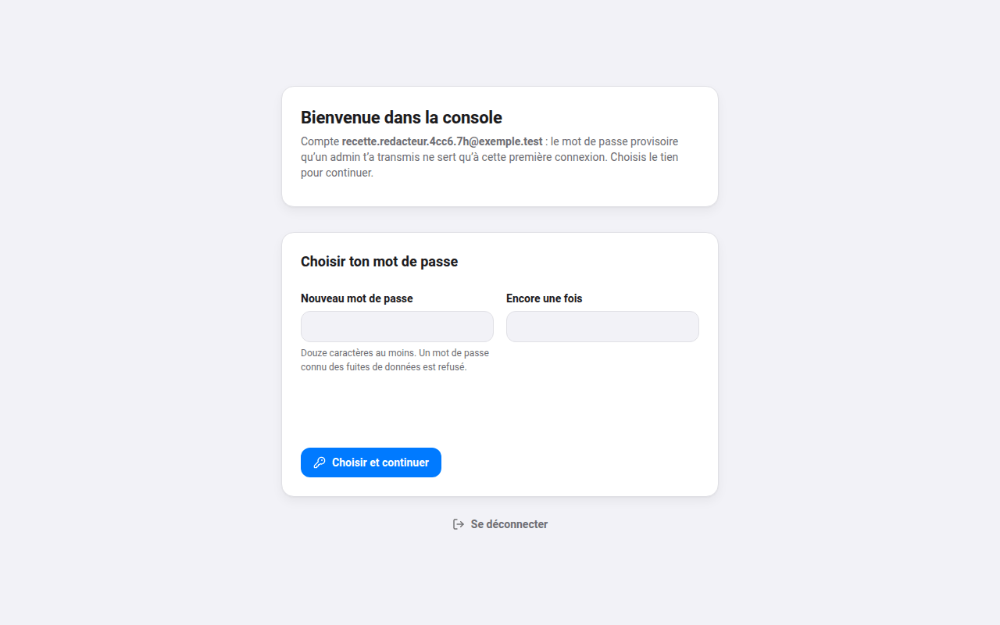
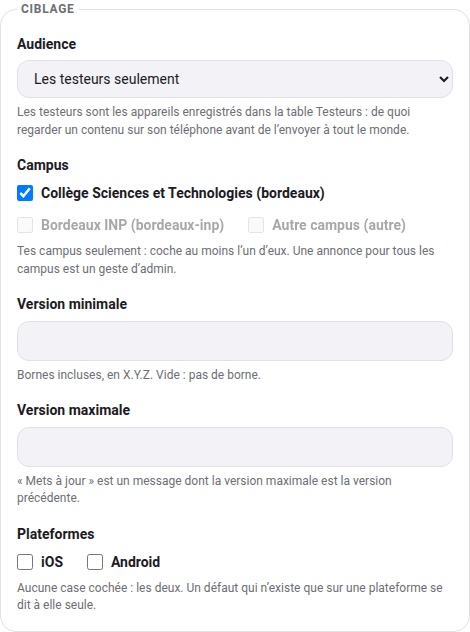
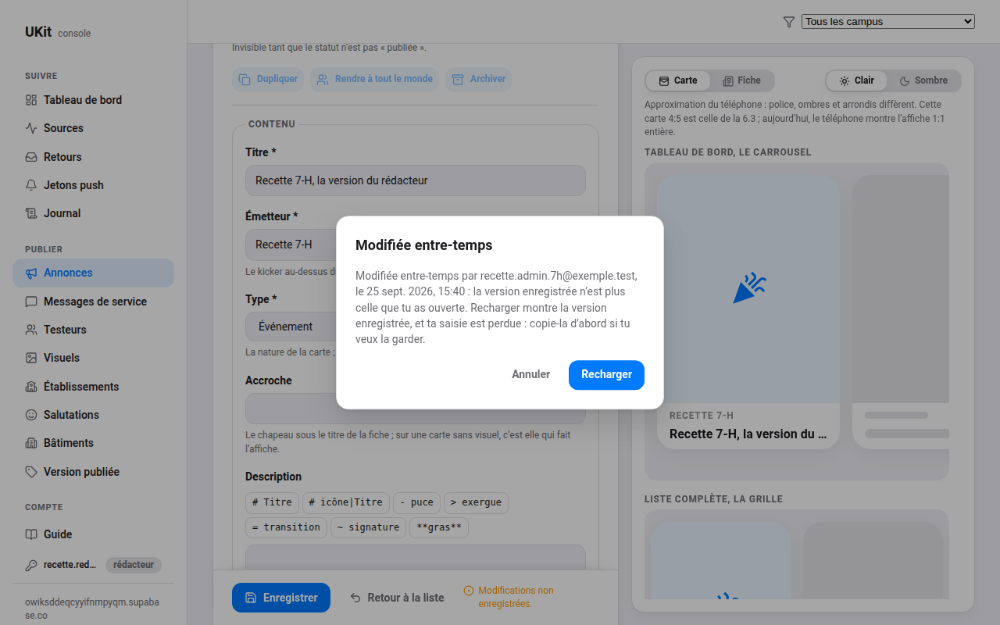

# Le guide de la console

La console, c'est l'endroit où l'on publie dans UKit sans passer par une mise à jour de
l'application : les annonces de la vie étudiante, les messages de service, et tout ce que les
téléphones relisent chaque fois qu'on ouvre l'application. Ce guide est écrit pour celles et ceux qui
publient sans être développeurs. La référence technique, elle, est [pilotage.md](pilotage.md).

Adresse : **https://kae-lab.github.io/UKit/**, sur un ordinateur. La console se lit sur un téléphone,
mais une annonce se compose sur un écran d'ordinateur.

## Se connecter

- **Un compte se crée sur invitation.** Un admin de la console t'invite et te donne un **mot de passe
  provisoire**, de vive voix ou par un message privé. Il ne sert qu'une fois.
- **À la première connexion**, la console ne montre qu'une chose : le choix de ton mot de passe. Douze
  caractères au moins ; un mot de passe connu des fuites de données est refusé, choisis-en un qui
  n'appartient qu'à toi.
- **Mot de passe oublié ?** Il n'y a pas de lien « mot de passe oublié » : demande à un admin, il t'en
  donne un nouveau provisoire.
- **Ton rôle** se lit dans la page **Compte**, en une phrase, et à côté de ton adresse, en bas de la
  navigation.

## Qui peut quoi

| Rôle | Ce qu'il fait |
|---|---|
| **Admin** | tout : les annonces, les messages de service et leurs notifications, le catalogue des universités, les bâtiments, les visuels, les testeurs, les retours et l'adresse que les gens y laissent, et l'équipe |
| **Rédacteur** | crée, modifie, programme et archive les **annonces** des campus qui lui sont confiés, et lit tout le reste. Il ne supprime rien, et une annonce « pour tous les campus » reste un geste d'admin |
| **Lecteur** | lit toute la console, sans y écrire. Les adresses laissées dans les retours ne lui sont pas montrées |

Ce n'est pas la console qui décide, c'est la base de données : un bouton grisé n'est qu'un
avertissement, la règle s'applique de toute façon. En tête de chaque page, un bandeau dit ce que ton
rôle y permet.

## Publier une annonce

Tout se passe dans **Annonces**, puis **Nouvelle annonce**. À droite, l'aperçu montre ce que la carte
et la fiche donneront sur un téléphone, en clair et en sombre, et suit le champ que tu remplis.

1. **Contenu.** Le titre ; l'émetteur, le petit mot au-dessus du titre (« BDE Sciences ») ; le type
   (événement, information, bon plan, partenaire) ; l'accroche, qui sert de chapeau ; la description.
   La barre au-dessus de la description insère la mise en forme (titres de section, puces, exergue,
   signature) : pas besoin d'en retenir la syntaxe, l'aperçu la rend.
2. **Visuel.** Une affiche : elle est réduite et compressée toute seule avant l'envoi. Clique sur
   l'image pour poser le **point focal**, ce qui doit rester visible quand la carte la recadre ; le
   voile gris montre ce qui sera coupé.
3. **Cartes et ordre.** Les réglages par défaut conviennent presque toujours. Les **créneaux** mettent
   une annonce en avant à certaines heures (un bon plan du midi, de 11 h à 14 h, en heure de Paris).
4. **Lieu et action.** Pour le lieu, colle un point copié d'une carte (clic droit sur Google Maps) :
   la fiche proposera « S'y rendre ». Un bouton demande un libellé **et** un lien complet, qui commence
   par `https://`.
5. **Publication.** Garde le statut **Brouillon** tant que tu travailles : personne ne le voit. Passe à
   **Publiée** quand c'est prêt. Une date de publication **dans le futur** programme l'annonce : elle
   apparaîtra toute seule à l'heure dite, et l'en-tête le dit (« Programmée, publiée le 3 octobre à
   11 h »). Une date d'expiration la retire toute seule.
6. **Ciblage.** Commence **toujours** par l'audience **Les testeurs seulement** (voir plus bas). Les
   campus : tes campus sont déjà cochés, et un rédacteur ne peut cocher que les siens. Laisse les
   versions et les plateformes vides, sauf consigne.
7. **Enregistrer**, en bas, ou **Ctrl+S** (**Cmd+S** sur Mac).

**Dupliquer** refait une annonce à partir d'une autre (la même affiche d'une semaine à l'autre) :
la copie naît en brouillon, et, pour un rédacteur, sur ses campus. **Archiver** retire une annonce des
téléphones en gardant sa trace et ses chiffres ; une annonce archivée se republie en changeant son
statut.

## La vérifier sur son téléphone

L'aperçu approche le téléphone, il ne le remplace pas. La preuve, c'est ton téléphone :

1. **Fais enregistrer ton téléphone comme testeur**, une fois pour toutes : dans UKit, **Réglages →
   À propos**, touche sept fois le numéro de version, onglet **Testeur**, **Copier**. Envoie cet
   identifiant à un admin, qui l'ajoute dans la page Testeurs.
2. Publie l'annonce en audience **Les testeurs seulement**, ou utilise **Voir sur mon téléphone**
   dans l'en-tête d'une annonce déjà publiée.
3. Ouvre UKit, onglet **Campus** : l'annonce est là, pour les seuls téléphones de testeurs. Si
   UKit était déjà ouverte, passe un instant sur une autre application puis reviens : les annonces se
   relisent au retour.
4. Quand tout est juste : **Rendre à tout le monde**.

## Travailler à plusieurs

Deux personnes peuvent ouvrir la même annonce. Si quelqu'un l'enregistre pendant que tu l'édites, rien
n'est écrasé : au moment où tu enregistres, un message dit **« Modifiée entre-temps »**, par qui et
quand. **Recharger** montre la version enregistrée ; ta saisie est alors perdue, donc copie d'abord ce
que tu veux garder, puis reporte-le.

Chaque écriture est enregistrée au nom de son compte, dans le **Journal** : qui a écrit quoi, et quand.

## Lire ses chiffres

Le **Tableau de bord** donne, à l'arrivée :

- **le parc actif** : les téléphones qui reçoivent les notifications, par campus, par version et par
  plateforme. C'est un minimum : un téléphone qui a coupé les notifications n'y est pas ;
- **les annonces** visibles et programmées ;
- **les retours** ouverts, ce que les utilisateurs ont écrit dans le formulaire.

Une case qui compterait moins de cinq téléphones n'est jamais affichée : à cette taille, un chiffre
peut désigner quelqu'un. Les chiffres de chaque annonce (combien l'ont vue, combien l'ont ouverte) et
le rapport pour un partenaire arrivent avec la page Statistiques.

## Ce qui ne se fait jamais

- **Supprimer au lieu d'archiver.** Une annonce archivée garde sa trace et ses chiffres ; une annonce
  supprimée les perd. Seul un admin supprime.
- **Partager une capture d'écran qui montre une donnée personnelle** : l'adresse laissée dans un
  retour, un nom, un numéro. Les retours restent dans la console.
- **Publier un essai pour tout le monde.** Un essai se fait en audience **Les testeurs seulement**,
  toujours ; « tout le monde », c'est plus de deux mille téléphones.
- **Publier un visuel dont on n'a pas les droits** : le logo d'une université ou d'une marque, une
  photo trouvée en ligne. Un logo affiché sur une annonce laisse croire que son propriétaire la
  soutient.
- **Prêter son compte.** Chaque compte est personnel, et tout ce qu'il écrit est enregistré à son nom.
  Pour quelqu'un de plus, un admin l'invite.

## Pour les admins

- **Inviter** : **Équipe → Inviter quelqu'un**, l'adresse, le rôle et, pour un rédacteur, ses campus
  (aucune case : tous). À l'enregistrement, le mot de passe provisoire s'affiche **une seule fois** :
  transmets-le de vive voix, ou par un message privé.
- **Changer un rôle ou des campus** : ouvre la ligne, change, enregistre. Le changement vaut dès la
  requête suivante.
- **Mot de passe oublié** : **Nouveau mot de passe provisoire**, sur la ligne de la personne. L'ancien
  cesse aussitôt de fonctionner.
- **Révoquer** : les droits sont coupés à la requête suivante, puis le compte est supprimé ; le journal
  garde l'adresse et tout ce que ce compte a écrit. On ne se révoque pas soi-même, et la console garde
  toujours au moins un admin.
- **Les messages de service** s'adressent à tout le parc : une information, un avertissement, un
  incident. **Notifier** envoie une notification aux téléphones visés, **une seule fois** : relis avant.
- **Les retours** se reclassent (nature, état, note). L'adresse laissée s'affiche au clic,
  **Afficher l'adresse**, et ne se recopie nulle part ailleurs.
- **Les testeurs** : ajoute les téléphones de l'équipe (un identifiant, un nom).

Pour réparer un compte admin, il reste une commande sur le poste du développeur :
[`supabase/README.md`](../supabase/README.md#la-console-et-son-équipe).
