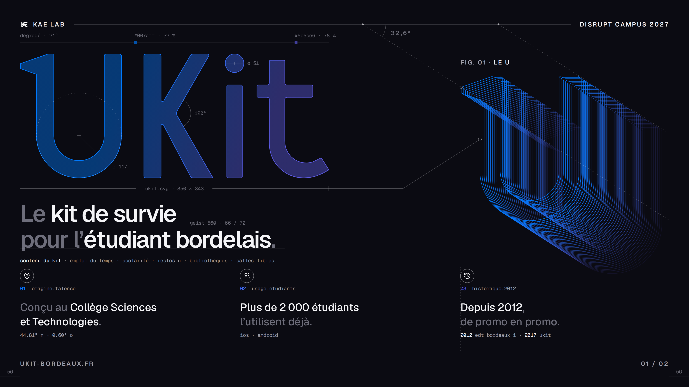
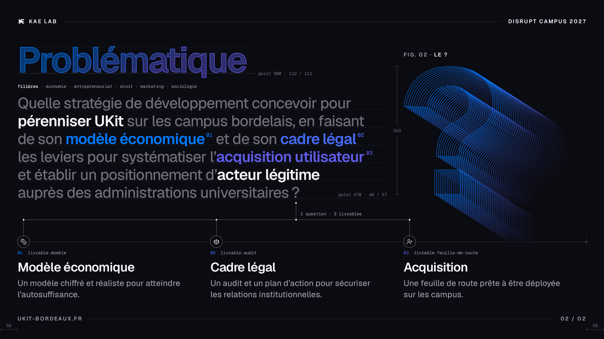

# L'Épure, l'identité visuelle de UKit

> **Née le 2026-09-23**, pour les deux slides qui ont présenté UKit aux étudiants du programme Disrupt
> Campus. Validée sur ce support, elle est **le point de départ** de l'identité de l'application, du site
> et de la console ; son entrée dans chacun se décide aux jalons
> [7-I](phase-7/7-i-releve-et-vocabulaire.md) et [7-M](phase-7/7-m-le-site.md), avec les questions encore
> ouvertes ([plus bas](#ce-qui-reste-à-trancher)). Les deux slides témoins et le logo vectoriel sont dans
> [identite/](identite/) ; le kit qui les produit au pixel près, dans [tools/epure/](../tools/epure/README.md).

## L'idée

En architecture, l'**épure** est le dessin qui garde ses traits de construction ; le mot dit aussi
*épuré*. L'Épure laisse visibles les traces de conception d'une composition — ses cotes, ses angles, ses
lignes de base, le nom de ses fichiers, ses fiches typographiques —, comme un plan dont on n'aurait pas
effacé les constructions.

Elle dit quelque chose de vrai sur UKit : un projet ouvert, construit en public, par des étudiants, depuis
2012 ([histoire.md](histoire.md)). Trois principes la tiennent :

1. **Tout vient du logo.** Ses deux couleurs, sa géométrie, ses vraies mesures : rien n'est plaqué.
2. **Une trace dit une vérité.** Une cote, un angle, une date sont mesurés, jamais inventés.
3. **Le décor ne pèse jamais comme l'information.** Les traces restent en retrait ; le contenu se lit
   d'abord.

## La composition

Les règles de mise en page viennent de deux séries d'affiches de référence — des affiches de typographie
et d'objets, puis une série « technique » faite de fenêtres d'analyse, d'annotations, de trames et de
verre —, dont l'Épure garde les procédés en les rendant sobres :

- **un seul élément énorme par surface** — le logo sur la slide 1, le titre sur la slide 2 —, et tout le
  reste cinq à dix fois plus petit ;
- **deux ou trois tailles de texte** par surface, pas davantage ;
- **une grille qui se voit** : les petits textes partent des bords des grandes formes, et la grille elle-même
  se laisse deviner en pointillé ;
- **deux couleurs et un accent**, celles du logo ;
- **des détails de cadre** : capitales espacées, filets, numéros, noms de fichiers ;
- **l'asymétrie tenue** : le texte à gauche sur deux tiers, la figure à droite ;
- **le poids se répartit pareil entre les surfaces d'un même jeu** : si l'une pèse en haut, l'autre aussi.
  Mesuré sur les slides par la luminosité moyenne de chaque bande de hauteur.

## Le logo

Le logo est un lettrage dessiné, pas une police. Il n'existait qu'en PNG (850 × 343) ; il est redessiné en
géométrie exacte à partir de ses mesures, à 99,5 % de recouvrement avec l'original :
[identite/logo-ukit.svg](identite/logo-ukit.svg), et sa variante d'une seule couleur
[identite/logo-ukit-plein.svg](identite/logo-ukit-plein.svg), régénérés par
[`tools/epure/reconstruire.py`](../tools/epure/reconstruire.py).

| Mesure | Valeur, en unités du dessin (343 de haut) |
|---|---|
| Fûts | environ 47,5 pour le U et le K, 42,6 pour le i et le t |
| Congés | 5,6 aux capitales, 3,3 aux minuscules, 6 au creux de la barre du t |
| Bol du U | deux cercles concentriques, de rayon 117,1 et 69,5 |
| Point du i | un cercle de diamètre 51 |
| K | 120° entre le bras et la jambe |
| Dégradé | un axe à 21° : `#007AFF` pur jusqu'à 32 % de sa longueur, `#5E5CE6` pur à partir de 78 % |

**Le logo en verre** est sa forme dans l'Épure : le dégradé rempli à **42 %**, et son arête nette de
**1,6 px**. En couleur pleine, il mangeait la page ; en verre, il reste plein et reste le héros, avec ses
couleurs intactes.

## La palette

Un fond sombre, une encre, deux gris, et les couleurs du logo. Contrastes mesurés sur le fond.

| Nom | Valeur | Rôle | Contraste |
|---|---|---|---|
| Papier | `#0B0B12` | le fond | — |
| Encre | `#F4F4F7` | l'essentiel : titres, mots clés, faits | 17,9:1 |
| Gris | `#A0A0AC` | le texte secondaire, les traces, le pied du cadre | 7,6:1 |
| Estompe | `#6E6E7B` | les mots de liaison des textes en deux tons | 3,9:1 |
| Filet | `rgba(244,244,247,.16)` | les filets du cadre et de l'horizon | — |
| Trait | `rgba(244,244,247,.42)` | les traces de conception | — |
| Bleu | `#007AFF` | la première couleur du logo, le levier 01 | 4,9:1 |
| Bleu-indigo | `#456BF2` | le milieu des deux, pris en OKLab pour un pas régulier à l'œil, le levier 02 | 4,3:1 |
| Indigo | `#5E5CE6` | la seconde couleur du logo, le levier 03 | 3,9:1 |

**Le sombre** est choisi pour deux raisons : le verre et l'écho n'existent que sur un fond sombre, et une
surface sombre se détache au milieu de supports blancs. Au vidéoprojecteur, blanc sur noir et noir sur
blanc se valent ; le point faible du sombre est son gris, que la lumière d'une salle efface plus vite. Un
gris plus clair pour les mots de liaison (`#858592`) a été essayé : il tenait mieux dans une salle très
éclairée, mais leur redonnait trop de poids sur un bon écran. **L'estompe reste `#6E6E7B`**, et une salle
claire se règle en baissant la lumière près de l'écran.

## La typographie

**[Geist](https://vercel.com/font)** pour le texte, **Geist Mono** pour les traces : une grotesque neutre
et précise, qui laisse toute la personnalité au logo. Toutes deux sous licence SIL Open Font License.

| Rôle | Police | Graisse | Corps / interligne | Approche |
|---|---|---|---|---|
| Titre en verre | Geist, contours fusionnés | 600 | 112 / 112 | −0,04 em |
| Slogan | Geist | 560 | 66 / 72 | −0,038 em |
| Question, problématique | Geist | 470 ; mots clés 600 | 48 / 57 | −0,03 em |
| Titre de colonne | Geist | 600 | 40 / 42 | −0,03 em |
| Fait (texte d'une colonne) | Geist | 480 | 30 / 40 | −0,006 em |
| Détail d'une colonne | Geist | 450 | 26 / 36 | — |
| Cadre, légende de figure | Geist, capitales | 600 | 17 | +0,16 em |
| Traces, étiquettes, données | Geist Mono | 400 ; valeurs 500 | 14 | +0,01 em, chiffres tabulaires |
| Renvoi numéroté | Geist Mono | 500 | 17 | — |

- **Les deux tons.** L'essentiel en encre, les mots de liaison en estompe : l'œil saisit le sens en deux
  secondes, et la phrase se lit encore en entier. Dans une question, les leviers prennent les couleurs du
  logo, chacun suivi du numéro qui renvoie à sa colonne.
- **Les retours à la ligne se posent à la main** : aucune expression clé n'est coupée.
- **L'espace fine insécable se dessine** : Geist n'a pas le caractère U+202F (« 2 000 », « universitaires ? »).
- **Un titre bordé d'une arête se compose avec des contours fusionnés.** La police variable dessine
  certaines lettres en contours superposés, comme la barre du t posée sur son fût : invisible au
  remplissage, une arête les trace tous.

## La grille

Une surface de **1 920 × 1 080**, rendue au double pour l'export.

| Élément | Valeur |
|---|---|
| Marges | 56 sur les quatre côtés |
| Colonnes | 12, gouttière de 32 ; trois blocs de quatre colonnes, en x 56, 669 et 1 283, larges de 581 |
| Ligne de tête | y 68, le filet du cadre du haut |
| Horizon | y 770, le filet qui sépare la zone haute de la rangée |
| Rangée | étiquette en y 798, texte en y 838, donnée en y 928 |
| Pied | le filet du cadre du bas, à 56 du bord |
| Figure | 560 de haut, le pied sur l'horizon, le bord gauche sur le troisième bloc |

## Les composants

### Le cadre

En tête, le monogramme de KAE Lab et « KAE LAB », un filet, puis le nom de l'événement ou du support. En
pied, en gris, « UKIT-BORDEAUX.FR », un filet, puis la pagination (« 01 / 02 »). Le cadre et l'horizon
sont **au même endroit sur toutes les surfaces d'un jeu** : c'est ce qui les lie.

### L'horizon et ses stations

L'horizon court d'une marge à l'autre. Chaque colonne y a sa **station** : une icône
[Lucide](https://lucide.dev) au trait de 1,6, de 20 px, dans un cercle de rayon 19 posé sur le filet. La
première station marque le bout gauche de l'horizon, une croix le bout droit. Sous la station,
l'**étiquette** de la colonne : son numéro dans sa couleur, puis son nom en chasse fixe
(`01 origine.talence`, `02 livrable.audit`) ; au bas de la colonne, sa **donnée** en chasse fixe
(`44.81° n · 0.60° o`).

### Les figures et l'écho

Une figure est **un objet à part**, jamais un effet posé sur le logo ou sur un texte : **Fig. 01**, le U du
logo ; **Fig. 02**, le point d'interrogation. Chacune porte sa légende en capitales (« FIG. 01 · LE U »).

L'**écho** les construit : le contour répété **40 fois**, chaque copie décalée de **(5 ; 3,2)**, soit un
angle de 32,6° ; un trait de 1,2 px ; une opacité qui descend de 1 à 0,1 vers le fond ; une teinte qui
glisse de `#007AFF` à `#5E5CE6` d'une copie à l'autre ; les copies dessinées du fond vers l'avant. Le
« ? » vient de Geist 600, aux contours fusionnés, mis à la hauteur du U : 343 unités.

### Les traces de conception

| Trace | Sens |
|---|---|
| Pointillé (3 / 5) | la géométrie : une ligne de construction, une capitale, une colonne |
| Trait plein | une relation, une cote, une ligne de pied |
| Cercle creux | un nœud, là où une trace touche une forme |
| Point plein | une jonction, là où une trace rencontre un filet |
| Croix | un repère : un centre, un bout de ligne |
| Carré | une ancre de courbe, un arrêt de dégradé |

Les traces sont de quatre familles :

- **la construction d'une figure** : les arêtes de l'écho prolongées jusqu'au filet de tête, et l'angle
  qu'elles y font (« 32,6° ») ;
- **le plan du logo** : la réglette du dégradé et ses deux arrêts, le grand cercle du U (« r 117 »), le
  point du i (« ø 51 »), l'angle du K (« 120° ») ;
- **les cotes** : « ukit.svg · 850 × 343 » sous le logo, prolongée jusqu'à la face avant du U, que le logo
  engendre ; la hauteur du « ? » (« 343 ») ;
- **le plan de page** : les colonnes de la grille en pointillé, les marges cotées (« 56 »), les lignes de
  pied et de capitales des grands textes avec leur fiche typographique (« geist 560 · 66 / 72 »).

### Les renvois et la décomposition

Dans une question, chaque levier porte un **renvoi** (« 01 », « 02 », « 03 ») dans sa couleur, qui mène à
sa colonne. Sous la question, un **tronc** part de son point d'interrogation et se divise vers les trois
stations : la question se résout en trois livrables (« 1 question · 3 livrables »).

## Les règles de facture

1. **Tout vient du logo** : couleurs, formes, mesures.
2. **Une trace dit une vérité.** Quand une vraie mesure gêne, on cote autre chose, qui a du sens : le
   point du « ? » mesurait 69, la cote porte sa hauteur, 343, celle du U et du logo.
3. **Aucune double lecture**, même vraie, même par hasard.
4. **Le décor en retrait.** Les traces purement décoratives — cotes, angles, fiches, plan de page — sont
   rendues à **65 %** ; ce qui informe — étiquettes, données, contenu du kit, filières, tronc, légendes —
   reste à pleine intensité. À 45 %, la direction disparaît au vidéoprojecteur.
5. **Une ligne ne coupe jamais une lettre.** Les lettres rondes de Geist descendent de 12 millièmes du
   corps sous la ligne de base : une ligne de pied passe sous ce dépassement, sous la demi-arête s'il y en
   a une, avec 2 px de jour.
6. **Une arête sur du texte exige des contours fusionnés.**
7. **Les effets vivent sur des objets à part.** L'écho posé sur le logo et sur des chiffres a été essayé :
   « ça bave ». Le même écho, en figure à part, est devenu la signature.
8. **Un seul élément énorme par surface, et un poids réparti pareil entre les surfaces d'un jeu.**
9. **Un réglage pour un cas limite ne dégrade pas le cas nominal** : le gris des mots de liaison.
10. **Dire ce qu'on attend, pas ce qu'on n'exige pas** : les filières concernées, plutôt que « aucune
    compétence technique requise ».
11. **Juger au zoom ×3** les contacts entre les textes et les traits, et **au vidéoprojecteur délavé**
    l'ensemble.

## Les intensités

L'Épure ne s'applique pas pareil partout : elle se dose selon le support.

| Support | Intensité | Ce qui y entre |
|---|---|---|
| Présentation, affiche, visuel de communication | pleine | tout : cadre, figures, traces, deux tons, logo en verre |
| Site ([7-M](phase-7/7-m-le-site.md)) | forte | le logo en verre et une figure en ouverture, les deux tons, le cadre ; des traces plus rares |
| Carte d'annonce, format 4:5 du carrousel | réduite | une figure, un titre en deux tons ; des traces rares et plus épaisses, les traits fins disparaissant à cette taille |
| Application ([7-I](phase-7/7-i-releve-et-vocabulaire.md)) | signature | des moments : l'accueil, les états vides, les cartes d'erreur illustrées, les fonds par écran, le tirer-pour-rafraîchir, où l'écho est déjà un mouvement ; aucune trace sur les écrans de travail, qui restent natifs |
| Console | minimale | la palette et le logo ; la console reste un outil |

## Ce qui reste à trancher

1. **La police de l'application.** [theme.md](theme.md#les-décisions-durables) tient une règle : une seule
   police, celle du système. Le penchant : la garder dans l'application — rendu natif, taille de texte
   réglable, listes denses — et réserver Geist au site et à la communication. Tranché en 7-I.
2. **Les formes rondes.** L'application n'en a pas, tout y est carré arrondi ; l'Épure a des stations et des
   nœuds ronds. Pour un seul système, la marque adopterait plutôt le carré arrondi de l'application. À
   essayer en planches à l'ouverture de 7-M.
3. **Le thème clair.** L'Épure n'existe qu'en sombre ; l'application tient les deux thèmes à égalité, et le
   site devrait suivre. Une version claire se dessine et se valide avant que l'Épure s'étende au-delà des
   supports sombres.
4. **Les petits formats** — cartes d'annonce, icônes, réseaux sociaux — : l'épaisseur et la densité des
   traces à ces tailles.

## Comment elle est née

Par **planches comparatives** : à chaque tour, plusieurs options côte à côte, une seule chose change d'une
option à l'autre, et le choix se fait sur pièce. Trois premiers jets, puis douze tours de planches, entre
le 22 et le 23 septembre 2026.

- **Le point de départ** : une identité à tirer du seul logo, minimaliste mais très dessinée, sans rien
  reprendre du site ni des visuels d'annonce. Un premier jet posait le logo sur toute la largeur : il
  prenait la slide entière, et la structure en bandeaux faisait scolaire.
- **Le U en écho** est né au deuxième jet, comme un objet à part. Appliqué ensuite au logo lui-même et aux
  chiffres, il « bavait » : d'où la règle 7.
- **La série de références « technique »** a apporté l'analyse, les annotations, l'écho et le verre. Le U
  est devenu un spécimen, en deux tons ; la page s'est habillée de traces, puis d'un réseau.
- **Le mot juste est arrivé au quatrième tour** : ce n'était pas un réseau qu'on cherchait, mais **les
  traces de conception laissées visibles**, comme sur un plan d'architecte. Le nœud central « ukit » du
  réseau, qui répétait le nom, a été retiré.
- **Ensuite** : le logo en verre ; les traces du logo dosées, le plan de page gardé entier ; les icônes
  posées sur l'horizon ; la vraie année de naissance, 2012 ; la slide 2 dans le même langage, avec sa
  Fig. 02 et le tronc de la décomposition.
- **Après la première livraison** : le titre en verre, qui donne à la slide 2 le poids de la slide 1 ; le
  décor à 65 % ; les contours fusionnés ; la cote « 343 » ; le gris gardé ; les lignes de pied sous les
  lettres.

## Le kit

[tools/epure/](../tools/epure/README.md) produit tout ce qui précède : la charte, les traces, les figures,
le logo, et les deux slides témoins au pixel près. Une nouvelle composition s'y écrit sur le modèle des
deux premières.
