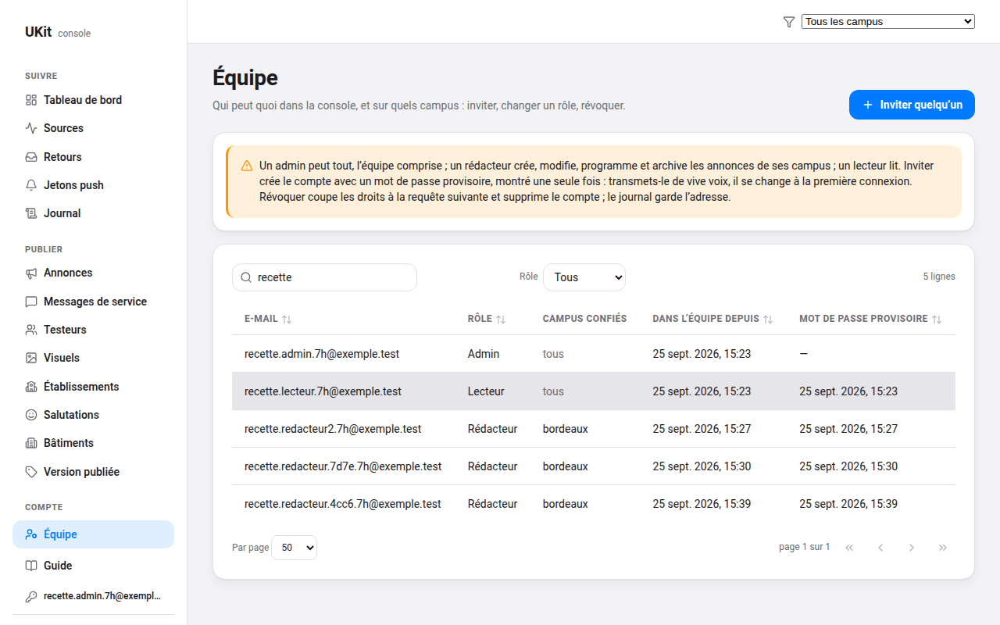
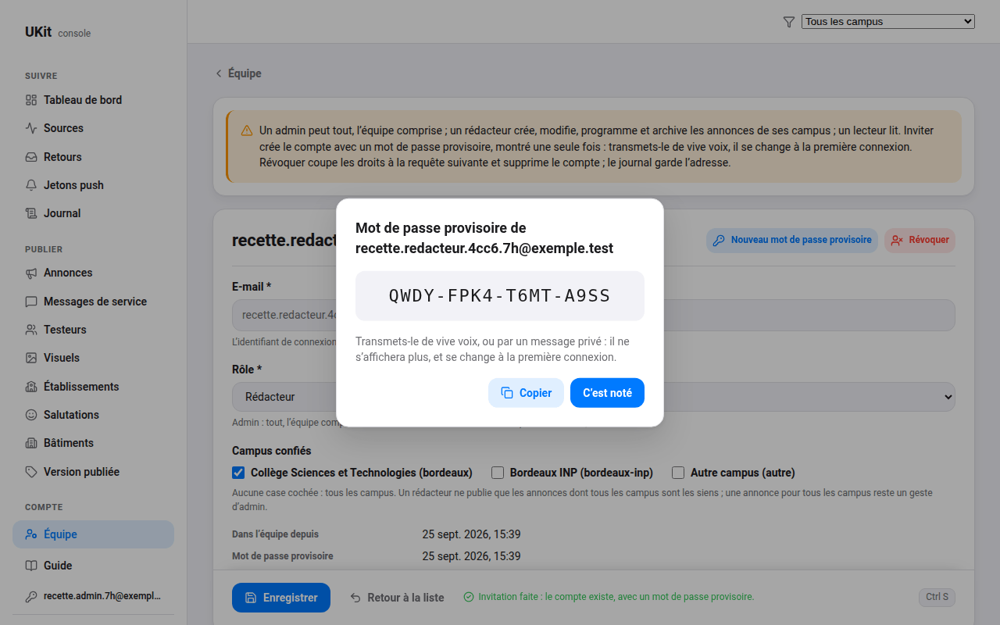

# 7-H — Les rôles et l'équipe

> **Jalon livré le 2026-09-25** — les rôles dans la base, les trois fermetures que la lecture du code et
> de la production a trouvées, le verrou, la fonction `editeurs` et la page Équipe, la console qui
> reflète chaque rôle, le guide de l'équipe ; ouvert le même jour sur la branche `feat/console-roles`,
> depuis `main`. Sans release : les deux migrations sont en production, les deux fonctions déployées,
> l'authentification durcie, et la console se déploie depuis `main`. Le [plan de test](#plan-de-test)
> s'est joué en trois temps — en SQL dans une transaction annulée sur la production, par l'API avec la
> clé publiable, dans la console par un navigateur piloté —, avec des comptes jetables supprimés après.
> Ce que la réalité a corrigé du texte ci-dessous est dans
> [Ce que la réalité a corrigé](#ce-que-la-réalité-a-corrigé-le-2026-09-25).
>
> **Spécification, ouverte le 2026-09-14.** Aucune publication. Le dernier des quatre
> jalons de la console, sur le socle de [7-E](7-e-console-socle.md) : ouvrir la console à une équipe sans
> lui donner les clés de la production. Il se livre avant l'arrivée de l'équipe, en janvier 2027 ; la
> donnée — `editeurs.role` et `editeurs.etablissements` — est posée dès
> [7-C](7-c-economie-et-socle.md#6-les-colonnes-additives).

## La direction

Aujourd'hui, un compte est éditeur ou ne l'est pas, et un éditeur peut tout : publier un incident à tout
le parc, retirer un établissement, notifier. C'est juste pour une personne. Pour une équipe — quelqu'un
qui publie les annonces d'un BDE, un relais par campus, quelqu'un qui prépare un dossier de subvention et
ne doit rien casser —, il faut dire **qui peut quoi, et où**, dans la base elle-même, là où la console ne
peut pas se tromper.

## Les rôles

| Rôle | Peut | Ne peut pas |
|---|---|---|
| **admin** | tout ce que la console permet aujourd'hui : messages de service et notification, établissements, bâtiments, visuels, testeurs, version publiée, retours avec leur contact, et les éditeurs eux-mêmes | — |
| **redacteur** | créer, modifier, programmer et archiver les **annonces** des campus qui lui sont confiés ; téléverser leurs visuels ; lire les statistiques, et les retours sans leur contact | publier un message de service, notifier, toucher au catalogue, aux bâtiments, aux visuels des sources, aux testeurs, aux éditeurs |
| **lecteur** | lire les statistiques, les annonces, les sources et le rapport partenaire | écrire quoi que ce soit |

**Un rédacteur borné à des campus** (`editeurs.etablissements` non nul) ne publie que des annonces dont
**tous** les établissements ciblés sont les siens ; une annonce ciblée « tous les campus »
(`etablissements` nul) reste le fait d'un admin ou d'un rédacteur sans borne.

## Ce que la réalité a corrigé, le 2026-09-25

Les endroits où la lecture du code, les mesures en production et l'exécution ont amendé le texte des
sections suivantes — annoncés, jamais cachés.

**Trois fermetures que la spécification ne voyait pas.** Elle protégeait la colonne `contact` ; elle
laissait ouverts trois chemins qu'une équipe qui lit la console aurait pu suivre par l'API.

- **L'adresse d'un retour avait trois copies.** L'importeur la rangeait aussi, en clair, dans
  `reponses`, sous la question qui la demande — les colonnes de contact échappaient au masquage des
  textes libres —, et la fiche d'un retour l'affichait question par question ; le journal, lui, copie
  la ligne entière. Mesuré le 2026-09-25 : seize retours portaient une adresse, et les seize étaient
  aussi dans `reponses` et dans seize lignes du journal. Révoquer la seule colonne n'aurait rien
  protégé. Trois gestes, donc : la colonne retirée à tous et rendue à l'admin par
  `contact_du_retour()` ; `reponses` qui ne porte plus la question de contact — l'importeur corrigé
  ([`projection.mjs`](../../tools/retours/projection.mjs)), trente-sept lignes nettoyées par la
  migration, la question étant présente, vide, dans vingt et une autres — ; les lignes du journal qui
  copient un retour, lisibles par l'admin seul. L'empreinte d'un retour se calcule avant, sur la
  réponse telle qu'écrite : rien ne s'est recréé.
- **Les jetons push étaient une clé de la production.** La fonction `notifier` envoie sans jeton
  d'accès Expo : le service accepte une notification vers tout jeton connu, et qui lit les jetons peut
  « se faire passer pour notre serveur », selon la documentation d'Expo. Toute session éditeur lisait
  les deux mille jetons du parc. Aucun compte de la console ne les lit plus, admin compris : personne
  n'en avait besoin, le parc se compte sur les cinq autres colonnes, et la fonction lit les jetons avec
  la clé de service.
- **Un tableau vide de campus vaut « tous » pour l'application** ([`ciblage.ts`](../../src/shared/ciblage/ciblage.ts)),
  et `'{}' <@ borne` est vrai en SQL : la règle d'inclusion écrite plus bas laissait un rédacteur borné
  publier à tout le parc. `peut_publier` exige une cible non vide, et un `check` sur les annonces et
  les messages ne laisse plus à « tous » qu'une écriture, `null` — aucune ligne ne portait `'{}'`.

**Un privilège de colonne ne se retire pas d'un privilège de table.** `authenticated` tient la lecture
de toute la table : `revoke select (contact)` n'aurait rien fait. La lecture de la table est retirée,
puis accordée colonne par colonne — le geste déjà fait pour `testeurs` et `anon`. Conséquence :
`select *` sur `retours` et `jetons_push` est refusé en entier, à tout compte ; les descripteurs de ces
deux tables nomment leurs colonnes (`colonnes`), et une colonne ajoutée à `retours` devra être accordée
pour se lire. Mesuré à la recette : un `PATCH` qui demande la ligne en retour avec `select *` est refusé
avant même la politique, parce qu'il relit `contact`.

**`editeurs` n'était pas journalisé** — le script du poste affichait « écriture journalisée », à tort.
La table entre au journal ; ses lignes, comme celles des retours, ne se lisent que par un admin. Elle
gagne `provisoire_le`, la date du dernier mot de passe provisoire donné, écrite avec la session de
l'admin : sans elle, ce geste ne toucherait que l'authentification, et ne laisserait aucune trace à nous.

**La base garde toujours un admin.** Un déclencheur d'instruction refuse l'écriture qui retirerait le
dernier — la clé de service comprise —, parce que sans admin plus personne n'invite ni ne répare, sinon
depuis le poste. Et une borne n'existe que pour un rédacteur, jamais vide (`check`).

**Le verrou avait trois pièges.**

- Il porte sur la version que le **formulaire a chargée**, pas sur la dernière relue : TanStack Query
  relit une ligne en arrière-plan, et un verrou posé sur la relecture laisserait écraser ce qu'il existe
  pour protéger. Le formulaire tient sa **référence** — la ligne chargée, puis celle qu'une écriture ou
  un geste lui rend.
- **« Notifier » change la ligne** : la fonction pose `notifie_le`, ou le réserve puis le rend quand
  rien n'est parti. Le geste rend la ligne relue, sans quoi l'éditeur qui vient de notifier lirait
  « modifiée entre-temps », devancé par la notification elle-même.
- **Une modification filtrée par une politique ne lève rien** : zéro ligne, comme une modification
  devancée. La console relit la ligne ([`verrou.ts`](../../console/src/lib/verrou.ts), pur) pour dire
  laquelle des trois choses est arrivée — devancée, supprimée, refusée —, et le conflit dit par qui et
  quand, d'après le journal.

La version se tient par `clock_timestamp()` et non `now()` : `now()` est l'heure du début de la
transaction, et deux modifications dans une même transaction garderaient la même version — c'est l'essai
en transaction annulée qui l'a montré.

**L'invitation.** La fonction `editeurs` écrit d'abord la ligne, avec la session de l'admin — les
politiques et les contraintes jugent avant que rien ne touche l'authentification, et le journal porte
son nom —, puis crée le compte ; s'il ne se crée pas, la ligne se retire. Le mot de passe provisoire a
seize signes sans ambiguïté, groupés par quatre pour se dicter (quatre-vingts bits), rendu une seule
fois, jamais journalisé. Le drapeau qui exige de le changer vit dans les métadonnées que le compte
écrit lui-même : qui l'effacerait sans changer de mot de passe ne ferait tort qu'à son compte, et le
porter dans les métadonnées d'administration aurait demandé une fonction de plus pour une garantie qui
ne protège d'aucun risque réel. **Révoquer supprime aussi le compte**, décidé à l'ouverture : pas de
compte dormant avec un mot de passe ; le journal garde l'adresse. Un admin ne se révoque pas et ne se
redonne pas de mot de passe provisoire depuis la page : un autre admin, ou la page Compte.
`notifier` et `editeurs` partagent `_shared/` : qui appelle, vérifié auprès du service
d'authentification, et avec quel rôle ; `notifier` est réservée aux admins.

**Pas de serveur d'envoi**, constaté dans la configuration du projet : l'envoi par défaut de Supabase
plafonne à deux courriels par heure, pour des essais. Le mot de passe provisoire est donc le seul
chemin livré, comme la spécification le prévoyait en repli ; l'invitation par lien se branchera quand
l'association aura une adresse d'envoi. **L'authentification est durcie** dans le même geste, sur
décision du propriétaire du produit : douze caractères imposés par la base — elle en acceptait six, la
console seule en demandait douze — et les mots de passe connus des fuites refusés (plan Pro).

**Deux branches, une base.** La production portait la migration `mesures` de `v6.3`, que `main` n'a
pas : `db push` depuis `main` refusait. La poussée s'est faite depuis un dossier temporaire portant
l'union des migrations ([`supabase/README.md`](../../supabase/README.md#migrations)). La fusion de `main`
dans `v6.3`, à l'ouverture de [7-I](7-i-releve-et-vocabulaire.md), aura donc des conflits dans les
trois fichiers de la vue lisible : garder les deux côtés.

**La documentation pour l'équipe est un document à elle**, [guide-console.md](../guide-console.md),
et non une réécriture de [pilotage.md](../pilotage.md) : celui-ci est la référence technique, cité
quatre-vingt-seize fois dans le dépôt, avec son SQL, ses fonctions Deno et sa carte des fichiers — ce
que l'équipe n'a pas à lire. Il gagne les rôles ; le guide dit comment on publie. La console mène au
guide depuis sa navigation et la page Compte.

**Aucune release, aucun essai sur téléphone** : l'application nomme les colonnes qu'elle lit
([`BdeService`](../../src/features/Campus/services/BdeService.ts), [`messages/index.ts`](../../src/shared/messages/index.ts)),
et rien de ce jalon ne la touche — `maj_le` et les `check` du ciblage lui sont invisibles, vérifié.

**Ce que la console a gagné en chemin**, annoncé : le bouton de création d'une page porte le libellé
de son descripteur (« Nouvelle annonce », « Inviter quelqu'un ») plutôt que « Nouvelle ligne » ; un
champ ne s'étire plus à la hauteur de sa voisine dans une grille à deux colonnes — le second champ du
mot de passe, page Compte, était décalé depuis 7-E ; l'adresse du compte, en bas de la navigation, tient
sur une ligne, entière au survol ; le titre d'une ligne qui n'a qu'une adresse est son adresse.

### La préproduction, évaluée

La spécification demandait de l'évaluer à l'ouverture ([ce qui n'est pas dans la
phase](README.md#ce-qui-nest-pas-dans-la-phase)). **Verdict : pas maintenant.** Une branche de
préproduction permanente coûte environ 9,81 $ par mois sur la plus petite instance, hors du plafond de
dépenses, plus son entretien : ses données, ses secrets, une seconde console pointée sur elle. Ce
qu'elle protégerait est déjà couvert : une migration s'essaie sur la production elle-même, dans une
transaction annulée, cas du plan de test compris ; les recettes tournent avec des comptes jetables et
l'audience `testeurs` ; et, depuis ce jalon, les rôles bornent ce que l'équipe peut casser, le brouillon
et l'audience `testeurs` lui tenant lieu de bac à sable pour le contenu. Elle se rouvre le jour où une
deuxième personne écrit du SQL, ou pour une migration qu'une transaction annulée ne sait pas éprouver
(l'authentification, le stockage, une extension).

## Ce qui est à faire

### Les politiques

- `private.role_editeur()` rend le rôle du compte connecté, ou rien ; `private.est_editeur()` reste vrai
  pour les trois rôles, parce que la lecture leur est commune.
- `private.peut_publier(etablissements text[])` : vrai pour un admin ; pour un rédacteur, vrai si sa
  borne est nulle, ou si la liste ciblée est non nulle et incluse dans sa borne.
- Les politiques d'écriture se réécrivent table par table : `annonces` par `peut_publier` en `using`
  **et** en `with check` — l'ancienne ligne comme la nouvelle, sans quoi un rédacteur pourrait déplacer
  une annonce d'un campus qui n'est pas le sien vers le sien —, tout le reste réservé à l'admin ; le
  bucket `media` ouvert à l'admin et au rédacteur.
- **Le contact d'un retour devient réservé à l'admin.** Un privilège de colonne ne distingue pas deux
  rôles applicatifs qui partagent le rôle `authenticated` de la base : `select (contact)` lui est donc
  **révoqué**, et une fonction `contact_du_retour(id)`, `security definer`, ne rend l'adresse qu'à un
  admin. [PRIVACY.md](../../PRIVACY.md) promet que l'adresse « n'est transmise à personne » ; une équipe
  qui grandit rend la promesse plus exigeante, pas moins.
- Le journal garde `par` : chaque écriture reste attribuée à son compte.

### L'invitation, sans script

Aujourd'hui, un compte se crée depuis le poste du publieur, avec la clé de service
([`tools/console/editeur.mjs`](../../tools/console/editeur.mjs)). Une fonction de la base, `editeurs`,
appelée par un admin depuis une page « Équipe » :

- crée le compte et sa ligne dans `editeurs`, avec son rôle et sa borne ;
- **l'invitation par courriel demande un serveur d'envoi à nous** : l'envoi fourni par défaut par
  Supabase est limité et fait pour les essais. Tant qu'il n'est pas configuré — une adresse de
  l'association fera l'affaire —, la fonction crée le compte avec **un mot de passe temporaire**, que
  l'admin transmet de vive voix, et la console **exige de le changer** à la première connexion ;
- change un rôle ou une borne, ou **révoque** : la ligne d'`editeurs` supprimée, les écritures sont
  refusées à la requête suivante.

Le script reste, pour réparer un compte admin depuis le poste.

### Le verrou contre l'écrasement

« Le dernier enregistrement gagne » ([pilotage.md](../pilotage.md#limites-connues)) tient pour un
éditeur, pas pour deux qui ouvrent la même annonce. `annonces` et `service_messages` gagnent une colonne
`maj_le`, tenue par un déclencheur ; la console enregistre avec `update … where maj_le = <la valeur
lue>`, et une modification qui ne touche aucune ligne se dit : « modifiée entre-temps par quelqu'un
d'autre », avec le choix de recharger. *Décidé à la rédaction de cette spécification* : c'est le plus
petit mécanisme qui rend la console sûre à plusieurs.

### La documentation pour l'équipe

[pilotage.md](../pilotage.md) est réécrit pour ceux qui publient sans être développeurs : qui peut quoi ;
publier et programmer une annonce ; la vérifier sur son téléphone en audience `testeurs` ; lire ses
chiffres ; et ce qui ne se fait jamais — supprimer au lieu d'archiver, partager une capture de retour qui
montre une adresse.

## Décisions et pièges

- **Les rôles vivent dans la base, pas dans la console.** Masquer un bouton ne protège rien : la clé
  publiable est publique, et une requête faite à la main passe outre l'interface. Seule la politique
  décide ; la console ne fait que refléter.
- **Un rédacteur borné face à une annonce « tous campus »** : la règle d'inclusion refuse, et c'est
  voulu — publier à tout le parc est un geste d'admin.
- **Le serveur d'envoi de courriels** est un prérequis de l'invitation par lien ; le mot de passe
  temporaire n'est qu'un repli.
- **Une préproduction** — les branches de base du plan Pro — devient raisonnable quand d'autres que le
  propriétaire du produit publient ; elle s'évalue à l'ouverture de ce jalon
  ([ce qui n'est pas dans la phase](README.md#ce-qui-nest-pas-dans-la-phase)).

## Dépendances

[7-E](7-e-console-socle.md), [7-F](7-f-console-annonces.md) ; les colonnes de
[7-C](7-c-economie-et-socle.md#6-les-colonnes-additives) ; et il doit être prêt avant l'arrivée de
l'équipe, en janvier 2027.

## Définition de « terminé »

*Ajoutée à la livraison : la spécification n'en portait pas.*

- les migrations en production, et la production identique à la vue lisible — une empreinte des
  politiques, des privilèges, des contraintes, des déclencheurs et des fonctions, comparée ;
- les deux fonctions déployées, typées par Deno ;
- l'importeur qui ne recopie plus l'adresse, sur `main` avant son passage suivant, le 2026-09-28 ;
- la console qui reflète chaque rôle, la page Équipe, la première connexion, le verrou ;
- `tsc` de la racine et de la console, ESLint à zéro avertissement, `npm test`, la construction de la
  console ; l'intégration continue verte sur la branche, puis `main` avancée ;
- le plan de test joué par l'API **et** dans la console, les comptes jetables supprimés ;
- le guide de l'équipe, et la documentation technique à jour : pilotage, base, console, confidentialité ;
- les captures des pages nouvelles, dans les deux thèmes pour l'Équipe.

## Plan de test

Trois comptes jetables — un admin, un rédacteur borné à `bordeaux`, un lecteur —, joués **par l'API**
avec la clé publiable, pas seulement dans la console :

1. le rédacteur crée une annonce ciblée `{bordeaux}` : acceptée ; ciblée `{bordeaux-inp}` : refusée
   (42501) ; « tous campus » : refusée ;
2. le rédacteur modifie une annonce `{bordeaux-inp}` créée par l'admin : refusé ; il tente d'en changer
   la cible vers `{bordeaux}` : refusé ;
3. le rédacteur publie un message de service : refusé ; le lecteur écrit n'importe où : refusé ;
4. le rédacteur lit un retour : oui, sans `contact` ; l'admin appelle `contact_du_retour` : l'adresse ;
5. deux onglets ouvrent la même annonce, les deux enregistrent : le second lit « modifiée entre-temps » ;
6. l'admin révoque le rédacteur : sa prochaine écriture est refusée ;
7. le journal attribue chaque écriture au bon compte.

Les comptes sont supprimés après, comme au jalon [6.1.x-C](../phase-6/6-1-x-c-retours.md).

*Joué le 2026-09-25, en trois temps, tout en audience `testeurs` et en brouillon.*

*En SQL, avant la poussée* : les deux migrations appliquées dans une transaction **annulée** sur la
production, quatre comptes fictifs — admin, rédacteur borné à `bordeaux`, rédacteur sans borne,
lecteur — joués en posant `role` et `request.jwt.claims` à la main : **cinquante-six cas conformes**, dont
les sept points ci-dessous, la garde du dernier admin (se rétrograder, se supprimer : refusés), les
`check` de la borne et du ciblage, le stockage par dossier, les jetons ; un cas mal écrit — l'adresse
tirée au hasard n'était pas un e-mail — corrigé en comparant des empreintes. Puis l'état produit par
les migrations comparé à celui des trois fichiers de la vue lisible : identique.

*Par l'API, après la poussée*, avec la clé publiable : un admin jetable créé par le script du poste, un
rédacteur borné à `bordeaux` et un lecteur **invités par la fonction `editeurs`** — **quarante-six cas
conformes**. Un écart du premier passage était dans le test : un `PATCH` de retour demandait la ligne
en retour avec `select *`, refusé par le privilège de colonne avant la politique ; rejoué avec les
colonnes nommées, le lecteur ne modifie rien et l'admin reclasse. Aucune adresse ni aucun mot de passe
n'a été imprimé.

1. *Accepté (201) ; `{bordeaux-inp}`, « tous » et `'{}'` refusés (42501).*
2. *Les deux gestes touchent zéro ligne ; recibler sa propre annonce vers `{bordeaux-inp}` : 42501 ;
   supprimer la sienne : zéro ligne.*
3. *Refusés (42501) ; `notifier` et `editeurs` répondent 403 au rédacteur ; `notifier` laisse passer
   l'admin, sur un message inconnu (404).*
4. *Le rédacteur lit les retours, aucune question de contact dans `reponses` ; `select=contact` et
   `select=*` : 42501, admin compris ; `contact_du_retour` rend les seize adresses à l'admin, refuse le
   rédacteur (42501) et la clé publiable ; les lignes du journal des retours : aucune pour le lecteur.*
5. *En base : la version lue enregistre, la même, périmée, ne touche rien. Dans la console, plus bas.*
6. *La révocation rend `compteSupprime` ; l'écriture suivante du rédacteur, avec son jeton encore
   valide, est refusée ; sa reconnexion aussi.*
7. *L'insertion et la modification du rédacteur, l'invitation et la révocation par l'admin : chacune à
   son nom.*

*Et* : un mot de passe de onze caractères, puis `password1234`, refusés (422) ; le premier mot de passe
choisi lève le drapeau ; le jeton d'un appareil refusé à l'admin (42501), le parc compté sans lui ; une
annonce `'{}'` refusée par le `check` (23514) ; un rédacteur téléverse dans `annonces/`, pas dans
`restaurants/`, un lecteur nulle part.

*Dans la console locale*, par un navigateur piloté (Playwright, Chromium, 1280 px, deux thèmes) :
**vingt-cinq cas conformes, aucune erreur de console** — l'admin voit l'Équipe et le guide, invite un
rédacteur et lit son mot de passe provisoire dans le dialogue, ne peut se révoquer lui-même, n'affiche
l'adresse d'un retour qu'au clic ; le rédacteur fait sa première connexion, lit ses campus en tête des
annonces, en trouve les autres grisés, se voit refuser « aucune case » par le champ avant la base,
publie sur son campus, trouve l'annonce de l'INP en lecture seule et la duplique sur ses campus, lit
les messages et les retours sans les écrire, ne se voit proposer ni les retours ni l'équipe dans le
filtre du journal, liste les jetons sans les ouvrir ; **le verrou** : l'admin enregistre l'annonce du
rédacteur pendant qu'il l'édite, et l'enregistrement du rédacteur ouvre « Modifiée entre-temps par
recette.admin…, le … », « Recharger » montre la version de l'admin, et l'enregistrement suivant passe ;
le lecteur lit tout en lecture seule. La recette a trouvé cinq défauts d'interface, corrigés et rejoués
— le titre « Modifier » d'un membre de l'équipe, l'aide « aucune case : tous les campus » montrée à un
rédacteur borné, le second champ du mot de passe décalé, l'adresse coupée dans la navigation, un
en-tête de colonne tronqué.

## Limites écrites

- **La borne par campus porte sur les annonces seulement** : les messages de service restent un geste
  d'admin.
- **Un rédacteur voit toutes les annonces**, même hors de ses campus : la lecture est commune, seule
  l'écriture est bornée.
- **Le mot de passe temporaire transite hors de l'outil** tant que l'envoi de courriels n'est pas
  configuré. Il n'expire pas de lui-même : un admin en redonne un si la personne ne s'est pas connectée.
- **Le drapeau du mot de passe provisoire se lève par le compte lui-même** : il sert l'hygiène d'un
  secret dicté, pas un droit.
- **Le verrou couvre les annonces et les messages de service** ; ailleurs, écrit par un admin, le
  dernier enregistrement gagne.
- **Le journal garde des copies de l'adresse** dans les lignes des retours, lisibles par l'admin seul ;
  une demande d'effacement les efface avec la ligne ([`supabase/README.md`](../../supabase/README.md#effacer-un-retour)).
- **Hors du jalon, et à décider plus tard** : la sécurité renforcée d'Expo — un jeton d'accès exigé à
  chaque envoi, un second verrou sur les jetons, un réglage d'expo.dev et un secret de la fonction —,
  et la double authentification des admins, que l'authentification du projet permet déjà.
