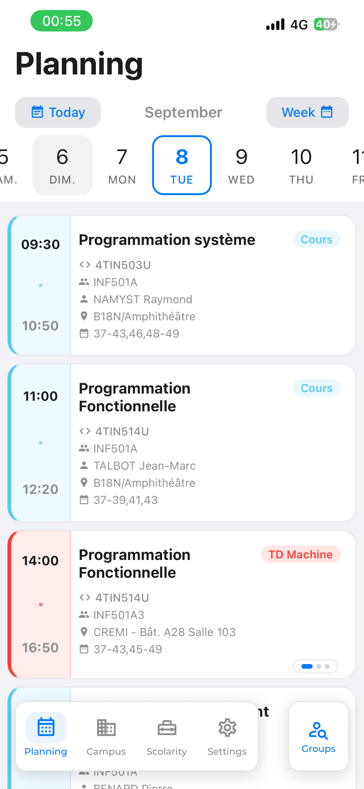

# Captures d'écran

Les images illustrant la documentation vivent dans ce dossier. Elles sont prises **à la main** sur un
appareil ou un émulateur : le projet ne dispose d'aucun outillage de capture automatique, et une
application React Native n'a pas de mode de rendu sans écran.

Les emplacements attendus sont **répartis dans les documents eux-mêmes**, au point où l'illustration
sert le propos. Ce fichier ne porte que la convention et l'inventaire de suivi.

## Convention

- **Nom** : `<domaine>-<ecran>.png`, en minuscules, mots séparés par des tirets.
- **Format** : PNG, appareil en **mode portrait**, thème **clair** par défaut. Une variante sombre se
  suffixe `-dark`.
- **Largeur** : celle de l'appareil, sans redimensionnement ; pas de cadre de téléphone ajouté.
- **Contenu** : données réalistes mais **anonymes**. Aucune capture ne doit montrer un nom, un numéro
  étudiant, un INE, une adresse mail ou un contenu de messagerie réels — l'onglet Scolarité se
  photographie avec un compte de test ou après floutage.

## Déposer une capture

Chaque emplacement attendu est marqué dans la documentation par une ligne de ce type :

```markdown
> **Capture attendue** — `planning-jour.png` : la vue jour avec le curseur de dates.
```

Déposer le fichier dans ce dossier, puis **remplacer cette ligne** par l'image et sa légende :

```markdown

```

Le chemin est `../screenshots/…` depuis `docs/features/`, `screenshots/…` depuis `docs/`.

## Prendre une capture

```bash
npx expo start        # puis a (Android), i (iOS), ou Expo Go sur un appareil
```

- **Android** : `adb exec-out screencap -p > docs/screenshots/<nom>.png`
- **iOS (simulateur)** : `xcrun simctl io booted screenshot docs/screenshots/<nom>.png`
- **Appareil physique** : capture système, puis transfert dans ce dossier.

Pour les écrans dépendant de l'heure (salles libres, menu du jour, rappels), le menu flottant de
simulation temporelle permet de se placer au bon moment — voir [qualite.md](../qualite.md).

## Inventaire

Suivi des emplacements marqués dans la documentation. Les captures **essentielles** couvrent un écran
entier ; les **complémentaires** documentent un état particulier (vide, hors ligne, modale) et
peuvent attendre.

### Onboarding — [features/onboarding.md](../features/onboarding.md)

| Fichier | Contenu | Priorité |
|---|---|---|
| `onboarding-bienvenue.png` | étape 1, logo et accroche | essentielle |
| `onboarding-preferences.png` | étape 2, choix du thème et de la langue | essentielle |
| `onboarding-groupes.png` | étape 3, année, semestre et recherche de groupe | essentielle |
| `onboarding-fin.png` | étape 4, confirmation | complémentaire |

### Planning — [features/planning.md](../features/planning.md)

| Fichier | Contenu | Priorité |
|---|---|---|
| `planning-jour.png` | vue jour, curseur de dates, journée chargée | **prise** |
| `planning-semaine.png` | vue semaine, sections repliables | essentielle |
| `planning-groupes.png` | recherche de groupes, sections alphabétiques | essentielle |
| `planning-cours-detail.png` | fiche d'un cours avec sa carte | essentielle |
| `planning-cours-simultanes.png` | carrousel de cours qui se chevauchent | complémentaire |
| `planning-hors-ligne.png` | bandeau de données en cache daté | **prise** — produite avec l'interrupteur **hors ligne** du menu de développement, sans mode avion ([qualite.md](../qualite.md)) |
| `planning-echec.png` | l'échec d'une source : message de la famille et bouton Réessayer | **prise** — même interrupteur |
| `planning-vide.png` | état vide, aucun groupe favori | complémentaire |

### Campus — [features/campus.md](../features/campus.md)

| Fichier | Contenu | Priorité |
|---|---|---|
| `campus-dashboard.png` | tableau de bord, quatre sections | essentielle |
| `campus-liste-filtres.png` | modale de filtres du socle de liste | complémentaire |
| `campus-liste-vide.png` | état vide d'une liste filtrée | complémentaire |

### Campus — restaurants · [features/campus-crous.md](../features/campus-crous.md)

| Fichier | Contenu | Priorité |
|---|---|---|
| `crous-liste.png` | liste des restaurants avec distances **et horaires** | **livrée** |
| `crous-menu.png` | menu d'un restaurant, midi et soir | **livrée** |
| `crous-menu-absent.png` | restaurant qui ne publie pas de menu — l'état vide, à contraster avec l'état d'échec | **livrée** |

### Campus — bibliothèques · [features/campus-bibliotheques.md](../features/campus-bibliotheques.md)

| Fichier | Contenu | Priorité |
|---|---|---|
| `bu-liste.png` | liste avec pastilles d'affluence | **livrée** |
| `bu-detail.png` | fiche, jauge d'affluence et horaires | **livrée** |
| `bu-couverture-partielle.png` | le bandeau de couverture partielle au-dessus d'une liste réelle — la seule interface que le jalon 6-D ajoute | **livrée** |

### Campus — salles libres · [features/campus-salles-libres.md](../features/campus-salles-libres.md)

| Fichier | Contenu | Priorité |
|---|---|---|
| `salles-libres-liste.png` | liste des bâtiments en accès libre | essentielle |
| `salles-libres-detail.png` | sélecteur d'heure et créneaux disponibles | essentielle |
| `salles-libres-ferme.png` | état fermé (hors horaires ou vacances) | complémentaire |

### Campus — vie étudiante · [features/campus-vie-etudiante.md](../features/campus-vie-etudiante.md)

| Fichier | Contenu | Priorité |
|---|---|---|
| `annonces-liste.png` | liste des annonces actives | essentielle |
| `annonce-detail.png` | fiche d'une annonce avec bouton d'action | essentielle |
| `annonces-erreur.png` | la liste en échec : service indisponible et bouton Réessayer — **déposée** (jalon 6-B) | essentielle |

### Scolarité — [features/scolarite.md](../features/scolarite.md)

Toutes les captures de cette section exigent un compte de test ou un floutage.

| Fichier | Contenu | Priorité |
|---|---|---|
| `scolarite-login.png` | écran de connexion universitaire | essentielle |
| `scolarite-dashboard.png` | salutation et ligne de messagerie | essentielle |
| `scolarite-progression.png` | écran de progression du parcours froid | complémentaire |
| `scolarite-biometrie.png` | verrou biométrique | complémentaire |
| `scolarite-compte.png` | réglages du compte et déconnexion | complémentaire |
| `scolarite-navigateur.png` | navigateur intégré et sa barre flottante | complémentaire |

### Réglages — [features/settings.md](../features/settings.md)

| Fichier | Contenu | Priorité |
|---|---|---|
| `reglages.png` | écran complet, sections déployées | essentielle |
| `reglages-apropos.png` | écran À propos | essentielle |
| `reglages-filtres.png` | modale de gestion des filtres d'UE | complémentaire |
| `reglages-calendrier.png` | modale de choix du calendrier | complémentaire |
| `reglages-langue.png` | modale de langue | complémentaire |

### Socle

| Fichier | Contenu | Document | Priorité |
|---|---|---|---|
| `navigation-tabbar.png` | barre d'onglets et bouton d'action contextuel | [navigation.md](../navigation.md) | essentielle |
| `theme-clair-sombre.png` | un même écran dans les deux thèmes | [theme.md](../theme.md) | essentielle |
| `carte.png` | écran carte, marqueur au thème de l'application | [cartographie.md](../cartographie.md) | essentielle |
| `modmenu.png` | menu flottant de simulation temporelle | [qualite.md](../qualite.md) | complémentaire |
| `modmenu-blueprints.png` | panneau de livraison : origine, version et raison par Blueprint — **déposée** (jalon 6-C) | [blueprints.md](../blueprints.md) | essentielle |

## Mettre à jour

Une capture périmée est plus trompeuse que pas de capture. Après une évolution visible d'un écran,
reprendre l'image concernée dans le même changement, en conservant son nom de fichier — les documents
qui la référencent n'ont alors rien à modifier.
